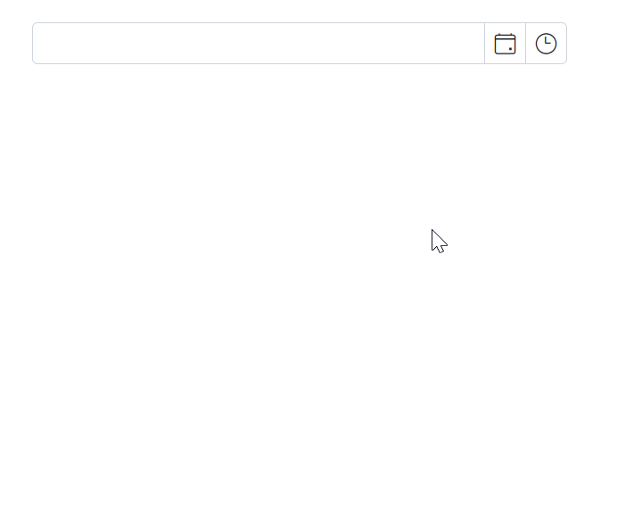

# Open the Blazor Datetime Picker popup on Focus

Open the DateTimePicker popup when the input receives focus by setting the [OpenOnFocus](https://help.syncfusion.com/cr/blazor/Syncfusion.Blazor.Calendars.SfDateTimePicker-1.html#Syncfusion_Blazor_Calendars_SfDateTimePicker_1_OpenOnFocus) property to `true`.

The following example demonstrates how to open the DateTimePicker popup when the input is focused.

```cshtml
@using Syncfusion.Blazor.Calendars

<SfDateTimePicker TValue="DateTime?"  OpenOnFocus="true" ShowClearButton="true"></SfDateTimePicker>

```
