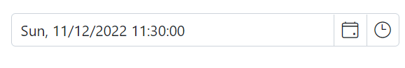

# Mask Support in Blazor DateTimePicker Component

The masking feature allows users to enter a date and time in the correct format, as specified by the [Format](https://help.syncfusion.com/cr/blazor/Syncfusion.Blazor.Calendars.SfDatePicker-1.html#Syncfusion_Blazor_Calendars_SfDatePicker_1_Format) property. This helps to ensure that the date and time is entered correctly and can also make it easier for users to understand how to enter the date and time. The [EnableMask](https://help.syncfusion.com/cr/blazor/Syncfusion.Blazor.Calendars.SfDatePicker-1.html#Syncfusion_Blazor_Calendars_SfDatePicker_1_EnableMask) property in the DateTimePicker component allows you to enable or disable the masking functionality. When enabled, the input field will be displayed as masked with a specific datetime format pattern for entering the date and time.







## MaskPlaceholder

The [DateTimePickerMaskPlaceholder](https://help.syncfusion.com/cr/blazor/Syncfusion.Blazor.Calendars.DateTimePickerMaskPlaceholder.html) directive allows you to set custom placeholder text for each segment of the date and time format in a `DateTimePicker` component. This can be used to provide additional context or instructions to the user about the expected format for the input. To use the directive, include it in the component's configuration along with the [EnableMask](https://help.syncfusion.com/cr/blazor/Syncfusion.Blazor.Calendars.SfDatePicker-1.html#Syncfusion_Blazor_Calendars_SfDatePicker_1_EnableMask) property.

The `DateTimePickerMaskPlaceholder` tag directive has the following properties:

* [Day](https://help.syncfusion.com/cr/blazor/Syncfusion.Blazor.Calendars.MaskPlaceholder.html#Syncfusion_Blazor_Calendars_MaskPlaceholder_Day) : Specifies the placeholder text for the day (`dd`) segment of the date value.

* [Month](https://help.syncfusion.com/cr/blazor/Syncfusion.Blazor.Calendars.MaskPlaceholder.html#Syncfusion_Blazor_Calendars_MaskPlaceholder_Month) : Specifies the placeholder text for the month (`MM`) segment of the date value.

* [Year](https://help.syncfusion.com/cr/blazor/Syncfusion.Blazor.Calendars.MaskPlaceholder.html#Syncfusion_Blazor_Calendars_MaskPlaceholder_Year) : Specifies the placeholder text for the year (`yy`) segment of the date value.

* [Hour](https://help.syncfusion.com/cr/blazor/Syncfusion.Blazor.Calendars.MaskPlaceholder.html#Syncfusion_Blazor_Calendars_MaskPlaceholder_Hour) : Specifies the placeholder text for the hour (`hh`) segment of the time value.

* [Minute](https://help.syncfusion.com/cr/blazor/Syncfusion.Blazor.Calendars.MaskPlaceholder.html#Syncfusion_Blazor_Calendars_MaskPlaceholder_Minute) : Specifies the placeholder text for the minute (`mm`) segment of the time value.

* [Second](https://help.syncfusion.com/cr/blazor/Syncfusion.Blazor.Calendars.MaskPlaceholder.html#Syncfusion_Blazor_Calendars_MaskPlaceholder_Second): Specifies the placeholder text for the second (`ss`) segment of the time value.

* [DayOfWeek](https://help.syncfusion.com/cr/blazor/Syncfusion.Blazor.Calendars.MaskPlaceholder.html#Syncfusion_Blazor_Calendars_MaskPlaceholder_DayOfWeek) : Specifies the placeholder text for the day of the week (`dddd`) segment of the date value.

The `DateTimePicker` component uses placeholder text from the current culture's resources file for each segment of the date and time format by default. If you want to use custom placeholder text instead, you can specify it using the `DateTimePickerMaskPlaceholder` directive and its properties. 







> If you do not specify custom placeholder text for any segment of the date and time format, the component will use the default placeholder text from the current culture based resources file for not specified segments.