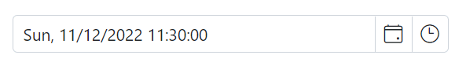

# Mask Support in Blazor DateTime Picker

The masking feature guides users to enter date and time values that match the display format defined by the [Format](https://help.syncfusion.com/cr/blazor/Syncfusion.Blazor.Calendars.SfDateTimePicker-1.html#Syncfusion_Blazor_Calendars_SfDateTimePicker_1_Format) property. Enable or disable masking using the [EnableMask](https://help.syncfusion.com/cr/blazor/Syncfusion.Blazor.Calendars.SfDateTimePicker-1.html#Syncfusion_Blazor_Calendars_SfDateTimePicker_1_EnableMask) property (default is `false`). When enabled, the input shows a mask pattern derived from the configured format and the current culture (including localized separators and literals). Masking improves guidance during entry but does not, by itself, validate out-of-range values or business rules.







## MaskPlaceholder

The [DateTimePickerMaskPlaceholder](https://help.syncfusion.com/cr/blazor/Syncfusion.Blazor.Calendars.DateTimePickerMaskPlaceholder.html) directive allows custom placeholder text for each segment of the configured date and time format. Use it together with [EnableMask](https://help.syncfusion.com/cr/blazor/Syncfusion.Blazor.Calendars.SfDateTimePicker-1.html#Syncfusion_Blazor_Calendars_SfDateTimePicker_1_EnableMask) to provide clear guidance for expected input. Placeholders apply to the segments used by the configured format (for example, `dd/MM/yyyy hh:mm:ss`). Declare `<DateTimePickerMaskPlaceholder>` as a child of `<SfDateTimePicker>`.

The `DateTimePickerMaskPlaceholder` tag directive has the following properties:

* [Day](https://help.syncfusion.com/cr/blazor/Syncfusion.Blazor.Calendars.MaskPlaceholder.html#Syncfusion_Blazor_Calendars_MaskPlaceholder_Day) : Placeholder text for the day segment (such as `d`/`dd`).
* [Month](https://help.syncfusion.com/cr/blazor/Syncfusion.Blazor.Calendars.MaskPlaceholder.html#Syncfusion_Blazor_Calendars_MaskPlaceholder_Month) : Placeholder text for the month segment (such as `M`/`MM`).
* [Year](https://help.syncfusion.com/cr/blazor/Syncfusion.Blazor.Calendars.MaskPlaceholder.html#Syncfusion_Blazor_Calendars_MaskPlaceholder_Year) : Placeholder text for the year segment (such as `yy`/`yyyy`).
* [Hour](https://help.syncfusion.com/cr/blazor/Syncfusion.Blazor.Calendars.MaskPlaceholder.html#Syncfusion_Blazor_Calendars_MaskPlaceholder_Hour) : Placeholder text for the hour segment (such as `h`/`hh`).
* [Minute](https://help.syncfusion.com/cr/blazor/Syncfusion.Blazor.Calendars.MaskPlaceholder.html#Syncfusion_Blazor_Calendars_MaskPlaceholder_Minute) : Placeholder text for the minute segment (`m`/`mm`).
* [Second](https://help.syncfusion.com/cr/blazor/Syncfusion.Blazor.Calendars.MaskPlaceholder.html#Syncfusion_Blazor_Calendars_MaskPlaceholder_Second) : Placeholder text for the second segment (`s`/`ss`).
* [DayOfWeek](https://help.syncfusion.com/cr/blazor/Syncfusion.Blazor.Calendars.MaskPlaceholder.html#Syncfusion_Blazor_Calendars_MaskPlaceholder_DayOfWeek) : Placeholder text for the weekday segment (`ddd`/`dddd`). Only used when the `Format` includes a day-of-week token such as `ddd`/`dddd`.

By default, the component uses placeholder text from the current culture's resource file for each date and time segment. To override these defaults, specify custom values using the `DateTimePickerMaskPlaceholder` directive.







> If custom placeholder text is not specified for a segment, the component uses the default placeholder text from the current culture's resource file for that segment. The mask pattern and separators are culture-aware, and validation behavior (such as handling incomplete or out-of-range input) follows the component's configuration. Enable [StrictMode](./strict-mode) to enforce the mask on blur; with `StrictMode="false"`, masked but incomplete input may resolve to `null`.

## See also

* [DateTime Format in Blazor DateTime Picker](./date-time-format)
* [Strict Mode in Blazor DateTime Picker](./strict-mode)