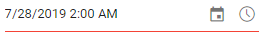

# Strict Mode in Blazor Datetime Picker Component

The [StrictMode](https://help.syncfusion.com/cr/blazor/Syncfusion.Blazor.Calendars.SfDateTimePicker-1.html#Syncfusion_Blazor_Calendars_SfDateTimePicker_1_StrictMode) property controls how typed input is validated against the configured `Min` and `Max` range. When enabled, only valid date and time values within the specified range are accepted. If the entered value is invalid, the component retains the previous valid value. If the entered value is out of range, the component clamps the value to the nearest boundary (`Min` or `Max`).

The following example demonstrates the DateTimePicker in `StrictMode` with a `Min`/`Max` range of `5/5/2019 2:00 AM` to `5/25/2019 2:00 AM`. Only valid values within the range are accepted.

- If an out-of-range value such as `5/28/2019` is entered, the value is set to the `Max` value (`5/25/2019 2:00 AM`).
- If an invalid date is entered, the value remains at the previous valid value.

The following code demonstrates the DateTimePicker with StrictMode `true`.

```cshtml
@using Syncfusion.Blazor.Calendars

<SfDateTimePicker TValue="DateTime?" Min='@MinDate' Max='@MaxDate' StrictMode=true Value='@DateValue'></SfDateTimePicker>

@code {
    public DateTime MinDate {get;set;} = new DateTime(DateTime.Now.Year,DateTime.Now.Month, 05, 02, 00, 00);
    public DateTime MaxDate {get;set;} = new DateTime(DateTime.Now.Year, DateTime.Now.Month, 25, 02, 00, 00);
    public DateTime? DateValue {get;set;} = new DateTime(DateTime.Now.Year, DateTime.Now.Month, 28, 02, 00, 00);
}
```


By default, `StrictMode` is `false`. In this state, the textbox allows invalid or out-of-range date and time values to be entered.

- If the value is invalid, the model becomes `null`.
- If the value is out of range, the model can hold the out-of-range value. The input is highlighted with an `error` class to indicate an invalid or out-of-range entry.

The following code demonstrates `StrictMode` as `false`. In this mode, valid and invalid values can be entered in the textbox.

```cshtml
@using Syncfusion.Blazor.Calendars

<SfDateTimePicker TValue="DateTime?" Min='@MinDate' Max='@MaxDate' StrictMode=false Value='@DateValue'></SfDateTimePicker>

@code {
    public DateTime MinDate {get;set;} = new DateTime(DateTime.Now.Year,DateTime.Now.Month, 05, 02, 00, 00);
    public DateTime MaxDate {get;set;} = new DateTime(DateTime.Now.Year, DateTime.Now.Month, 25, 02, 00, 00);
    public DateTime? DateValue {get;set;} = new DateTime(DateTime.Now.Year, DateTime.Now.Month, 28, 02, 00, 00);
}
```



N> If the values of `Min` or `Max` are changed through code-behind, update the `Value` property to ensure it remains within the defined range. Calendar/time list selection always respects `Min` and `Max`; disabled dates and times cannot be selected from the popup.