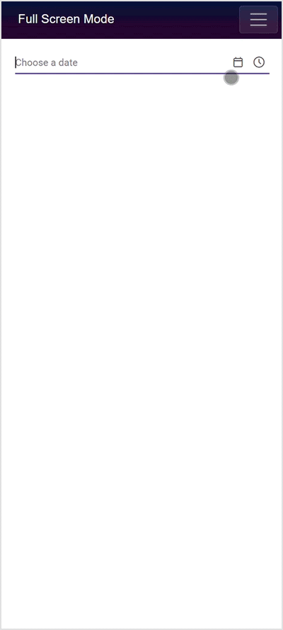

# Style and Appearance in Blazor Datetime Picker Component

Use the following CSS selectors to modify the DateTimePicker component’s appearance based on user preferences.

## Customizing the appearance of Datetime Picker container element

Apply the following CSS to adjust the input height and font size for the DateTimePicker container element.

```css
/* To specify height and font size */
.e-input-group input.e-input, .e-input-group.e-control-wrapper input.e-input {
        font-size: 20px;
        height: 40px;
    }
```

## Customizing the Datetime Picker icons element

Use the following CSS to style the DateTimePicker’s date and time icon elements.

```css
/* To specify background color and font size */
.e-datetime-wrapper .e-input-group-icon.e-date-icon, .e-datetime-wrapper .e-input-group-icon.e-time-icon {
        font-size: 16px;
        background-color: blanchedalmond;
    }
```

## Customizing the time picker popup in the Datetime Picker 

Use the following CSS to adjust the height of the time picker popup in the DateTimePicker.

```css
/* To specify height */
.e-datetimepicker.e-popup {
        height: 100px;
}
```

## Full screen mode support in mobiles and tablets

The DateTimePicker supports a full-screen popup on mobile devices to improve visibility and user experience in both landscape and portrait orientations. To enable full-screen mode, set the [FullScreen](https://help.syncfusion.com/cr/blazor/Syncfusion.Blazor.Calendars.SfDateTimePicker-1.html#Syncfusion_Blazor_Calendars_SfDateTimePicker_1_FullScreen) property to `true`. On mobile devices, the calendar and time popup expands to occupy the entire screen; desktop behavior is unchanged.

```cshtml
@using Syncfusion.Blazor.Calendars

<SfDateTimePicker TValue="DateTime?" FullScreen=true></SfDateTimePicker>

```



## Customizing the Calendar popup of the Datetime Picker

See the following section to customize the Calendar’s style and appearance when used within the DateTimePicker.

[Customizing Calendar's style and appearance](../calendar/style-appearance)