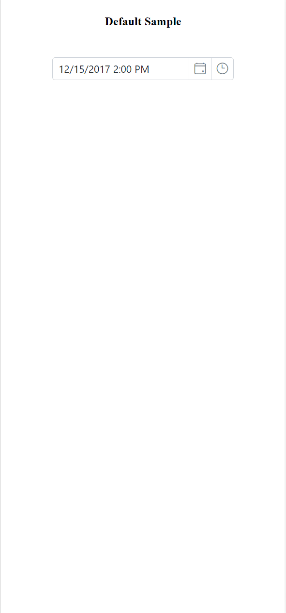

# Style and Appearance in Blazor Datetime Picker Component

The following content provides the exact CSS structure that can be used to modify the control's appearance based on the user preference.

## Customizing the appearance of Datetime Picker container element

Use the following CSS to customize the appearance of Datetime Picker container element.

```css
/* To specify height and font size */
.e-input-group input.e-input, .e-input-group.e-control-wrapper input.e-input {
        font-size: 20px;
        height: 40px;
    }
```

## Customizing the Datetime Picker icons element

Use the following CSS to customize the Datetime Picker icons element.

```css
/* To specify background color and font size */
.e-datetime-wrapper .e-input-group-icon.e-date-icon, .e-datetime-wrapper .e-input-group-icon.e-time-icon {
        font-size: 16px;
        background-color: blanchedalmond;
    }
```

## Customizing the time picker popup in the Datetime Picker 

Use the following CSS to customize the time picker popup in the Datetime Picker.

```css
/* To specify height */
.e-datetimepicker.e-popup {
        height: 100px;
}
```

## Full Screen Mode: Enhancing the DateTimePicker Component (Mobile Support Only)

We have introduced the full screen mode functionality in our DateTimePicker component, enabling users to see the DateTimePicker calendar and time popup element in full-screen mode for better visibility and an upgraded user experience. It is important to mention that this feature is exclusively available for mobile devices in both landscape and portrait orientations. To activate the full screen mode within the DateTimePicker component, simply set the [FullScreenMode](https://help.syncfusion.com/cr/blazor/Syncfusion.Blazor.Calendars.SfDateTimePicker-1.html#Syncfusion_Blazor_Calendars_SfDateTimePicker_1_FullScreenMode) API value to `true`. This action will extend the calendar and time popup element to occupy the entire screen on mobile devices.

```cshtml
@using Syncfusion.Blazor.Calendars

<SfDateTimePicker TValue="DateTime?" FullScreenMode=true></SfDateTimePicker>

```



## Customizing the Calendar popup of the Datetime Picker

Check the below section to customize the style and appearance of the Calendar component in the Datetime Picker.

[Customizing Calendar's style and appearance](../calendar/style-appearance/)