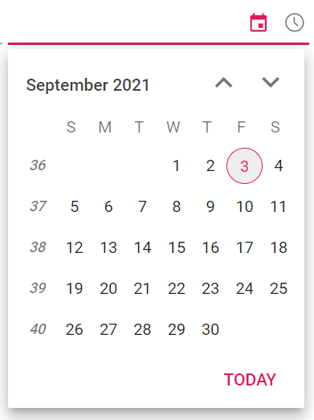
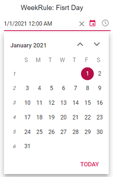
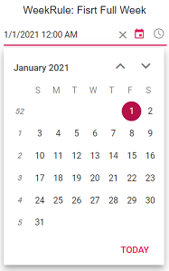
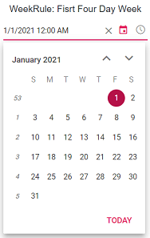

# Week Number in Blazor DateTimePicker Component

Enable week numbers in the DateTimePicker to display the week index in the calendar’s left column by using the [WeekNumber](https://help.syncfusion.com/cr/blazor/Syncfusion.Blazor.Calendars.CalendarBase-1.html#Syncfusion_Blazor_Calendars_CalendarBase_1_WeekNumber) property.

```cshtml

@using Syncfusion.Blazor.Calendars

<SfDateTimePicker TValue="DateTime?" Width="250px" WeekNumber="true"></SfDateTimePicker>

```



## Week Rule

Configure how the first week of the year is determined using the [WeekRule](https://help.syncfusion.com/cr/blazor/Syncfusion.Blazor.Calendars.CalendarBase-1.html#Syncfusion_Blazor_Calendars_CalendarBase_1_WeekRule) property. This setting controls how week numbers roll over at the start of the year. The following values correspond to .NET’s CalendarWeekRule:

Types  |Description  
-----|-----
FirstDay | The first week starts on the first day of the year; subsequent weeks are numbered 1, 2, 3, and so on.
FirstFullWeek | The first full week of the year is week 1; days before the first full week are counted as the last week (52 or 53) of the previous year.
FirstFourDayWeek | The first week with at least four days in the new year is week 1; otherwise, that week is counted as the last week (52 or 53) of the previous year.

N> The current culture (Locale) and the first day of the week influence week numbering. By default, the DateTimePicker uses the culture’s settings unless overridden.





