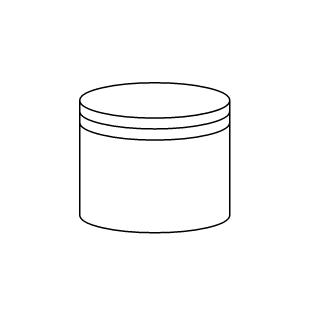

# BPMN Datasource in Blazor Diagram Component

Datasource is used to store or access data associated with a business process. To create a datasource, set the shape to **DataSource**. The following code example explains how to create a datasource.

```cshtml
@using Syncfusion.Blazor.Diagrams
@using System.Collections.ObjectModel

@* Initialize Diagram *@
<SfDiagram Height="600px" Nodes="@NodeCollection">
</SfDiagram>

@code{
    //Defines diagram's node collection
    public ObservableCollection<DiagramNode> NodeCollection { get; set; }

    protected override void OnInitialized()
    {
        NodeCollection = new ObservableCollection<DiagramNode>();
        DiagramNode node = new DiagramNode()
        {
            //Position of the node
            OffsetX = 100,
            OffsetY = 100,
            //Size of the node
            Width = 100,
            Height = 100,
            //Unique Id of the node
            Id = "node1",
            //Sets type to Bpmn and shape to DataSource
            Shape = new DiagramShape()
            {
                Type = Shapes.Bpmn,
                BpmnShape = BpmnShapes.DataSource,
            }
        };
        NodeCollection.Add(node);
    }
}
```

