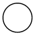
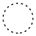
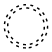
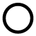
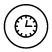
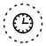
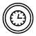
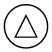
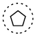
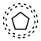

# BPMN Event in Blazor Diagram Component

An [Event](https://help.syncfusion.com/cr/blazor/Syncfusion.Blazor.Diagrams.DiagramBpmnEvent.html#Syncfusion_Blazor_Diagrams_DiagramBpmnEvent_Event) is a common BPMN process model element that represents something that happens during a business process and is notated with a circle. The type of events are as follows:

* Start - indicates the beginning of the process and every business process start with an event.
* Intermediate - indicates the middle of the process.
* End - indicates the beginning of the process and every business process end with an event.

The event property of the node allows you to define the type of the event. The default value of the event is **start**. The following code example explains how to create a BPMN event.

```cshtml
@using Syncfusion.Blazor.Diagrams
@using System.Collections.ObjectModel

@* Initialize Diagram *@
<SfDiagram Height="600px" Nodes="@NodeCollection">
</SfDiagram>

@code{
    //Defines diagram's node collection
    public ObservableCollection<DiagramNode> NodeCollection { get; set; }

    protected override void OnInitialized()
    {
        NodeCollection = new ObservableCollection<DiagramNode>();
        DiagramNode node = new DiagramNode()
        {
            //Position of the node
            OffsetX = 100,
            OffsetY = 100,
            //Size of the node
            Width = 100,
            Height = 100,
            //Unique Id of the node
            Id = "node1",
            Shape = new DiagramShape()
            {
                //Sets type to Bpmn and shape to Event
                Type = Shapes.Bpmn,
                BpmnShape = BpmnShapes.Event,
                // Set the event type to End
                Event = new DiagramBpmnEvent() { Event = BpmnEvents.End }
            }
        };
        NodeCollection.Add(node);
    }
}
```

## BPMN event trigger

Event triggers are notated as icons inside the circle and they represent the specific details of the process. The Trigger property of the node allows you to set the type of trigger and by default, it is set to None. The following code example explains how to create a BPMN trigger.

```cshtml
@using Syncfusion.Blazor.Diagrams
@using System.Collections.ObjectModel

@* Initialize Diagram *@
<SfDiagram Height="600px" Nodes="@NodeCollection">
</SfDiagram>

@code{
    //Defines diagram's node collection
    public ObservableCollection<DiagramNode> NodeCollection { get; set; }

    protected override void OnInitialized()
    {
        NodeCollection = new ObservableCollection<DiagramNode>();
        DiagramNode node = new DiagramNode()
        {
            //Position of the node
            OffsetX = 100,
            OffsetY = 100,
            //Size of the node
            Width = 100,
            Height = 100,
            //Unique Id of the node
            Id = "node1",
            Shape = new DiagramShape()
            {
                //Sets type to Bpmn and shape to Event
                Type = Shapes.Bpmn,
                BpmnShape = BpmnShapes.Event,
                // Set the event type to NonInterruptingIntermediate and set the trigger as message
                Event = new DiagramBpmnEvent()
                {
                    Event = BpmnEvents.NonInterruptingIntermediate,
                    Trigger = BpmnTriggers.Message
                }
            }
        };
        NodeCollection.Add(node);
    }
}
```

The following table illustrates the type of event triggers.

| Triggers | Start | Non-Interrupting Start | Intermediate | Non-Interrupting Intermediate | Throwing Intermediate | End |
| -------- | -------- | -------- | -------- | -------- | -------- | -------- |
| None |   |  |  |  | |  |
| Message |  |  |  |  | |  |
| Timer |  |  | | | | |
| Conditional |  |  |  | | | |
| Link | | | | |  | |
| Signal |  |  |  |  |  |  |
| Error |  | |  | | | |
| Escalation |  |  |  | |  |  |
| Termination | | | | | | |
| Compensation |  | |  | |  | |
| Cancel | | |  | | |  |
| Multiple |  |   |  |  |   |  |
| Parallel |  |  |  |  | | |