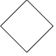
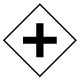
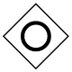
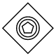
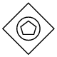
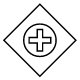

# BPMN Gateway in Blazor Diagram Component

Gateway is used to control the flow of a process and it is represented as a diamond shape. To create a gateway, the shape property of the node should be set to “Gateway” and the [Gateway](https://help.syncfusion.com/cr/blazor/Syncfusion.Blazor.Diagrams.DiagramBpmnGateway.html) property can be set with any of the appropriate gateways. The following code example explains how to create a BPMN Gateway.

```cshtml
@using Syncfusion.Blazor.Diagrams
@using System.Collections.ObjectModel

@* Initialize Diagram *@
<SfDiagram Height="600px" Nodes="@NodeCollection">
</SfDiagram>

@code{
    //Defines diagram's node collection
    public ObservableCollection<DiagramNode> NodeCollection { get; set; }

    protected override void OnInitialized()
    {
        NodeCollection = new ObservableCollection<DiagramNode>();
        DiagramNode node = new DiagramNode()
        {
            //Position of the node
            OffsetX = 100,
            OffsetY = 100,
            //Size of the node
            Width = 100,
            Height = 100,
            //Unique Id of the node
            Id = "node1",
            Shape = new DiagramShape()
            {
                //Sets type to Bpmn and shape to Gateway
                Type = Shapes.Bpmn,
                BpmnShape = BpmnShapes.Gateway,
                //Sets type of the gateway to None
                Gateway = new DiagramBpmnGateway()
                {
                    Type = BpmnGateways.None
                }
            }
        };
        NodeCollection.Add(node);
    }
}
```

> By default, the `Gateway` will be set to **None**.

There are several types of gateways as follows:

| Shape | Image |
| -------- | -------- |
| None |  |
| Exclusive |  |
| Parallel |  |
| Inclusive |  |
| Complex |  |
| EventBased |  |
| ExclusiveEventBased |  |
| ParallelEventBased |  |