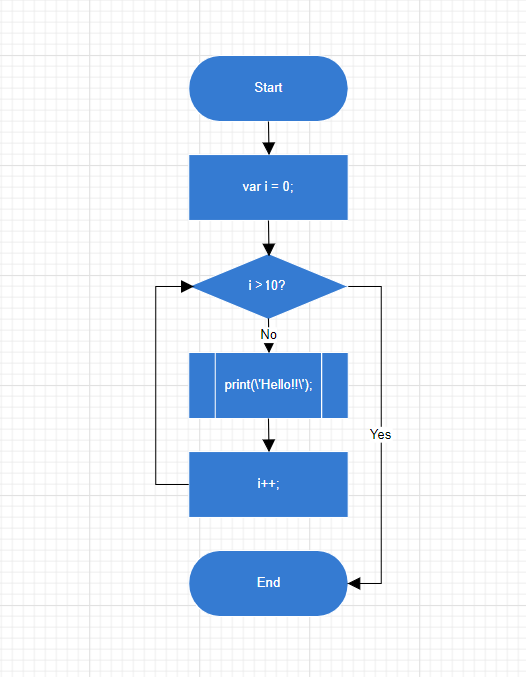

N> Syncfusion<sup style="font-size:70%">&reg;</sup> recommends using [Blazor Diagram Component](https://blazor.syncfusion.com/documentation/diagram/getting-started) which provides better performance than this diagram control. Blazor Diagram Component will be actively developed in the future.

# Getting Started with Blazor Diagram Component

This section briefly explains about how to include a Diagram in your Blazor Server-Side application. You can refer [Getting Started with Syncfusion<sup style="font-size:70%">&reg;</sup> Blazor for Server-Side in Visual Studio](https://blazor.syncfusion.com/documentation/getting-started/blazor-server-side-visual-studio) page for the introduction and configuring the common specifications.

## Importing Syncfusion<sup style="font-size:70%">&reg;</sup> Blazor component in the application

 1. Install **Syncfusion.Blazor.Diagrams** NuGet package to the application by using the **NuGet Package Manager**.
 2. You can add the client-side style resources through [CDN](https://blazor.syncfusion.com/documentation/appearance/themes#cdn-reference) or from [NuGet](https://blazor.syncfusion.com/documentation/appearance/themes#static-web-assets) package in the **HEAD** element of the **~/Pages/_Host.cshtml** page.

```cshtml
<head>
    <environment include="Development">
        <link href="_content/Syncfusion.Blazor.Themes/bootstrap4.css" rel="stylesheet" />
     </environment>
</head>
```

N> For Internet Explorer 11 kindly refer the polyfills. Refer the [documentation](https://blazor.syncfusion.com/documentation/common/how-to/render-blazor-server-app-in-ie) for more information.

```cshtml
<head>
    <environment include="Development">
        <link href="_content/Syncfusion.Blazor.Themes/bootstrap4.css" rel="stylesheet" />
        <script src="https://github.com/Daddoon/Blazor.Polyfill/releases/download/3.0.1/blazor.polyfill.min.js"></script>
    </environment>
</head>
```

## Adding component package to the application

Open **~/_Imports.Blazor** file and import the **Syncfusion.Blazor.Diagrams** packages.

```cshtml
@using Syncfusion.Blazor
@using Syncfusion.Blazor.Diagrams
```

## Add SyncfusionBlazor service in Startup.cs

Open the **Startup.cs** file and add services required by Syncfusion<sup style="font-size:70%">&reg;</sup> components using  **services.AddSyncfusionBlazor()** method. Add this method in the **ConfigureServices** function as follows.

```c#
using Syncfusion.Blazor;

namespace BlazorApplication
{
    public class Startup
    {
        ....
        ....
        public void ConfigureServices(IServiceCollection services)
        {
            ....
            ....
            services.AddSyncfusionBlazor();
        }
    }
}
```

**Note**: To enable custom client side resource loading from CRG or CDN. You need to disable resource loading by `AddSyncfusionBlazor(true)` and load the scripts in the **HEAD** element of the **~/Pages/_Host.cshtml** page.

```cshtml
<head>
    <environment include="Development">
       <script src="https://cdn.syncfusion.com/blazor/{{ site.blazorversion }}/syncfusion-blazor.min.js"></script>
   </environment>
</head>
```

## Adding Diagram component to the Application

Diagram component can be rendered by using the `SfDiagram` tag helper in ASP.NET Core Blazor application. Add the Diagram component in any web page `razor` in the `Pages` folder. For example, the Diagram component is added in the `~/Pages/Index.razor` page.

The following example shows a basic Diagram component.

```cshtml
<SfDiagram Width="100%" Height="600px">
</SfDiagram>

```

## Adding Nodes and Connectors

Let us create and add a `nodes` with specific position, size, label and shape. Connect two or more nodes by using a
`connectors`.

```cshtml
@using Syncfusion.Blazor.Diagrams
@using System.Collections.ObjectModel
@using DiagramShapes = Syncfusion.Blazor.Diagrams.Shapes
@using DiagramSegments = Syncfusion.Blazor.Diagrams.Segments

<SfDiagram Height="600px" Nodes="@NodeCollection" Connectors="@ConnectorCollection" NodeDefaults="@NodeDefaults" ConnectorDefaults="@ConnectorDefaults">
</SfDiagram>

@code
{
    int connectorCount = 0;
    // Reference to diagram
    SfDiagram diagram;
    // Defines diagram's nodes collection
    public ObservableCollection<DiagramNode> NodeCollection { get; set; }
    // Defines diagram's connector collection
    public ObservableCollection<DiagramConnector> ConnectorCollection { get; set; }
    // Defines default values for DiagramNode object
    public DiagramNode NodeDefaults { get; set; }
    // Defines default values for DiagramConnector object
    public DiagramConnector ConnectorDefaults { get; set; }

    protected override void OnInitialized()
    {
        InitDiagramModel();
    }

    private void InitDiagramModel()
    {
        InitDiagramDefaults();
        NodeCollection = new ObservableCollection<DiagramNode>();
        ConnectorCollection = new ObservableCollection<DiagramConnector>();
        CreateNode("Start", 50, FlowShapes.Terminator, "Start");
        CreateNode("Init", 140, FlowShapes.Process, "var i = 0;'");
        CreateNode("Condition", 230, FlowShapes.Decision, "i < 10?");
        CreateNode("Print", 320, FlowShapes.PreDefinedProcess, "print(\'Hello!!\');");
        CreateNode("Increment", 410, FlowShapes.Process, "i++;");
        CreateNode("End", 500, FlowShapes.Terminator, "End");
        DiagramConnectorSegment segment1 = new DiagramConnectorSegment()
        {
            Type = DiagramSegments.Orthogonal,
            Length = 30,
            Direction = Direction.Right
        };
        DiagramConnectorSegment segment2 = new DiagramConnectorSegment()
        {
            Type = DiagramSegments.Orthogonal,
            Length = 300,
            Direction = Direction.Bottom
        };
        DiagramConnectorSegment segment3 = new DiagramConnectorSegment()
        {
            Type = DiagramSegments.Orthogonal,
            Length = 30,
            Direction = Direction.Left
        };
        DiagramConnectorSegment segment4 = new DiagramConnectorSegment()
        {
            Type = DiagramSegments.Orthogonal,
            Length = 200,
            Direction = Direction.Top
        };
        CreateConnector("Start", "Init");
        CreateConnector("Init", "Condition");
        CreateConnector("Condition", "Print");
        CreateConnector("Condition", "End", "Yes", segment1, segment2);
        CreateConnector("Print", "Increment", "No");
        CreateConnector("Increment", "Condition", null, segment3, segment4);
    }

    private void CreateConnector(string sourceId, string targetId, string label = default(string), DiagramConnectorSegment segment1 = null, DiagramConnectorSegment segment2 = null)
    {
        DiagramConnector diagramConnector = new DiagramConnector()
        {
            Id = string.Format("connector{0}", ++connectorCount),
            SourceID = sourceId,
            TargetID = targetId
        };

        if (label != default(string))
        {
            var annotation = new DiagramConnectorAnnotation()
            {
                Content = label,
                Style = new AnnotationStyle() { Fill = "white" }
            };
            diagramConnector.Annotations = new ObservableCollection<DiagramConnectorAnnotation>() { annotation };
        }

        if (segment1 != null)
        {
            diagramConnector.Segments = new ObservableCollection<DiagramConnectorSegment>() { segment1, segment2 };
        }

        ConnectorCollection.Add(diagramConnector);
    }

    private void InitDiagramDefaults()
    {
        DiagramNodeAnnotation defaultAnnotation = new DiagramNodeAnnotation()
        {
            Style = new AnnotationStyle()
            {
                Color = "white",
                Fill = "transparent"
            }
        };
        NodeDefaults = new DiagramNode()
        {
            Width = 140,
            Height = 50,
            OffsetX = 300,
            Annotations = new ObservableCollection<DiagramNodeAnnotation>() { defaultAnnotation },
            Style = new NodeShapeStyle() { Fill = "#357BD2", StrokeColor = "white" }
        };

        ConnectorDefaults = new DiagramConnector()
        {
            Type = DiagramSegments.Orthogonal,
            TargetDecorator = new ConnectorTargetDecorator() { Shape = DecoratorShapes.Arrow, Width = 10, Height = 10 }
        };
    }

    private void CreateNode(string id, double y, FlowShapes shape, string label, bool positionLabel = false)
    {
        DiagramNodeAnnotation annotation = new DiagramNodeAnnotation() { Content = label };
        if (positionLabel)
        {
            annotation.Margin = new NodeAnnotationMargin() { Left = 25, Right = 25 };
        };

        DiagramNode diagramNode = new DiagramNode()
        {
            Id = id,
            OffsetY = y,
            Shape = new DiagramShape() { Type = DiagramShapes.Flow, FlowShape = shape },
            Annotations = new ObservableCollection<DiagramNodeAnnotation>() { annotation }
        };
        NodeCollection.Add(diagramNode);
    }
}
```



N> You can refer to our [Blazor Diagram](https://www.syncfusion.com/blazor-components/blazor-diagram) feature tour page for its groundbreaking feature representations. You can also explore our [Blazor Diagram example](https://blazor.syncfusion.com/demos/diagramcomponent/flowchart?theme=fluent) to understand how to present and manipulate data.

## See Also

* [Getting Started with Syncfusion<sup style="font-size:70%">&reg;</sup> Blazor for Client-Side in .NET Core CLI](https://blazor.syncfusion.com/documentation/getting-started/blazor-webassembly-app)
* [Getting Started with Syncfusion<sup style="font-size:70%">&reg;</sup> Blazor for Server-Side in Visual Studio](https://blazor.syncfusion.com/documentation/getting-started/blazor-server-side-visual-studio)
* [Getting Started with Syncfusion<sup style="font-size:70%">&reg;</sup> Blazor for Server-Side in .NET Core CLI](https://blazor.syncfusion.com/documentation/getting-started/blazor-web-app)
