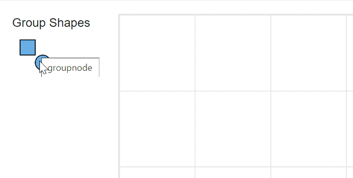

N> Syncfusion<sup style="font-size:70%">&reg;</sup> recommends using [Blazor Diagram Component](https://blazor.syncfusion.com/documentation/diagram/getting-started) which provides better performance than this diagram control. Blazor Diagram Component will be actively developed in the future.

# Group in Blazor Diagram Component

Group is used to cluster multiple nodes and connectors into a single element. It acts like a container for its children (nodes, groups, and connectors). Every change made to the group also affects the children. Child elements can be edited individually.

## Create group

## Add group when initializing diagram

A group can be added to the diagram model through `Nodes` collection. To define an object as group, add the child objects to the `Children` collection of the group. The following code illustrates how to create a group node.

* While creating group, its child node needs to be declared before the group declaration.

* Add a node to the existing group child by using the `diagram.Group` method.

* The group’s `diagram.UnGroup` method is used to define whether the group can be ungrouped or not.

* A group can be added into a child of another group.

```cshtml
@using Syncfusion.Blazor.Diagrams
@using System.Collections.ObjectModel

@* Initialize the diagram with NodeCollection *@
<SfDiagram Height="500px" @ref="diagram" Nodes="@NodeCollection">
</SfDiagram>

@code{
    SfDiagram diagram;
    ObservableCollection<DiagramNode> NodeCollection;

    protected override void OnInitialized()
    {
        NodeCollection = new ObservableCollection<DiagramNode>();
        DiagramNode node1 = createNode("node1", 100, 100, "Node1");
        DiagramNode node2 = createNode("node2", 300, 100, "Node2");
        DiagramNode node3 = createNode("node3", 200, 250, "Node3");
        DiagramNode groupnode = new DiagramNode();
        // Grouping node 1 and node 2 into a single group
        groupnode.Children = new string[] { "node1", "node2" };
        NodeCollection.Add(node1);
        NodeCollection.Add(node2);
        NodeCollection.Add(node3);
        NodeCollection.Add(groupnode);
    }

    public DiagramNode createNode(string id, double offx, double offy, string content)
    {
        DiagramNode node = new DiagramNode()
        {
            Id = id,
            OffsetX = offx,
            OffsetY = offy,
            Height = 100,
            Width = 100,
            Style = new NodeShapeStyle() { Fill = "darkcyan" }
        };
        DiagramNodeAnnotation annotation = new DiagramNodeAnnotation()
        {
            Id = "annotation1",
            Content = content,
            Style = new AnnotationStyle() { Color = "white", Fill = "transparent", StrokeColor = "None" },
        };
        node.Annotations = new ObservableCollection<DiagramNodeAnnotation>()
        {
            annotation
        };
        return node;
    }

    protected override async Task OnAfterRenderAsync(bool firstRender)
    {
        if (firstRender)
        {
            await Task.Delay(500);
            diagram.SelectAll();
            // Adding the third node into the existing group
            diagram.Group();
        }
    }
}
```

The following code illustrates how a ungroup  at runtime.

```cshtml
@using Syncfusion.Blazor.Diagrams
@using System.Collections.ObjectModel

@* Initialize the diagram with NodeCollection *@
<SfDiagram Height="500px" @ref="diagram" Nodes="@NodeCollection">
</SfDiagram>

@code{
    SfDiagram diagram;
    ObservableCollection<DiagramNode> NodeCollection;

    protected override void OnInitialized()
    {
        NodeCollection = new ObservableCollection<DiagramNode>();
        DiagramNode node1 = createNode("node1", 100, 100, "Node1");
        DiagramNode node2 = createNode("node2", 300, 100, "Node2");
        DiagramNode groupnode = new DiagramNode();
        // Grouping node 1 and node 2 into a single group
        groupnode.Children = new string[] { "node1", "node2" };
        NodeCollection.Add(node1);
        NodeCollection.Add(node2);
        NodeCollection.Add(groupnode);
    }

    public DiagramNode createNode(string id, double offx, double offy, string content)
    {
        DiagramNode node = new DiagramNode()
        {
            Id = id,
            OffsetX = offx,
            OffsetY = offy,
            Height = 100,
            Width = 100,
            Style = new NodeShapeStyle() { Fill = "darkcyan" }
        };
        DiagramNodeAnnotation annotation = new DiagramNodeAnnotation()
        {
            Id = "annotation1",
            Content = content,
            Style = new AnnotationStyle() { Color = "white", Fill = "transparent", StrokeColor = "None" },
        };
        node.Annotations = new ObservableCollection<DiagramNodeAnnotation>()
        {
            annotation
        };
        return node;
    }

    protected override async Task OnAfterRenderAsync(bool firstRender)
    {
        if (firstRender)
        {
            await Task.Delay(500);
            diagram.SelectAll();
            // Ungroup the selected group into nodes
            diagram.UnGroup();
        }
    }
}
```

## Add group at runtime

A group node can be added at runtime by using Nodes collection of diagram. The following code illustrates how a group node is added at runtime

```cshtml
@using Syncfusion.Blazor.Diagrams
@using System.Collections.ObjectModel

<input type="button" value="AddGroup" @onclick="@AddGroup" />
@* Initialize the diagram with NodeCollection *@
<SfDiagram Height="500px" Nodes="@NodeCollection">
</SfDiagram>

@code{
    ObservableCollection<DiagramNode> NodeCollection;
    DiagramNode groupnode = new DiagramNode();

    protected override void OnInitialized()
    {
        NodeCollection = new ObservableCollection<DiagramNode>();
        DiagramNode node1 = createNode("node1", 100, 100, "Node1");
        DiagramNode node2 = createNode("node2", 300, 100, "Node2");
        // Grouping node 1 and node 2 into a single group
        groupnode.Children = new string[] { "node1", "node2" };
        NodeCollection.Add(node1);
        NodeCollection.Add(node2);
    }

    public DiagramNode createNode(string id, double offx, double offy, string content)
    {
        DiagramNode node = new DiagramNode()
        {
            Id = id,
            OffsetX = offx,
            OffsetY = offy,
            Height = 100,
            Width = 100,
            Style = new NodeShapeStyle() { Fill = "#6BA5D7" }
        };
        DiagramNodeAnnotation annotation = new DiagramNodeAnnotation()
        {
            Id = "annotation1",
            Content = content,
            Style = new AnnotationStyle() { Color = "white", Fill = "transparent", StrokeColor = "None" },
        };
        node.Annotations = new ObservableCollection<DiagramNodeAnnotation>()
        {
            annotation
        };
        return node;
    }

    private void AddGroup()
    {
        NodeCollection.Add(groupnode);
    }
}
```

## Group from SymbolPalette

Group Nodes can be predefined and added to SymbolPalette. You can drop those Groups into Diagram, when required. The following code illustrates how to add group into SymbolPalette.

```cshtml
@using Syncfusion.Blazor.Diagrams
@using System.Collections.ObjectModel

<div class="control-section">
    @*Hidden:Lines*@
    <style>
        .sb-mobile-palette {
            width: 140px;
            height: 100%;
            float: left;
        }

        .sb-mobile-diagram {
            width: calc(100% - 242px);
            height: 100%;
            float: left;
        }
    </style>
    @*End:Hidden*@
    <div style="width: 100%">
        <div class="sb-mobile-palette-bar">
            <div id="palette-icon" style="float: right;" role="button" class="e-ddb-icons1 e-toggle-palette"></div>
        </div>
        <div id="palette-space" class="sb-mobile-palette">
            @* Initialize Symbol palette with customize symbol size*@
            <SfSymbolPalette Width="100%" Height="700px" SymbolHeight="60" SymbolWidth="60" SymbolInfo="@symbolInfo">
                <SymbolPalettePalettes>
                    @* Sets the palette header property for the symbols *@
                    <SymbolPalettePalette Id="basic" Expanded="true" Symbols="@BasicShapes" IconCss="e-ddb-icons e-flow" Title="Group Shapes">
                    </SymbolPalettePalette>
                </SymbolPalettePalettes>
            </SfSymbolPalette>
        </div>
        <div id="diagram-space" class="sb-mobile-diagram">
            <div class="content-wrapper" style="border: 1px solid #D7D7D7">
                <SfDiagram ID="diagram" Width="500px" Height="400px">
                </SfDiagram>
            </div>
        </div>
    </div>
</div>

@code{
    // Defines palette's basic-shape collection
    public ObservableCollection<DiagramNode> BasicShapes { get; set; }
    public SymbolInfo symbolInfo;

    protected override void OnInitialized()
    {
        //Sets the size, appearance and description of a symbol
        symbolInfo = new SymbolInfo()
        {
            Description = new SymbolDescription()
            {
                Text = "GroupCollection",
                Overflow = TextOverflow.Wrap,
                Wrap = TextWrap.Wrap
            },
            Height = 50,
            Width = 50
        };
        //Initialize the basicshapes for the symbol palette
        BasicShapes = new ObservableCollection<DiagramNode>();
        DiagramNode groupnode = createNode("groupnode", 100, 100, "GroupNode", Syncfusion.Blazor.Diagrams.BasicShapes.Rectangle);
        DiagramNode node1 = createNode("node1", 100, 100, "Node1", Syncfusion.Blazor.Diagrams.BasicShapes.Rectangle);
        DiagramNode node2 = createNode("node2", 150, 150, "Node2", Syncfusion.Blazor.Diagrams.BasicShapes.Ellipse);
        //Grouping node 1 and node 2 into a single group
        groupnode.Children = new string[] { "node1", "node2" };
        BasicShapes.Add(node1);
        BasicShapes.Add(node2);
        BasicShapes.Add(groupnode);
    }

    public DiagramNode createNode(string id, double offx, double offy, string content, Syncfusion.Blazor.Diagrams.BasicShapes shape)
    {
        DiagramNodeAnnotation Annotation = new DiagramNodeAnnotation()
        {
            Id = "annotation1",
            Content = content,
            Style = new AnnotationStyle()
            {
                Color = "white",
                Fill = "transparent",
                StrokeColor = "None"
            },
        };
        if (content == "GroupNode")
        {
            Annotation.Style.Color = "black";
        }
        DiagramNode Node = new DiagramNode()
        {
            Id = id,
            OffsetX = offx,
            OffsetY = offy,
            Height = 50,
            Width = 50,
            Shape = new DiagramShape() { Type = Shapes.Basic, BasicShape = shape },
            Annotations = new ObservableCollection<DiagramNodeAnnotation>() { Annotation }
        };
        if (content != "GroupNode")
        {
            Node.Style = new NodeShapeStyle() { Fill = "#6BA5D7" };
        }
        return Node;
    }
}
```



## Update position at runtime

You can change the position of the group similar to node. For more information about node positioning, refer to [Positioning](./nodes/positioning).

```cshtml
@using Syncfusion.Blazor.Diagrams
@using System.Collections.ObjectModel

<input type="button" value="UpdatePosition" @onclick="@UpdatePosition" />
@* Initialize the diagram with NodeCollection *@
<SfDiagram Height="500px" Nodes="@NodeCollection">
</SfDiagram>

@code{
    ObservableCollection<DiagramNode> NodeCollection;
    DiagramNode groupnode = new DiagramNode();

    protected override void OnInitialized()
    {
        NodeCollection = new ObservableCollection<DiagramNode>();
        DiagramNode node1 = createNode("node1", 100, 100, "Node1");
        DiagramNode node2 = createNode("node2", 300, 100, "Node2");
        // Grouping node 1 and node 2 into a single group
        groupnode.Children = new string[] { "node1", "node2" };
        NodeCollection.Add(node1);
        NodeCollection.Add(node2);
        NodeCollection.Add(groupnode);
    }

    public DiagramNode createNode(string id, double offx, double offy, string content)
    {
        DiagramNode node = new DiagramNode()
        {
            Id = id,
            OffsetX = offx,
            OffsetY = offy,
            Height = 100,
            Width = 100,
            Style = new NodeShapeStyle() { Fill = "#6BA5D7" }
        };
        DiagramNodeAnnotation annotation = new DiagramNodeAnnotation()
        {
            Id = "annotation1",
            Content = content,
            Style = new AnnotationStyle()
            {
                Color = "white",
                Fill = "transparent",
                StrokeColor = "None"
            },
        };
        node.Annotations = new ObservableCollection<DiagramNodeAnnotation>()
        {
            annotation
        };
        return node;
    }
    
    private void UpdatePosition()
    {
        NodeCollection[2].BeginUpdate();
        NodeCollection[2].OffsetX = 500;
        NodeCollection[2].OffsetY = 200;
        NodeCollection[2].EndUpdate();
    }
}
```

## Appearance

You can change the appearance of the group similar to node. For more information about node appearance, refer to [Appearance](./nodes/appearance).

## Interaction

You can edit the group and its children at runtime. We able to interact the group as like the node interaction like resize, rotate and drag. For more information about node interaction, refer to [Interaction](./nodes/interaction).

## See Also

* [How to add annotations to the node](https://blazor.syncfusion.com/documentation/introduction)
* [How to add ports to the node](./ports)
* [How to enable/disable the behavior of the node](./constraints)
* [How to add nodes to the symbol palette](./symbol-palette)
* [How to create diagram nodes using drawing tools](./tools)
* [How to perform the interaction on the group](./interaction)