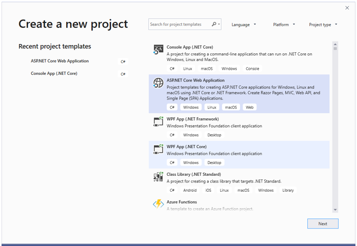
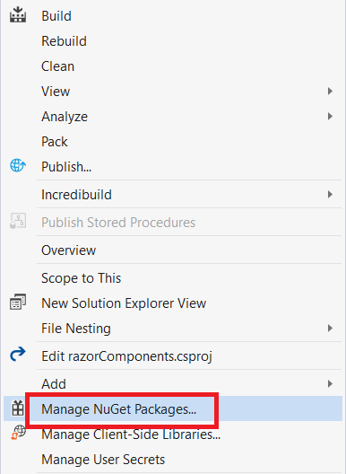

# Blazor WebAssembly Diagram in Blazor Diagram Component

This article provides a step-by-step instructions to configure Syncfusion Blazor Diagram in a simple Blazor WebAssembly application using [Visual Studio 2019](https://visualstudio.microsoft.com/vs/).

**Note**: Starting with version 17.4.0.39 (2019 Volume 4), you need to include a valid license key (either paid or trial key) within your applications. Refer to this help topic for more information.

## Prerequisites

* [Visual Studio 2019](https://visualstudio.microsoft.com/vs/)
* [.NET Core SDK 3.1.3](https://dotnet.microsoft.com/download/dotnet-core/3.1)

**Note**: .NET Core SDK 3.1.3 requires Visual Studio 2019 16.6 or later.

Syncfusion Blazor components are compatible with .NET Core 5.0 Preview 6 and it requires Visual Studio 16.7 Preview 1 or later.

## Create a Blazor WebAssembly project in Visual Studio 2019

1. Install the essential project templates in the Visual Studio 2019 by running the below command line in the command prompt.

    ```bash
    dotnet new -i Microsoft.AspNetCore.Components.WebAssembly.Templates::3.2.0-rc1.20223.4
    ```

2. Choose **Create a new project** from the Visual Studio dashboard.

   

3. Select **Blazor App** from the template and click **Next** button.

   

4. Now, the project configuration window will popup. Click **Create** button to create a new project with the default project configuration.

   

5. Choose **Blazor WebAssembly App** from the dashboard and click **Create** button to create a new Blazor WebAssembly application. Make sure **.NET Core** and **ASP.NET Core 3.1** is selected at the top.

   

**Note**: ASP.NET Core 3.1 is available in Visual Studio 2019 version.

## Importing Syncfusion Blazor component in the application

1. Now, install **Syncfusion.Blazor** NuGet package to the newly created application by using the `NuGet Package Manager`. Right-click the project and select Manage NuGet Packages.

   

2. Search **Syncfusion.Blazor** keyword in the Browser tab and install **Syncfusion.Blazor** NuGet package in the application.

   

3. The Syncfusion Blazor package will be installed in the project, once the installation process is completed.

4. Install **Syncfusion.EJ2.Blazor** NuGet package to the application using the **NuGet Package Manager**. Ensure to check the Include prerelease option for our Beta release.

5. You can add the client-side style resources from NuGet package in the `<head>` element of the **~/Pages/_Host.cshtml** page.

```cshtml
<head>
    <environment include="Development">
        <link href="_content/Syncfusion.Blazor.Themes/bootstrap4.css" rel="stylesheet" />
    </environment>
</head>

```

For Internet Explorer 11 refer the polyfills. Refer the documentation for more information.

```cshtml
<head>
    <environment include="Development">
        <link href="_content/Syncfusion.Blazor.Themes/bootstrap4.css" rel="stylesheet" />
        <script src="https://github.com/Daddoon/Blazor.Polyfill/releases/download/3.0.1/blazor.polyfill.min.js"></script>
    </environment>
</head>

```

## Adding component package to the application

Open **~/_Imports.razor** file and import the **Syncfusion.Blazor.Diagram** package.

```cshtml
@using Syncfusion.Blazor
@using Syncfusion.Blazor.Diagrams
```

## Add SyncfusionBlazor service in Startup.cs

Open the **Startup.cs** file and add services required by Syncfusion components using **services.AddSyncfusionBlazor()** method. Add this method in the **ConfigureServices** function as follows.

```csharp
 using Syncfusion.Blazor;

 namespace BlazorApplication
{
    public class Startup
    {
        ....
        ....
            public void ConfigureServices(IServiceCollection services)
        {
            ....
            ....
            services.AddSyncfusionBlazor();
        }
    }
}

```

**Note**: To enable custom client side resource loading from CRG or CDN. You need to disable resource loading by `AddSyncfusionBlazor(true)` and load the scripts in the **HEAD** element of the **~/Pages/_Host.cshtml** page.

```cshtml
<head>
   <environment include="Development">
    <script src="https://cdn.syncfusion.com/blazor/18.4.42/syncfusion-blazor.min.js"></script>
   </environment>
</head>

```

## Adding Diagram component to the Application

Diagram component can be rendered by using the `SfDiagram` tag helper in ASP.NET Core Blazor application.

The following example shows a basic Diagram component.

```cshtml
<SfDiagram Width="100%" Height="600px">
</SfDiagram>

```

Adding Nodes and Connectors
Let us create and add a `Nodes` with specific position, size, label and shape. Connect two or more Nodes by using a `Connectors`.

```cshtml
@using Syncfusion.Blazor.Diagrams
@using System.Collections.ObjectModel
@using DiagramShapes = Syncfusion.Blazor.Diagrams.Shapes
@using DiagramSegments = Syncfusion.Blazor.Diagrams.Segments
<SfDiagram  Height="600px" Nodes="@NodeCollection" Connectors="@ConnectorCollection" NodeDefaults="@NodeDefaults"
        ConnectorDefaults="@ConnectorDefaults"></SfDiagram>
@code
{
int connectorCount = 0;
// Reference to diagram
SfDiagram diagram;
// Defines diagram's nodes collection
public ObservableCollection<DiagramNode> NodeCollection { get; set; }
// Defines diagram's connector collection
public ObservableCollection<DiagramConnector> ConnectorCollection { get; set; }
// Defines default values for DiagramNode object
public DiagramNode NodeDefaults { get; set; }
// Defines default values for DiagramConnector object
public DiagramConnector ConnectorDefaults { get; set; }
protected override void OnInitialized()
{
    InitDiagramModel();
}

private void InitDiagramModel()
{
    InitDiagramDefaults();
    NodeCollection = new ObservableCollection<DiagramNode>();
    ConnectorCollection = new ObservableCollection<DiagramConnector>();
    CreateNode("Start", 50, FlowShapes.Terminator, "Start");
    CreateNode("Init", 140, FlowShapes.Process, "var i = 0;'");
    CreateNode("Condition", 230, FlowShapes.Decision, "i < 10?");
    CreateNode("Print", 320, FlowShapes.PreDefinedProcess, "print(\'Hello!!\');");
    CreateNode("Increment", 410, FlowShapes.Process, "i++;");
    CreateNode("End", 500, FlowShapes.Terminator, "End");
    DiagramConnectorSegment rightSegment = new DiagramConnectorSegment()
    {
        Type = DiagramSegments.Orthogonal,
        Length = 30,
        Direction = Direction.Right
    };
    DiagramConnectorSegment bottomSegment = new DiagramConnectorSegment()
    {
        Type = DiagramSegments.Orthogonal,
        Length = 300,
        Direction = Direction.Bottom
    };
    DiagramConnectorSegment leftSegment = new DiagramConnectorSegment()
    {
        Type = DiagramSegments.Orthogonal,
        Length = 30,
        Direction = Direction.Left
    };
    DiagramConnectorSegment topSegment = new DiagramConnectorSegment()
    {
        Type = DiagramSegments.Orthogonal,
        Length = 200,
        Direction = Direction.Top
    };
    CreateConnector("Start", "Init");
    CreateConnector("Init", "Condition");
    CreateConnector("Condition", "Print");
    CreateConnector("Condition", "End", "Yes", rightSegment, bottomSegment);
    CreateConnector("Print", "Increment", "No");
    CreateConnector("Increment", "Condition", null, leftSegment, topSegment);

}
private void CreateConnector(string sourceId, string targetId, string label = default(string), DiagramConnectorSegment rightSegment = null, DiagramConnectorSegment bottomSegment = null)
{
    DiagramConnector diagramConnector = new DiagramConnector()
    {
        Id = string.Format("connector{0}", ++connectorCount),
        SourceID = sourceId,
        TargetID = targetId
    };

    if (label != default(string))
{
        var annotation = new DiagramConnectorAnnotation()
        {
            Content = label,
            Style = new AnnotationStyle() { Fill = "white" }
        };
        diagramConnector.Annotations = new ObservableCollection<DiagramConnectorAnnotation>() { annotation };
    }

    if (rightSegment != null)
    {
        diagramConnector.Segments = new ObservableCollection<DiagramConnectorSegment>() { rightSegment, bottomSegment };
    }

    ConnectorCollection.Add(diagramConnector);
}

private void InitDiagramDefaults()
{
    DiagramNodeAnnotation defaultAnnotation = new DiagramNodeAnnotation()
    {
        Style = new AnnotationStyle()
        {
            Color = "white",
            Fill = "transparent"
        }
    };
    NodeDefaults = new DiagramNode()
    {
        Width = 140,
        Height = 50,
        OffsetX = 300,
        Annotations = new ObservableCollection<DiagramNodeAnnotation>() { defaultAnnotation },
        Style = new NodeShapeStyle() { Fill = "#357BD2", StrokeColor = "white" }
    };

    ConnectorDefaults = new DiagramConnector()
    {
        Type = DiagramSegments.Orthogonal,
        TargetDecorator = new ConnectorTargetDecorator() { Shape = DecoratorShapes.Arrow, Width = 10, Height = 10 }
    };
}
private void CreateNode(string id, double y, FlowShapes shape, string label, bool positionLabel = false)
{
    DiagramNodeAnnotation annotation = new DiagramNodeAnnotation() { Content = label };
    if (positionLabel)
    {
        annotation.Margin = new NodeAnnotationMargin() { Left = 25, Right = 25 };
    };

    DiagramNode diagramNode = new DiagramNode()
    {
        Id = id,
        OffsetY = y,
        Shape = new DiagramShape() { Type = DiagramShapes.Flow, FlowShape = shape },
        Annotations = new ObservableCollection<DiagramNodeAnnotation>() { annotation }
    };
    NodeCollection.Add(diagramNode);
}
}

```


## See Also

* [Getting Started with Syncfusion Blazor for Client-Side in .NET Core CLI](https://blazor.syncfusion.com/documentation/getting-started/blazor-webassembly-dotnet-cli)
* [Getting Started with Syncfusion Blazor for Server-Side in Visual Studio 2019 Preview](https://blazor.syncfusion.com/documentation/getting-started/blazor-server-side-visual-studio)
* [Getting Started with Syncfusion Blazor for Server-Side in .NET Core CLI](https://blazor.syncfusion.com/documentation/getting-started/blazor-server-side-dotnet-cli)
