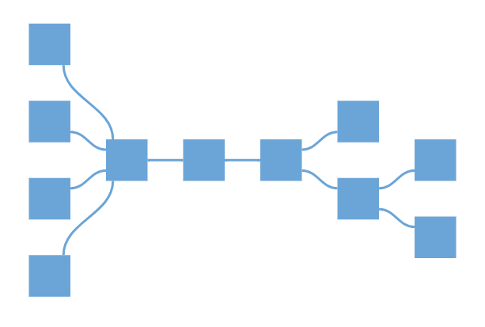

N> Syncfusion<sup style="font-size:70%">&reg;</sup> recommends using [Blazor Diagram Component](https://blazor.syncfusion.com/documentation/diagram/getting-started) which provides better performance than this diagram control. Blazor Diagram Component will be actively developed in the future.

# Mind Map layout in Blazor Diagram

A mind map is a diagram that displays the nodes as a spider diagram organizes information around a central concept. To create mind map, the [Type](https://help.syncfusion.com/cr/blazor/Syncfusion.Blazor.Diagrams.DiagramLayout.html#Syncfusion_Blazor_Diagrams_DiagramLayout_Type) of layout should be set as `MindMap`.

The following code example illustrates how to create an organizational chart.

```cshtml
@using Syncfusion.Blazor.Diagrams
@using System.Collections.ObjectModel

<SfDiagram ID="diagram" Height="600px" NodeDefaults="@NodeDefaults" ConnectorDefaults="@ConnectorDefault" Layout="@LayoutValue">
    <DiagramDataSource Id="Id" ParentId="ParentId" DataSource="@DataSource" DataMapSettings="@DataMap"></DiagramDataSource>
</SfDiagram>

@code {
    //Initializing MindMap layout
    DiagramLayout LayoutValue = new DiagramLayout()
    {
        //Sets layout type as MindMap...
        Type = LayoutType.MindMap,
        Margin = new LayoutMargin() { Top = 20, Left = 20 }
    };

    List<DiagramDataMapSetting> DataMap = new List<DiagramDataMapSetting>()
    {
    new DiagramDataMapSetting() { Property = "Shape.Content",Field = "Label" },
    };

    DiagramNode NodeDefaults = new DiagramNode()
    {
        Width = 25,
        Height = 25,
        BackgroundColor = "#6BA5D7",
        Annotations = new ObservableCollection<DiagramNodeAnnotation>() { new DiagramNodeAnnotation() { Id = "label1", Style = new AnnotationStyle() { Color = "black" } }, },
        Style = new NodeShapeStyle { Fill = "#6BA5D7", StrokeWidth = 1, StrokeColor = "white" },
        Shape = new DiagramShape()
        {
            Type = Syncfusion.Blazor.Diagrams.Shapes.Text,
            Content = "",
            Margin = new BasicShapeMargin() { Left = 5, Right = 5, Bottom = 5, Top = 5 }
        }

    };
    DiagramConnector ConnectorDefault = new DiagramConnector
    {
        Type = Syncfusion.Blazor.Diagrams.Segments.Bezier,
        Style = new ConnectorShapeStyle() { StrokeColor = "#6BA5D7", StrokeWidth = 2 },
        TargetDecorator = new ConnectorTargetDecorator()
        {
            Shape = DecoratorShapes.None,
        }
    };

    public class MindMapDetails
    {
        public string Id { get; set; }
        public string Label { get; set; }
        public string ParentId { get; set; }
        public string Branch { get; set; }
        public string Fill { get; set; }
    }

    public object DataSource = new List<object>()
    {
        new MindMapDetails() { Id= "1",Label="Creativity", ParentId ="", Branch = "Root"},
        new MindMapDetails() { Id= "2",  Label="Brainstorming", ParentId ="1", Branch = "Right" },
        new MindMapDetails() { Id= "3",  Label="Complementing", ParentId ="1", Branch = "Left" },
        new MindMapDetails() { Id= "4",  Label="Sessions", ParentId ="2", Branch = "subRight" },
        new MindMapDetails() { Id= "5",  Label="Complementing", ParentId ="2", Branch = "subRight" },
        new MindMapDetails() { Id= "6", Label= "Local", ParentId ="3", Branch = "subRight"  },
        new MindMapDetails() { Id= "7", Label= "Remote", ParentId ="3", Branch = "subRight"  },
        new MindMapDetails() { Id= "8", Label= "Individual", ParentId ="3", Branch = "subRight" },
        new MindMapDetails() { Id= "9", Label= "Teams", ParentId ="3", Branch = "subRight" },
        new MindMapDetails() { Id= "10", Label= "Ideas", ParentId ="5", Branch = "subRight" },
        new MindMapDetails() { Id= "11", Label= "Engagement", ParentId ="5", Branch = "subRight" },
    };
}
```



## See also

* [How to create a node](../nodes/nodes)

* [How to create a connector](../connectors/connectors)
