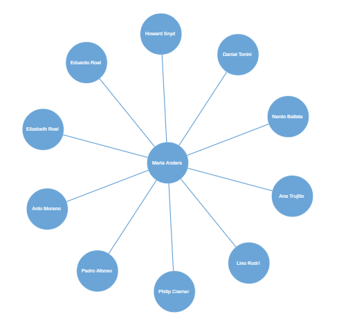

# Radial Tree Layout in Blazor Diagram Component

The radial tree layout arranges nodes on a virtual concentric circle around a root node. Sub-trees formed by the branching of child nodes are located radially around the child nodes. This arrangement result in an ever-expanding concentric arrangement with radial proximity to the root node indicating the node level in the hierarchy. The layout [Root](https://help.syncfusion.com/cr/blazor#Syncfusion_Blazor_Diagrams_DiagramLayout_Root/Syncfusion.Blazor.html) property can be used to define the root node of the layout. When no root node is set, the algorithm automatically considers one of the diagram nodes as the root node.

To arrange nodes in a radial tree structure, set the [Type](https://help.syncfusion.com/cr/blazor#Syncfusion_Blazor_Diagrams_DiagramLayout_Type/Syncfusion.Blazor.html) of the layout as `RadialTree`. The following code illustrates how to arrange the nodes in a radial tree structure.

```cshtml
@using Syncfusion.Blazor.Diagrams
@using System.Collections.ObjectModel

<SfDiagram Height="600px" NodeDefaults="@NodeDefaults" ConnectorDefaults="@ConnectorDefault" Layout="@LayoutSetting">
    <DiagramDataSource Id="Id" ParentId="ReportingPerson" DataSource="@DataSource" DataMapSettings="@DataMap"></DiagramDataSource>
</SfDiagram>

@code{
    //Uses layout to auto-arrange nodes on the diagram page
    DiagramLayout LayoutSetting = new DiagramLayout()
    {
        //Sets layout type as RadialTree...
        Type = LayoutType.RadialTree,
        VerticalSpacing = 20,
        HorizontalSpacing = 20
    };

    //sets Data map setting
    List<DiagramDataMapSetting> DataMap { get; set; } = new List<DiagramDataMapSetting>() {
        //Data mapping for the label
         new DiagramDataMapSetting() { Property = "Annotations[0].Content",
        Field = "Name" },
   };

    //Sets the default properties for nodes and connectors
    DiagramNode NodeDefaults = new DiagramNode()
    {
        Height = 100,
        Width = 100,
        //sets the default node's shape
        Shape = new DiagramShape() 
        { 
            Type = Syncfusion.Blazor.Diagrams.Shapes.Basic, 
            BasicShape = BasicShapes.Ellipse 
        },
        //sets the default node's annotation with style
        Annotations = new ObservableCollection<DiagramNodeAnnotation>() 
        { 
            new DiagramNodeAnnotation() 
            { 
                Id = "label1", 
                Style = new AnnotationStyle() 
                {
                Color = "white"
                } 
            } 
        },
        //sets the default node's shape style
        Style = new NodeShapeStyle 
        { 
            Fill = "#6BA5D7",
            StrokeColor = "white" 
        }
    };

    DiagramConnector ConnectorDefault = new DiagramConnector
    {
        Type = Syncfusion.Blazor.Diagrams.Segments.Straight,
        //sets the default connector's style
        Style = new ConnectorShapeStyle() 
        {
            StrokeColor = "#6BA5D7",    
            StrokeWidth = 2 
        },
        //sets the connector's target decorator
        TargetDecorator = new ConnectorTargetDecorator()
        {
            Shape = DecoratorShapes.None,
            //sets decorator shape style
            Style = new DecoratorShapeStyle() 
            {
                Fill = "#6BA5D7",
                StrokeColor = "#6BA5D7",
            },
        }
    };

    //Initialize radial tree data
    public class RadialTreeDetails
    {
        public string Id { get; set; }
        public string Name { get; set; }
        public string Designation { get; set; }
        public string ReportingPerson { get; set; }
    }

    //Configures data source for diagram
    public object DataSource = new List<object>()
    {
        new RadialTreeDetails {Id = "parent", Name = "Maria Anders",Designation =  "Managing Director", ReportingPerson = "" },
        new RadialTreeDetails {Id = "1", Name= "Ana Trujillo", Designation= "Project Manager", ReportingPerson= "parent" },
        new RadialTreeDetails {Id ="2",Name= "Lino Rodri", Designation="Project Manager",ReportingPerson= "parent" },
        new RadialTreeDetails {Id="3",Name = "Philip Cramer",Designation = "Project Manager",ReportingPerson= "parent" },
        new RadialTreeDetails {Id="4",Name= "Pedro Afonso",Designation= "Project Manager",ReportingPerson= "parent" },
        new RadialTreeDetails {Id ="5", Name="Anto Moreno",Designation= "Project Lead",ReportingPerson= "parent" },
        new RadialTreeDetails {Id="6",Name = "Elizabeth Roel",Designation= "Project Lead",ReportingPerson= "parent" },
        new RadialTreeDetails {Id="8",Name= "Eduardo Roel",Designation= "Project Lead",ReportingPerson= "parent" },
        new RadialTreeDetails {Id="9",Name= "Howard Snyd",Designation= "Project Lead",ReportingPerson= "parent" },
        new RadialTreeDetails {Id="10",Name= "Daniel Tonini",Designation= "Project Lead",ReportingPerson= "parent" },
        new RadialTreeDetails {Id="11",Name= "Nardo Batista",Designation= "Project Lead",ReportingPerson= "parent" },
    };
}
```



## See also

* [How to create a node](../nodes/nodes)

* [How to create a connector](../connectors/connectors)
