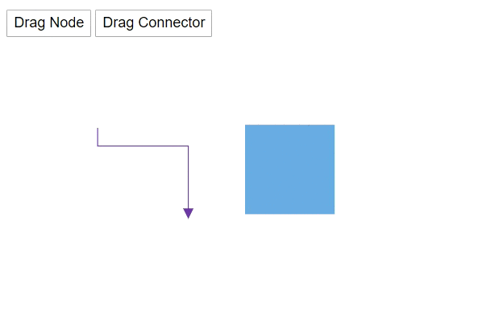

> Syncfusion recommends using [Blazor Diagram Component](https://blazor.syncfusion.com/documentation/diagram-component/getting-started) which provides better performance than this diagram control. Blazor Diagram Component will be actively developed in the future.

# Diagram Methods in Blazor Diagram Component

The following methods are used to perform the diagram functionalities.

## Nodes

### Add the node

You can add the node at runtime by using the [AddNode](https://help.syncfusion.com/cr/blazor/Syncfusion.Blazor.Diagrams.SfDiagram.html#Syncfusion_Blazor_Diagrams_SfDiagram_AddNode_Syncfusion_Blazor_Diagrams_DiagramNode_System_Nullable_System_Boolean__) method. The following code snippet shows how to add the node.

```cshtml
@using Syncfusion.Blazor.Diagrams
@using System.Collections.ObjectModel

<input type="button" value="Add Node" @onclick="@AddNodeInCollection" />

<SfDiagram @ref="@Diagram" Height="600px" Nodes="@NodeCollection">
</SfDiagram>

@code{
    SfDiagram Diagram;
    public ObservableCollection<DiagramNode> NodeCollection = new ObservableCollection<DiagramNode>() { };

    protected override void OnInitialized()
    {
        // A node is created and stored in the nodes collection.
        DiagramNode node1 = new DiagramNode()
        {
            // Position of the node
            OffsetX = 250,
            OffsetY = 250,
            // Size of the node
            Width = 100,
            Height = 100,
            Style = new NodeShapeStyle() { Fill = "#6BA5D7", StrokeColor = "white" }
        };
        NodeCollection.Add(node1);
    }

    // Add node at runtime
    public void AddNodeInCollection()
    {
        DiagramNode Node1 = new DiagramNode()
        {
            Id = "New Node1",
            OffsetX = 100,
            OffsetY = 100,
            Width = 100,
            Height = 100
        };
        Diagram.AddNode(Node1);
    }
}
```


### Remove the node and connector

You can remove the node at runtime by using the [Remove](https://help.syncfusion.com/cr/blazor/Syncfusion.Blazor.Diagrams.SfDiagram.html#Syncfusion_Blazor_Diagrams_SfDiagram_Remove_System_Object_) method.

The following code shows how to remove a node at runtime.

```cshtml
@using Syncfusion.Blazor.Diagrams
@using System.Collections.ObjectModel

<input type="button" value="Remove Node" @onclick="@RemoveNode" />
<input type="button" value="Remove Connector" @onclick="@RemoveConnector" />
<SfDiagram @ref="@Diagram" Height="600px" Nodes="@NodeCollection" Connectors="@ConnectorCollection">
</SfDiagram>

@code{
    SfDiagram Diagram;
    SnapConstraints Constraints;
    public ObservableCollection<DiagramNode> NodeCollection;
    public ObservableCollection<DiagramConnector> ConnectorCollection;

    protected override void OnInitialized()
    {
        Constraints = SnapConstraints.None;
        // A node is created and stored in node's collection.
        NodeCollection = new ObservableCollection<DiagramNode>()
        {
            new DiagramNode()
            {
                // Position of the node
                OffsetX = 250, OffsetY = 250,
                // Size of the node
                Width = 100, Height = 100,
                Style = new NodeShapeStyle() { Fill = "#6BA5D7", StrokeColor = "white" }
            }
        };
        ConnectorCollection = new ObservableCollection<DiagramConnector>()
        {
            new DiagramConnector()
            {
                Id = "Connector1",
                SourcePoint = new ConnectorSourcePoint() { X = 300, Y = 100 },
                TargetPoint = new ConnectorTargetPoint() { X = 400, Y = 200 },
                Type = Segments.Orthogonal
            }
        };
    }

    // Remove Node at runtime
    public void RemoveNode()
    {
        Diagram.Remove(NodeCollection[0]);
    }

    // Remove connector at runtime
    public void RemoveConnector()
    {
        Diagram.Remove(ConnectorCollection[0]);
    }
}
```


### Add child to group node

You can add the child to group node at runtime by using the [AddChildToGroup](https://help.syncfusion.com/cr/blazor/Syncfusion.Blazor.Diagrams.SfDiagram.html#Syncfusion_Blazor_Diagrams_SfDiagram_AddChildToGroup_Syncfusion_Blazor_Diagrams_DiagramNode_System_Object_) method. The following code shows how to add child in a group.

```cshtml
@using Syncfusion.Blazor.Diagrams
@using System.Collections.ObjectModel

<input type="button" value="Add Child Node" @onclick="@AddChildNode" />
<SfDiagram @ref="@Diagram" Height="600px" Nodes="@NodeCollection">
</SfDiagram>

@code{
    SfDiagram Diagram;
    ObservableCollection<DiagramNode> NodeCollection = new ObservableCollection<DiagramNode>();

    protected override void OnInitialized()
    {
        DiagramNode node1 = CreateNode("node1", 100, 100, "Node1");
        DiagramNode node2 = CreateNode("node2", 300, 100, "Node2");
        DiagramNode groupnode = new DiagramNode();
        // Grouping node 1 and node 2 into a single group
        groupnode.Children = new string[] { "node1", "node2" };
        NodeCollection.Add(node1);
        NodeCollection.Add(node2);
        NodeCollection.Add(groupnode);
    }

    public DiagramNode CreateNode(string Id, double OffsetX, double OffsetY, string Content)
    {
        DiagramNode Node = new DiagramNode()
        {
            Id = Id,
            OffsetX = OffsetX,
            OffsetY = OffsetY,
            Height = 100,
            Width = 100,
            Style = new NodeShapeStyle() { Fill = "darkcyan" },
            Annotations = new ObservableCollection<DiagramNodeAnnotation>()
            {
                new DiagramNodeAnnotation()
                {
                    Id="annotation1",
                    Content = Content,
                    Style=new AnnotationStyle(){Color="white", Fill="transparent",StrokeColor="None"},
                }
            }
        };
        return Node;
    }

    public void AddChildNode()
    {
        DiagramNode Child = CreateNode("node2", 300, 100, "Node2");
        // Add child node to group
        Diagram.AddChildToGroup(NodeCollection[2], Child);
    }
}
```

### Get the node

You can find and get the node from the id property itself. The following code shows how to find the node in the diagram.

```cshtml
@using Syncfusion.Blazor.Diagrams
@using System.Collections.ObjectModel

<input type="button" value="Get Node and Update style" @onclick="@GetNode" />

<SfDiagram @ref="@Diagram" Height="600px" Nodes="@NodeCollection">
</SfDiagram>

@code{
    SfDiagram Diagram;
    public ObservableCollection<DiagramNode> NodeCollection = new ObservableCollection<DiagramNode>() { };

    protected override void OnInitialized()
    {
        // A node is created and stored in the nodes collection.
        DiagramNode node1 = new DiagramNode()
        {
            Id = "Node1",
            // Position of the node
            OffsetX = 250,
            OffsetY = 250,
            // Size of the node
            Width = 100,
            Height = 100,
            Style = new NodeShapeStyle() { Fill = "#6BA5D7", StrokeColor = "white" }
        };
        NodeCollection.Add(node1);
    }

    // Add node at runtime
    public void GetNode()
    {
        // Find the node
        DiagramNode Node = Diagram.GetNode("Node1");
        Node.Style.StrokeColor = "black";
    }
}
```


### Get the edges

You can find what are all the in and out connectors that are connected to the node by using the [GetEdges](https://help.syncfusion.com/cr/blazor/Syncfusion.Blazor.Diagrams.SfDiagram.html#Syncfusion_Blazor_Diagrams_SfDiagram_GetEdges_System_String_System_Boolean_) method. The following code snippet shows how to get the in and out connector list what are the connectors are connected to the node.

```cshtml
@using Syncfusion.Blazor.Diagrams
@using System.Collections.ObjectModel

<input type="button" value="UpdateEdges" @onclick="@UpdateEdges" />
<SfDiagram Height="600px" @ref="@Diagram"
           Nodes="@NodeCollection" Connectors="@ConnectorCollection"
           NodeDefaults="@NodeDefaults">
</SfDiagram>

@code{
    // Reference of the diagram
    SfDiagram Diagram;
    // Define node and connector collection
    public ObservableCollection<DiagramNode> NodeCollection;
    public ObservableCollection<DiagramConnector> ConnectorCollection;
    // Set the default value of the node
    DiagramNode NodeDefaults = new DiagramNode()
    {
        // Size of the node
        Width = 80,
        Height = 50,
        // Style of the node
        Style = new NodeShapeStyle() { Fill = "#6BA5D7", StrokeColor = "white" },
    };

    protected override void OnInitialized()
    {
        NodeCollection = new ObservableCollection<DiagramNode>()
        {
            new DiagramNode()
            {
                Id = "Node1",
                // Position of the node
                OffsetX = 100,
                OffsetY = 100
            },
            new DiagramNode()
            {
                Id = "Node2",
                // Position of the node
                OffsetX = 198, OffsetY = 189
            },
            new DiagramNode()
            {
                Id = "Node3",
                // Position of the node
                OffsetX = 272, OffsetY = 100
            }
        };
        ConnectorCollection = new ObservableCollection<DiagramConnector>()
        {
            new DiagramConnector()
            {
                // Sets the unique id, source node, and taget node
                Id = "Connector1", SourceID = "Node1", TargetID = "Node2",
                // Sets the type of the connector
                Type = Segments.Orthogonal
            },
            new DiagramConnector()
            {
                // Sets the unique id, source node, and taget node
                Id = "Connector2", SourceID = "Node2", TargetID = "Node3",
                // Sets the type of the connector
                Type = Segments.Orthogonal
            },
            new DiagramConnector()
            {
                // Sets the unique id, source node, and taget node
                Id = "connector3", SourceID = "Node3", TargetID = "Node1",
                // Sets the type of the connector
                Type = Segments.Orthogonal
            }
        };
    }

    protected override async Task OnAfterRenderAsync(bool firstRender)
    {
        if (firstRender)
        {
            //OnAfterRenderAsync will be triggered after the component rendered.
            await Task.Delay(1500);
            // Select the node
            Diagram.Select(new ObservableCollection<DiagramNode>() { Diagram.Nodes[1] }, null);
        }
    }

    // The GetEdges method is used to get the connectors that connected to nodes.
    public async Task UpdateEdges()
    {
        string NodeId = Diagram.SelectedItems.Nodes[0].Id;
        // Find the out connectors connected from the node
        string[] OutEdges = await Diagram.GetEdges(NodeId, true);
        // Find the in connectors connected to the node
        string[] InEdges = await Diagram.GetEdges(NodeId, false);
        string[] edges = InEdges.Concat(OutEdges).ToArray();
        for (int i = 0; i < edges.Length; i++)
        {
            // Get the connector from id
            DiagramConnector connector = Diagram.GetConnector(edges[i]);
            // Change the style of the connector
            connector.Style.StrokeColor = "#1413F8";
            connector.TargetDecorator.Style.StrokeColor = "#1413F8";
            connector.TargetDecorator.Style.Fill = "#1413F8";
        }
    }
}
```


### Get the parent information

You can find the parent of the object by using the [GetParentID](https://help.syncfusion.com/cr/blazor/Syncfusion.Blazor.Diagrams.SfDiagram.html#Syncfusion_Blazor_Diagrams_SfDiagram_GetParentId_System_String_) method. The following code shows how to get the parent information of the object.

```cshtml
@using Syncfusion.Blazor.Diagrams
@using System.Collections.ObjectModel

<input type="button" value="Get Parent Node" @onclick="@GetParentNode" />

<SfDiagram @ref="@Diagram" Height="600px" Nodes="@NodeCollection">
</SfDiagram>

@code{
    SfDiagram Diagram;
    ObservableCollection<DiagramNode> NodeCollection = new ObservableCollection<DiagramNode>();

    protected override void OnInitialized()
    {
        DiagramNode node1 = CreateNode("node1", 100, 100, "Node1");
        DiagramNode node2 = CreateNode("node2", 300, 100, "Node2");
        DiagramNode groupnode = new DiagramNode();
        // Grouping node 1 and node 2 into a single group
        groupnode.Children = new string[] { "node1", "node2" };
        NodeCollection.Add(node1);
        NodeCollection.Add(node2);
        NodeCollection.Add(groupnode);
    }

    public DiagramNode CreateNode(string Id, double OffsetX, double OffsetY, string Content)
    {
        DiagramNode Node = new DiagramNode()
        {
            Id = Id,
            OffsetX = OffsetX,
            OffsetY = OffsetY,
            Height = 100,
            Width = 100,
            Style = new NodeShapeStyle() { Fill = "darkcyan" },
            Annotations = new ObservableCollection<DiagramNodeAnnotation>()
            {
                new DiagramNodeAnnotation()
                {
                    Id="annotation1",
                    Content = Content,
                    Style=new AnnotationStyle(){Color="white", Fill="transparent",StrokeColor="None"},
                }
            }
        };
        return Node;
    }

    public async void GetParentNode()
    {
        // Get the parent id
        string parentId = await Diagram.GetParentId("node2");
        DiagramNode Parent = Diagram.GetNode(parentId);
        Parent.Style.StrokeColor = "#6BA5D7";
    }
}
```


## Connectors

### Add the connector

You can add a connector at runtime by using the server-side method [AddConnector](https://help.syncfusion.com/cr/blazor/Syncfusion.Blazor.Diagrams.SfDiagram.html#Syncfusion_Blazor_Diagrams_SfDiagram_AddConnector_Syncfusion_Blazor_Diagrams_DiagramConnector_) in the Diagram component.  The following code explains how to add connectors at runtime.

```cshtml
@using Syncfusion.Blazor.Diagrams

<input type="button" value="Add Connector" @onclick="@AddConnector">

<SfDiagram @ref="@Diagram" Height="600px">
</SfDiagram>

@code
{
    SfDiagram Diagram;
    // To hide the gridlines
    SnapConstraints Constraints = SnapConstraints.None;

    protected void AddConnector()
    {
        DiagramConnector diagramConnector = new DiagramConnector()
        {
            Id = "Connector1",
            SourcePoint = new ConnectorSourcePoint() { X = 100, Y = 100 },
            TargetPoint = new ConnectorTargetPoint() { X = 200, Y = 200 },
            TargetDecorator = new ConnectorTargetDecorator()
            {
                Shape = DecoratorShapes.Arrow,
                Style = new DecoratorShapeStyle()
                {
                    Fill = "#6f409f",
                    StrokeColor = "#6f409f",
                    StrokeWidth = 1
                }
            },
            Style = new ConnectorShapeStyle() { StrokeColor = "#6f409f", StrokeWidth = 1 },
            Type = Segments.Straight,
        };
        //Add the connector at the run time.
        Diagram.AddConnector(diagramConnector);
    }
}
```


### Get the connector

You can get the connector from property `Id` by using the [GetConnector](https://help.syncfusion.com/cr/blazor/Syncfusion.Blazor.Diagrams.SfDiagram.html#Syncfusion_Blazor_Diagrams_SfDiagram_GetConnector_System_String_) method. The following code shows how to find the connector in the diagram.

```cshtml
@using Syncfusion.Blazor.Diagrams
@using System.Collections.ObjectModel

<input type="button" value="Get Connector and Change" @onclick="@GetConnector" />
<SfDiagram @ref="@Diagram" Height="600px" Connectors="@ConnectorCollection">  
</SfDiagram>

@code{
    SfDiagram Diagram;

    //Defines diagram's connector collection
    public ObservableCollection<DiagramConnector> ConnectorCollection = new ObservableCollection<DiagramConnector>();

    protected override void OnInitialized()
    {
        // A connector is created and stored in the connector collection.
        ConnectorCollection = new ObservableCollection<DiagramConnector>()
        {
            new DiagramConnector()
            {
                Id = "Connector1",
                SourcePoint = new ConnectorSourcePoint() { X = 100, Y = 100 },
                TargetPoint = new ConnectorTargetPoint() { X = 200, Y = 200 },
                TargetDecorator = new ConnectorTargetDecorator()
                {
                    Shape = DecoratorShapes.Arrow,
                    Style = new DecoratorShapeStyle()
                    { 
                        Fill = "#6f409f", 
                        StrokeColor = "#6f409f",
                        StrokeWidth = 1
                    }
                },
                Style = new ConnectorShapeStyle() 
                {
                    StrokeColor = "#6f409f",
                    StrokeWidth = 1
                },
                Type = Segments.Straight,
            }
        };
    }

    public void GetConnector()
    {
        // Get the connector
        DiagramConnector Connector = Diagram.GetConnector("Connector1");
        Connector.SourcePoint.X += 10;
    }
}
```


### Reset the segments

You can arrange the connector segments without overlapping the nodes by using the [ResetSegments](https://help.syncfusion.com/cr/blazor/Syncfusion.Blazor.Diagrams.SfDiagram.html#Syncfusion_Blazor_Diagrams_SfDiagram_ResetSegments) method.

```cshtml
@using Syncfusion.Blazor.Diagrams
@using System.Collections.ObjectModel

<input type="button" value="Segments Change" @onclick="@ResetSegments" />
<SfDiagram @ref="@Diagram" Height="600px" Nodes="@NodeCollection" Connectors="@ConnectorCollection">
</SfDiagram>

@code
{
    SfDiagram Diagram;
    //Defines diagram's nodes collection
    public ObservableCollection<DiagramNode> NodeCollection = new ObservableCollection<DiagramNode>();
    //Defines diagram's connector collection
    public ObservableCollection<DiagramConnector> ConnectorCollection = new ObservableCollection<DiagramConnector>();
    public DiagramConstraints Constraints { get; set; }

    protected override void OnInitialized()
    {
        // Add nodes to collection
        NodeCollection.Add(CreateNode("Node1", 100, 100, "Node1"));
        NodeCollection.Add(CreateNode("Node2", 300, 100, "Node2"));
        NodeCollection.Add(CreateNode("Node3", 500, 100, "Node3"));
        ConnectorCollection = new ObservableCollection<DiagramConnector>()
        {
            new DiagramConnector()
            {
                Id = "Connector1", SourceID = "Node1", TargetID = "Node3",
                Type = Segments.Orthogonal
            }
        };
    }

    public DiagramNode CreateNode(string Id, double OffsetX, double OffsetY, string Content)
    {
        DiagramNode Node = new DiagramNode()
        {
            Id = Id,
            OffsetX = OffsetX, OffsetY = OffsetY,
            Height = 100, Width = 100,
            Style = new NodeShapeStyle() { Fill = "darkcyan" }
        };
        return Node;
    }

    public void ResetSegments()
    {
        Diagram.BeginUpdate();
        Diagram.Constraints = DiagramConstraints.Default | DiagramConstraints.LineRouting;
        Diagram.EndUpdate();
        // update the segments based on routing
        Diagram.ResetSegments();
    }
}
```


## Annotations

### Add the annotation

Annotations can be added at runtime by using the [AddLabels](https://help.syncfusion.com/cr/blazor/Syncfusion.Blazor.Diagrams.SfDiagram.html#Syncfusion_Blazor_Diagrams_SfDiagram_AddLabels_System_Object_System_Object_) method. The following code explains how to add an annotation to a node.

```cshtml
@using Syncfusion.Blazor.Diagrams
@using System.Collections.ObjectModel

<input value="Addlabel" type="button" @onclick="@AddLabel" name="Addlabel" />
<SfDiagram Height="600px" @ref="@diagram" Nodes="@NodeCollection">
</SfDiagram>

@code
{
    // Reference to diagram
    SfDiagram diagram;
    //Defines diagram's node collection
    public ObservableCollection<DiagramNode> NodeCollection { get; set; }
    SnapConstraints snapConstraints;

    protected override void OnInitialized()
    {
        snapConstraints = SnapConstraints.None;
        NodeCollection = new ObservableCollection<DiagramNode>();
        DiagramNode node = new DiagramNode()
        {
            Width = 100,
            Height = 100,
            OffsetX = 100,
            OffsetY = 100,
            Style = new NodeShapeStyle() { Fill = "#6BA5D7", StrokeColor = "white" },
        };
        NodeCollection.Add(node);
    }

    //Method to add labels at runtime
    public void AddLabel()
    {
        ObservableCollection<DiagramNodeAnnotation> annotations = new ObservableCollection<DiagramNodeAnnotation>()
        {
            new DiagramNodeAnnotation() { Content = "Annotation" },
        };
        // AddLabels method is used to add annotations at run time
        diagram.AddLabels(diagram.Nodes[0], annotations);
    }
}
```


### Remove the annotation

A collection of annotations can be removed from the node by using the [RemoveLabels](https://help.syncfusion.com/cr/blazor/Syncfusion.Blazor.Diagrams.SfDiagram.html#Syncfusion_Blazor_Diagrams_SfDiagram_RemoveLabels_System_Object_System_Object_) method. The following code explains how to remove an annotation to a node.

```cshtml
@using Syncfusion.Blazor.Diagrams
@using System.Collections.ObjectModel

<input value="Removelabel" type="button" @onclick="@RemoveLabel" name="Removelabel" />
<SfDiagram Height="600px" @ref="@diagram" Nodes="@NodeCollection">
</SfDiagram>

@code
{
    //Reference to diagram
    SfDiagram diagram;
    //Defines diagram's node collection
    public ObservableCollection<DiagramNode> NodeCollection { get; set; }

    protected override void OnInitialized()
    {
        NodeCollection = new ObservableCollection<DiagramNode>();
        DiagramNode node = new DiagramNode()
        {
            Width = 100,
            Height = 100,
            OffsetX = 100,
            OffsetY = 100,
            Style = new NodeShapeStyle() { Fill = "#6BA5D7", StrokeColor = "white" },
        };
        node.Annotations = new ObservableCollection<DiagramNodeAnnotation>()
        {
            new DiagramNodeAnnotation() {Id="label", Content = "Annotation" },
        };
        NodeCollection.Add(node);
    }

    //Method to remove labels at runtime
    public void RemoveLabel()
    {
        ObservableCollection<DiagramNodeAnnotation> annotations = new ObservableCollection<DiagramNodeAnnotation>()
        {
            new DiagramNodeAnnotation() {Id="label", Content = "Annotation" }
        };
        // RemoveLabels method is used to remove label at run time.
        diagram.RemoveLabels(diagram.Nodes[0], annotations);
    }
}
```


### Edit the annotation

You can change the annotation content by using the [StartTextEdit](https://help.syncfusion.com/cr/blazor/Syncfusion.Blazor.Diagrams.SfDiagram.html#Syncfusion_Blazor_Diagrams_SfDiagram_StartTextEdit_System_Object_System_String_) method. The following code shows how to edit the content of the annotation.

```cshtml
@using Syncfusion.Blazor.Diagrams
@using System.Collections.ObjectModel

<input value="Annotation Editing" type="button" @onclick="@AnnotationEditing" />
<SfDiagram Height="600px" @ref="@Diagram" Nodes="@NodeCollection">
</SfDiagram>

@code
{
    // Reference to diagram
    SfDiagram Diagram;
    //Defines diagram's node collection
    public ObservableCollection<DiagramNode> NodeCollection { get; set; }

    protected override void OnInitialized()
    {
        NodeCollection = new ObservableCollection<DiagramNode>();
        DiagramNode node = new DiagramNode()
        {
            Width = 100,
            Height = 100,
            OffsetX = 100,
            OffsetY = 100,
            Style = new NodeShapeStyle() { Fill = "#6BA5D7", StrokeColor = "white" },
            Annotations = new ObservableCollection<DiagramNodeAnnotation>()
            {
                new DiagramNodeAnnotation() { Id = "Annotation1", Content = "Annotation" }
            }
        };
        NodeCollection.Add(node);
    }

    //Method to edit the annotation at runtime
    public void AnnotationEditing()
    {
        Diagram.StartTextEdit(NodeCollection[0], "Annotation1");
    }
}
```


## Ports

### Add the ports

You can add ports to a node at runtime by using the [AddPorts](https://help.syncfusion.com/cr/blazor/Syncfusion.Blazor.Diagrams.SfDiagram.html#Syncfusion_Blazor_Diagrams_SfDiagram_AddPorts_Syncfusion_Blazor_Diagrams_DiagramNode_System_Collections_ObjectModel_ObservableCollection_Syncfusion_Blazor_Diagrams_DiagramPort__) methods. The following code shows how to add new port in a node.

```csharp
@using Syncfusion.Blazor.Diagrams
@using System.Collections.ObjectModel

<input type="button" value="AddPorts" @onclick="@AddPorts" />
<SfDiagram @ref="@Diagram" Height="600px" Nodes="@NodeCollection">
</SfDiagram>

@code{
    SfDiagram Diagram;
    public ObservableCollection<DiagramNode> NodeCollection = new ObservableCollection<DiagramNode>() { };

    protected override void OnInitialized()
    {
        //A node is created and stored in nodes array
        DiagramNode node1 = new DiagramNode()
        {
            //Position of the node
            OffsetX = 250,
            OffsetY = 250,
            //Size of the node
            Width = 100,
            Height = 100,
            Style = new NodeShapeStyle() { Fill = "#6BA5D7", StrokeColor = "white" },
        };
        NodeCollection.Add(node1);
    }

    public void AddPorts()
    {
        // Initialize port collection
        ObservableCollection<DiagramPort> ports = new ObservableCollection<DiagramPort>()
        {
            new DiagramPort() { Id = "port1", Offset = new NodePortOffset() { X = 0, Y = 0.5 }, Visibility = PortVisibility.Visible },
            new DiagramPort() { Id = "port2", Offset = new NodePortOffset() { X = 1, Y = 0.5 }, Visibility = PortVisibility.Visible },
            new DiagramPort() { Id = "port3", Offset = new NodePortOffset() { X = 0.5, Y = 0 }, Visibility = PortVisibility.Visible },
            new DiagramPort() { Id = "port4", Offset = new NodePortOffset() { X = 0.5, Y = 1 }, Visibility = PortVisibility.Visible }
        };
        Diagram.AddPorts(NodeCollection[0], ports);
    }
}
```


### Remove the ports

You can remove the existing ports in a node by using the [RemovePorts](https://help.syncfusion.com/cr/blazor/Syncfusion.Blazor.Diagrams.SfDiagram.html#Syncfusion_Blazor_Diagrams_SfDiagram_RemovePorts_Syncfusion_Blazor_Diagrams_DiagramNode_System_Collections_ObjectModel_ObservableCollection_Syncfusion_Blazor_Diagrams_DiagramPort__) method. The following code shows how to remove the ports in a diagram.

```cshtml
@using Syncfusion.Blazor.Diagrams
@using System.Collections.ObjectModel

<input type="button" value="RemovePorts" @onclick="@RemovePorts" />
<SfDiagram Height="600px" Nodes="@NodeCollection">
</SfDiagram>

@code{
    SnapConstraints constraints;
    public ObservableCollection<DiagramNode> NodeCollection = new ObservableCollection<DiagramNode>() { };

    protected override void OnInitialized()
    {
        constraints = SnapConstraints.None;
        // A node is created and stored in nodes array.
        DiagramNode node1 = new DiagramNode()
        {
            // Position of the node
            OffsetX = 250,
            OffsetY = 250,
            // Size of the node
            Width = 100,
            Height = 100,
            Style = new NodeShapeStyle() { Fill = "#6BA5D7", StrokeColor = "white" },
            // Initialize port collection
            Ports = new ObservableCollection<DiagramPort>()
            {
                new DiagramPort()
                {
                    Id = "port1",
                    Offset = new NodePortOffset() { X = 0, Y = 0.5 },
                    Visibility = PortVisibility.Visible,
                    //Set the style for the port
                    Style= new PortShapeStyle(){ Fill="red", StrokeColor="black", StrokeWidth=2},
                    // Sets the shape of the port as Circle
                    Width= 12,
                    Height=12,
                    Shape= PortShapes.Circle
                }
            },
        };
        NodeCollection.Add(node1);
    }

    public void RemovePorts()
    {
        (NodeCollection[0].Ports as ObservableCollection<DiagramPort>).RemoveAt(0);
    }
}
```


## Print and exporting

### Print the diagram

You can print the diagram area by using the [Print](https://help.syncfusion.com/cr/blazor/Syncfusion.Blazor.Diagrams.SfDiagram.html#Syncfusion_Blazor_Diagrams_SfDiagram_Print_Syncfusion_Blazor_Diagrams_IPrintOptions_) method. The following code shows how to print the diagram.

```cshtml
@using Syncfusion.Blazor.Diagrams
@using System.Collections.ObjectModel

<input type="button" value="Print Diagram" @onclick="@PrintDiagram" />
<SfDiagram @ref="@Diagram" Height="600px" Nodes="@NodeCollection">
</SfDiagram>

@code{
    SfDiagram Diagram;
    public ObservableCollection<DiagramNode> NodeCollection = new ObservableCollection<DiagramNode>() { };

    protected override void OnInitialized()
    {
        // A node is created and stored in the nodes collection.
        DiagramNode node1 = new DiagramNode()
        {
            // Position of the node
            OffsetX = 250,
            OffsetY = 250,
            // Size of the node
            Width = 100,
            Height = 100,
            Style = new NodeShapeStyle() { Fill = "#6BA5D7", StrokeColor = "white" }
        };
        NodeCollection.Add(node1);
    }

    // Print the diagram
    public void PrintDiagram()
    {
        IPrintOptions PrintOptions = new IPrintOptions() { PageHeight = 500, PageWidth = 500 };
        Diagram.Print(PrintOptions);
    }
}
```

### Export the diagram

You can export the diagram area by using the [ExportDiagram](https://help.syncfusion.com/cr/blazor/Syncfusion.Blazor.Diagrams.SfDiagram.html#Syncfusion_Blazor_Diagrams_SfDiagram_ExportDiagram_Syncfusion_Blazor_Diagrams_IExportOptions_) method. The following code shows how to export the diagram.

```cshtml
@using Syncfusion.Blazor.Diagrams
@using System.Collections.ObjectModel

<input type="button" value="Export Diagram" @onclick="@ExportDiagram" />
<SfDiagram @ref="@Diagram" Height="600px" Nodes="@NodeCollection">
</SfDiagram>

@code{
    SfDiagram Diagram;
    public ObservableCollection<DiagramNode> NodeCollection = new ObservableCollection<DiagramNode>() { };

    protected override void OnInitialized()
    {
        // A node is created and stored in nodes collection.
        DiagramNode node1 = new DiagramNode()
        {
            // Position of the node
            OffsetX = 250,
            OffsetY = 250,
            // Size of the node
            Width = 100,
            Height = 100,
            Style = new NodeShapeStyle() { Fill = "#6BA5D7", StrokeColor = "white" }
        };
        NodeCollection.Add(node1);
    }

    // Export the diagram
    public void ExportDiagram()
    {
        IExportOptions ExportOptions = new IExportOptions() { PageWidth = 500, PageHeight = 500 };
        Diagram.ExportDiagram(ExportOptions);
    }
}
```

## Save and load the diagram

* You can save the diagram to JSON data by using the [SaveDiagram](https://help.syncfusion.com/cr/blazor/Syncfusion.Blazor.Diagrams.SfDiagram.html#Syncfusion_Blazor_Diagrams_SfDiagram_SaveDiagram) method. The following code is used how to save the diagram.

* You can load the diagram from JSON data by using the [LoadDiagram](https://help.syncfusion.com/cr/blazor/Syncfusion.Blazor.Diagrams.SfDiagram.html#Syncfusion_Blazor_Diagrams_SfDiagram_LoadDiagram_System_String_) method. The following code is used how to load the diagram at runtime.

```cshtml
@using Syncfusion.Blazor.Diagrams
@using System.Collections.ObjectModel

<input type="button" value="Save Diagram" @onclick="@SaveDiagram" />
<input type="button" value="Load Diagram" @onclick="@LoadDiagram" />
<SfDiagram @ref="@Diagram" Height="600px" Nodes="@NodeCollection">
</SfDiagram>

@code{
    SfDiagram Diagram;
    public ObservableCollection<DiagramNode> NodeCollection = new ObservableCollection<DiagramNode>() { };
    
    protected override void OnInitialized()
    {
        // A node is created and stored in the nodes collection.
        DiagramNode node1 = new DiagramNode()
        {
            // Position of the node
            OffsetX = 250,
            OffsetY = 250,
            // Size of the node
            Width = 100,
            Height = 100,
            Style = new NodeShapeStyle() { Fill = "#6BA5D7", StrokeColor = "white" }
        };
        NodeCollection.Add(node1);
    }

    string SaveString;

    // Save the diagram
    public async void SaveDiagram()
    {
        SaveString = await Diagram.SaveDiagram();
    }

    // Load the diagram
    public void LoadDiagram()
    {
        Diagram.LoadDiagram(SaveString);
    }
}
```


## Layers

### Add the layers

You can add new layers in a diagram by using the `AddLayers` method. The following code shows how to add the layers to the diagram.

```cshtml
@using Syncfusion.Blazor.Diagrams
@using System.Collections.ObjectModel

<input type="button" value="Add Layers" @onclick="@AddLayerCollection" />
<SfDiagram @ref="@Diagram" Height="600px" Nodes="@NodeCollection" Connectors="@ConnectorCollection" Layers="@LayersCollection">
</SfDiagram>

@code{
    SfDiagram Diagram;
    SnapConstraints Constraints;
    public ObservableCollection<DiagramNode> NodeCollection;
    public ObservableCollection<DiagramConnector> ConnectorCollection;
    public ObservableCollection<DiagramLayer> LayersCollection;

    protected override void OnInitialized()
    {
        Constraints = SnapConstraints.None;
        // A node is created and stored in node's collection.
        NodeCollection = new ObservableCollection<DiagramNode>()
        {
            new DiagramNode()
            {
                Id = "Node1",
                // Position of the node
                OffsetX = 250, OffsetY = 250,
                // Size of the node
                Width = 100, Height = 100,
                Style = new NodeShapeStyle() { Fill = "#6BA5D7", StrokeColor = "white" }
            }
        };
        ConnectorCollection = new ObservableCollection<DiagramConnector>()
        {
            new DiagramConnector()
            {
                Id = "Connector1",
                SourcePoint = new ConnectorSourcePoint() { X = 300, Y = 100 },
                TargetPoint = new ConnectorTargetPoint() { X = 400, Y = 200 },
                Type = Segments.Orthogonal
            }
        };
        LayersCollection = new ObservableCollection<DiagramLayer>()
        {
            new DiagramLayer() { Id = "Layer1", Objects = new string[] {"Node1", "Connector1" } }
        };
    }

    // Add layer at runtime
    public void AddLayerCollection()
    {
        DiagramNode Node1 = new DiagramNode()
        {
            Id = "New Node1",
            OffsetX = 100,
            OffsetY = 100,
            Width = 100,
            Height = 100,
            Style = new NodeShapeStyle() { Fill = "#6BA5D7", StrokeColor = "white" }
        };
        Diagram.AddLayer(new DiagramLayer() { Id = "Layer2" }, new Object[] { Node1 });
    }
}
```


### Remove the layer

You can remove the layers in a diagram by using the `RemoveLayers` method. The following code shows how to remove the layers to the diagram.

```cshtml
@using Syncfusion.Blazor.Diagrams
@using System.Collections.ObjectModel

<input type="button" value="Remove Layers" @onclick="@RemoveLayers" />
<SfDiagram @ref="@Diagram" Height="600px" Nodes="@NodeCollection" Connectors="@ConnectorCollection" Layers="@LayersCollection">
</SfDiagram>

@code{
    SfDiagram Diagram;
    SnapConstraints Constraints;
    public ObservableCollection<DiagramNode> NodeCollection;
    public ObservableCollection<DiagramConnector> ConnectorCollection;
    public ObservableCollection<DiagramLayer> LayersCollection;

    protected override void OnInitialized()
    {
        Constraints = SnapConstraints.None;
        // A node is created and stored in the node's collection.
        NodeCollection = new ObservableCollection<DiagramNode>()
        {
            new DiagramNode()
            {
                Id = "Node1",
                // Position of the node
                OffsetX = 250, OffsetY = 250,
                // Size of the node
                Width = 100, Height = 100,
                Style = new NodeShapeStyle() { Fill = "#6BA5D7", StrokeColor = "white" }
            }
        };
        ConnectorCollection = new ObservableCollection<DiagramConnector>()
        {
            new DiagramConnector()
            {
                Id = "Connector1",
                SourcePoint = new ConnectorSourcePoint() { X = 300, Y = 100 },
                TargetPoint = new ConnectorTargetPoint() { X = 400, Y = 200 },
                Type = Segments.Orthogonal
            }
        };
        LayersCollection = new ObservableCollection<DiagramLayer>()
        {
            new DiagramLayer() { Id = "Layer1", Objects = new string[] {"Node1", "Connector1" } }
        };
    }

    // Remove layer at runtime
    public void RemoveLayers()
    {
        Diagram.RemoveLayer("Layer1");
    }
}
```


### Clone the layer

You can clone the layers in a diagram by using the `CloneLayer` method. The following code shows how to clone the layers to the diagram.

```cshtml
@using Syncfusion.Blazor.Diagrams
@using System.Collections.ObjectModel

<input type="button" value="Clone Layers" @onclick="@CloneLayers" />
<SfDiagram @ref="@Diagram" Height="600px"
           Nodes="@NodeCollection" Connectors="@ConnectorCollection"
           Layers="@LayersCollection">
</SfDiagram>

@code{
    SfDiagram Diagram;
    SnapConstraints Constraints;
    public ObservableCollection<DiagramNode> NodeCollection;
    public ObservableCollection<DiagramConnector> ConnectorCollection;
    public ObservableCollection<DiagramLayer> LayersCollection;

    protected override void OnInitialized()
    {
        Constraints = SnapConstraints.None;
        // A node is created and stored in node's collection.
        NodeCollection = new ObservableCollection<DiagramNode>()
        {
            new DiagramNode()
            {
                Id = "Node1",
                // Position of the node
                OffsetX = 250, OffsetY = 250,
                // Size of the node
                Width = 100, Height = 100,
                Style = new NodeShapeStyle() { Fill = "#6BA5D7", StrokeColor = "white" }
            }
        };
        ConnectorCollection = new ObservableCollection<DiagramConnector>()
        {
            new DiagramConnector()
            {
                Id = "Connector1",
                SourcePoint = new ConnectorSourcePoint() { X = 300, Y = 100 },
                TargetPoint = new ConnectorTargetPoint() { X = 400, Y = 200 },
                Type = Segments.Orthogonal
            }
        };
        LayersCollection = new ObservableCollection<DiagramLayer>()
        {
            new DiagramLayer() { Id = "Layer1", Objects = new string[] {"Node1", "Connector1" } }
        };
    }

    // Clone layer at runtime
    public void CloneLayers()
    {
        Diagram.CloneLayer("Layer1");
    }
}
```


### Get the active layer

You can get the active layer in a diagram by using the `GetActiveLayer` method. The following code shows how to find the active layer of the diagram.

```cshtml
@using Syncfusion.Blazor.Diagrams
@using System.Collections.ObjectModel

<input type="button" value="Get Active Layers" @onclick="@GetActiveLayer" />
<SfDiagram @ref="@Diagram" Height="600px" Nodes="@NodeCollection" Connectors="@ConnectorCollection" Layers="@LayersCollection">
</SfDiagram>

@code{
    SfDiagram Diagram;
    SnapConstraints Constraints;
    public ObservableCollection<DiagramNode> NodeCollection;
    public ObservableCollection<DiagramConnector> ConnectorCollection;
    public ObservableCollection<DiagramLayer> LayersCollection;

    protected override void OnInitialized()
    {
        Constraints = SnapConstraints.None;
        // A node is created and stored in the node's collection.
        NodeCollection = new ObservableCollection<DiagramNode>()
        {
            new DiagramNode()
            {
                Id = "Node1",
                // Position of the node
                OffsetX = 250, OffsetY = 250,
                // Size of the node
                Width = 100, Height = 100,
                Style = new NodeShapeStyle() { Fill = "#6BA5D7", StrokeColor = "white" }
            },
            new DiagramNode()
            {
                Id = "Node2",
                // Position of the node
                OffsetX = 300, OffsetY = 200,
                // Size of the node
                Width = 100, Height = 100,
                Style = new NodeShapeStyle() { Fill = "#6BA5D7", StrokeColor = "white" }
            }
        };
        ConnectorCollection = new ObservableCollection<DiagramConnector>()
        {
            new DiagramConnector()
            {
                Id = "Connector1",
                SourcePoint = new ConnectorSourcePoint() { X = 300, Y = 100 },
                TargetPoint = new ConnectorTargetPoint() { X = 400, Y = 200 },
                Type = Segments.Orthogonal
            }
        };
        LayersCollection = new ObservableCollection<DiagramLayer>()
        {
            new DiagramLayer() { Id = "Layer1", Objects = new string[] {"Node1", "Connector1" } },
            new DiagramLayer() { Id = "Layer2", Objects = new string[] {"Node2" } }
        };
    }

    // Get active layer at runtime
    public void GetActiveLayer()
    {
        Diagram.GetActiveLayer();
    }
}
```

### Set the active layer

You can set the active layer in a diagram by using the `SetActiveLayer` method. The following code shows how to set the active layer of the diagram.

```cshtml
@using Syncfusion.Blazor.Diagrams
@using System.Collections.ObjectModel

<input type="button" value="Set Active Layer" @onclick="@SetActiveLayer" />
<SfDiagram @ref="@Diagram" Height="600px" Nodes="@NodeCollection" Connectors="@ConnectorCollection" Layers="@LayersCollection">  
</SfDiagram>

@code{
    SfDiagram Diagram;
    SnapConstraints Constraints;
    public ObservableCollection<DiagramNode> NodeCollection;
    public ObservableCollection<DiagramConnector> ConnectorCollection;
    public ObservableCollection<DiagramLayer> LayersCollection;

    protected override void OnInitialized()
    {
        Constraints = SnapConstraints.None;
        // A node is created and stored in node's collection.
        NodeCollection = new ObservableCollection<DiagramNode>()
        {
            new DiagramNode()
            {
                Id = "Node1",
                // Position of the node
                OffsetX = 250, OffsetY = 250,
                // Size of the node
                Width = 100, Height = 100,
                Style = new NodeShapeStyle() { Fill = "#6BA5D7", StrokeColor = "white" }
            },
            new DiagramNode()
            {
                Id = "Node2",
                // Position of the node
                OffsetX = 250, OffsetY = 250,
                // Size of the node
                Width = 100, Height = 100,
                Style = new NodeShapeStyle() { Fill = "#6BA5D7", StrokeColor = "white" }
            }
        };
        ConnectorCollection = new ObservableCollection<DiagramConnector>()
        {
            new DiagramConnector()
            {
                Id = "Connector1",
                SourcePoint = new ConnectorSourcePoint() { X = 300, Y = 100 },
                TargetPoint = new ConnectorTargetPoint() { X = 400, Y = 200 },
                Type = Segments.Orthogonal
            }
        };
        LayersCollection = new ObservableCollection<DiagramLayer>()
        {
            new DiagramLayer() { Id = "Layer1", Objects = new string[] {"Node1", "Connector1" } },
            new DiagramLayer() { Id = "Layer2", Objects = new string[] {"Node2" } }
        };
    }

    // Set active layer at runtime
    public async void SetActiveLayer()
    {
        DiagramLayer layer = await Diagram.GetActiveLayer();
        await Diagram.SetActiveLayer("Layer1");
        layer = await Diagram.GetActiveLayer();
    }
}
```

### Bring the layer to forward

You can change the layer order, to get the layer forward by using the `BringLayerForward` method. The following code shows how to bring forward the particular layer in the diagram.

```cshtml
@using Syncfusion.Blazor.Diagrams
@using System.Collections.ObjectModel

<input type="button" value="Bring Layer To Forward" @onclick="@BringLayerToForward" />
<SfDiagram @ref="@Diagram" Height="600px"
           Nodes="@NodeCollection" Connectors="@ConnectorCollection"
           Layers="@LayersCollection">
</SfDiagram>

@code{
    SfDiagram Diagram;
    SnapConstraints Constraints;
    public ObservableCollection<DiagramNode> NodeCollection;
    public ObservableCollection<DiagramConnector> ConnectorCollection;
    public ObservableCollection<DiagramLayer> LayersCollection;

    protected override void OnInitialized()
    {
        Constraints = SnapConstraints.None;
        // A node is created and stored in the node's collection.
        NodeCollection = new ObservableCollection<DiagramNode>()
        {
            new DiagramNode()
            {
                Id = "Node1",
                // Position of the node
                OffsetX = 250, OffsetY = 250,
                // Size of the node
                Width = 100, Height = 100,
                Style = new NodeShapeStyle() { Fill = "#6BA5D7", StrokeColor = "white" }
            },
            new DiagramNode()
            {
                Id = "Node2",
                // Position of the node
                OffsetX = 250, OffsetY = 250,
                // Size of the node
                Width = 100, Height = 100,
                Style = new NodeShapeStyle() { Fill = "#6BA5D7", StrokeColor = "white" }
            }
        };
        ConnectorCollection = new ObservableCollection<DiagramConnector>()
        {
            new DiagramConnector()
            {
                Id = "Connector1",
                SourcePoint = new ConnectorSourcePoint() { X = 300, Y = 100 },
                TargetPoint = new ConnectorTargetPoint() { X = 400, Y = 200 },
                Type = Segments.Orthogonal
            }
        };

        LayersCollection = new ObservableCollection<DiagramLayer>()
        {
            new DiagramLayer() { Id = "Layer1", Objects = new string[] {"Node1", "Connector1" } },
            new DiagramLayer() { Id = "Layer2", Objects = new string[] {"Node2" } }
        };
    }

    // Bring layer to forward
    public void BringLayerToForward()
    {
        Diagram.BringLayerForward("Layer1");
    }
}
```


### Send the layer to backward

You can change the layer order, to get the layer forward by using the `SendLayerBackward` method. The following code shows how to bring forward the particular layer in the diagram.

```cshtml
@using Syncfusion.Blazor.Diagrams
@using System.Collections.ObjectModel

<input type="button" value="Send Layer To Backward" @onclick="@SendLayerToBackward" />
<SfDiagram @ref="@Diagram" Height="600px"
           Nodes="@NodeCollection" Connectors="@ConnectorCollection"
           Layers="@LayersCollection">
</SfDiagram>

@code{
    SfDiagram Diagram;
    SnapConstraints Constraints;
    public ObservableCollection<DiagramNode> NodeCollection;
    public ObservableCollection<DiagramConnector> ConnectorCollection;
    public ObservableCollection<DiagramLayer> LayersCollection;

    protected override void OnInitialized()
    {
        Constraints = SnapConstraints.None;
        // A node is created and stored in the node's collection.
        NodeCollection = new ObservableCollection<DiagramNode>()
        {
            new DiagramNode()
            {
                Id = "Node1",
                // Position of the node
                OffsetX = 250, OffsetY = 250,
                // Size of the node
                Width = 100, Height = 100,
                Style = new NodeShapeStyle() { Fill = "#6BA5D7", StrokeColor = "white" }
            },
            new DiagramNode()
            {
                Id = "Node2",
                // Position of the node
                OffsetX = 250, OffsetY = 250,
                // Size of the node
                Width = 100, Height = 100,
                Style = new NodeShapeStyle() { Fill = "#6BA5D7", StrokeColor = "white" }
            }
        };
        ConnectorCollection = new ObservableCollection<DiagramConnector>()
        {
            new DiagramConnector()
            {
                Id = "Connector1",
                SourcePoint = new ConnectorSourcePoint() { X = 300, Y = 100 },
                TargetPoint = new ConnectorTargetPoint() { X = 400, Y = 200 },
                Type = Segments.Orthogonal
            }
        };
        LayersCollection = new ObservableCollection<DiagramLayer>()
        {
            new DiagramLayer() { Id = "Layer1", Objects = new string[] {"Node1", "Connector1" } },
            new DiagramLayer() { Id = "Layer2", Objects = new string[] {"Node2" } }
        };
    }

    // Add node at runtime
    public void SendLayerToBackward()
    {
        Diagram.SendLayerBackward("Layer2");
    }
}
```


### Move object from one to another layer

You can move node or connector from one layer to another layer by using the [MoveObjects](https://help.syncfusion.com/cr/blazor/Syncfusion.Blazor.Diagrams.SfDiagram.html#Syncfusion_Blazor_Diagrams_SfDiagram_MoveObjects_System_Collections_Generic_List_System_String__System_String_) method. The following code shows how to move an object from one layer to another.

```cshtml
@using Syncfusion.Blazor.Diagrams
@using System.Collections.ObjectModel

<input type="button" value="Move Objects" @onclick="@MoveObjectsLayer" />
<SfDiagram @ref="@Diagram" Height="600px"
           Nodes="@NodeCollection" Connectors="@ConnectorCollection"
           Layers="@LayersCollection">
</SfDiagram>

@code{
    SfDiagram Diagram;
    SnapConstraints Constraints;
    public ObservableCollection<DiagramNode> NodeCollection;
    public ObservableCollection<DiagramConnector> ConnectorCollection;
    public ObservableCollection<DiagramLayer> LayersCollection;

    protected override void OnInitialized()
    {
        Constraints = SnapConstraints.None;
        // A node is created and stored in the node's collection.
        NodeCollection = new ObservableCollection<DiagramNode>()
        {
            new DiagramNode()
            {
                Id = "Node1",
                // Position of the node
                OffsetX = 250, OffsetY = 250,
                // Size of the node
                Width = 100, Height = 100,
                Style = new NodeShapeStyle() { Fill = "#6BA5D7", StrokeColor = "white" }
            },
            new DiagramNode()
            {
                Id = "Node2",
                // Position of the node
                OffsetX = 250, OffsetY = 250,
                // Size of the node
                Width = 100, Height = 100,
                Style = new NodeShapeStyle() { Fill = "#6BA5D7", StrokeColor = "white" }
            }
        };
        ConnectorCollection = new ObservableCollection<DiagramConnector>()
        {
            new DiagramConnector()
            {
                Id = "Connector1",
                SourcePoint = new ConnectorSourcePoint() { X = 300, Y = 100 },
                TargetPoint = new ConnectorTargetPoint() { X = 400, Y = 200 },
                Type = Segments.Orthogonal
            }
        };
        LayersCollection = new ObservableCollection<DiagramLayer>()
        {
            new DiagramLayer() { Id = "Layer1", Objects = new string[] {"Node1", "Connector1" } },
            new DiagramLayer() { Id = "Layer2", Objects = new string[] {"Node2" } }
        };
    }

    // Move object one layer to another layer
    public async void MoveObjectsLayer()
    {
        List<string> nodelist = new List<string>() { "Node1" };
        await Diagram.MoveObjects(nodelist, "Layer2");
    }
}
```

## Layout

### Refresh the layout

Diagram allows you to refresh the layout at runtime. Use the following code example to refresh the layout.

```csharp
//update the layout at runtime.
diagram.DoLayout();

//Here, diagram is instance of SfDiagram.
```

## Sizing Commands

A sizing commands enable to equally size the selected nodes with respect to the first selected object.

`SizingOptions` are as follows:

* Width: Scales the width of the selected objects.
* Height: Scales the height of the selected objects.
* Size: Scales the selected objects both vertically and horizontally.

The following code example shows how to execute the SameSize commands.

```cshtml
@using Syncfusion.Blazor.Diagrams
@using System.Collections.ObjectModel

<input type="button" value="Same Width" @onclick="@OnSameWidth" />
<input type="button" value="Same Height" @onclick="@OnSameHeight" />
<input type="button" value="Same Size" @onclick="@OnSameSize" />
<SfDiagram @ref="@Diagram" Height="600px" Nodes="@NodeCollection">
</SfDiagram>

@code{
    SfDiagram Diagram;
    public ObservableCollection<DiagramNode> NodeCollection;

    protected override void OnInitialized()
    {
        // A node is created and stored in the node's collection.
        NodeCollection = new ObservableCollection<DiagramNode>()
        {
            new DiagramNode()
            {
                Id = "Node1",
                // Position of the node
                OffsetX = 100, OffsetY = 100,
                // Size of the node
                Width = 70, Height = 40,
                Style = new NodeShapeStyle() { Fill = "#6BA5D7", StrokeColor = "white" }
            },
            new DiagramNode()
            {
                Id = "Node2",
                // Position of the node
                OffsetX = 100, OffsetY = 300,
                // Size of the node
                Width = 60, Height = 80,
                Style = new NodeShapeStyle() { Fill = "#6BA5D7", StrokeColor = "white" }
            },
            new DiagramNode()
            {
                Id = "Node3",
                // Position of the node
                OffsetX = 100, OffsetY = 200,
                // Size of the node
                Width = 50, Height = 50,
                Style = new NodeShapeStyle() { Fill = "#6BA5D7", StrokeColor = "white" }
            },
            new DiagramNode()
            {
                Id = "Node4",
                // Position of the node
                OffsetX = 200, OffsetY = 250,
                // Size of the node
                Width = 70, Height = 90,
                Style = new NodeShapeStyle() { Fill = "#6BA5D7", StrokeColor = "white" }
            }
        };
    }

    // Same width
    public async void OnSameWidth()
    {
        await Diagram.Select(new ObservableCollection<DiagramNode>() { Diagram.Nodes[0], Diagram.Nodes[1], Diagram.Nodes[2] }, true);
        Syncfusion.Blazor.Diagrams.SizingOptions sizingOptions = Syncfusion.Blazor.Diagrams.SizingOptions.Width;
        await Diagram.SameSize(sizingOptions);
    }

    // Same Height
    public async void OnSameHeight()
    {
        await Diagram.Select(new ObservableCollection<DiagramNode>() { Diagram.Nodes[0], Diagram.Nodes[1], Diagram.Nodes[2] }, true);
        //Changing the selected nodes to same height
        Syncfusion.Blazor.Diagrams.SizingOptions sizingOptions = Syncfusion.Blazor.Diagrams.SizingOptions.Height;
        await Diagram.SameSize(sizingOptions);
    }

    // Same Height
    public async void OnSameSize()
    {
        await Diagram.SelectAll();
        //Changing the selected nodes to same size
        Syncfusion.Blazor.Diagrams.SizingOptions sizingOptions = Syncfusion.Blazor.Diagrams.SizingOptions.Size;
        await Diagram.SameSize(sizingOptions);
    }
}
```


## Alignment commands

Alignment commands enable you to align the selected or defined objects such as nodes and connectors with respect to the selection boundary. Refer to the Align commands that shows how to use align methods in the diagram.

```cshtml
@using Syncfusion.Blazor.Diagrams
@using System.Collections.ObjectModel

<input type="button" value="Alignment" @onclick="@OnAlign" />
<SfDiagram @ref="@Diagram" Height="600px" Nodes="@NodeCollection">
</SfDiagram>

@code{
    SfDiagram Diagram;
    public ObservableCollection<DiagramNode> NodeCollection;

    protected override void OnInitialized()
    {
        // A node is created and stored in the node's collection.
        NodeCollection = new ObservableCollection<DiagramNode>()
        {
            new DiagramNode()
            {
                Id = "Node1",
                // Position of the node
                OffsetX = 50, OffsetY = 100,
                // Size of the node
                Width = 70, Height = 40,
                Style = new NodeShapeStyle() { Fill = "#6BA5D7", StrokeColor = "white" }
            },
            new DiagramNode()
            {
                Id = "Node2",
                // Position of the node
                OffsetX = 292, OffsetY = 293,
                // Size of the node
                Width = 60, Height = 80,
                Style = new NodeShapeStyle() { Fill = "#6BA5D7", StrokeColor = "white" }
            },
            new DiagramNode()
            {
                Id = "Node3",
                // Position of the node
                OffsetX = 166, OffsetY = 184,
                // Size of the node
                Width = 50, Height = 50,
                Style = new NodeShapeStyle() { Fill = "#6BA5D7", StrokeColor = "white" }
            },
            new DiagramNode()
            {
                Id = "Node4",
                // Position of the node
                OffsetX = 435, OffsetY = 197,
                // Size of the node
                Width = 70, Height = 90,
                Style = new NodeShapeStyle() { Fill = "#6BA5D7", StrokeColor = "white" }
            }
        };
    }

    public async void OnAlign()
    {
        Diagram.SelectAll();
        //Aligns the selected items to top
        Diagram.Align(AlignmentOptions.Top, null, AlignmentMode.Selector);
    }
}
```


## Distribution commands

The Distribute commands enable to place the selected objects on the page at equal intervals from each other. The selected objects are equally spaced within the selection boundary.

```cshtml
@using Syncfusion.Blazor.Diagrams
@using System.Collections.ObjectModel

<input type="button" value="Distribute" @onclick="@OnDistribution" />
<SfDiagram @ref="@Diagram" Height="600px" Nodes="@NodeCollection">
</SfDiagram>

@code{
    SfDiagram Diagram;
    public ObservableCollection<DiagramNode> NodeCollection;

    protected override void OnInitialized()
    {
        // A node is created and stored in the node's collection.
        NodeCollection = new ObservableCollection<DiagramNode>()
        {
            new DiagramNode()
            {
                Id = "Node1",
                // Position of the node
                OffsetX = 100, OffsetY = 100,
                // Size of the node
                Width = 70, Height = 40,
                Style = new NodeShapeStyle() { Fill = "#6BA5D7", StrokeColor = "white" }
            },
            new DiagramNode()
            {
                Id = "Node2",
                // Position of the node
                OffsetX = 156, OffsetY = 305,
                // Size of the node
                Width = 60, Height = 80,
                Style = new NodeShapeStyle() { Fill = "#6BA5D7", StrokeColor = "white" }
            },
            new DiagramNode()
            {
                Id = "Node3",
                // Position of the node
                OffsetX = 239, OffsetY = 188,
                // Size of the node
                Width = 50, Height = 50,
                Style = new NodeShapeStyle() { Fill = "#6BA5D7", StrokeColor = "white" }
            },
            new DiagramNode()
            {
                Id = "Node4",
                // Position of the node
                OffsetX = 392, OffsetY = 179,
                // Size of the node
                Width = 70, Height = 90,
                Style = new NodeShapeStyle() { Fill = "#6BA5D7", StrokeColor = "white" }
            }
        };
    }

    public async void OnDistribution()
    {
        Diagram.SelectAll();
        //Distribute the selected items to middle
        Diagram.Distribute(DistributeOptions.Middle);
    }
}
```


## Clipboard commands

A Clipboard commands are used to cut, copy, or paste the selected elements. Refer to the following link that shows how to use clipboard methods in the diagram.

```cshtml
@using Syncfusion.Blazor.Diagrams
@using System.Collections.ObjectModel

<input type="button" value="Cut" @onclick="@OnCut" />
<input type="button" value="Copy" @onclick="@OnCopy" />
<input type="button" value="Paste" @onclick="@OnPaste" />
<SfDiagram @ref="@Diagram" Height="600px" Nodes="@NodeCollection">
</SfDiagram>

@code{
    SfDiagram Diagram;
    public ObservableCollection<DiagramNode> NodeCollection;

    protected override void OnInitialized()
    {
        // A node is created and stored in the node's collection.
        NodeCollection = new ObservableCollection<DiagramNode>()
        {
            new DiagramNode()
            {
                Id = "Node1",
                // Position of the node
                OffsetX = 100, OffsetY = 100,
                // Size of the node
                Width = 100, Height = 100,
                Style = new NodeShapeStyle() { Fill = "#6BA5D7", StrokeColor = "white" }
            },
            new DiagramNode()
            {
                Id = "Node2",
                // Position of the node
                OffsetX = 300, OffsetY = 100,
                // Size of the node
                Width = 100, Height = 100,
                Style = new NodeShapeStyle() { Fill = "#6BA5D7", StrokeColor = "white" }
            },
            new DiagramNode()
            {
                Id = "Node3",
                // Position of the node
                OffsetX = 300, OffsetY = 100,
                // Size of the node
                Width = 100, Height = 100,
                Style = new NodeShapeStyle() { Fill = "#6BA5D7", StrokeColor = "white" }
            }
        };
    }

    // Cut the selected node
    public async void OnCut()
    {
        Diagram.Select(new ObservableCollection<DiagramNode>() { Diagram.Nodes[0] }, true);
        Diagram.Cut();
    }

    // Copy the selected node
    public async void OnCopy()
    {
       Diagram.Select(new ObservableCollection<DiagramNode>() { Diagram.Nodes[0] }, true);
       Diagram.Copy();
    }

    // Paste the copied node
    public async void OnPaste()
    {
        Diagram.Paste();
    }
}
```


## Grouping commands

Grouping commands are used to group or ungroup the selected elements on the diagram. Refer to the following link that shows how to use grouping commands in the diagram.

* A `Group` method is used to the selected nodes and connectors in the diagram.

* A `UnGroup` method is used to the selected nodes and connectors in the diagram.

The following code shows how to execute the grouping commands.

```cshtml
@using Syncfusion.Blazor.Diagrams
@using System.Collections.ObjectModel

<input type="button" value="Group" @onclick="@OnGroup" />
<input type="button" value="UnGroup" @onclick="@OnUnGroup" />
<SfDiagram @ref="@Diagram" Height="600px" Nodes="@NodeCollection" Connectors="@ConnectorCollection">
</SfDiagram>

@code{
    SfDiagram Diagram;
    public ObservableCollection<DiagramNode> NodeCollection;
    public ObservableCollection<DiagramConnector> ConnectorCollection;
    public ObservableCollection<DiagramLayer> LayersCollection;

    protected override void OnInitialized()
    {
        // A node is created and stored in the node's collection.
        NodeCollection = new ObservableCollection<DiagramNode>()
        {
            new DiagramNode()
            {
                Id = "Node1",
                // Position of the node
                OffsetX = 250, OffsetY = 250,
                // Size of the node
                Width = 100, Height = 100,
                Style = new NodeShapeStyle() { Fill = "#6BA5D7", StrokeColor = "white" }
            }
        };
        ConnectorCollection = new ObservableCollection<DiagramConnector>()
        {
            new DiagramConnector()
            {
                Id = "Connector1",
                SourcePoint = new ConnectorSourcePoint() { X = 300, Y = 100 },
                TargetPoint = new ConnectorTargetPoint() { X = 400, Y = 200 },
                Type = Segments.Orthogonal
            }
        };
    }

    // Group the selected objects
    public void OnGroup()
    {
        Diagram.SelectAll();
        Diagram.Group();
    }

    // UnGroup the selected group
    public void OnUnGroup()
    {
        Diagram.Select(new ObservableCollection<DiagramNode>(){ Diagram.Nodes[1] });
        Diagram.UnGroup();
    }
}
```


## Order commands

Order commands enable you to visually arrange the selected objects such as nodes and connectors on the page.

```cshtml
@using Syncfusion.Blazor.Diagrams
@using System.Collections.ObjectModel

<input type="button" value="Send To Back" @onclick="@OnSendToBack" />
<input type="button" value="Bring To Front" @onclick="@OnBringToFront" />
<input type="button" value="Send BackWard" @onclick="@OnSendBackWard" />
<input type="button" value="Move Forward" @onclick="@OnMoveForward" />
<SfDiagram @ref="@Diagram" Height="600px" Nodes="@NodeCollection" Connectors="@ConnectorCollection">
</SfDiagram>

@code{
    SfDiagram Diagram;
    public ObservableCollection<DiagramNode> NodeCollection;
    public ObservableCollection<DiagramConnector> ConnectorCollection;

    protected override void OnInitialized()
    {
        // A node is created and stored in the node's collection.
        NodeCollection = new ObservableCollection<DiagramNode>()
        {
            new DiagramNode()
            {
                Id = "Node1",
                // Position of the node
                OffsetX = 100, OffsetY = 100,
                // Size of the node
                Width = 100, Height = 100,
                Style = new NodeShapeStyle() { Fill = "#6BA5D7", StrokeColor = "white" },
                Annotations = new ObservableCollection<DiagramNodeAnnotation>()
                {
                    new DiagramNodeAnnotation(){ Id="Annotation1", Content="Node1" }
                }
            },
            new DiagramNode()
            {
                Id = "Node2",
                // Position of the node
                OffsetX = 179, OffsetY = 170,
                // Size of the node
                Width = 100, Height = 100,
                Style = new NodeShapeStyle() { Fill = "#6BA5D7", StrokeColor = "white" },
                Annotations = new ObservableCollection<DiagramNodeAnnotation>()
                {
                    new DiagramNodeAnnotation(){ Id="Annotation1", Content="Node2" }
                }
            },
            new DiagramNode()
            {
                Id = "Node3",
                // Position of the node
                OffsetX = 339, OffsetY = 169,
                // Size of the node
                Width = 100, Height = 100,
                Style = new NodeShapeStyle() { Fill = "#6BA5D7", StrokeColor = "white" },
                Annotations = new ObservableCollection<DiagramNodeAnnotation>()
                {
                    new DiagramNodeAnnotation(){ Id="Annotation1", Content="Node3" }
                }
            },
            new DiagramNode()
            {
                Id = "Node4",
                // Position of the node
                OffsetX = 250, OffsetY = 100,
                // Size of the node
                Width = 100, Height = 100,
                Style = new NodeShapeStyle() { Fill = "#6BA5D7", StrokeColor = "white" },
                Annotations = new ObservableCollection<DiagramNodeAnnotation>()
                {
                    new DiagramNodeAnnotation(){ Id="Annotation1", Content="Node4" }
                }
            }
        };
        ConnectorCollection = new ObservableCollection<DiagramConnector>()
        {
            new DiagramConnector()
            {
                Id = "Connector1",
                SourcePoint = new ConnectorSourcePoint() { X = 300, Y = 100 },
                TargetPoint = new ConnectorTargetPoint() { X = 400, Y = 200 },
                Type = Segments.Orthogonal
            }
        };
    }

    // Send the object to back
    public async void OnSendToBack()
    {
        Diagram.Select(new ObservableCollection<DiagramNode>(){ Diagram.Nodes[1] });
        Diagram.SendToBack();
    }

    // bring the object to front
    public async void OnBringToFront()
    {
        Diagram.Select(new ObservableCollection<DiagramNode>(){ Diagram.Nodes[1] });
        Diagram.BringToFront();
    }

    // Send the object to backward
    public async void OnSendBackWard()
    {
        Diagram.Select(new ObservableCollection<DiagramNode>(){ Diagram.Nodes[1] });
        Diagram.SendBackward();
    }

    // Move the object to forward
    public async void OnMoveForward()
    {
        Diagram.Select(new ObservableCollection<DiagramNode>(){ Diagram.Nodes[1] });
        Diagram.MoveForward();
    }
}
```


## Interaction

Diagram provides the support to interact the nodes, connectors, and so on.

### Selection

* A object can be select at runtime by using the [Select](https://help.syncfusion.com/cr/blazor/Syncfusion.Blazor.Diagrams.SfDiagram.html#Syncfusion_Blazor_Diagrams_SfDiagram_Select_System_Object_System_Nullable_System_Boolean__) method.

* You can select all the objects in the diagram by using the [SelectAll](https://help.syncfusion.com/cr/blazor/Syncfusion.Blazor.Diagrams.SfDiagram.html#Syncfusion_Blazor_Diagrams_SfDiagram_SelectAll) method.

* You can clear the selected objects by using the [ClearSelection](https://help.syncfusion.com/cr/blazor/Syncfusion.Blazor.Diagrams.SfDiagram.html#Syncfusion_Blazor_Diagrams_SfDiagram_ClearSelection) method.

```cshtml
@using Syncfusion.Blazor.Diagrams
@using System.Collections.ObjectModel

<input type="button" value="Select Node" @onclick="@OnSelectNode">
<input type="button" value="Select Connector" @onclick="@OnSelectConnector" />
<input type="button" value="Multiple Selection" @onclick="@OnMultipleSelection">
<input type="button" value="Select All" @onclick="@OnSelectAll">
<input type="button" value="Clear Selection" @onclick="@OnClearSelection" />
<SfDiagram @ref="@Diagram" Height="600px" Nodes="@NodeCollection" Connectors="@ConnectorCollection">
</SfDiagram>

@code {
    // reference of the diagram
    SfDiagram Diagram;
    // To define node collection
    public ObservableCollection<DiagramNode> NodeCollection = new ObservableCollection<DiagramNode>();
    //Defines diagram's connector collection
    public ObservableCollection<DiagramConnector> ConnectorCollection = new ObservableCollection<DiagramConnector>();

    protected override void OnInitialized()
    {
        // A node is created and stored in the nodes collection.
        DiagramNode Node1 = new DiagramNode()
        {
            Id = "Node1",
            // Position of the node
            OffsetX = 300, OffsetY = 100,
            // Size of the node
            Width = 100, Height = 100,
            Style = new NodeShapeStyle() { Fill = "#6BA5D7", StrokeColor = "white" }
        };
        // Add node
        NodeCollection.Add(Node1);
        DiagramConnector Connector1 = new DiagramConnector()
        {
            Id = "Connector1",
            SourcePoint = new ConnectorSourcePoint() { X = 100, Y = 100 },
            TargetPoint = new ConnectorTargetPoint() { X = 200, Y = 200 },
            TargetDecorator = new ConnectorTargetDecorator()
            {
                Shape = DecoratorShapes.Arrow,
                Style = new DecoratorShapeStyle()
                {
                    Fill = "#6f409f",
                    StrokeColor = "#6f409f",
                    StrokeWidth = 1
                }
            },
            Style = new ConnectorShapeStyle() { StrokeColor = "#6f409f", StrokeWidth = 1 },
            Type = Segments.Orthogonal
        };
        ConnectorCollection.Add(Connector1);
    }

    public void OnSelectNode()
    {
        // Select the node
        Diagram.Select(new ObservableCollection<DiagramNode>() { Diagram.Nodes[0] }, null);
    }

    public void OnSelectConnector()
    {
        // Select the connector
        Diagram.Select(new ObservableCollection<DiagramConnector>() { Diagram.Connectors[0] }, null);
    }

    public void OnMultipleSelection()
    {
        // Select the node
        Diagram.Select(new ObservableCollection<DiagramNode>() { Diagram.Nodes[0] }, null);
        // Enables the  multple selection
        Diagram.Select(new ObservableCollection<DiagramConnector>() { Diagram.Connectors[0] }, true);
    }

    public void OnSelectAll()
    {
        // Select all the elements in the diagram
        Diagram.SelectAll();
    }

    public void OnClearSelection()
    {
        // clear selection in the diagram
        Diagram.ClearSelection();
    }
}
```


### Drag

A object can be drag at runtime by using the [Drag](https://help.syncfusion.com/cr/blazor/Syncfusion.Blazor.Diagrams.SfDiagram.html#Syncfusion_Blazor_Diagrams_SfDiagram_Drag_System_Object_System_Double_System_Double_) method. The following code explains how to drag the node by using the drag method.

```cshtml
@using Syncfusion.Blazor.Diagrams
@using System.Collections.ObjectModel

<input type="button" value="Drag Node" @onclick="@OnDragNode">
<input type="button" value="Drag Connector" @onclick="@OnDragConnector" />
<SfDiagram @ref="@Diagram" Height="600px" Nodes="@NodeCollection" Connectors="@ConnectorCollection">
</SfDiagram>

@code {
    // reference of the diagram
    SfDiagram Diagram;
    // To define node collection
    public ObservableCollection<DiagramNode> NodeCollection = new ObservableCollection<DiagramNode>();
    //Defines diagram's connector collection
    public ObservableCollection<DiagramConnector> ConnectorCollection = new ObservableCollection<DiagramConnector>();

    protected override void OnInitialized()
    {
        // A node is created and stored in the nodes collection.
        DiagramNode Node1 = new DiagramNode()
        {
            Id = "Node1",
            // Position of the node
            OffsetX = 300, OffsetY = 100,
            // Size of the node
            Width = 100, Height = 100,
            Style = new NodeShapeStyle() { Fill = "#6BA5D7", StrokeColor = "white" }
        };
        // Add node
        NodeCollection.Add(Node1);
        DiagramConnector Connector1 = new DiagramConnector()
        {
            Id = "Connector1",
            SourcePoint = new ConnectorSourcePoint() { X = 100, Y = 100 },
            TargetPoint = new ConnectorTargetPoint() { X = 200, Y = 200 },
            TargetDecorator = new ConnectorTargetDecorator()
            {
                Shape = DecoratorShapes.Arrow,
                Style = new DecoratorShapeStyle()
                {
                    Fill = "#6f409f",
                    StrokeColor = "#6f409f",
                    StrokeWidth = 1
                }
            },
            Style = new ConnectorShapeStyle()
            {
                StrokeColor = "#6f409f",
                StrokeWidth = 1
            },
            Type = Segments.Orthogonal
        };
        ConnectorCollection.Add(Connector1);
    }

    public void OnDragNode()
    {
        // Drag the node
        Diagram.Drag(Diagram.Nodes[0], 10, 10);
    }

    public void OnDragConnector()
    {
        // Drag the connector
        Diagram.Drag(Diagram.Connectors[0], 10, 10);
    }
}
```



### Resize

A node can be resize at runtime by using the [Scale](https://help.syncfusion.com/cr/blazor/Syncfusion.Blazor.Diagrams.SfDiagram.html#Syncfusion_Blazor_Diagrams_SfDiagram_Scale_System_Object_System_Double_System_Double_Syncfusion_Blazor_Diagrams_PointModel_) method. The following code explains how to resize the node by using the scale method.

```cshtml
@using Syncfusion.Blazor.Diagrams
@using System.Collections.ObjectModel

<input type="button" value="Resize" @onclick="OnResize">
<SfDiagram @ref="@Diagram" Height="600px" Nodes="@NodeCollection">
</SfDiagram>

@code {
    // reference of the diagram
    SfDiagram Diagram;
    // To hide the gridlines
    SnapConstraints constraints = SnapConstraints.None;
    // To define node collection
    public ObservableCollection<DiagramNode> NodeCollection = new ObservableCollection<DiagramNode>() { };

    protected override void OnInitialized()
    {
        // A node is created and stored in the nodes collection.
        DiagramNode node1 = new DiagramNode()
        {
            // Position of the node
            OffsetX = 250, OffsetY = 250,
            // Size of the node
            Width = 100, Height = 100,
            Style = new NodeShapeStyle() { Fill = "#6BA5D7", StrokeColor = "white" }
        };
        // Add node
        NodeCollection.Add(node1);
    }

    public void OnResize()
    {
        // Resize the node
        Diagram.Scale(Diagram.Nodes[0], 0.5, 0.5, new PointModel() { X = 0, Y = 0 } );
    }
}
```


### Rotate

A node can be rotate at runtime by using the [Rotate](https://help.syncfusion.com/cr/blazor/Syncfusion.Blazor.Diagrams.SfDiagram.html#Syncfusion_Blazor_Diagrams_SfDiagram_Rotate_System_Object_System_Double_Syncfusion_Blazor_Diagrams_PointModel_) method. The following code explains how to rotate the node by using method.

```cshtml
@using Syncfusion.Blazor.Diagrams
@using System.Collections.ObjectModel

<input type="button" value="Rotate" @onclick="OnRotate">
<SfDiagram @ref="@Diagram" Height="600px" Nodes="@NodeCollection">
</SfDiagram>

@code {
    // reference of the diagram
    SfDiagram Diagram;
    // To hide the gridlines
    SnapConstraints constraints = SnapConstraints.None;
    // To define node collection
    public ObservableCollection<DiagramNode> NodeCollection = new ObservableCollection<DiagramNode>() { };

    protected override void OnInitialized()
    {
        // A node is created and stored in nodes collection.
        DiagramNode node1 = new DiagramNode()
        {
            // Position of the node
            OffsetX = 250, OffsetY = 250,
            // Size of the node
            Width = 100, Height = 100,
            Style = new NodeShapeStyle() { Fill = "#6BA5D7", StrokeColor = "white" }
        };
        // Add node
        NodeCollection.Add(node1);
    }

    public void OnRotate()
    {
        // Rotate the node
        Diagram.Rotate(Diagram.Nodes[0], Diagram.Nodes[0].RotateAngle+10);
    }
}
```


### Drag source end

You can drag the source point of the connector by using the [DragSourceEnd](https://help.syncfusion.com/cr/blazor/Syncfusion.Blazor.Diagrams.SfDiagram.html#Syncfusion_Blazor_Diagrams_SfDiagram_DragSourceEnd_Syncfusion_Blazor_Diagrams_DiagramConnector_System_Double_System_Double_) method. The following code is used to change the source end.

```cshtml
@using Syncfusion.Blazor.Diagrams
@using System.Collections.ObjectModel

<input type="button" value="Drag Source End" @onclick="@OnDragSourceEnd">
<SfDiagram @ref="@Diagram" Height="600px" Connectors="@ConnectorCollection">
</SfDiagram>

@code {
    // reference of the diagram
    SfDiagram Diagram;
    // To hide the gridlines
    SnapConstraints constraints = SnapConstraints.None;
    //Defines diagram's connector collection
    public ObservableCollection<DiagramConnector> ConnectorCollection = new ObservableCollection<DiagramConnector>();

    protected override void OnInitialized()
    {
        DiagramConnector diagramConnector = new DiagramConnector()
        {
            Id = "Connector1",
            SourcePoint = new ConnectorSourcePoint() { X = 100, Y = 100 },
            TargetPoint = new ConnectorTargetPoint() { X = 200, Y = 200 },
            TargetDecorator = new ConnectorTargetDecorator()
            {
                Shape = DecoratorShapes.Arrow,
                Style = new DecoratorShapeStyle() { Fill = "#6f409f", StrokeColor = "#6f409f", StrokeWidth = 1 }
            },
            Style = new ConnectorShapeStyle() { StrokeColor = "#6f409f", StrokeWidth = 1 },
            Type = Segments.Orthogonal
        };
        ConnectorCollection.Add(diagramConnector);
    }

    public void OnDragSourceEnd()
    {
        // Drag the source end point
        Diagram.DragSourceEnd(Diagram.Connectors[0], 10, 10);
    }
}
```

### Drag target end

You can drag the target point of the connector by using the [DragTargetEnd](https://help.syncfusion.com/cr/blazor/Syncfusion.Blazor.Diagrams.SfDiagram.html#Syncfusion_Blazor_Diagrams_SfDiagram_DragTargetEnd_Syncfusion_Blazor_Diagrams_DiagramConnector_System_Double_System_Double_) method. The following code is used to change the target end.

```cshtml
@using Syncfusion.Blazor.Diagrams
@using System.Collections.ObjectModel

<input type="button" value="Drag Target End" @onclick="@OnDragTargetEnd">
<SfDiagram @ref="@Diagram" Height="600px" Connectors="@ConnectorCollection">
</SfDiagram>

@code {
    // reference of the diagram
    SfDiagram Diagram;
    // To hide the gridlines
    SnapConstraints constraints = SnapConstraints.None;
    //Defines diagram's connector collection
    public ObservableCollection<DiagramConnector> ConnectorCollection = new ObservableCollection<DiagramConnector>();

    protected override void OnInitialized()
    {
        DiagramConnector diagramConnector = new DiagramConnector()
        {
            Id = "Connector1",
            SourcePoint = new ConnectorSourcePoint() { X = 100, Y = 100 },
            TargetPoint = new ConnectorTargetPoint() { X = 200, Y = 200 },
            TargetDecorator = new ConnectorTargetDecorator()
            {
                Shape = DecoratorShapes.Arrow,
                Style = new DecoratorShapeStyle()
                {
                    Fill = "#6f409f",
                    StrokeColor = "#6f409f",
                    StrokeWidth = 1
                }
            },
            Style = new ConnectorShapeStyle() { StrokeColor = "#6f409f", StrokeWidth = 1 },
            Type = Segments.Orthogonal
        };
        ConnectorCollection.Add(diagramConnector);
    }

    public void OnDragTargetEnd()
    {
        // Drag the target end point
        Diagram.DragTargetEnd(Diagram.Connectors[0], 10, 10);
    }
}
```

### Nudge

You can move a single or some of the distance of the selected node by using the [Nudge](https://help.syncfusion.com/cr/blazor/Syncfusion.Blazor.Diagrams.SfDiagram.html#Syncfusion_Blazor_Diagrams_SfDiagram_Nudge_Syncfusion_Blazor_Diagrams_NudgeDirection_System_Nullable_System_Double__System_Nullable_System_Double__) method.

* NudgeDirection - used to consider the direction to move the selected object.
* X, Y - which distance to be moved. By default, X and Y value is set to be 1.

```cshtml
@using Syncfusion.Blazor.Diagrams
@using System.Collections.ObjectModel

<input type="button" value="Select Node" @onclick="@OnSelectNode">
<input type="button" value="Select Connector" @onclick="@OnSelectConnector" />
<input type="button" value="Nudge Left" @onclick="@OnNudgeLeft">
<input type="button" value="Nudge Right" @onclick="@OnNudgeRight">
<input type="button" value="Nudge Top" @onclick="@OnNudgeTop" />
<input type="button" value="Nudge Bottom" @onclick="@OnNudgeBottom" />
<SfDiagram @ref="@Diagram" Height="600px" Nodes="@NodeCollection" Connectors="@ConnectorCollection">
</SfDiagram>

@code {
    // reference of the diagram
    SfDiagram Diagram;
    // To define node collection
    public ObservableCollection<DiagramNode> NodeCollection = new ObservableCollection<DiagramNode>();
    //Defines diagram's connector collection
    public ObservableCollection<DiagramConnector> ConnectorCollection = new ObservableCollection<DiagramConnector>();

    protected override void OnInitialized()
    {
        // A node is created and stored in nodes collection.
        DiagramNode Node1 = new DiagramNode()
        {
            Id = "Node1"
            // Position of the node
            OffsetX = 250, OffsetY = 250,
            // Size of the node
            Width = 100, Height = 100,
            Style = new NodeShapeStyle() { Fill = "#6BA5D7", StrokeColor = "white" }
        };
        // Add node
        NodeCollection.Add(Node1);
        DiagramConnector Connector1 = new DiagramConnector()
        {
            Id = "Connector1",
            SourcePoint = new ConnectorSourcePoint() { X = 100, Y = 100 },
            TargetPoint = new ConnectorTargetPoint() { X = 200, Y = 200 },
            TargetDecorator = new ConnectorTargetDecorator()
            {
                Shape = DecoratorShapes.Arrow,
                Style = new DecoratorShapeStyle()
                {
                     Fill = "#6f409f",
                    StrokeColor = "#6f409f",
                    StrokeWidth = 1
                }
            },
            Style = new ConnectorShapeStyle() { StrokeColor = "#6f409f", StrokeWidth = 1 },
            Type = Segments.Orthogonal
        };
        ConnectorCollection.Add(Connector1);
    }

    public void OnSelectNode()
    {
        // Select the node
        Diagram.Select(new ObservableCollection<DiagramNode>() { Diagram.Nodes[0] }, null);
    }

    public void OnSelectConnector()
    {
        // Select the node
        Diagram.Select(new ObservableCollection<DiagramNode>() { Diagram.Connectors[0] }, null);
    }

    public void OnNudgeLeft()
    {
        // Selected objects move one step to left
        Diagram.Nudge(NudgeDirection.Left);
    }

    public void OnNudgeRight()
    {
        // Selected objects move one step to right
        Diagram.Nudge(NudgeDirection.Right);
    }

    public void OnNudgeTop()
    {
        // Selected objects move one step to top
        Diagram.Nudge(NudgeDirection.Up);
    }

    public void OnNudgeBottom()
    {
        // Selected objects move one step to bottom
        Diagram.Nudge(NudgeDirection.Down);
    }
}
```


## View Port

### Zoom

You can zoom in or zoom out the diagram. The following code how to zoom the diagram.

```cshtml
@using Syncfusion.Blazor.Diagrams
@using System.Collections.ObjectModel

<input type="button" value="Zoom" @onclick="@OnZoom" />
<input type="button" value="Zoom To" @onclick="@OnZoomRegion" />
<SfDiagram @ref="@Diagram" Height="600px" Nodes="@NodeCollection" Connectors="@ConnectorCollection">
</SfDiagram>

@code{
    SfDiagram Diagram;
    public ObservableCollection<DiagramNode> NodeCollection;
    public ObservableCollection<DiagramConnector> ConnectorCollection;
    public ObservableCollection<DiagramLayer> LayersCollection;

    protected override void OnInitialized()
    {
        // A node is created and stored in the node's collection.
        NodeCollection = new ObservableCollection<DiagramNode>()
        {
            new DiagramNode()
            {
                Id = "Node1",
                // Position of the node
                OffsetX = 250, OffsetY = 250,
                // Size of the node
                Width = 100, Height = 100,
                Style = new NodeShapeStyle() { Fill = "#6BA5D7", StrokeColor = "white" }
            }
        };
        ConnectorCollection = new ObservableCollection<DiagramConnector>()
        {
            new DiagramConnector()
            {
                Id = "Connector1",
                SourcePoint = new ConnectorSourcePoint() { X = 300, Y = 100 },
                TargetPoint = new ConnectorTargetPoint() { X = 400, Y = 200 },
                Type = Segments.Orthogonal
            }
        };
    }

    // Zoom the diagram
    public void OnZoom()
    {
        Diagram.Zoom(0.5);
    }

    public void OnZoomRegion()
    {
        ZoomOptions Options = new ZoomOptions()
        {
            FocusPoint = new PointModel()
            {
                X = 100,
                Y = 100
            },
            Type = ZoomTypes.ZoomIn,
            ZoomFactor = 2.5
        };
        Diagram.ZoomTo(Options);
    }
}
```


### Pan

You can move the diagram view port by using the [Pan](https://help.syncfusion.com/cr/blazor/Syncfusion.Blazor.Diagrams.SfDiagram.html#Syncfusion_Blazor_Diagrams_SfDiagram_Pan_System_Double_System_Double_Syncfusion_Blazor_Diagrams_PointModel_) method. The following code hows how to pan the diagram.

```cshtml
@using Syncfusion.Blazor.Diagrams
@using System.Collections.ObjectModel

<input type="button" value="Pan" @onclick="@OnPan" />

<SfDiagram @ref="@Diagram" Height="600px" Nodes="@NodeCollection" Connectors="@ConnectorCollection">
</SfDiagram>

@code{
    SfDiagram Diagram;
    public ObservableCollection<DiagramNode> NodeCollection;
    public ObservableCollection<DiagramConnector> ConnectorCollection;
    public ObservableCollection<DiagramLayer> LayersCollection;

    protected override void OnInitialized()
    {
        // A node is created and stored in the node's collection.
        NodeCollection = new ObservableCollection<DiagramNode>()
        {
            new DiagramNode()
            {
                Id = "Node1",
                // Position of the node
                OffsetX = 250, OffsetY = 250,
                // Size of the node
                Width = 100, Height = 100,
                Style = new NodeShapeStyle() { Fill = "#6BA5D7", StrokeColor = "white" }
            }
        };
        ConnectorCollection = new ObservableCollection<DiagramConnector>()
        {
            new DiagramConnector()
            {
                Id = "Connector1",
                SourcePoint = new ConnectorSourcePoint() { X = 300, Y = 100 },
                TargetPoint = new ConnectorTargetPoint() { X = 400, Y = 200 },
                Type = Segments.Orthogonal
            }
        };
    }

    // Pan the diagram
    public void OnPan()
    {
        Diagram.Pan(100, 20);
    }
}
```


### Fit to page

You can fit the diagram elements within the diagram bounds. The following code is used to how to fit all the elements in the diagram area.

```cshtml
@using Syncfusion.Blazor.Diagrams
@using System.Collections.ObjectModel

<input type="button" value="FitToPage" @onclick="@OnFitToPage" />

<SfDiagram @ref="@Diagram" Height="600px" Nodes="@NodeCollection" Connectors="@ConnectorCollection">
</SfDiagram>

@code{
    SfDiagram Diagram;
    public ObservableCollection<DiagramNode> NodeCollection;
    public ObservableCollection<DiagramConnector> ConnectorCollection;
    public ObservableCollection<DiagramLayer> LayersCollection;

    protected override void OnInitialized()
    {
        // A node is created and stored in the node's collection.
        NodeCollection = new ObservableCollection<DiagramNode>()
        {
            new DiagramNode()
            {
                Id = "Node1",
                // Position of the node
                OffsetX = 250, OffsetY = 250,
                // Size of the node
                Width = 100, Height = 100,
                Style = new NodeShapeStyle() { Fill = "#6BA5D7", StrokeColor = "white" }
            }
        };
        ConnectorCollection = new ObservableCollection<DiagramConnector>()
        {
            new DiagramConnector()
            {
                Id = "Connector1",
                SourcePoint = new ConnectorSourcePoint() { X = 700, Y = 500 },
                TargetPoint = new ConnectorTargetPoint() { X = 500, Y = 700 },
                Type = Segments.Orthogonal
            }
        };
    }

    // Fit all the elemnts in the diagram view port
    public void OnFitToPage()
    {
        Diagram.FitToPage();
    }
}
```


### Update view port

You can change the size of the diagram area, after that you can update the view port by using the [UpdateViewPort](https://help.syncfusion.com/cr/blazor/Syncfusion.Blazor.Diagrams.SfDiagram.html#Syncfusion_Blazor_Diagrams_SfDiagram_UpdateViewPort) method. The following code shows how to update the view port.

```cshtml
@using Syncfusion.Blazor.Diagrams
@using System.Collections.ObjectModel

<input type="button" value="UpdateViewPort" @onclick="@OnUpdateViewPort" />

<SfDiagram @ref="@Diagram" Height="600px" Nodes="@NodeCollection" Connectors="@ConnectorCollection">
</SfDiagram>

@code{
    SfDiagram Diagram;
    public ObservableCollection<DiagramNode> NodeCollection;
    public ObservableCollection<DiagramConnector> ConnectorCollection;
    public ObservableCollection<DiagramLayer> LayersCollection;

    protected override void OnInitialized()
    {
        // A node is created and stored in the node's collection.
        NodeCollection = new ObservableCollection<DiagramNode>()
        {
            new DiagramNode()
            {
                Id = "Node1",
                // Position of the node
                OffsetX = 250, OffsetY = 250,
                // Size of the node
                Width = 100, Height = 100,
                Style = new NodeShapeStyle() { Fill = "#6BA5D7", StrokeColor = "white" }
            }
        };
        ConnectorCollection = new ObservableCollection<DiagramConnector>()
        {
            new DiagramConnector()
            {
                Id = "Connector1",
                SourcePoint = new ConnectorSourcePoint() { X = 700, Y = 500 },
                TargetPoint = new ConnectorTargetPoint() { X = 500, Y = 700 },
                Type = Segments.Orthogonal
            }
        };
    }

    // Update the view port
    public void OnUpdateViewPort()
    {
        Diagram.BeginUpdate();
        Diagram.Width = "700px";
        Diagram.Height = "700px";
        Diagram.EndUpdate();
        Diagram.UpdateViewPort();
    }
}
```

### Bring to center

You can view the particular bounds to center of the view port by using the [BringToCenter](https://help.syncfusion.com/cr/blazor/Syncfusion.Blazor.Diagrams.SfDiagram.html#Syncfusion_Blazor_Diagrams_SfDiagram_BringToCenter_System_Object_) method. The following code shows how to use the method.

```cshtml
@using Syncfusion.Blazor.Diagrams
@using System.Collections.ObjectModel

<input type="button" value="BringToCenter" @onclick="@OnBringToCenter" />

<SfDiagram @ref="@Diagram" Height="600px" Nodes="@NodeCollection" Connectors="@ConnectorCollection">
</SfDiagram>

@code{
    SfDiagram Diagram;
    public ObservableCollection<DiagramNode> NodeCollection;
    public ObservableCollection<DiagramConnector> ConnectorCollection;
    public ObservableCollection<DiagramLayer> LayersCollection;

    protected override void OnInitialized()
    {
        // A node is created and stored in the node's collection.
        NodeCollection = new ObservableCollection<DiagramNode>(){
            new DiagramNode()
            {
                Id = "Node1",
                // Position of the node
                OffsetX = 250, OffsetY = 250,
                // Size of the node
                Width = 100, Height = 100,
                Style = new NodeShapeStyle() { Fill = "#6BA5D7", StrokeColor = "white" }
            }
        };
        ConnectorCollection = new ObservableCollection<DiagramConnector>()
        {
            new DiagramConnector()
            {
                Id = "Connector1",
                SourcePoint = new ConnectorSourcePoint() { X = 700, Y = 500 },
                TargetPoint = new ConnectorTargetPoint() { X = 500, Y = 700 },
                Type = Segments.Orthogonal
            }
        };
    }

    // Bring into center of the particular bounds
    public void OnBringToCenter()
    {
        System.Drawing.Rectangle Bounds = new System.Drawing.Rectangle() { X = 500, Y = 500, Height = 200, Width = 200 };
        Diagram.BringToCenter(Bounds);
    }
}
```

### Bring to view

You can view the particular bounds to the view port by using the [BringIntoView](https://help.syncfusion.com/cr/blazor/Syncfusion.Blazor.Diagrams.SfDiagram.html#Syncfusion_Blazor_Diagrams_SfDiagram_BringIntoView_System_Object_) method. The following code show how to use the method.

```cshtml
@using Syncfusion.Blazor.Diagrams
@using System.Collections.ObjectModel

<input type="button" value="BringToView" @onclick="@OnBringToView" />

<SfDiagram @ref="@Diagram" Height="600px" Nodes="@NodeCollection" Connectors="@ConnectorCollection">
</SfDiagram>

@code{
    SfDiagram Diagram;
    public ObservableCollection<DiagramNode> NodeCollection;
    public ObservableCollection<DiagramConnector> ConnectorCollection;
    public ObservableCollection<DiagramLayer> LayersCollection;

    protected override void OnInitialized()
    {
        // A node is created and stored in the node's collection.
        NodeCollection = new ObservableCollection<DiagramNode>()
        {
            new DiagramNode()
            {
                Id = "Node1",
                // Position of the node
                OffsetX = 250, OffsetY = 250,
                // Size of the node
                Width = 100, Height = 100,
                Style = new NodeShapeStyle() { Fill = "#6BA5D7", StrokeColor = "white" }
            }
        };
        ConnectorCollection = new ObservableCollection<DiagramConnector>()
        {
            new DiagramConnector()
            {
                Id = "Connector1",
                SourcePoint = new ConnectorSourcePoint() { X = 700, Y = 500 },
                TargetPoint = new ConnectorTargetPoint() { X = 500, Y = 700 },
                Type = Segments.Orthogonal
            }
        };
    }

    // Bring into view of the particular bounds
    public void OnBringToView()
    {
        System.Drawing.Rectangle Bounds = new System.Drawing.Rectangle() { X = 500, Y = 500, Height = 200, Width = 200 };
        Diagram.BringIntoView(Bounds);
    }
}
```

### Get diagram bounds

You can get the diagram bounds by using the [GetDiagramBounds](https://help.syncfusion.com/cr/blazor/Syncfusion.Blazor.Diagrams.SfDiagram.html#Syncfusion_Blazor_Diagrams_SfDiagram_GetDiagramBounds) method.

```cshtml
@using Syncfusion.Blazor.Diagrams
@using System.Collections.ObjectModel

<input type="button" value="GetDiagramBounds" @onclick="@OnGetDiagramBounds" />

<SfDiagram @ref="@Diagram" Height="600px" Nodes="@NodeCollection" Connectors="@ConnectorCollection">
</SfDiagram>

@code{
    SfDiagram Diagram;
    public ObservableCollection<DiagramNode> NodeCollection;
    public ObservableCollection<DiagramConnector> ConnectorCollection;
    public ObservableCollection<DiagramLayer> LayersCollection;

    protected override void OnInitialized()
    {
        // A node is created and stored in the node's collection.
        NodeCollection = new ObservableCollection<DiagramNode>()
        {
            new DiagramNode()
            {
                Id = "Node1",
                // Position of the node
                OffsetX = 250, OffsetY = 250,
                // Size of the node
                Width = 100, Height = 100,
                Style = new NodeShapeStyle() { Fill = "#6BA5D7", StrokeColor = "white" }
            }
        };
        ConnectorCollection = new ObservableCollection<DiagramConnector>()
        {
            new DiagramConnector()
            {
                Id = "Connector1",
                SourcePoint = new ConnectorSourcePoint() { X = 700, Y = 500 },
                TargetPoint = new ConnectorTargetPoint() { X = 500, Y = 700 },
                Type = Segments.Orthogonal
            }
        };
    }

    // Get the diagram bounds
    public async void OnGetDiagramBounds()
    {
        Object Bounds = await Diagram.GetDiagramBounds();
    }
}
```

### Clear

You can clear all the elements in diagram by using the [Clear](https://help.syncfusion.com/cr/blazor/Syncfusion.Blazor.Diagrams.SfDiagram.html#Syncfusion_Blazor_Diagrams_SfDiagram_Clear) method.

```cshtml
@using Syncfusion.Blazor.Diagrams
@using System.Collections.ObjectModel

<input type="button" value="UpdateViewPort" @onclick="@OnUpdateViewPort" />
<input type="button" value="Refresh" @onclick="@OnRefresh" />
<input type="button" value="Clear" @onclick="@OnClear" />

<SfDiagram @ref="@Diagram" Height="600px" Nodes="@NodeCollection" Connectors="@ConnectorCollection">
</SfDiagram>

@code{
    SfDiagram Diagram;
    public ObservableCollection<DiagramNode> NodeCollection;
    public ObservableCollection<DiagramConnector> ConnectorCollection;
    public ObservableCollection<DiagramLayer> LayersCollection;

    protected override void OnInitialized()
    {
        // A node is created and stored in the node's collection.
        NodeCollection = new ObservableCollection<DiagramNode>()
        {
            new DiagramNode()
            {
                Id = "Node1",
                // Position of the node
                OffsetX = 250, OffsetY = 250,
                // Size of the node
                Width = 100, Height = 100,
                Style = new NodeShapeStyle() { Fill = "#6BA5D7", StrokeColor = "white" }
            }
        };
        ConnectorCollection = new ObservableCollection<DiagramConnector>()
        {
            new DiagramConnector()
            {
                Id = "Connector1",
                SourcePoint = new ConnectorSourcePoint() { X = 700, Y = 500 },
                TargetPoint = new ConnectorTargetPoint() { X = 500, Y = 700 },
                Type = Segments.Orthogonal
            }
        };
    }

    // Bring into view of the particular bounds
    public void OnUpdateViewPort()
    {
        Diagram.BeginUpdate();
        Diagram.Width = "700px";
        Diagram.Height = "700px";
        Diagram.EndUpdate();
        Diagram.UpdateViewPort();
    }

    // Clear all objects in diagram
    public void OnClear()
    {
        Diagram.Clear();
    }
}
```


## History

### Undo

You can reverse the last action that was performed by using the [Undo](https://help.syncfusion.com/cr/blazor/Syncfusion.Blazor.Diagrams.SfDiagram.html#Syncfusion_Blazor_Diagrams_SfDiagram_Undo) method.

```csharp

Diagram.Undo();

```

### Redo

You can restore the last action that was reverted by using the [Redo](https://help.syncfusion.com/cr/blazor/Syncfusion.Blazor.Diagrams.SfDiagram.html#Syncfusion_Blazor_Diagrams_SfDiagram_Redo) method.

```csharp

Diagram.Redo();

```

### Group action

* A [StartGroupAction](https://help.syncfusion.com/cr/blazor/Syncfusion.Blazor.Diagrams.SfDiagram.html#Syncfusion_Blazor_Diagrams_SfDiagram_StartGroupAction) method is used to starts to group the changes to revert or restore them in a single reverse(undo) or restore(redo).

* A [EndGroupAction](https://help.syncfusion.com/cr/blazor/Syncfusion.Blazor.Diagrams.SfDiagram.html#Syncfusion_Blazor_Diagrams_SfDiagram_EndGroupAction) used to end to group the changes to revert or restore them.

```csharp

// Start group action in history
Diagram.StartGroupAction();
// End group action in history
Diagram.EndGroupAction();

```

### Get history stack

You can get the number of undo or redo actions to be stored on the history list.

```csharp

// Get the undo list
List<HistoryEntry> EntryStack = await Diagram.GetHistoryStack(true);
// Get the redo list
EntryStack = await Diagram.GetHistoryStack(false);

```

### Set stack limit

You can restrict the undo and redo actions to a certain limit by using the [SetStackLimit](https://help.syncfusion.com/cr/blazor/Syncfusion.Blazor.Diagrams.SfDiagram.html#Syncfusion_Blazor_Diagrams_SfDiagram_SetStackLimit_System_Double_) method.

```csharp

Diagram.SetStackLimit(5);

```

### Clear history

You can clear the actions that is recorded to perform undo or redo operation in the diagram by using the [ClearHistory](https://help.syncfusion.com/cr/blazor/Syncfusion.Blazor.Diagrams.SfDiagram.html#Syncfusion_Blazor_Diagrams_SfDiagram_ClearHistory) method.

```csharp

Diagram.ClearHistory();

```

### Add the custom history entry

You can add the history entry at runtime by using the [AddCustomHistoryEntry](https://help.syncfusion.com/cr/blazor/Syncfusion.Blazor.Diagrams.SfDiagram.html#Syncfusion_Blazor_Diagrams_SfDiagram_AddCustomHistoryEntry_Syncfusion_Blazor_Diagrams_HistoryEntry_) and perform some actions.

```csharp

HistoryEntry Entry = new HistoryEntry() { BlazorHistoryEntryType = HistoryEntryType.Object, Category = EntryCategory.External };
Diagram.AddCustomHistoryEntry(Entry);

```

The following code shows how to manage and get the history list.

```cshtml
@using Syncfusion.Blazor.Diagrams
@using System.Collections.ObjectModel

<input type="button" value="Undo" @onclick="@OnUndo" />
<input type="button" value="Redo" @onclick="@OnRedo" />
<input type="button" value="StartGroupAction" @onclick="@OnStartGroupAction" />
<input type="button" value="EndGroupAction" @onclick="@OnEndGroupAction" />
<input type="button" value="GetHistoryStack" @onclick="@OnGetHistoryStack" />
<input type="button" value="SetStackLimit" @onclick="@OnSetStackLimit" />
<input type="button" value="ClearHistory" @onclick="@OnClearHistory" />
<SfDiagram @ref="@Diagram" Height="600px" Nodes="@NodeCollection" Connectors="@ConnectorCollection">
</SfDiagram>

@code{
    SfDiagram Diagram;
    SnapConstraints Constraints;
    public ObservableCollection<DiagramNode> NodeCollection;
    public ObservableCollection<DiagramConnector> ConnectorCollection;
    public ObservableCollection<DiagramLayer> LayersCollection;

    protected override void OnInitialized()
    {
        Constraints = SnapConstraints.None;
        // A node is created and stored in the node's collection.
        NodeCollection = new ObservableCollection<DiagramNode>()
        {
            new DiagramNode()
            {
                Id = "Node1",
                // Position of the node
                OffsetX = 100, OffsetY = 100,
                // Size of the node
                Width = 100, Height = 100,
                Style = new NodeShapeStyle() { Fill = "#6BA5D7", StrokeColor = "white" }
            },
            new DiagramNode()
            {
                Id = "Node2",
                // Position of the node
                OffsetX = 250, OffsetY = 250,
                // Size of the node
                Width = 100, Height = 100,
                Style = new NodeShapeStyle() { Fill = "#6BA5D7", StrokeColor = "white" }
            }
        };
        ConnectorCollection = new ObservableCollection<DiagramConnector>()
        {
            new DiagramConnector()
            {
                Id = "Connector1",
                SourcePoint = new ConnectorSourcePoint() { X = 300, Y = 100 },
                TargetPoint = new ConnectorTargetPoint() { X = 400, Y = 200 },
                Type = Segments.Orthogonal
            }
        };
    }

    // Undo changes
    public void OnUndo()
    {
        Diagram.Undo();
    }

    // Redo changes
    public void OnRedo()
    {
        Diagram.Redo();
    }

    // Start group action in history
    public void OnStartGroupAction()
    {
        Diagram.StartGroupAction();
    }

    // End group action in history
    public void OnEndGroupAction()
    {
        Diagram.EndGroupAction();
    }

    public async void OnGetHistoryStack(){
        // Get the undo list
        List<HistoryEntry> EntryStack = await Diagram.GetHistoryStack(true);
        // Get the redo list
        EntryStack = await Diagram.GetHistoryStack(false);
    }

    public void OnSetStackLimit(){
        Diagram.SetStackLimit(5);
    }

    public void OnClearHistory(){
        Diagram.ClearHistory();
    }
}
```


## Tool tip

You can show and hide the tooltip by using the [ShowTooltip](https://help.syncfusion.com/cr/blazor/Syncfusion.Blazor.Diagrams.SfDiagram.html#Syncfusion_Blazor_Diagrams_SfDiagram_ShowTooltip_System_Object_) and [HideTooltip](https://help.syncfusion.com/cr/blazor/Syncfusion.Blazor.Diagrams.SfDiagram.html#Syncfusion_Blazor_Diagrams_SfDiagram_HideTooltip_System_Object_) method.

```csharp

@using Syncfusion.Blazor.Diagrams
@using System.Collections.ObjectModel

<input type="button" value="ShowToolTip" @onclick="@OnShowToolTip" />
<input type="button" value="HideToolTip" @onclick="@OnHideToolTip" />
<SfDiagram @ref="@Diagram" Height="600px" Nodes="@NodeCollection" Connectors="@ConnectorCollection" Tooltip="@Tooltips">
</SfDiagram>

@code{
    SfDiagram Diagram;
    public ObservableCollection<DiagramNode> NodeCollection;
    public ObservableCollection<DiagramConnector> ConnectorCollection;
    
    DiagramTooltip Tooltips = new DiagramTooltip()
    {
        Content = "Tooltip",
        Position = Syncfusion.Blazor.Popups.Position.BottomCenter,
        RelativeMode = TooltipRelativeMode.Object,
        Animation = new Syncfusion.Blazor.Popups.AnimationModel()
        {
            Open = new Syncfusion.Blazor.Popups.TooltipAnimationSettings() { Effect = Syncfusion.Blazor.Popups.Effect.FadeZoomIn, Delay = 1 },
            Close = new Syncfusion.Blazor.Popups.TooltipAnimationSettings() { Effect = Syncfusion.Blazor.Popups.Effect.FadeZoomOut, Delay = 0 },
        }
    };

    protected override void OnInitialized()
    {
        // A node is created and stored in the node's collection.
        NodeCollection = new ObservableCollection<DiagramNode>()
        {
            new DiagramNode()
            {
                Id = "Node1",
                // Position of the node
                OffsetX = 250, OffsetY = 250,
                // Size of the node
                Width = 100, Height = 100,
                Style = new NodeShapeStyle() { Fill = "#6BA5D7", StrokeColor = "white" }
            }
        };
        ConnectorCollection = new ObservableCollection<DiagramConnector>()
        {
            new DiagramConnector()
            {
                Id = "Connector1",
                SourcePoint = new ConnectorSourcePoint() { X = 300, Y = 100 },
                TargetPoint = new ConnectorTargetPoint() { X = 400, Y = 200 },
                Type = Segments.Orthogonal
            }
        };
    }

    // Show the tooltip
    public void OnShowToolTip()
    {
        Diagram.ShowTooltip(Diagram.Nodes[0]);
    }

    // Hide the tooltip
    public void OnHideToolTip()
    {
        Diagram.HideTooltip(Diagram.Nodes[0]);
    }
}

```

## Property change

The diagram allows for changing the property at runtime. You can change more properties in a single update by using [BeginUpdate](https://help.syncfusion.com/cr/blazor/Syncfusion.Blazor.Diagrams.SfDiagram.html#Syncfusion_Blazor_Diagrams_SfDiagram_BeginUpdate) and [EndUpdate](https://help.syncfusion.com/cr/blazor/Syncfusion.Blazor.Diagrams.SfDiagram.html#Syncfusion_Blazor_Diagrams_SfDiagram_EndUpdate) methods.

```csharp
public void UpdateNodeProperties()
{
    Diagram.BeginUpdate();
    Diagram.Nodes[0].OffsetX += 20;
    Diagram.Nodes[0].OffsetY += 30;
    Diagram.Nodes[0].Style.Fill = "red";
    Diagram.EndUpdate();
}
```