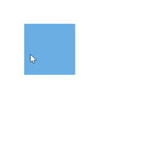

N> Syncfusion<sup style="font-size:70%">&reg;</sup> recommends using [Blazor Diagram Component](https://blazor.syncfusion.com/documentation/diagram/getting-started) which provides better performance than this diagram control. Blazor Diagram Component will be actively developed in the future.

# Interaction in Blazor Diagram Component

Diagram provides the support to drag, resize, or rotate the node interactively.

## Select

A node can be select at runtime by using the [Select](https://help.syncfusion.com/cr/blazor/Syncfusion.Blazor.Diagrams.SfDiagram.html#Syncfusion_Blazor_Diagrams_SfDiagram_Select_System_Object_System_Nullable_System_Boolean__) method and clear the selection in the diagram using the [ClearSelection](https://help.syncfusion.com/cr/blazor/Syncfusion.Blazor.Diagrams.SfDiagram.html#Syncfusion_Blazor_Diagrams_SfDiagram_ClearSelection). 

The following code explains how to select and clear selection in the diagram.

```cshtml
@using Syncfusion.Blazor.Diagrams
@using System.Collections.ObjectModel

<input type="button" value="Select" @onclick="OnSelect">
<input type="button" value="UnSelect" @onclick="@UnSelect" />
<SfDiagram @ref="@Diagram" Height="600px" Nodes="@NodeCollection">
</SfDiagram>

@code {
    // reference of the diagram
    SfDiagram Diagram;

    // To define node collection
    public ObservableCollection<DiagramNode> NodeCollection = new ObservableCollection<DiagramNode>() { };
    protected override void OnInitialized()
    {
        // A node is created and stored in nodes collection.
        DiagramNode node1 = new DiagramNode()
        {
            // Position of the node
            OffsetX = 250, OffsetY = 250,
            // Size of the node
            Width = 100, Height = 100,
            Style = new NodeShapeStyle() { Fill = "#6BA5D7", StrokeColor = "white" }
        };
        // Add node
        NodeCollection.Add(node1);
    }
    public void OnSelect()
    {
        // Select the node
        Diagram.Select(new ObservableCollection<DiagramNode>() { Diagram.Nodes[0] }, null);
    }
    public void UnSelect()
    {
        // clear selection in the diagram
        Diagram.ClearSelection();
    }
}
```

And also the selection enable during the interaction.

* An element can be selected by clicking that element.
* When you select the elements in the diagram, the [SelectionChanged](https://help.syncfusion.com/cr/blazor/Syncfusion.Blazor.Diagrams.DiagramEvents.html#Syncfusion_Blazor_Diagrams_DiagramEvents_SelectionChanged) event gets triggered and to do customization in this event.


## Drag

A node can be drag at runtime by using the [Drag](https://help.syncfusion.com/cr/blazor/Syncfusion.Blazor.Diagrams.SfDiagram.html#Syncfusion_Blazor_Diagrams_SfDiagram_Drag_System_Object_System_Double_System_Double_) method. 

The following code explains how to drag the node by using the drag method.

```cshtml
@using Syncfusion.Blazor.Diagrams
@using System.Collections.ObjectModel

<input type="button" value="Drag" @onclick="OnDrag">
<SfDiagram @ref="@Diagram" Height="600px" Nodes="@NodeCollection">
</SfDiagram>

@code {
    // reference of the diagram
    SfDiagram Diagram;
    // To define node collection
    public ObservableCollection<DiagramNode> NodeCollection = new ObservableCollection<DiagramNode>() { };
    protected override void OnInitialized()
    {
        // A node is created and stored in nodes collection.
        DiagramNode node1 = new DiagramNode()
        {
            // Position of the node
            OffsetX = 250,
            OffsetY = 250,
            // Size of the node
            Width = 100,
            Height = 100,
            Style = new NodeShapeStyle()
            {
                Fill = "#6BA5D7",
                StrokeColor = "white"
            }
        };
        // Add node
        NodeCollection.Add(node1);
    }
    public void OnDrag()
    {
        // Drag the node
        Diagram.Drag(Diagram.Nodes[0], 10, 10);
    }
}
```

And also the drag the node during the interaction.

* An object can be dragged by clicking and dragging it. When multiple elements are selected, dragging any one of the selected elements move all the selected elements.
* When you drag the elements in the diagram, the [OnPositionChange](https://help.syncfusion.com/cr/blazor/Syncfusion.Blazor.Diagrams.DiagramEvents.html#Syncfusion_Blazor_Diagrams_DiagramEvents_OnPositionChange) event gets triggered and to do customization in this event.



## Resize

A node can be resize at runtime by using the [Scale](https://help.syncfusion.com/cr/blazor/Syncfusion.Blazor.Diagrams.SfDiagram.html#Syncfusion_Blazor_Diagrams_SfDiagram_Scale_System_Object_System_Double_System_Double_Syncfusion_Blazor_Diagrams_PointModel_) method. 

The following code explains how to resize the node by using the scale method.

```cshtml
@using Syncfusion.Blazor.Diagrams
@using System.Collections.ObjectModel

<input type="button" value="Resize" @onclick="OnResize">
<SfDiagram @ref="@Diagram" Height="600px" Nodes="@NodeCollection">
</SfDiagram>

@code {
    // reference of the diagram
    SfDiagram Diagram;
    // To define node collection
    public ObservableCollection<DiagramNode> NodeCollection = new ObservableCollection<DiagramNode>() { };
    protected override void OnInitialized()
    {
        // A node is created and stored in nodes collection.
        DiagramNode node1 = new DiagramNode()
        {
            // Position of the node
            OffsetX = 250,
            OffsetY = 250,
            // Size of the node
            Width = 100,
            Height = 100,
            Style = new NodeShapeStyle()
            {
                Fill = "#6BA5D7",
                StrokeColor = "white"
            }
        };
        // Add node
        NodeCollection.Add(node1);
    }
    public void OnResize()
    {
        // Resize the node
        Diagram.Scale(Diagram.Nodes[0], 0.5, 0.5, new PointModel() { X = 0, Y = 0 });
    }
}
```

And also the resize the node during the interaction.

* Selector is surrounded by eight thumbs. When dragging these thumbs, the selected items can be resized.
* When one corner of the selector is dragged, the opposite corner will be in a static position.
* When a node is resized, the [OnSizeChange](https://help.syncfusion.com/cr/blazor/Syncfusion.Blazor.Diagrams.DiagramEvents.html#Syncfusion_Blazor_Diagrams_DiagramEvents_OnSizeChange) event gets triggered.


N>  While dragging and resizing, the objects are snapped towards the nearest objects to make better alignments. For better alignments, refer to `Snapping`.

## Rotate

A node can be rotate at runtime by using the [Rotate](https://help.syncfusion.com/cr/blazor/Syncfusion.Blazor.Diagrams.SfDiagram.html#Syncfusion_Blazor_Diagrams_SfDiagram_Rotate_System_Object_System_Double_Syncfusion_Blazor_Diagrams_PointModel_) method. The following code explains how to rotate the node by using method.

```cshtml
@using Syncfusion.Blazor.Diagrams
@using System.Collections.ObjectModel

<input type="button" value="Rotate" @onclick="OnRotate">
<SfDiagram @ref="@Diagram" Height="600px" Nodes="@NodeCollection">
</SfDiagram>

@code {
    // reference of the diagram
    SfDiagram Diagram;

    // To define node collection
    public ObservableCollection<DiagramNode> NodeCollection = new ObservableCollection<DiagramNode>() { };
    protected override void OnInitialized()
    {
        // A node is created and stored in nodes collection.
        DiagramNode node1 = new DiagramNode()
        {
            // Position of the node
            OffsetX = 250,
            OffsetY = 250,
            // Size of the node
            Width = 100, 
            Height = 100,
            Style = new NodeShapeStyle() 
        {
        Fill = "#6BA5D7", 
    StrokeColor = "white" 
}
        };
        // Add node
        NodeCollection.Add(node1);
    }
    public void OnRotate()
    {
        // Rotate the node
        Diagram.Rotate(Diagram.Nodes[0], Diagram.Nodes[0].RotateAngle+10);
    }
}
```

And also the rotate the node during the interaction.

* A rotate handler is placed above the selector. Clicking and dragging the handler in a circular direction lead to rotate the node.
* The node is rotated with reference to the static pivot point.
* Pivot thumb (thumb at the middle of the node) appears when rotating the node to represent the static point.


For more information about node interaction, refer to [Node Interaction](../interaction).

## See also

* [How to get events while the interact the node](./events)

* [How to positioning the node](./positioning)

* [How to customize the node](./appearance)

* [How to interact the annotation in diagram](../annotations/interaction)

* [How to interact the port in diagram](../ports/interaction)

* [How to interact the connector in diagram](../connectors/interactions)
