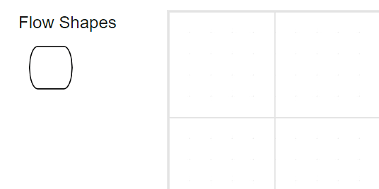
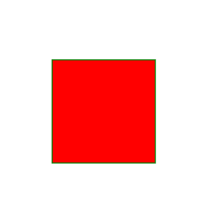

N> Syncfusion recommends using [Blazor Diagram Component](https://blazor.syncfusion.com/documentation/diagram/getting-started) which provides better performance than this diagram control. Blazor Diagram Component will be actively developed in the future.

# Actions of nodes in Blazor Diagram Component

Nodes are graphical objects that are used to visually represent the geometrical information, process flow, internal business procedure, entity, or any other kind of data and it represents the functions of a complete system in regards to how it interacts with external entities.


## Create node

A node can be created and added to the diagram, either programmatically or interactively. Nodes are stacked in the diagram area from bottom-to-top in the order they are added.

## Add node through nodes collection

To create a node, define the [DiagramNode](https://help.syncfusion.com/cr/blazor/Syncfusion.Blazor.Diagrams.DiagramNode.html) object and add that to the nodes collection of the diagram model. The following code example shows how to add a node to the diagram.

```cshtml
@using Syncfusion.Blazor.Diagrams
@using System.Collections.ObjectModel

<SfDiagram Height="600px" Nodes="@NodeCollection">
</SfDiagram>

@code{
    public ObservableCollection<DiagramNode> NodeCollection = new ObservableCollection<DiagramNode>() { };
    protected override void OnInitialized()
    {
        // A node is created and stored in the nodes collection.
        DiagramNode node1 = new DiagramNode()
        {
            // Position of the node
            OffsetX = 250,
            OffsetY = 250,
            // Size of the node
            Width = 100,
            Height = 100,
            Style = new NodeShapeStyle() { Fill = "#6BA5D7", StrokeColor = "white" }
        };
        // Add node
        NodeCollection.Add(node1);
    }
}
```


## Add node at runtime

* A node can be added in a diagram at runtime by using the [AddNode](https://help.syncfusion.com/cr/blazor/Syncfusion.Blazor.Diagrams.SfDiagram.html#Syncfusion_Blazor_Diagrams_SfDiagram_AddNode_Syncfusion_Blazor_Diagrams_DiagramNode_System_Nullable_System_Boolean__).

* The node’s ID property is used to define the name of the node and it is further used to find the node at runtime and do any customization.

The following code shows how to add a node at runtime.

```cshtml
@using Syncfusion.Blazor.Diagrams
@using System.Collections.ObjectModel

<input type="button" value="Add Node" @onclick="@AddNode" />
<SfDiagram @ref="@Diagram" Height="600px" Nodes="@NodeCollection">
</SfDiagram>

@code{
    SfDiagram Diagram;
    public ObservableCollection<DiagramNode> NodeCollection = new ObservableCollection<DiagramNode>() { };
    protected override void OnInitialized()
    {
        // A node is created and stored in nodes collection.
        DiagramNode node1 = new DiagramNode()
        {
            // Position of the node
            OffsetX = 250,
            OffsetY = 250,
            // Size of the node
            Width = 100,
            Height = 100,
            Style = new NodeShapeStyle()
            {
                Fill = "#6BA5D7",
                StrokeColor = "white"
            }
        };
        NodeCollection.Add(node1);
    }

    // Add node at runtime
    public void AddNode()
    {
        DiagramNode Node1 = new DiagramNode()
        {
            Id = "New Node1",
            OffsetX = 100,
            OffsetY = 100,
            Width = 100,
            Height = 100
        };
        Diagram.AddNode(Node1);
    }
}
```

Also, the Node can be added at runtime by using the `Add` method.

```csharp
// Add node at runtime
public void AddNode()
{
    DiagramNode Node2 = new DiagramNode()
    {
        Id = "New Node2",
        OffsetX = 100,
        OffsetY = 200,
        Width = 100,
        Height = 100,
    };
    NodeCollection.Add(Node2);
}
```


## Add node from palette

Nodes can be predefined and added to the palette, and can be dropped into the diagram when needed. For more information about adding nodes from symbol palette, refer to the [Symbol Palette](https://help.syncfusion.com/cr/blazor/Syncfusion.Blazor.Diagram.SymbolPalette.html).

* Once you drag a node/connector from the palette to the diagram, the following events can be used to do the customization.
* When a symbol is dragged into a diagram from symbol palette, the [DragEnter](https://help.syncfusion.com/cr/blazor/Syncfusion.Blazor.Diagrams.DiagramEvents.html#Syncfusion_Blazor_Diagrams_DiagramEvents_DragEnter) event gets triggered.
* When a symbol is dragged over a diagram, the [DragOver](https://help.syncfusion.com/cr/blazor/Syncfusion.Blazor.Diagrams.IDragOverEventArgs.html) event gets triggered.
* When a symbol is dragged and dropped from symbol palette to diagram area, the [Drop](https://help.syncfusion.com/cr/blazor/Syncfusion.Blazor.Diagrams.IBlazorDropEventArgs.html) event gets triggered.
* When a symbol is dragged outside of the diagram, the [DragLeave](https://help.syncfusion.com/cr/blazor/Syncfusion.Blazor.Diagrams.DiagramEvents.html#Syncfusion_Blazor_Diagrams_DiagramEvents_DragLeave) event gets triggered.

For more information about adding nodes from symbol palette, refer to the [Symbol Palette](../symbol-palette).

```cshtml
@using Syncfusion.Blazor.Diagrams
@using System.Collections.ObjectModel
@using DiagramShapes = Syncfusion.Blazor.Diagrams.Shapes

<div id="palette-space" style="width: 130px; float: left">
    <SfSymbolPalette id="symbolPalette" Width="130px" Height="700px" SymbolHeight="60" SymbolWidth="60" SymbolInfo="@SymbolInfo">
        <SymbolPalettePalettes>
            <SymbolPalettePalette Id="FlowShapePalette" Expanded="true" Symbols="@FlowShapeList" Title="Flow Shapes">
            </SymbolPalettePalette>
        </SymbolPalettePalettes>
    </SfSymbolPalette>
</div>
<div style="border: 1px solid #D7D7D7">
    <SfDiagram ID="diagram" Height="400px" Width="1200px">
    </SfDiagram>
</div>
@code
{
    // Defines palette's flow-shape collection
    public ObservableCollection<DiagramNode> FlowShapeList { get; set; }

    // Defines Symbol info
    public SymbolInfo SymbolInfo { get; set; }

    protected override void OnInitialized()
    {
        // Sets the symbol info
        SymbolInfo = new SymbolInfo() { Fit = true };

        // Add shapes to palette
        FlowShapeList = new ObservableCollection<DiagramNode>()
        {
            new DiagramNode()
            {
                Id = "Terminator",
                // Set the symbol preview size
                PreviewSize = new SymbolSizeModel() { Width = 100, Height = 100 },
                // Sets the shape of the node
                Shape = new DiagramShape()
                {
                    Type = DiagramShapes.Flow,
                    FlowShape = FlowShapes.Terminator
                }
            }
        };
    }
}
```



## Draw Node using drawing object

Nodes can be interactively drawn by clicking and dragging on the diagram surface by using the [DrawingObject](https://help.syncfusion.com/cr/blazor/Syncfusion.Blazor.Diagrams.SfDiagram.html#Syncfusion_Blazor_Diagrams_SfDiagram_DrawingObject).

For more information about drawing Node, refer to the [Draw Nodes](https://help.syncfusion.com/cr/blazor/Syncfusion.Blazor.Diagrams.DiagramTools.html).


## Create node through data source

Nodes can be generated automatically with the information provided through data source. The default properties for these nodes are fetched from default settings.

## Remove node at runtime

A node can be removed from diagram at runtime by using the [Remove](https://help.syncfusion.com/cr/blazor/Syncfusion.Blazor.Diagrams.SfDiagram.html#Syncfusion_Blazor_Diagrams_SfDiagram_Remove_System_Object_) method.

The following code shows how to remove a node at runtime.

```cshtml
@using Syncfusion.Blazor.Diagrams
@using System.Collections.ObjectModel

<input type="button" value="Remove Node" @onclick="@RemoveNode" />
<SfDiagram @ref="@Diagram" Height="600px" Nodes="@NodeCollection">
</SfDiagram>

@code{
    SfDiagram Diagram;
    public ObservableCollection<DiagramNode> NodeCollection = new ObservableCollection<DiagramNode>() { };
    protected override void OnInitialized()
    {
        // A node is created and stored in node's collection.
        DiagramNode node1 = new DiagramNode()
        {
            // Position of the node
            OffsetX = 250,
            OffsetY = 250,
            // Size of the node
            Width = 100,
            Height = 100,
            Style = new NodeShapeStyle() { Fill = "#6BA5D7", StrokeColor = "white" }
        };
        // Add node
        NodeCollection.Add(node1);
    }

    // Remove Node at runtime
    public void RemoveNode()
    {
        Diagram.Remove(NodeCollection[0]);
    }
}
```

A Node can be removed from the diagram by using the native [RemoveAt`] method. Refer to the following example that shows how to remove node at runtime.

```csharp
// Add node at runtime
public void RemoveNode()
{
    NodeCollection.RemoveAt(0);
}
```

## Update node at runtime

You can change any node's properties at runtime. The following code sample shows how the annotation of the node changed at runtime.

```cshtml

@using Syncfusion.Blazor.Diagrams
@using System.Collections.ObjectModel

<input type="button" value="Update" @onclick="@UpdateNode" />
<SfDiagram @ref="@Diagram" Height="600px" Nodes="@NodeCollection">
</SfDiagram>

@code{
    // reference of the diagram
    SfDiagram Diagram;

    public ObservableCollection<DiagramNode> NodeCollection = new ObservableCollection<DiagramNode>() { };

    protected override void OnInitialized()
    {
        // A node is created and stored in nodes collection.
        DiagramNode node1 = new DiagramNode()
        {
            // Position of the node
            OffsetX = 250,
            OffsetY = 250,
            // Size of the node
            Width = 100,
            Height = 100,
            Style = new NodeShapeStyle() { Fill = "#6BA5D7", StrokeColor = "white" }
        };
        // Add node
        NodeCollection.Add(node1);
    }

    // update node properties at run time
    public void UpdateNode()
    {
        Diagram.BeginUpdate();
        NodeCollection[0].Style.Fill = "red";
        NodeCollection[0].Style.StrokeColor = "green";
        Diagram.EndUpdate();
    }
}
```



**Note:** You cannot reset the node collection directly to add or update the node collection.

## See Also

* [How to add annotations to the node](../annotations/labels)

* [How to add ports to the node](../ports/ports)

* [How to enable/disable the behavior of the node](../constraints)

* [How to edit the node visual interface](../interaction#selection)
