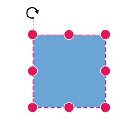
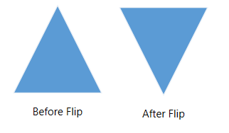

N> Syncfusion<sup style="font-size:70%">&reg;</sup> recommends using [Blazor Diagram Component](https://blazor.syncfusion.com/documentation/diagram/getting-started) which provides better performance than this diagram control. Blazor Diagram Component will be actively developed in the future.

# Positioning in Blazor Diagram Component

## Arrange the nodes

* Position of a node is controlled by using the [OffsetX](https://help.syncfusion.com/cr/blazor/Syncfusion.Blazor.Diagrams.DiagramNode.html#Syncfusion_Blazor_Diagrams_DiagramNode_OffsetX) and [OffsetY](https://help.syncfusion.com/cr/blazor/Syncfusion.Blazor.Diagrams.DiagramNode.html#Syncfusion_Blazor_Diagrams_DiagramNode_OffsetY) properties. By default, these offset properties represent the distance between the origin of the diagram’s page and node’s center point.

* You may expect this offset values to represent the distance between page origin and node’s top-left corner instead of center. The Pivot property helps to solve this problem. Default value of node’s [Pivot](https://help.syncfusion.com/cr/blazor/Syncfusion.Blazor.Diagrams.DiagramNode.html#Syncfusion_Blazor_Diagrams_DiagramNode_Pivot) point is (0.5, 0.5) that means center of the node.

* The size of the node can be controlled by using the [Width](https://help.syncfusion.com/cr/blazor/Syncfusion.Blazor.Diagrams.DiagramNode.html#Syncfusion_Blazor_Diagrams_DiagramNode_Width) and [Height](https://help.syncfusion.com/cr/blazor/Syncfusion.Blazor.Diagrams.DiagramNode.html#Syncfusion_Blazor_Diagrams_DiagramNode_Height) properties.

* Rotation of a node is controlled by using the [RotateAngle](https://help.syncfusion.com/cr/blazor/Syncfusion.Blazor.Diagrams.DiagramNode.html#Syncfusion_Blazor_Diagrams_DiagramNode_RotateAngle) property.

The following table shows how pivot relates offset values with node boundaries.

| Pivot | Offset |
|-------- | -------- |
| (0.5,0.5)| OffsetX and OffsetY values are considered as the node’s center point. |
| (0,0) | OffsetX and OffsetY values are considered as the top-left corner of the node. |
| (1,1) | OffsetX and OffsetY values are considered as the bottom-right corner of the node. |

The following code shows how to change the `Pivot` value.

```cshtml
@using Syncfusion.Blazor.Diagrams
@using System.Collections.ObjectModel

<SfDiagram Height="600px" @ref="@diagram" Nodes="@NodeCollection">
</SfDiagram>

@code {
    SfDiagram diagram;
    public ObservableCollection<DiagramNode> NodeCollection = new ObservableCollection<DiagramNode>() { };
    protected override void OnInitialized()
    {
        // A node is created and stored in nodes array.
        DiagramNode node1 = new DiagramNode()
        {
            // Position of the node
            OffsetX = 250,
            OffsetY = 250,
            // Size of the node
            Width = 100,
            Height = 100,
            Style = new NodeShapeStyle() { Fill = "#6BA5D7", StrokeColor = "white" },
            // Pivot of the node
            Pivot = new NodePivotPoint() { X = 0, Y = 0 }
        };
        NodeCollection.Add(node1);
    }

    protected override async Task OnAfterRenderAsync(bool firstRender)
    {
        if (firstRender)
        {
            //OnAfterRenderAsync will be triggered after the component rendered.
            await Task.Delay(1500);
            diagram.Select(new ObservableCollection<DiagramNode>() { diagram.Nodes[0] }, null);
        }
    }
}
```



## Flip

The diagram Provides support to flip the node. [Flip](https://help.syncfusion.com/cr/blazor/Syncfusion.Blazor.Diagrams.DiagramNode.html#Syncfusion_Blazor_Diagrams_DiagramNode_Flip) is performed to give the mirrored image of the original element.

* [The Flip is also applicable for connectors](./flip)

The flip types are as follows:

* `HorizontalFlip` is used to change the element in the horizontal direction.

* `VerticalFlip` is used to change the element in the vertical direction

* `Both` that involves both vertical and horizontal changes of the element.

The following code shows how to provide the mirror image of the original element.

```cshtml
@using Syncfusion.Blazor.Diagrams
@using System.Collections.ObjectModel

<SfDiagram Height="600px" Nodes="@NodeCollection">
</SfDiagram>

@code {
    SfDiagram diagram;
    public ObservableCollection<DiagramNode> NodeCollection = new ObservableCollection<DiagramNode>() { };
    protected override void OnInitialized()
    {
        // A node is created and stored in nodes array.
        DiagramNode node1 = new DiagramNode()
        {
            // Position of the node
            OffsetX = 250,
            OffsetY = 250,
            // Size of the node
            Width = 100,
            Height = 100,
            Style = new NodeShapeStyle() { Fill = "#6BA5D7", StrokeColor = "white" },
            // Flip the node in Vertical Direction
            Flip = FlipDirection.Vertical,
            Shape = new DiagramShape()
            {
                Type = Syncfusion.Blazor.Diagrams.Shapes.Basic,
                BasicShape = BasicShapes.Triangle
            }
        };
        // Add node
        NodeCollection.Add(node1);
    }
}
```



N> The flip is also applicable for group and BPMN shapes.

## See also

* [How to customize the node](./appearance)

* [How to get events when they interact the node](./events)
