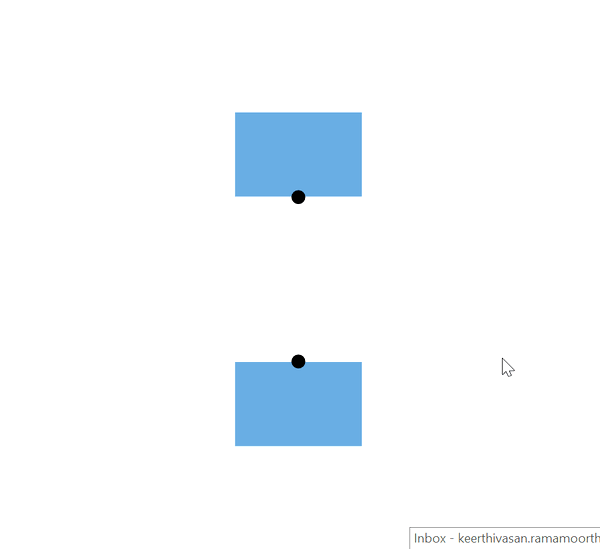

N> Syncfusion recommends using [Blazor Diagram Component](https://blazor.syncfusion.com/documentation/diagram/getting-started) which provides better performance than this diagram control. Blazor Diagram Component will be actively developed in the future.

# Actions of Port in Blazor Diagram Component

Port is a special connection point in a Node that you can glue the connectors. When you glue a connector to a node or port, they stay connected, even if one of the node is moved.


## Connections

There are two main types of connections, dynamic and port. The difference between these two connections is whether or not a connector remains glued to a specific connection point when you move the attached node or connector.

A dynamic connection is one where the connector will move around the node as you move the node. Diagram will always ensure the connector is the shortest, most direct line possible. You can create a dynamic  connection by selecting the entire node (rather than the port) and connect it to another shape (rather than to a port).


Ports act as the connection points of the node and allows creating connections with only those specific points as shown in the following image.



## Create ports

To add a connection port, define the port object and add it to node’s ports collection. The [Offset](https://help.syncfusion.com/cr/blazor/Syncfusion.Blazor.Diagrams.DiagramPort.html#Syncfusion_Blazor_Diagrams_DiagramPort_Offset) property of the port accepts an object of fractions and used to determine the position of ports. The following code explains how to add ports when initializing the node.

```cshtml
@using Syncfusion.Blazor.Diagrams
@using System.Collections.ObjectModel

<SfDiagram Height="600px" Nodes="@NodeCollection">
</SfDiagram>

@code{

    public ObservableCollection<DiagramNode> NodeCollection = new ObservableCollection<DiagramNode>() { };
    protected override void OnInitialized()
    {
        // A node is created and stored in nodes collection.
        DiagramNode node1 = new DiagramNode()
        {
            // Position of the node
            OffsetX = 250,
            OffsetY = 250,
            // Size of the node
            Width = 100,
            Height = 100,
            Style = new NodeShapeStyle() { Fill = "#6BA5D7", StrokeColor = "white" },
            // Initialize port collection
            Ports = new ObservableCollection<DiagramPort>()
            {
                // Sets the position for the port
                new DiagramPort()
                {
                    Style=new PortShapeStyle(){ Fill="gray" },
                    Offset= new NodePortOffset(){X=0.5,Y=0.5},
                    Visibility = PortVisibility.Visible
                }
            }
        };
        NodeCollection.Add(node1);
    }
}
```


## Add ports at runtime

Add ports at runtime by using the server-side method [Add`] in the port collection. The following code explains how to add ports to node at runtime.

The port’s [Id](https://help.syncfusion.com/cr/blazor/Syncfusion.Blazor.Diagrams.DiagramPort.html#Syncfusion_Blazor_Diagrams_DiagramPort_Id) property is used to define the unique ID for the port and it is further used to find the port at runtime. If **Id** is not set, then default **Id** is automatically set.

```cshtml
@using Syncfusion.Blazor.Diagrams
@using System.Collections.ObjectModel

<input type="button" value="AddPorts" @onclick="@AddPorts" />

<SfDiagram Height="600px" Nodes="@NodeCollection">
</SfDiagram>

@code{

    public ObservableCollection<DiagramNode> NodeCollection = new ObservableCollection<DiagramNode>() { };

    protected override void OnInitialized()
    {
        //A node is created and stored in nodes array
        DiagramNode node1 = new DiagramNode()
        {
            //Position of the node
            OffsetX = 250,
            OffsetY = 250,
            //Size of the node
            Width = 100,
            Height = 100,
            Style = new NodeShapeStyle() { Fill = "#6BA5D7", StrokeColor = "white" },
        };
        NodeCollection.Add(node1);
    }
    public void AddPorts()
    {
        // Initialize port collection
        NodeCollection[0].Ports.Add(new DiagramPort()
        {
            Id = "port1",
            Offset = new NodePortOffset() { X = 0, Y = 0.5 },
            Visibility = PortVisibility.Visible
        });
        NodeCollection[0].Ports.Add(new DiagramPort()
        {
            Id = "port2",
            Offset = new NodePortOffset() { X = 1, Y = 0.5 },
            Visibility = PortVisibility.Visible
        });
        NodeCollection[0].Ports.Add(new DiagramPort()
        {
            Id = "port3",
            Offset = new NodePortOffset() { X = 0.5, Y = 0 },
            Visibility = PortVisibility.Visible
        });
        NodeCollection[0].Ports.Add(new DiagramPort()
        {
            Id = "port4",
            Offset = new NodePortOffset() { X = 0.5, Y = 1 },
            Visibility = PortVisibility.Visible
        });
    }
}
```

## Remove ports at runtime

A collection of ports can be removed from the node by using the native[RemoveAt`] method. Refer to the following example that shows how to remove ports at runtime.

```cshtml
@using Syncfusion.Blazor.Diagrams
@using System.Collections.ObjectModel
<input type="button" value="RemovePorts" @onclick="@RemovePorts" />
<SfDiagram Height="600px" Nodes="@NodeCollection">
</SfDiagram>
@code{

    public ObservableCollection<DiagramNode> NodeCollection = new ObservableCollection<DiagramNode>() { };
    protected override void OnInitialized()
    {
        // A node is created and stored in nodes array.
        DiagramNode node1 = new DiagramNode()
        {
            // Position of the node
            OffsetX = 250,
            OffsetY = 250,
            // Size of the node
            Width = 100,
            Height = 100,
            Style = new NodeShapeStyle() { Fill = "#6BA5D7", StrokeColor = "white" },
            // Initialize port collection
            Ports = new ObservableCollection<DiagramPort>()
            {
                new DiagramPort()
                {
                    Id = "port1",
                    Offset = new NodePortOffset() { X = 0, Y = 0.5 },
                    Visibility = PortVisibility.Visible,
                    //Set the style for the port
                    Style= new PortShapeStyle(){ Fill="red", StrokeColor="black", StrokeWidth=2},
                    // Sets the shape of the port as Circle
                    Width= 12,
                    Height=12,
                    Shape= PortShapes.Circle
                }
            },
        };
        NodeCollection.Add(node1);
    }
    public void RemovePorts()
    {
        (NodeCollection[0].Ports as ObservableCollection<DiagramPort>).RemoveAt(0);
    }
}
```

## Update ports at runtime

You can change any port properties at runtime.

The following code example explains how to change the port properties at runtime.

```cshtml
@using Syncfusion.Blazor.Diagrams
@using System.Collections.ObjectModel

<input type="button" value="Update Port" @onclick="@UpdatePort" />
<SfDiagram Height="600px" Nodes="@NodeCollection">
</SfDiagram>

@code{

    public ObservableCollection<DiagramNode> NodeCollection = new ObservableCollection<DiagramNode>() { };
    protected override void OnInitialized()
    {
        // Initialize port collection
        ObservableCollection<DiagramPort> Ports1 = new ObservableCollection<DiagramPort>() { };
        Ports1.Add(new DiagramPort()
        {
            Id = "port1",
            Offset = new NodePortOffset() { X = 0, Y = 0.5 },
            Visibility = PortVisibility.Visible
        });
        // A node is created and stored in nodes array
        DiagramNode node1 = new DiagramNode()
        {
            // Position of the node
            OffsetX = 250,
            OffsetY = 250,
            // Size of the node
            Width = 100,
            Height = 100,
            Style = new NodeShapeStyle() { Fill = "#6BA5D7", StrokeColor = "white" },
            Ports = Ports1
        };
        NodeCollection.Add(node1);
    }
    public void UpdatePort()
    {
        //update ports at run time
        NodeCollection[0].BeginUpdate();
        NodeCollection[0].Ports[0].Offset.X = 1;
        NodeCollection[0].Ports[0].Offset.Y = 1;
        NodeCollection[0].EndUpdate();
    }
}
```

## See also

* [How to create a node](../nodes/nodes)

* [How to customize the ports](./appearance)

* [How to interact the ports](./interaction)

* [How to set the position of the port](./positioning)
