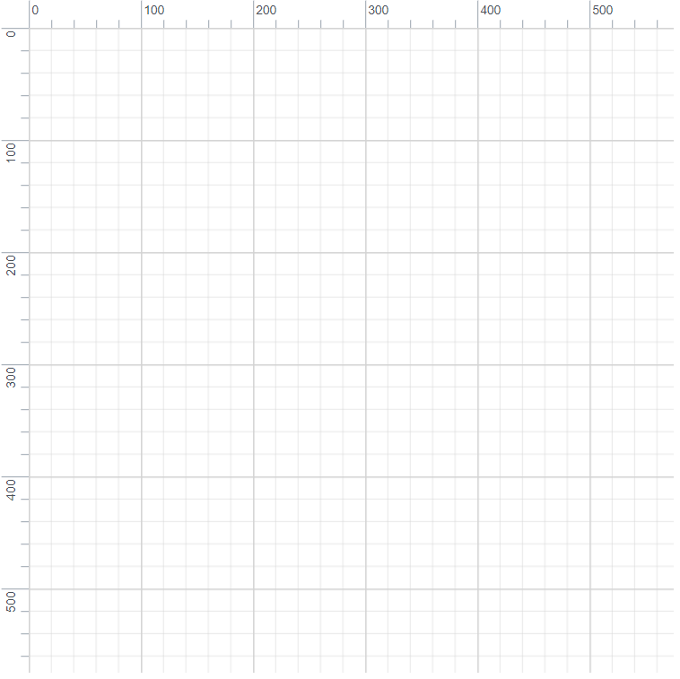
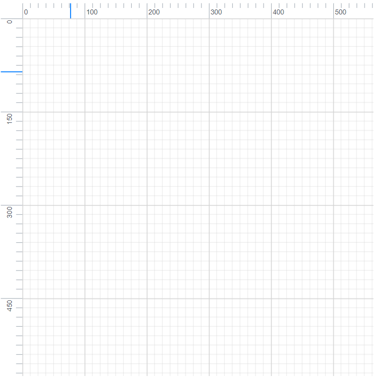

# Ruler in Blazor Diagram Component

The Ruler provides a horizontal and vertical guide for measuring in the Diagram control. The Ruler can be used to measure the diagram objects, indicate positions, and align diagram elements. This is especially useful in creating scale models.

## Adding Rulers to the Diagram

* The [DiagramRulerSettings](https://help.syncfusion.com/cr/blazor/Syncfusion.Blazor.Diagrams.DiagramRulerSettings.html) property is used to control the visibility and appearance of the ruler in the diagram.

* The RulerSettings [ShowRulers](https://help.syncfusion.com/cr/blazor/Syncfusion.Blazor.Diagrams.DiagramRulerSettings.html#Syncfusion_Blazor_Diagrams_DiagramRulerSettings_ShowRulers) property is used to show or hide the rulers in the diagram.

* The RulerSettings [HorizontalRuler](https://help.syncfusion.com/cr/blazor/Syncfusion.Blazor.Diagrams.HorizontalRuler.html) and [VerticalRuler](https://help.syncfusion.com/cr/blazor/Syncfusion.Blazor.Diagrams.VerticalRuler.html) properties are used to customize the rulers appearance in the diagram.

The following code shows how to add a ruler to the diagram.

```cshtml
@using Syncfusion.Blazor.Diagrams

<SfDiagram Width="600px" Height="600px">
    <DiagramRulerSettings ShowRulers="true">
    </DiagramRulerSettings>
</SfDiagram>

```



## Customizing the Ruler

By default, the ruler segments are arranged based on pixel values.

* The HorizontalRuler’s [Interval](https://help.syncfusion.com/cr/blazor/Syncfusion.Blazor.Diagrams.DiagramsRuler.html#Syncfusion_Blazor_Diagrams_DiagramsRuler_Interval) property allows you to define the interval between ruler segments and the [SegmentWidth](https://help.syncfusion.com/cr/blazor/Syncfusion.Blazor.Diagrams.DiagramsRuler.html#Syncfusion_Blazor_Diagrams_DiagramsRuler_SegmentWidth) property allows you to define the segment width of the ruler. Similarly, the VerticalRuler’s [Interval](https://help.syncfusion.com/cr/blazor/Syncfusion.Blazor.Diagrams.DiagramsRuler.html#Syncfusion_Blazor_Diagrams_DiagramsRuler_Interval) and [SegmentWidth](https://help.syncfusion.com/cr/blazor/Syncfusion.Blazor.Diagrams.DiagramsRuler.html#Syncfusion_Blazor_Diagrams_DiagramsRuler_SegmentWidth) properties are used to define the interval and segment width of the vertical ruler.

* The HorizontalRuler’s [TickAlignment](https://help.syncfusion.com/cr/blazor/Syncfusion.Blazor.Diagrams.DiagramsRuler.html#Syncfusion_Blazor_Diagrams_DiagramsRuler_TickAlignment) property is used to align the ruler tick either left or right side of the ruler. The VerticalRuler’s [TickAlignment](https://help.syncfusion.com/cr/blazor/Syncfusion.Blazor.Diagrams.DiagramsRuler.html#Syncfusion_Blazor_Diagrams_DiagramsRuler_TickAlignment) property is used to align the ruler tick either top or bottom side of the ruler.

* The HorizontalRuler’s [MarkerColor](https://help.syncfusion.com/cr/blazor/Syncfusion.Blazor.Diagrams.DiagramsRuler.html#Syncfusion_Blazor_Diagrams_DiagramsRuler_MarkerColor) and VerticalRuler’s [MarkerColor](https://help.syncfusion.com/cr/blazor/Syncfusion.Blazor.Diagrams.DiagramsRuler.html#Syncfusion_Blazor_Diagrams_DiagramsRuler_MarkerColor) properties are used to define the ruler marker color and marker will be shown when performing the interaction in the diagram.

The following code shows how the diagram ruler can be customized.

```cshtml
@using Syncfusion.Blazor.Diagrams

<SfDiagram Width="600px" Height="600px">
    <DiagramRulerSettings ShowRulers="true">
        <HorizontalRuler Interval="8" SegmentWidth="100" Thickness="25" TickAlignment="@verticalTickAlignment"></HorizontalRuler>
        <VerticalRuler Interval="10" SegmentWidth="150" Thickness="35" TickAlignment="@horizontalTickAlignment"></VerticalRuler>
    </DiagramRulerSettings>
</SfDiagram>

@code{
    TickAlignment verticalTickAlignment = TickAlignment.LeftOrTop;
    TickAlignment horizontalTickAlignment = TickAlignment.RightOrBottom;
}
```

> The MarkerColor property can be customized using the [Marker](./style#customizing-the-ruler) CSS style.

