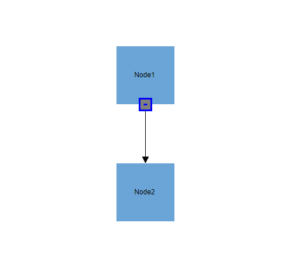
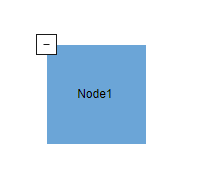
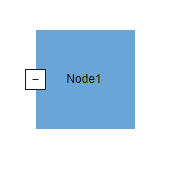
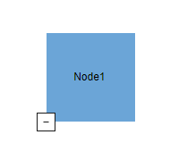
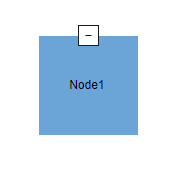
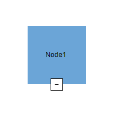
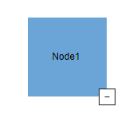

# DiagramIcon for Node in Blazor Diagram Component

Diagram provides support to describe the state of the node. i.e., the node is expanded or collapsed state.The DiagramIcon icon is used to show or hide children and view only the relevant nodes in the diagram. The IsExpanded property of node is used to expand or collapse the children nodes.The DiagramIcon Icon is used to compress the view of a hierarchy so that only the roots of each elements are visible. The opposite of collapse is expand that makes the entire elements visible.

## Initializing the DiagramIcon

There are two types of DiagramIcon each to represent the State of the Node:

* DiagramExpandIcon

* DiagramCollapseIcon


The following code example illustrates how to create an icon of various shapes in a simple node connection.

```csharp
@using Syncfusion.Blazor.Diagram

<SfDiagramComponent Height="600px" Nodes="@nodes" Connectors="@connectors" />

@code
{
    DiagramObjectCollection<Node> nodes;
    DiagramObjectCollection<Connector> connectors;

    protected override void OnInitialized()
    {
        Node node1 = new Node()
        {
            ID = "node1",
            Width = 100,
            Height = 100,
            OffsetX = 300,
            OffsetY = 300,
            Style = new ShapeStyle()
            {
                Fill = "#6BA5D7",
                StrokeColor = "white"
            },
            Annotations = new DiagramObjectCollection<ShapeAnnotation>()
            {
                new ShapeAnnotation()
                {
                    Content="Node1"
                }
            },
            ExpandIcon = new DiagramExpandIcon()
            {
                Shape = DiagramExpandIcons.Minus,
                Height = 20,
                Width = 20,
            },
            CollapseIcon = new DiagramCollapseIcon()
            {
                Shape = DiagramCollapseIcons.Plus,
                Height = 20,
                Width = 20,
            },
        };
        nodes.Add(node1);
        Node node2 = new Node()
        {
            ID = "node2",
            Width = 100,
            Height = 100,
            OffsetX = 300,
            OffsetY = 500,
            Style = new ShapeStyle()
            {
                Fill = "#6BA5D7",
                StrokeColor = "white"
            },
             Annotations = new DiagramObjectCollection<ShapeAnnotation>()
            {
                new ShapeAnnotation()
                {
                    Content="Node2"
                }
            },
            ExpandIcon = new DiagramExpandIcon()
            {
                Shape = DiagramExpandIcons.Minus,
                Height = 20,
                Width = 20,
            },
            CollapseIcon = new DiagramCollapseIcon()
            {
                Shape = DiagramCollapseIcons.Plus,
                Height = 20,
                Width = 20,
            },
        };
        nodes.Add(node2);
        Connector connector1 = new Connector()
        {
            ID = "connector1",
            SourceID = "node1",
            TargetID = "node2",
        };
        connectors.Add(connector1)
    }
}
```


The following code example illustrates how to create an icon of various shapes in a Layout.
```csharp
@using Syncfusion.Blazor.Diagram
@using Syncfusion.Blazor.Diagram.Internal
@using System.Collections.ObjectModel
@using System.Reflection;

<SfDiagramComponent @ref="diagram" Width="900px" Height="600px" InteractionController="@DiagramInteractions.ZoomPan" NodeCreating="NodeCreating" ConnectorCreating="ConnectorCreating">
        <DataSourceSettings DataSource="DataSource" ID="Id" ParentID="Manager"></DataSourceSettings>
            <Layout @bind-Type="type" @bind-HorizontalSpacing="@HorizontalSpacing" @bind-FixedNode="@FixedNode" @bind-Orientation="@oreintation" @bind-VerticalSpacing="@VerticalSpacing" @bind-HorizontalAlignment="@horizontalAlignment" @bind-VerticalAlignment="@verticalAlignment" GetLayoutInfo="GetLayoutInfo">
                <LayoutMargin @bind-Top="@top" @bind-Bottom="@bottom" @bind-Right="@right" @bind-Left="@left"></LayoutMargin>               
            </Layout>
            <SnapSettings></SnapSettings>
</SfDiagramComponent>
@code{

    public SfDiagramComponent diagram;
    double top = 50;
    double bottom = 50;
    double right = 50;
    double left = 50;
    LayoutType type = LayoutType.OrganizationalChart;
    LayoutOrientation oreintation = LayoutOrientation.TopToBottom;
    HorizontalAlignment horizontalAlignment = HorizontalAlignment.Auto;
    VerticalAlignment verticalAlignment = VerticalAlignment.Auto;
    int HorizontalSpacing = 30;
    int VerticalSpacing = 30;
    Orientation subTreeOrientation = Orientation .Vertical;
    SubTreeAlignmentType subTreeAlignment= SubTreeAlignmentType.Left;
    private string FixedNode = null;
    public class HierarchicalDetails
    {
        public string Id { get; set; }
        public string Role { get; set; }
        public string Manager { get; set; }
        public string ChartType { get; set; }
        public string Color { get; set; }
    }
    public List<HierarchicalDetails> DataSource = new List<HierarchicalDetails>()
    {
        new HierarchicalDetails()   { Id= "parent", Role= "Board", Color= "#71AF17" },
        new HierarchicalDetails()   { Id= "1", Role= "General Manager", Manager= "parent", ChartType= "right", Color= "#71AF17" },
        new HierarchicalDetails()   { Id= "11", Role= "Assistant Manager", Manager= "1", Color= "#71AF17" },
        new HierarchicalDetails()   { Id= "2", Role= "Human Resource Manager", Manager= "1", ChartType= "right", Color= "#1859B7" },
        new HierarchicalDetails()   { Id= "3", Role= "Trainers", Manager= "2", Color= "#2E95D8" },
        new HierarchicalDetails()   { Id= "4", Role= "Recruiting Team", Manager= "2", Color= "#2E95D8" },
        new HierarchicalDetails()   { Id= "5", Role= "Finance Asst. Manager", Manager= "2", Color= "#2E95D8" },
        new HierarchicalDetails()   { Id= "6", Role= "Design Manager", Manager= "1",ChartType= "right", Color= "#1859B7" },
        new HierarchicalDetails()   { Id= "7", Role= "Design Supervisor", Manager= "6", Color= "#2E95D8" },
        new HierarchicalDetails()   { Id= "8", Role= "Development Supervisor", Manager= "6", Color= "#2E95D8" },
        new HierarchicalDetails()   { Id= "9", Role= "Drafting Supervisor", Manager= "6", Color= "#2E95D8" },
        new HierarchicalDetails()   { Id= "10", Role= "Operation Manager", Manager= "1", ChartType= "right", Color= "#1859B7" },
        new HierarchicalDetails()   { Id= "11", Role= "Statistic Department", Manager= "10", Color= "#2E95D8" },
        new HierarchicalDetails()   { Id= "12", Role= "Logistic Department", Manager= "10", Color= "#2E95D8" },
        new HierarchicalDetails()   { Id= "16", Role= "Marketing Manager", Manager= "1", ChartType= "right", Color= "#1859B7" },
        new HierarchicalDetails()   { Id= "17", Role= "Oversea sales Manager", Manager= "16", Color= "#2E95D8" },
        new HierarchicalDetails()   { Id= "18", Role= "Petroleum Manager", Manager= "16", Color= "#2E95D8" },
        new HierarchicalDetails()   { Id= "20", Role= "Service Dept. Manager", Manager= "16", Color= "#2E95D8" },
        new HierarchicalDetails()   { Id= "21", Role= "Quality Department", Manager= "16", Color= "#2E95D8" }
    };
    private TreeInfo GetLayoutInfo(IDiagramObject obj, TreeInfo options)
    {
        if (rows == 0)
        {
            if (rows == 0 && options.Rows != null)
                options.Rows = null;
            Node node = obj as Node;
            if (pattern == "Pattern3Select" || pattern == "Pattern4Select")
            {
                options.Offset = -50;
            }
            if ((node.Data as HierarchicalDetails).Role == "General Manager")
            {
                if (options.Children.Count > 0)
                {
                    options.Assistants.Add(options.Children[0]);
                    options.Children.RemoveAt(0);
                }
            }
            if (!options.HasSubTree)
            {
                options.Orientation = subTreeOrientation;
                options.AlignmentType = subTreeAlignment;
            }
        }
        else
        {
            if (!options.HasSubTree)
            {
                options.AlignmentType = SubTreeAlignmentType.Balanced;
                options.Orientation = Orientation .Horizontal;
                options.Rows = rows;
            }
        }
        return options;
    }
     private void NodeCreating(IDiagramObject obj)
    {
        Node node = obj as Node;
        if(node.Data is System.Text.Json.JsonElement)
        {
            node.Data = System.Text.Json.JsonSerializer.Deserialize<HierarchicalDetails>(node.Data.ToString());
        }
        HierarchicalDetails hierarchicalData = node.Data as HierarchicalDetails;
        node.Width = 150;
        node.Height = 50;
        node.Style.Fill = hierarchicalData.Color;
        node.Annotations = new DiagramObjectCollection<ShapeAnnotation>()
        {
            new ShapeAnnotation()
            {
                Content = hierarchicalData.Role,
                Style =new TextStyle(){Color = "white"}
            }
        };
        node.ExpandIcon = new DiagramExpandIcon()
        {
            Shape = DiagramExpandIcons.Minus,
            Height=20,
            Width = 20,
            Fill = "Gray"
        };
        node.CollapseIcon = new DiagramCollapseIcon()
        {
            Shape = DiagramCollapseIcons.Plus,
             Height=20,
            Width = 20,
            Fill = "Gray"
        };
    }
}
```


## Customization
To explore the properties of expand and collapse icon, refer to [DiagramExpandIcon](https://help.syncfusion.com/cr/blazor/Syncfusion.Blazor.Diagram.DiagramExpandIcon.html) and [DiagramCollapseIcon](https://help.syncfusion.com/cr/blazor/Syncfusion.Blazor.Diagram.DiagramCollapseIcon.html).

### Change the shape of the DiagramIcon

The shape of a DiagramExpandIcon and DiagramCollapseIcon can be changed by using the Shape property. 
To explore the different types of DiagramExpandIcon shapes, refer to [DiagramExpandIcons](https://help.syncfusion.com/cr/blazor/Syncfusion.Blazor.Diagram.DiagramExpandIcons.html).
To explore the different types of DiagramCollapseIcon shapes, refer to [DiagramCollapseIcons](https://help.syncfusion.com/cr/blazor/Syncfusion.Blazor.Diagram.DiagramCollapseIcons.html).
If you need to render a custom shape, then you can set shape to path and define path using the path data property.


### The appearance of the Icon can be customized by using the BorderColor, BorderWidth, Fill properties.

The following code explains how to change the appearance of the port.

```csharp
@using Syncfusion.Blazor.Diagram

<SfDiagramComponent Height="600px" Nodes="@nodes" Connectors="@connectors" />

@code
{
    DiagramObjectCollection<Node> nodes;
    DiagramObjectCollection<Connector> connectors;

    protected override void OnInitialized()
    {
        Node node1 = new Node()
        {
            ID = "node1",
            Width = 100,
            Height = 100,
            OffsetX = 300,
            OffsetY = 300,
            Style = new ShapeStyle()
            {
                Fill = "#6BA5D7",
                StrokeColor = "white"
            },
            Annotations = new DiagramObjectCollection<ShapeAnnotation>()
            {
                new ShapeAnnotation()
                {
                    Content="Node1"
                }
            },
            ExpandIcon = new DiagramExpandIcon()
            {
                Shape = DiagramExpandIcons.Minus,
                Height = 20,
                Width = 20,
                Fill = "Gray",
                BorderColor = "Blue", 
                BorderWidth = 3,
            },
            CollapseIcon = new DiagramCollapseIcon()
            {
                Shape = DiagramCollapseIcons.Plus,
                Height = 20,
                Width = 20,
                Fill = "Gray",
                BorderColor = "Blue", 
                BorderWidth = 3,
            },
        };
        nodes.Add(node1);
        Node node2 = new Node()
        {
            ID = "node2",
            Width = 100,
            Height = 100,
            OffsetX = 300,
            OffsetY = 500,
            Style = new ShapeStyle()
            {
                Fill = "#6BA5D7",
                StrokeColor = "white"
            },
             Annotations = new DiagramObjectCollection<ShapeAnnotation>()
            {
                new ShapeAnnotation()
                {
                    Content="Node2"
                }
            },
            ExpandIcon = new DiagramExpandIcon()
            {
                Shape = DiagramExpandIcons.Minus,
                Height = 20,
                Width = 20,
            },
            CollapseIcon = new DiagramCollapseIcon()
            {
                Shape = DiagramCollapseIcons.Plus,
                Height = 20,
                Width = 20,
            },
        };
        nodes.Add(node2);
        Connector connector1 = new Connector()
        {
            ID = "connector1",
            SourceID = "node1",
            TargetID = "node2",
        };
        connectors.Add(connector1)
    }
}
```


### The Position of the Icon can be customized by using the OfsetX, OffsetY, properties.

The following table shows the relationship between the DiagramIcon  position and DiagramIcon OffsetX and OffsetY values (fraction values).

| OffsetX,OffsetY values | Output |
|---|---|
| (0,0) |  |
| (0,0.5) |  |
| (0,1) |  |
| (0.5,0) |  |
| (0.5,0.5) |  |
| (0.5,1) |  |
| (1,0) |  |
| (1,0.5) |  |
| (1,1) |  |
