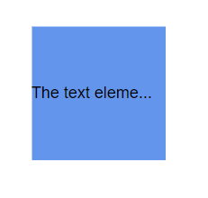
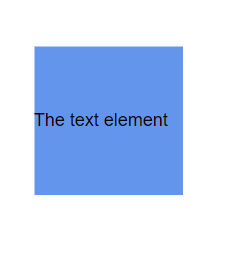

# Appearance in Blazor Diagram Component

## Size for an annotation

Diagram allows you set size for annotations by using the Height and Width properties. The default value of the `Width` and `Height` properties are 0, and it takes the node or connector size as default. The following code example shows how the annotation size is customized.

```cshtml
@using Syncfusion.Blazor.Diagram

<SfDiagramComponent Height="600px" Connectors="@connectors" />

@code
{
    // Defines diagram's connector collection
    DiagramObjectCollection<Connector> connectors;

    protected override void OnInitialized()
    {
        connectors = new DiagramObjectCollection<Connector>();
        Connector connector = new Connector()
        {
            SourcePoint = new DiagramPoint() { X = 300, Y = 40 },
            TargetPoint = new DiagramPoint() { X = 400, Y = 160 },
            Type = ConnectorSegmentType.Orthogonal,
            Style = new TextStyle() { StrokeColor = "#6495ED" },
            Annotations = new DiagramObjectCollection<PathAnnotation>()
            {
              new PathAnnotation 
              { 
                  Content = "Annotation length will be varied", 
                  Width = 50, 
                  Height = 50 
              },
            }
        };
        connectors.Add(connector);
    }
}
```


## Hyperlink

Diagram provides support to add a `Hyperlink` to the nodes or connectors annotation. It can also be customized.

```cshtml
@using Syncfusion.Blazor.Diagram

<SfDiagramComponent Height="600px" Nodes="@nodes" />

@code
{
    // Defines diagram's node collection
    DiagramObjectCollection<Node> nodes;

    protected override void OnInitialized()
    {
        nodes = new DiagramObjectCollection<Node>();
        Node node = new Node()
        {
            ID = "node",
            Width = 100,
            Height = 100,
            OffsetX = 100,
            OffsetY = 100,
            // Sets the annotation for the Node
            Annotations = new DiagramObjectCollection<ShapeAnnotation>()
            {
                // Add text as hyperlink.
                new ShapeAnnotation 
                { 
                    Hyperlink = new HyperlinkSettings
                    { 
                        Url = "https://www.syncfusion.com"
                    } 
                }
            },
            Style = new ShapeStyle() { Fill = "#6495ED", StrokeColor = "white" },
        };
        nodes.Add(node);
    }
}
```


### Hyperlink with content

```cshtml
@using Syncfusion.Blazor.Diagram

<SfDiagramComponent Height="600px" Nodes="@nodes" />

@code
{
    // Defines diagram's node collection
    DiagramObjectCollection<Node> nodes;

    protected override void OnInitialized()
    {
        nodes = new DiagramObjectCollection<Node>();
        Node node = new Node()
        {
            ID = "node",
            Width = 100,
            Height = 100,
            OffsetX = 100,
            OffsetY = 100,
            // Sets the annotation for the Node
            Annotations = new DiagramObjectCollection<ShapeAnnotation>()
            {
                // Add text as hyperlink.
                new ShapeAnnotation 
                { 
                    Hyperlink = new HyperlinkSettings
                    { 
                        Content = "Syncfusion", 
                        Url = "https://www.syncfusion.com" 
                    } 
                }
            },
            Style = new ShapeStyle() { Fill = "#6495ED", StrokeColor = "white" },
        };
        nodes.Add(node);
    }
}
```


## Wrapping

When text overflows node boundaries, you can control it by using the `TextWrapping`. So, it is wrapped into multiple lines. The wrapping property of the annotation defines how the text should be wrapped. The following code explains how to wrap a text in a node.

```cshtml
@using Syncfusion.Blazor.Diagram

<SfDiagramComponent Height="600px" Nodes="@nodes" />

@code
{
    // Defines diagram's node collection
    DiagramObjectCollection<Node> nodes;

    protected override void OnInitialized()
    {
        nodes = new DiagramObjectCollection<Node>();
        Node node = new Node()
        {
            ID = "node",
            Width = 100,
            Height = 100,
            OffsetX = 100,
            OffsetY = 100,
            // Sets the annotation for the node
            Annotations = new DiagramObjectCollection<ShapeAnnotation>()
            {
                new ShapeAnnotation 
                {
                    Content = "Annotation Text Wrapping",
                    Style = new TextStyle()
                    { 
                        TextWrapping = TextWrap.Wrap
                    } 
                }
            },
            Style = new ShapeStyle() { Fill = "#6495ED", StrokeColor = "white" },
        };
        nodes.Add(node);
    }
}
```

| Value | Description | Image |
| -------- | -------- | -------- |
| No Wrap | Text will not be wrapped. |  |
| Wrap | Text-wrapping occurs, when the text overflows beyond the available node width. |  |
| WrapWithOverflow (Default) | Text-wrapping occurs, when the text overflows beyond the available node width. However, the text may overflow beyond the node width in the case of a very long word. |  |

### Text overflow

The `TextOverflow` property specifies how the overflowed content that is not displayed should be signaled to the user. The TextOverflow can have the following values.

* **Wrap**: Wraps the text to next line, when it exceeds its bounds.
* **Ellipsis**: It truncates the overflown text and render an ellipsis ("...") to represent the clipped text.
* **Clip**: The text is clipped and the overflow text will not be shown.

The following code sample shows how the different types of overflow property working for the different types of text wrapping.

```cshtml
@using Syncfusion.Blazor.Diagram

<SfDiagramComponent Height="600px" Nodes="@nodes" />

@code
{
    // Defines diagram's node collection
    DiagramObjectCollection<Node> nodes;

    protected override void OnInitialized()
    {
        nodes = new DiagramObjectCollection<Node>();
        Node node = new Node()
        {
            ID = "node",
            Width = 100,
            Height = 100,
            OffsetX = 100,
            OffsetY = 100,
            // Sets the style for the text to be displayed
            Annotations = new DiagramObjectCollection<ShapeAnnotation>()
            {
                new ShapeAnnotation
                {
                    Content = "The text element with property of overflow as Wrap and wrapping as NoWrap",
                    Style = new TextStyle()
                    { 
                        TextOverflow = TextOverflow.Wrap,
                        TextWrapping=TextWrap.NoWrap 
                    }
                },
            },
            Style = new ShapeStyle() { Fill = "#6495ED", StrokeColor = "white" },
        };
        nodes.Add(node);
    }
}
```

| TextOverflow | Wrapping | Image |
| -------- | -------- | -------- |
| Wrap | No Wrap |  |
| Wrap| Wrap |  |
| Wrap | WrapWithOverflow |  |
| Ellipsis | No Wrap |  |
| Ellipsis| Wrap |  |
| Ellipsis | WrapWithOverflow |  |
| Clip | No Wrap |  |
| Clip| Wrap |  |
| Clip | WrapWithOverflow |  |

>**Note :** All the customization over the overflow is also applicable to connector’s annotation.

## Customize the appearance of an annotation

You can change the font style of the annotations with the font specific properties (FontSize, FontFamily, Color). The following code explains how to customize the appearance of the annotation.

* The label’s `Bold`, `Italic`, and `TextDecoration` properties are used to style the label’s text.

* The label’s `Fill`, `StrokeColor`, and `StrokeWidth` properties are used to define the background color and border color of the annotation and the `Opacity` property is used to define the transparency of the annotations.

* The `Visibility` property of the annotation enables or disables the visibility of annotation.

The Fill, Border, and Opacity appearances of the text can also be customized with appearance specific properties of annotation. The following code explains how to customize Background, Opacity, and Border of the annotation.

```cshtml
@using Syncfusion.Blazor.Diagram

<SfDiagramComponent Height="600px" Nodes="@nodes" />

@code
{
    // Defines diagram's node collection
    DiagramObjectCollection<Node> nodes;

    protected override void OnInitialized()
    {
        nodes = new DiagramObjectCollection<Node>();
        Node node = new Node()
        {
            ID = "node",
            Width = 100,
            Height = 100,
            OffsetX = 100,
            OffsetY = 100,
            // Sets the annotation for the node
            Annotations = new DiagramObjectCollection<ShapeAnnotation>()
            {
                new ShapeAnnotation 
                {
                    Content = "Annotation Text",
                    Style = new TextStyle() 
                    {
                        Color="black",
                        Bold = true,
                        Italic = true,
                        TextDecoration=TextDecoration.Underline,
                        FontSize = 12,
                        FontFamily = "TimesNewRoman"  
                    } 
                }
            },
            Style = new ShapeStyle() { Fill = "#6BA5D7", StrokeColor = "white" },
        };
        nodes.Add(node);
    }
}
```


## Update the annotation style at runtime

You can change the font style of the annotations with the font specific properties (FontSize, FontFamily, and Color). The following code explains how to update the appearance of the annotation.

```cshtml
@using Syncfusion.Blazor.Diagram

<input type="button" value="Update Style" @onclick="@UpdateStyle" />

<SfDiagramComponent @ref="@Diagram" Height="600px" Nodes="@nodes" />

@code
{
    // Reference of the diagram
    SfDiagramComponent Diagram;

    // Defines diagram's node collection
    DiagramObjectCollection<Node> nodes;

    protected override void OnInitialized()
    {
        nodes = new DiagramObjectCollection<Node>();
        Node node = new Node()
        {
            ID = "node1",
            Width = 100,
            Height = 100,
            OffsetX = 100,
            OffsetY = 100,
            // Sets the annotation for the node
            Annotations = new DiagramObjectCollection<ShapeAnnotation>()
            {
                new ShapeAnnotation
                {
                    Content = "Annotation Text",
                    Style = new TextStyle() 
                    {
                        Color = "black",
                        Bold = true,
                        Italic = true,
                        TextDecoration = TextDecoration.Underline,
                        FontSize = 12, 
                        FontFamily = "TimesNewRoman"
                    }
                }
            },
            Style = new ShapeStyle() { Fill = "#6BA5D7", StrokeColor = "white" },
        };
        nodes.Add(node);
    }

    public void UpdateStyle()
    {
        // Change the style of the annotation
        Diagram.BeginUpdate();
        Diagram.Nodes[0].Annotations[0].Style.Bold = false;
        Diagram.Nodes[0].Annotations[0].Style.TextDecoration = TextDecoration.None;
        Diagram.Nodes[0].Annotations[0].Style.Color = "Red";
        Diagram.EndUpdate();
    }
}
```

## Change the editing mode

Diagram provides support to edit an annotation at runtime, either programmatically or interactively. By default, the annotation is in view mode. But it can be brought to edit mode in two ways.

* You can edit the annotation Programmatically by using the `StartTextEdit` method.
* Also, you can edit the annotation interactively.
* By double-clicking the annotation.
* By selecting the item and pressing the F2 key.

Double-clicking any annotation will enable the editing and the node enables first annotation editing. When the focus of editor is lost, the annotation for the node is updated. 

## Set Annotation to read only

Diagram allows to create read-only annotations. You have to set the read-only property of annotation to enable or disable the read-only `Constraints`. The following code explains how to enable read-only mode.

```cshtml
@using Syncfusion.Blazor.Diagram

<SfDiagramComponent Height="600px" Nodes="@nodes" />

@code
{
    // Defines diagram's node collection
    DiagramObjectCollection<Node> nodes;

    protected override void OnInitialized()
    {
        nodes = new DiagramObjectCollection<Node>();
        Node node = new Node()
        {
            ID = "node",
            Width = 100,
            Height = 100,
            OffsetX = 100,
            OffsetY = 100,
            // Sets the constraints as Read only
            Annotations = new DiagramObjectCollection<ShapeAnnotation>()
            {
                new ShapeAnnotation 
                {
                    Content = "Annotation Text",
                    Constraints = AnnotationConstraints.ReadOnly
                }
            },
            Style = new ShapeStyle() { Fill = "#6BA5D7", StrokeColor = "white" },
        };
        nodes.Add(node);
    }
}
```

## Create Multiple Annotations

You can add any number of annotations to a node or connector. The following code example shows how to add multiple annotations to a node. Different labels by position is same or different point of the shapes of connector depends upon the offset values specified.

```cshtml
@using Syncfusion.Blazor.Diagram

<SfDiagramComponent Height="600px" Nodes="@nodes" Connectors="@connectors" />

@code
{
    // Defines diagram's node collection
    DiagramObjectCollection<Node> nodes;

    // Defines diagram's connector collection
    DiagramObjectCollection<Connector> connectors;

    protected override void OnInitialized()
    {
        nodes = new DiagramObjectCollection<Node>();
        Node node = new Node()
        {
            ID = "node",
            Width = 100,
            Height = 100,
            OffsetX = 100,
            OffsetY = 100,
            Style = new ShapeStyle() { Fill = "#6BA5D7", StrokeColor = "white" },
            // Sets the multiple annotation for the node
            Annotations = new DiagramObjectCollection<ShapeAnnotation>()
            {
                new ShapeAnnotation 
                {
                    Content = "Left",
                    Offset = new DiagramPoint(){ X = .12,Y = .1}
                },
                new ShapeAnnotation 
                {
                    Content = "Center",
                    Offset = new DiagramPoint(){ X = .5,Y = .5}
                },
                new ShapeAnnotation 
                {
                    Content = "Right",
                    Offset = new DiagramPoint(){ X = .82,Y = .9}
                }
            },
        };
        nodes.Add(node);
        connectors = new DiagramObjectCollection<Connector>();
        Connector connector = new Connector()
        {
            SourcePoint = new DiagramPoint() { X = 300, Y = 40 },
            TargetPoint = new DiagramPoint() { X = 400, Y = 160 },
            Type = ConnectorSegmentType.Orthogonal,
            Style = new TextStyle() { StrokeColor = "#6495ED" },
            Annotations = new DiagramObjectCollection<PathAnnotation>()
            {
                new PathAnnotation 
                { 
                    Content = "Offset as 0",
                    Offset=0 
                },
                new PathAnnotation 
                { 
                    Content = "Offset as 0.5",
                    Offset=0.5
                },
                new PathAnnotation 
                {
                    Content = "Offset as 1",
                    Offset=1 
                },
            }
        };
        connectors.Add(connector);
    }
}
```


>* Type of the annotation’s property of the node or connector was ObservableCollection.
>* Default value of the annotation will be null.
>* All the same customization can be applicable for the annotations.
>* Text Editing can be stated only the first annotation of the annotation collection when you double click the node or connector.

## Constraints

`AnnotationConstraints` are used to enable or disable certain behaviors of the annotation. Constraints are provided as flagged enumerations, so that multiple behaviors can be enabled or disabled with bitwise operators.

AnnotationConstraints may have multiple behaviors as follows:

| Constraints | Usages |
|---|---|
| ReadOnly | Enables or disables whether the annotation to be read only or not. |
| None | Disables all behaviors of Annotation. |

> The default value is AnnotationConstraints.InheritReadOnly for constraints property of the annotation.

Refer to `Constraints` to learn about how to enable or disable the annotation constraints.

## See also

* [How to add or remove annotation constraints](../constraints/#annotation-constraints)

* [How to add annotation for Node](./node-annotation)

* [How to add annotation for Connector](./connector-annotation)
