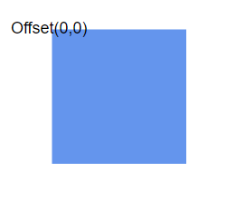
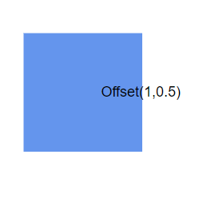
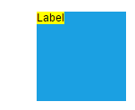
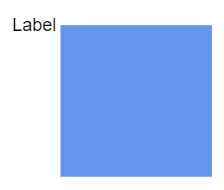
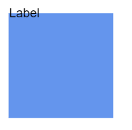
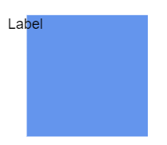
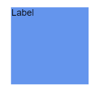

# How to position node’s annotation

Diagram allows you to customize the position and appearance of the annotation efficiently.
Annotation can be aligned relative to the node boundaries. It has Margin, Offset, Horizontal, and Vertical alignment settings. It is quite tricky when all four alignments are used together but gives more control over alignments properties of the `ShapeAnnotation` class.
Annotations of a node can be positioned using the following properties of `ShapeAnnotation`.

* `Offset`
* `HorizontalAlignment`
* `VerticalAlignment`
* `Margin`

## Offset

The `Offset` property of an annotation is used to align the annotations based on fractions. 0 represents top/left corner, 1 represents bottom/right corner, and 0.5 represents half of width/height.

The following code shows the relationship between the shape annotation position and path annotation offset (fraction values).

```csharp
@using Syncfusion.Blazor.Diagram

<SfDiagramComponent Height="600px" Nodes="@nodes">
</SfDiagramComponent>

@code
{
//Defines diagram's node collection
DiagramObjectCollection<Node> nodes = new DiagramObjectCollection<Node>();

protected override void OnInitialized()
{
    nodes = new DiagramObjectCollection<Node>();
        Node node = new Node()
    {
        Width = 100,
        Height = 100,
        OffsetX = 100,
        Annotations = new DiagramObjectCollection<ShapeAnnotation>() {
            new ShapeAnnotation { Content = "Offset(0,0)", Offset = new Point() { X = 0, Y = 0 } }
        },
        OffsetY = 100,
        Style = new ShapeStyle() { Fill = "#6495ED", StrokeColor = "white" },
    };
    nodes.Add(node);
}
}
```

| Offset values | Output |
|---|---|
| (0,0) |  |
| (0,0.5) |  |
| (0,1) |  |
| (0.5,0) |  |
| (0.5,0.5) |  |
| (0.5,1) |  |
| (1,0) |  |
| (1,0.5) |  |
| (1,1) |  |

>**Note:**
>* Type of the offset property for node’s shape annotation is NodeAnnotationOffset.
>* Type of the offset property for connector’s path annotation is double.

## Horizontal and vertical alignment

* The `HorizontalAlignment` property of annotation is used to set how the annotation is horizontally aligned at the annotation position determined from the fraction values.
* The `VerticalAlignment` property is used to set how the annotation is vertically aligned at the annotation position.

The following table shows all the possible alignments visually with 'offset (0, 0)'.

| Horizontal Alignment | Vertical Alignment | Output with Offset(0,0) |
| -------- | -------- | -------- |
| Left | Top |  |
| Center | Top |  |
| Right | Top |   |
| Left | Center |  |
| Center | Center|  |
| Right | Center |  |
| Left | Bottom |  |
| Center | Bottom |  |
| Right |Bottom | |

The following code explains how to align annotations.

```csharp
@using Syncfusion.Blazor.Diagram

<SfDiagramComponent Height="600px" Nodes="@nodes">
</SfDiagramComponent>

@code
{
//Defines diagram's node collection
DiagramObjectCollection<Node> nodes = new DiagramObjectCollection<Node>();

protected override void OnInitialized()
{
    nodes = new DiagramObjectCollection<Node>();
        Node node = new Node()
    {
        ID = "node1",
        Width = 100,
        Height = 100,
        OffsetX = 250,
        OffsetY = 250,
        Annotations = new DiagramObjectCollection<ShapeAnnotation>() {
            new ShapeAnnotation { Content = "Annotation", HorizontalAlignment = HorizontalAlignment.Center,VerticalAlignment = VerticalAlignment.Center}
        },

        Style = new ShapeStyle() { Fill = "#6495ED", StrokeColor = "white" },
    };
    nodes.Add(node);

}
}

```

>**Note:**
>* The value of the `HorizontalAlignment` is `Center` by default.
>* The value of the `VerticalAlignment` is `Center` by default.
>* Alignment positioned based on the offset value.

## Margin

`Margin` is an absolute value used to add some blank space to any one of its four sides. The annotations can be displaced with the margin property. The following code example explains how to align an annotation based on its Offset, HorizontalAlignment, VerticalAlignment, and Margin values.

```csharp
@using Syncfusion.Blazor.Diagram

<SfDiagramComponent Height="600px" Nodes="@nodes">
</SfDiagramComponent>

@code
{
//Defines diagram's node collection
DiagramObjectCollection<Node> nodes = new DiagramObjectCollection<Node>();

protected override void OnInitialized()
{
    nodes = new DiagramObjectCollection<Node>();
        Node node = new Node()
    {
        ID = "node1",
        Width = 100,
        Height = 100,
        OffsetX = 100,
        OffsetY = 100,
        // Sets the margin for the content
        Annotations = new DiagramObjectCollection<ShapeAnnotation>() {
            new ShapeAnnotation { Content = "Task1",Margin = new Margin() { Top = 10},
                HorizontalAlignment = HorizontalAlignment.Center,VerticalAlignment = VerticalAlignment.Top,Offset = new Point(){ X = .5 ,Y = 1} }
        },

        Style = new ShapeStyle() { Fill = "#6495ED", StrokeColor = "white" },
    };
    nodes.Add(node);
}
}

```

## Text align

The `TextAlign` inside the text block. The following code explains how to set TextAlign for an annotation.

```csharp
@using Syncfusion.Blazor.Diagram

<SfDiagramComponent Height="600px" Nodes="@nodes">
</SfDiagramComponent>

@code
{
//Defines diagram's node collection
DiagramObjectCollection<Node> nodes = new DiagramObjectCollection<Node>();

protected override void OnInitialized()
{
    nodes = new DiagramObjectCollection<Node>();
        Node node = new Node()
    {
        ID = "node1",
        Width = 100,
        Height = 100,
        OffsetX = 100,
        OffsetY = 100,
        // Sets the textAlign as left for the content
        Annotations = new DiagramObjectCollection<ShapeAnnotation>() {
            new ShapeAnnotation { Content = "Text align is set as Left",Style = new TextShapeStyle(){ TextAlign = TextAlign.Left} }
        },

        Style = new ShapeStyle() { Fill = "#6495ED", StrokeColor = "white" },
    };
    nodes.Add(node);
}
}

```

## See also

* [`How to add annotation for Connector`](./connector-annotation)

* [`How to add or remove annotation constraints`](../constraints/#annotation-constraints)

* [`How to customize the annotation`](./appearance)
