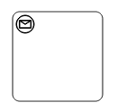
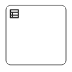
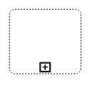

# BPMN activity in Blazor Diagram Component

The `Activity` is the task that is performed in a business process. It is represented by a rounded rectangle.

There are two types of activities. They are listed as follows:

* Task: Occurs within a process and it is not broken down to a finer level of detail.
* Subprocess: Occurs within a process and it is broken down to a finer level of detail.

```cshtml
@using Syncfusion.Blazor.Diagram

@* Initialize Diagram *@
<SfDiagramComponent Height="600px" Nodes="@nodes" />

@code
{
    // Initialize the node collection with node.
    DiagramObjectCollection<Node> nodes;

    protected override void OnInitialized()
    {
        nodes = new DiagramObjectCollection<Node>();
        Node node = new Node()
        {
            // Position of the node.
            OffsetX = 100,
            OffsetY = 100,
            // Size of the node.
            Width = 100,
            Height = 100,
            // Unique Id of the node.
            ID = "node1",
            // Sets the type of shape to Bpmn and shape to activity.
            Shape = new BpmnShape()
            {
                Type = Shapes.Bpmn,
                Shape = BpmnShapes.Activity,
                // Sets the activity type to task.
                Activity = new BpmnActivity() { Activity = BpmnActivities.Task },
            }
        };
        nodes.Add(node);
    }
}
```

## BPMN activity task

The `Task` property of the node allows you to define the type of task such as sending, receiving, user-based task, etc. By default, the `Type` property of task is set to **None**. The following code explains how to create different types of BPMN tasks. The events property of tasks allows you to represent these results as an event attached to the task.

```cshtml
@using Syncfusion.Blazor.Diagram

@* Initialize Diagram *@
<SfDiagramComponent Height="600px" Nodes="@nodes"/>

@code
{
    // Initialize the node collection with node.
    DiagramObjectCollection<Node> nodes;

    protected override void OnInitialized()
    {
        nodes = new DiagramObjectCollection<Node>();
        Node node = new Node()
        {
            // Position of the node.
            OffsetX = 100,
            OffsetY = 100,
            // Size of the node.
            Width = 100,
            Height = 100,
            // Unique Id of the node.
            ID = "node1",
            // Sets the type of shape to Bpmn and shape to activity.
            Shape = new BpmnShape()
            {
                Type = Shapes.Bpmn,
                Shape = BpmnShapes.Activity,
                // Sets the activity type to task.
                Activity = new BpmnActivity() 
                { 
                    Activity = BpmnActivities.Task,
                    // Sets the type of the task to Send.
                    Task = new BpmnTask() { Type = BpmnTasks.Send }
                },
            }
        };
        nodes.Add(node);
    }   
}
```

The various types of BPMN tasks are tabulated as follows.

| Shape | Image |
| -------- | -------- |
| Service |  |
| Send |  |
| Receive |  |
| Instantiating Receive |  |
| Manual | |
| Business Rule |  |
| User |  |
| Script |  |

## BPMN activity sub process

A `Sub-process` is a group of tasks that is used to hide or reveal details of additional levels using the `Collapsed` property.

```cshtml
@using Syncfusion.Blazor.Diagram

@* Initialize Diagram *@
<SfDiagramComponent Height="600px" Nodes="@nodes"/>

@code
{
    // Initialize the node collection with node.
    DiagramObjectCollection<Node> nodes;

    protected override void OnInitialized()
    {
        nodes = new DiagramObjectCollection<Node>();
        Node node = new Node()
        {
            // Position of the node.
            OffsetX = 100,
            OffsetY = 100,
            // Size of the node.
            Width = 100,
            Height = 100,
            // Unique Id of the node.
            ID = "node1",
            // Sets the type of shape to Bpmn and shape to activity.
            Shape = new BpmnShape()
            {
                Type = Shapes.Bpmn,
                Shape = BpmnShapes.Activity,
                // Sets the activity type to task.
                Activity = new BpmnActivity()
                {
                    // Sets activity to subprocess.
                    Activity = BpmnActivities.SubProcess,
                    // Set collapsed of subprocess to true.
                    SubProcess = new BpmnSubProcess() { Collapsed = true }
                },
            }
        };
        nodes.Add(node);
    }
}
```

The different types of subprocess are as follows:

    * Event subprocess
    * Transaction

### Event sub Process

A `SubProcess` is defined as an event SubProcess when it is triggered by an event. An event SubProcess is placed within another subprocess that part of the normal flow of its parent process is not. You can set event to a subprocess with the `Event` and `Trigger` properties of the subprocess. The `Type` property of subprocess allows you to define the type of subprocess whether it should be event subprocess or transaction subprocess.

```cshtml
@using Syncfusion.Blazor.Diagram

@* Initialize Diagram *@
<SfDiagramComponent Height="600px" Nodes="@nodes" />

@code
{
    // Initialize the node collection with node.
    DiagramObjectCollection<Node> nodes;

    protected override void OnInitialized()
    {
        nodes = new DiagramObjectCollection<Node>();
        Node node = new Node()
        {
            // Position of the node.
            OffsetX = 100,
            OffsetY = 100,
            // Size of the node
            Width = 100,
            Height = 100,
            // Unique id of the node.
            ID = "node1",
            Shape = new BpmnShape()
            {
                Type = Shapes.Bpmn,
                Shape = BpmnShapes.Activity,
                // Sets activity to SubProcess.
                Activity = new BpmnActivity()
                {
                    Activity = BpmnActivities.SubProcess,
                    // Sets the collapsed to true and type to Event.
                    SubProcess = new BpmnSubProcess()
                    {
                        Collapsed = true,
                        Type = BpmnSubProcessTypes.Event,
                        // Sets event to Start and trigger to Message.
                        Events = new List<BpmnSubEvent>()
                        {
                            new BpmnSubEvent()
                            {
                                Event = BpmnEvents.Start, Trigger = BpmnTriggers.Message
                            }
                        }
                    }
                }
            }
        };
        nodes.Add(node);
    }
}
```

### Transaction sub process

The `Transaction` is a set of activities that logically belong together that all contained activities must complete their parts of the transaction, otherwise the process is fail.

The execution result of a transaction is one of
* Successful Completion
* Unsuccessful Completion (Cancel)
* Hazard (Exception)

The `Events` property of subprocess allows you to represent these results as an event attached to the subprocess.

* The event object allows you to define the type of event by which the subprocess will be triggered. The name of the event can be defined to identify the event at runtime.

* The event’s offset property is used to set the fraction or ratio (relative to parent) that defines the position of the event shape.

* The trigger property defines the type of the event trigger.

* You can also use define ports and labels to subprocess events by using the event’s ports and labels properties.

```cshtml
@using Syncfusion.Blazor.Diagram

@* Initialize Diagram *@
<SfDiagramComponent Height="600px" Nodes="@nodes" />

@code
{
    // Initialize the node collection with node.
    DiagramObjectCollection<Node> nodes;

    protected override void OnInitialized()
    {
        nodes = new DiagramObjectCollection<Node>();
        Node node = new Node()
        {
            // Position of the node.
            OffsetX = 100,
            OffsetY = 100,
            // Size of the node.
            Width = 100,
            Height = 100,
            // Unique id of the node.
            ID = "node1",
            // Defines the type to BPMN and shape to activity.
            Shape = new BpmnShape()
            {
                Type = Shapes.Bpmn,
                Shape = BpmnShapes.Activity,
                // Sets the activity to subprocess.
                Activity = new BpmnActivity()
                {
                    Activity = BpmnActivities.SubProcess,
                    // Sets collapsed to true and type to Transaction.
                    SubProcess = new BpmnSubProcess()
                    {
                        Collapsed = true,
                        Type = BpmnSubProcessTypes.Transaction,
                        // Sets offset and visible for cancel and offset for failure.
                        Transaction = new BpmnTransactionSubProcess()
                        {
                            Cancel = new BpmnSubEvent() { Visible = true, Offset = new Point() { X = 0.25, Y = 1 } },
                            Failure = new BpmnSubEvent() { Offset = new Point() { X = 0.75, Y = 1 } }
                        }
                    },
                }
            }
        };
        nodes.Add(node);
    }
}
```

### Process

The `Processes` is an array collection that defines the children values for BPMN subprocess.

```cshtml
@using Syncfusion.Blazor.Diagram

@* Initialize Diagram *@
<SfDiagramComponent Height="600px" Nodes="@nodes" Connectors="@connectors" />

@code
{
    //Initialize the node collection with node.
    DiagramObjectCollection<Node> nodes;
    DiagramObjectCollection<Connector> connectors;

    protected override void OnInitialized()
    {
        nodes = new DiagramObjectCollection<Node>();
        Node node1 = new Node()
        {
            ID = "Start",
            Width = 50,
            Height = 50,
            Margin = new Margin() { Left = 10, Top = 50 },
            Shape = new BpmnShape()
            {
                Type = Shapes.Bpmn,
                Shape = BpmnShapes.Event,
                Events = new BpmnSubEvent() { Event = BpmnEvents.Start }
            }
        };
        Node node2 = new Node()
        {
            ID = "End",
            Width = 50,
            Height = 50,
            Margin = new Margin() { Left = 200, Top = 50 },
            Shape = new BpmnShape()
            {
                Type = Shapes.Bpmn,
                Shape = BpmnShapes.Event,
                Events = new BpmnSubEvent() { Event = BpmnEvents.End }
            }
        };
        Node node3 = new Node()
        {
            ID = "Node1",
            Width = 50,
            Height = 50,
            Margin = new Margin() { Left = 100, Top = 200 },
            Shape = new BpmnShape()
            {
                Type = Shapes.Bpmn,
                Shape = BpmnShapes.Activity,
                Activity = new BpmnActivity()
                {
                    Activity = BpmnActivities.SubProcess,
                    SubProcess = new BpmnSubProcess() { Collapsed = false }
                }
            },
            Constraints = NodeConstraints.Default | NodeConstraints.AllowDrop
        };
        Node node4 = new Node()
        {
            ID = "ActivityProcessNode",
            Width = 300,
            Height = 300,
            MaxHeight = 400,
            MaxWidth = 400,
            MinWidth = 200,
            MinHeight = 200,
            OffsetX = 200,
            OffsetY = 200,
            Shape = new BpmnShape()
            {
                Type = Shapes.Bpmn,
                Shape = BpmnShapes.Activity,
                Activity = new BpmnActivity()
                {
                    Activity = BpmnActivities.SubProcess,
                    SubProcess = new BpmnSubProcess()
                    {
                        Collapsed = false,
                        Type = BpmnSubProcessTypes.Event,
                        Processes = new DiagramObjectCollection<string> { "Start", "End", "Node1" }
                    }
                }
            },
            Constraints = NodeConstraints.Default | NodeConstraints.AllowDrop
        };
        nodes.Add(node1);
        nodes.Add(node2);
        nodes.Add(node3);
        nodes.Add(node4);

        connectors = new DiagramObjectCollection<Connector>();
        Connector connector1 = new Connector()
        {
            ID = "Connector1",
            SourceID = "Start",
            TargetID = "Node1"
        };
        Connector connector2 = new Connector()
        {
            ID = "Connector2",
            SourceID = "Node1",
            TargetID = "End"
        };
        connectors.Add(connector1);
        connectors.Add(connector2);
    }
}
```

### Loop

`Loop` is a task that is internally being looped. The loop property of task allows you to define the type of loop. The default value for `Loop` is **None**. You can define the loop property in subprocess BPMN shape as shown in the following code.

```cshtml
@using Syncfusion.Blazor.Diagram

@* Initialize Diagram *@
<SfDiagramComponent Height="600px" Nodes="@nodes"/>

@code
{       
    // Initialize the node collection with node.
    DiagramObjectCollection<Node> nodes;

    protected override void OnInitialized()
    {
        nodes = new DiagramObjectCollection<Node>();
        Node node = new Node()
        {
            // Position of the node.
            OffsetX = 100,
            OffsetY = 100,
            // Size of the node.
            Width = 100,
            Height = 100,
            // Unique Id of the node.
            ID = "node1",
            // Defines the type to BPMN and shape to activity.
            Shape = new BpmnShape()
            {
                Type = Shapes.Bpmn,
                Shape = BpmnShapes.Activity,
                // Set the activity to subprocess.
                Activity = new BpmnActivity()
                {
                    Activity = BpmnActivities.SubProcess,
                    // Sets collapsed to true and loop to standard.
                    SubProcess = new BpmnSubProcess()
                    {
                        Collapsed = true,
                        Loop = BpmnLoops.Standard,
                    },
                }
            }
        };
        nodes.Add(node);
    }
}
```

The following table contains various types of BPMN loops.

| Loops | Task | Subprocess |
| -------- | -------- | --------|
| Standard |   |  |
| SequenceMultiInstance |  |  |
| ParallelMultiInstance |  |  |

### Compensation

`Compensation` is triggered when the operation is partially failed and enabled it with the compensation property of the task and the subprocess.

```cshtml
@using Syncfusion.Blazor.Diagram

@* Initialize Diagram *@
<SfDiagramComponent Height="600px" Nodes="@nodes" />

@code
{
    // Initialize the node collection with node.
    DiagramObjectCollection<Node> nodes;

    protected override void OnInitialized()
    {
        nodes = new DiagramObjectCollection<Node>();
        Node node1 = new Node()
        {
            // Position of the node.
            OffsetX = 100,
            OffsetY = 100,
            // Size of the node.
            Width = 100,
            Height = 100,
            // Unique id of the node.
            ID = "node1",
            // Defines the type to BPMN and shape to activity.
            Shape = new BpmnShape()
            {
                Type = Shapes.Bpmn,
                Shape = BpmnShapes.Activity,
                // Set the activity to task.
                Activity = new BpmnActivity()
                {
                    Activity = BpmnActivities.Task,
                    // Set compensation to true.
                    Task = new BpmnTask()
                    {
                        Compensation = true,
                    },
                }
            }
        };
        Node node2 = new Node()
        {
            // Position of the node.
            OffsetX = 300,
            OffsetY = 100,
            // Size of the node.
            Width = 100,
            Height = 100,
            // Unique id of the node.
            ID = "node2",
            // Defines the type to BPMN and shape to activity.
            Shape = new BpmnShape()
            {
                Type = Shapes.Bpmn,
                Shape = BpmnShapes.Activity,
                // Set the activity to SubProcess
                Activity = new BpmnActivity()
                {
                    Activity = BpmnActivities.SubProcess,
                    // Sets collapsed and compensation to true.
                    SubProcess = new BpmnSubProcess()
                    {
                        Collapsed = true,
                        Compensation = true,
                    },
                }
            }
        };
        nodes.Add(node1);
        nodes.Add(node2);
    }
}
```

### Call

A `Call` activity is a global subprocess that is reused at various points of the business flow and set it with the call property of the task.

```cshtml
@using Syncfusion.Blazor.Diagram

@* Initialize Diagram *@
<SfDiagramComponent Height="600px" Nodes="@nodes"/>

@code
{
    // Initialize the node collection with node.
    DiagramObjectCollection<Node> nodes;

    protected override void OnInitialized()
    {
        nodes = new DiagramObjectCollection<Node>();
        Node node = new Node()
        {
            // Position of the node.
            OffsetX = 100,
            OffsetY = 100,
            // Size of the node.
            Width = 100,
            Height = 100,
            // Unique Id of the node.
            ID = "node1",         
            // Defines the type to BPMN and shape to activity.
            Shape = new BpmnShape()
            {
                Type = Shapes.Bpmn,
                Shape = BpmnShapes.Activity,
                // Sets the activity to task.
                Activity = new BpmnActivity()
                {
                    Activity = BpmnActivities.Task,
                    // Sets call to true.
                    Task = new BpmnTask()
                    {
                        Call = true,
                    },
                }
            }
        };
        nodes.Add(node);
    }
}
```

### Ad-Hoc

An ad-hoc subprocess is a group of tasks that are executed in any order or skipped in order to fulfill the end condition and set it with the `Ad-hoc` property of subprocess.

```cshtml
@using Syncfusion.Blazor.Diagram

@* Initialize Diagram *@
<SfDiagramComponent Height="600px" Nodes="@nodes" />

@code
{
    // Initialize the node collection with node.
    DiagramObjectCollection<Node> nodes;

    protected override void OnInitialized()
    {
        nodes = new DiagramObjectCollection<Node>();
        Node node = new Node()
        {
            // Position of the node.
            OffsetX = 100,
            OffsetY = 100,
            // Size of the node.
            Width = 100,
            Height = 100,
            // Unique id of the node.
            ID = "node1",
            // Defines the type to BPMN and shape to activity
            Shape = new BpmnShape()
            {
                Type = Shapes.Bpmn,
                Shape = BpmnShapes.Activity,
                // Sets the activity to subprocess
                Activity = new BpmnActivity()
                {
                    Activity = BpmnActivities.SubProcess,
                    // Sets collapsed and ad hoc to true.
                    SubProcess = new BpmnSubProcess()
                    {
                        Collapsed = true,
                        Adhoc = true
                    },
                }
            }
        };
        nodes.Add(node);
    }
}
```

### Boundary

Boundary represents the type of task that is being processed. The `Boundary` property of subprocess allows you to define the type of boundary. By default, it is set to **Default**.

```cshtml
@using Syncfusion.Blazor.Diagram

@* Initialize Diagram *@
<SfDiagramComponent Height="600px" Nodes="@nodes" />

@code
{
    // Initialize the node collection with node.
    DiagramObjectCollection<Node> nodes;

    protected override void OnInitialized()
    {
        nodes = new DiagramObjectCollection<Node>();
        Node node = new Node()
        {
            // Position of the node.
            OffsetX = 100,
            OffsetY = 100,
            // Size of the node.
            Width = 100,
            Height = 100,
            // Unique Id of the node.
            ID = "node1",
            // Sets type to Bpmn and shape to Activity.
            Shape = new BpmnShape()
            {
                Type = Shapes.Bpmn,
                Shape = BpmnShapes.Activity,
                // Sets activity to SubProcess.
                Activity = new BpmnActivity()
                {
                    Activity = BpmnActivities.SubProcess,
                    // Sets collapsed to true and boundary to Call.
                    SubProcess = new BpmnSubProcess()
                    {
                        Collapsed = true,
                        Boundary = Syncfusion.Blazor.Diagram.BpmnBoundary.Call
                    },
                }
            }
        };
        nodes.Add(node);
    }
}
```

The following table contains various types of BPMN boundaries.

| Boundary | Image |
| -------- | -------- |
| Call |  |
| Event |  |
| Default |  |
