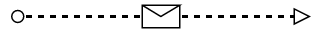

# BPMN Connectors in Blazor Diagram Component

The `BPMN Connectors` are lines that connect BPMN flow objects.

They are classified as follows.
* Association
* Sequence
* Message

## Association

The `BPMN Association` flow is used to link flow objects with its corresponding text or artifact. An association is represented as a dotted graphical line with an opened arrow. The types of association are as follows:

* Directional
* BiDirectional
* Default

The association property allows you to define the type of association. The following code example explains how to create an association.

```cshtml
@using Syncfusion.Blazor.Diagram

@* Initialize Diagram *@
<SfDiagramComponent Height="600px" Connectors="@connectors"/>

@code
{
    // Create connector and store it in the connector collection.
    DiagramObjectCollection<Connector> connectors;

    protected override void OnInitialized()
    {
        connectors = new DiagramObjectCollection<Connector>();
        Connector connector = new Connector()
        {
            // Unique Id of the connector.
            ID = "connector1",
            // Start and end point of the connector
            SourcePoint = new Point() { X = 100, Y = 200 },
            TargetPoint = new Point() { X = 300, Y = 200 },
            // Sets the type to Bpmn, flow to Association and association to bidirectional.
            Shape = new BpmnFlow()
            {
                Type = ConnectionShapes.Bpmn,
                Flow = BpmnFlows.Association,
                Association = BpmnAssociationFlows.BiDirectional
            }
        };
        connectors.Add(connector);
    }
}
```

The following table shows the visual representation of association flows.

| Association | Image |
| -------- | -------- |
| Default |  |
| Directional |  |
| BiDirectional |  |

>Note : The default value for the property `Association` is **Default**.

## Sequence

A `Sequence` flow shows the order that the activities are performed in a BPMN process and is represented by a solid graphical line. The types of sequence are as follows:

* Normal
* Conditional
* Default

The sequence property allows you to define the type of sequence. The following code example explains how to create a sequence flow.

```cshtml
@using Syncfusion.Blazor.Diagram

@* Initialize Diagram *@
<SfDiagramComponent Height="600px" Connectors="@connectors"/>

@code
{
    // Create connector and store it in the connector collection.
    DiagramObjectCollection<Connector> connectors;

    protected override void OnInitialized()
    {
        connectors = new DiagramObjectCollection<Connector>();
        Connector connector = new Connector()
        {
            // Unique Id of the connector.
            ID = "connector1",
            // Start and end point of the connector.
            SourcePoint = new Point() { X = 100, Y = 200 },
            TargetPoint = new Point() { X = 300, Y = 200 },
            // Sets the type to Bpmn, flow to Association and association to bidirectional.
            Shape = new BpmnFlow()
            {
                Type = ConnectionShapes.Bpmn,
                Flow = BpmnFlows.Sequence,
                Sequence = BpmnSequenceFlows.Conditional
            }
        };
        connectors.Add(connector);
    }
}
```

The following table contains various representation of sequence flows.

| Sequence | Image |
| -------- | -------- |
| Default |  |
| Conditional |  |
| Normal |  |

> The default value for the property `Sequence` is **Normal**.

## Message

A `Message` flow shows the flow of messages between two participants and is represented by dashed line. The types of messages are as follows:

* InitiatingMessage
* NonInitiatingMessage
* Default

The message property allows you to define the type of message. The following code example explains how to define a message flow.

```cshtml
@using Syncfusion.Blazor.Diagram

@* Initialize Diagram *@
<SfDiagramComponent Height="600px" Connectors="@connectors"/>

@code
{
    // Create connector and store it in the connector collection.
    DiagramObjectCollection<Connector> connectors;

    protected override void OnInitialized()
    {
        connectors = new DiagramObjectCollection<Connector>();
        Connector connector = new Connector()
        {
            // Unique Id of the connector.
            ID = "connector1",
            // Start and end point of the connector.
            SourcePoint = new Point() { X = 100, Y = 200 },
            TargetPoint = new Point() { X = 300, Y = 200 },
            // Sets the type to Bpmn, flow to Association and association to bidirectional.
            Shape = new BpmnFlow()
            {
                Type = ConnectionShapes.Bpmn,
                Flow = BpmnFlows.Message,
                Message = BpmnMessageFlows.InitiatingMessage
            }
        };
        connectors.Add(connector);
    }
}
```

The following table contains various representation of message flows.

| Message | Image |
| -------- | -------- |
| Default |  |
| InitiatingMessage |  |
| NonInitiatingMessage |  |

> The default value for the property `Message` is **Default**.
