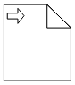

# BPMN data object

A data object represents information flowing through the process, such as data placed into the process, data resulting from the process, data that needs to be collected, or data that must be stored. To define a `DataObject`, set the shape to **DataObject** and the type property defines whether data is an input or output. You can create multiple instances of data object with the collection property of data.

```csharp
@using Syncfusion.Blazor.Diagram

@* Initialize the Diagram*@
<SfDiagramComponent Height="600px" Nodes="@nodes">
</SfDiagramComponent>

@code{
    //Initialize the node collection with node
    DiagramObjectCollection<Node> nodes = new DiagramObjectCollection<Node>()
    {
        new Node()
        {
            //Position of the node
            OffsetX = 100,
            OffsetY = 100,
            //Size of the node
            Width = 100,
            Height = 100,
            //Unique Id of the node
            ID = "node1",
            //Sets type to Bpmn and shape to DataObject
            Shape = new BpmnShape()
            {
                Type = Shapes.Bpmn,
                Shape=BpmnShapes.DataObject,
                //Sets collection to true when Dataobject is not a Single instance
                DataObject=new BpmnDataObject()
                {
                    Collection=true,
                    Type=BpmnDataObjects.Input
                }
            }
        },
    };
}
```

The following table contains various representation of the BPMN data object.

| Boundary | Image |
| -------- | -------- |
| Collection Data Object |  |
| Data Input |  |
| Data Output |  |
