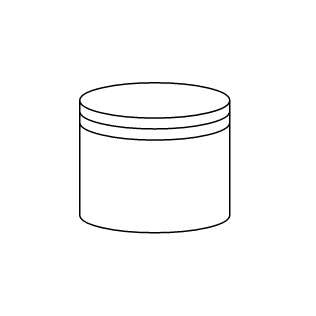

# BPMN Datasource

Datasource is used to store or access data associated with a business process. To create a datasource, set the shape to **DataSource**. The following code example explains how to create a datasource.

```csharp
@using Syncfusion.Blazor.Diagram

@* Initialize Diagram *@
<SfDiagramComponent Height="600px" Nodes="@nodes">
</SfDiagramComponent>

@code{
    //Initialize the node collection with node
    DiagramObjectCollection<Node> nodes = new DiagramObjectCollection<Node>()
    {
        new Node()
        {
            //Position of the node
            OffsetX = 100,
            OffsetY = 100,
            //Size of the node
            Width = 100,
            Height = 100,
            //Unique Id of the node
            ID = "node1",
             //Sets type to Bpmn and shape to DataSource
            Shape = new BpmnShape()
            {
                Type = Shapes.Bpmn,
                Shape=BpmnShapes.DataSource,
            }
        },
    };
}
```


