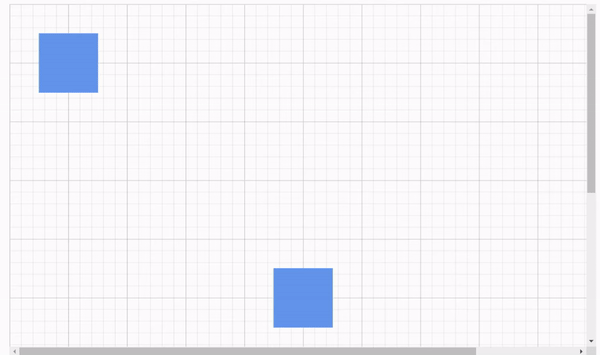
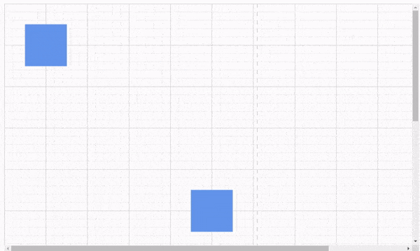

# Commands in Blazor Diagram Component

There are several commands available in the diagram as follows.

* Alignment commands
* Distribute commands
* Sizing commands
* Clipboard commands
* Grouping commands
* Zoom commands
* Undo/Redo commands
* FitToPage commands

## Alignment commands

Alignment commands enable you to align the selected or defined objects such as nodes and connectors with respect to the selection boundary. Following are the [AlignmentOptions](https://help.syncfusion.com/cr/blazor/Syncfusion.Blazor.Diagram.AlignmentOptions.html) in [SetAlign](https://help.syncfusion.com/cr/blazor/Syncfusion.Blazor.Diagram.SfDiagramComponent.html#Syncfusion_Blazor_Diagram_SfDiagramComponent_SetAlign_Syncfusion_Blazor_Diagram_AlignmentOptions_Syncfusion_Blazor_Diagram_DiagramObjectCollection_Syncfusion_Blazor_Diagram_NodeBase__Syncfusion_Blazor_Diagram_AlignmentMode_) commands which shows how to use align methods in the diagram.

### How to align the selected objects to the left

The following code example illustrates how to align all the selected objects to the left side of the selection boundary.

```cshtml
@using Syncfusion.Blazor.Diagram

<input type="button" value="Left" @onclick="@OnAlignLeft" />

<SfDiagramComponent @ref="diagram" Width="1000px" Height="500px" Nodes="@nodes" Connectors="@Connectors"/>

@code
{
    SfDiagramComponent diagram;
    DiagramObjectCollection<Node> nodes = new DiagramObjectCollection<Node>();
    DiagramObjectCollection<Connector> Connectors = new DiagramObjectCollection<Connector>();

    protected override void OnInitialized()
    {
        Node node1 = new Node()
        {
            ID = "node1",
            Width = 50,
            Height = 30,
            OffsetX = 500,
            OffsetY = 100,
            Shape = new BasicShape() { Type = Shapes.Basic, Shape = BasicShapeType.Rectangle }
        };
        nodes.Add(node1);
        Node node2 = new Node()
        {
            ID = "node2",
            Width = 60,
            Height = 40,
            OffsetX = 500,
            OffsetY = 300,
            Shape = new BasicShape() { Type = Shapes.Basic, Shape = BasicShapeType.Rectangle }
        };
        nodes.Add(node2);
        Node node3 = new Node()
        {
            ID = "node3",
            Width = 70,
            Height = 50,
            OffsetX = 500,
            OffsetY = 500,
            Shape = new BasicShape() { Type = Shapes.Basic, Shape = BasicShapeType.Rectangle }
        };
        nodes.Add(node3);
    }

    private void OnAlignLeft()
    {
        //Aligns the selected objects to the left side of the selection boundary.
        diagram.SetAlign(AlignmentOptions.Left);
    }      
}
```

### How to align the selected objects to the right

The following code example illustrates how to align all the selected objects at the right side of the selection boundary.

```cshtml
@using Syncfusion.Blazor.Diagram

<input type="button" value="Right" @onclick="@OnAlignRight" />

<SfDiagramComponent @ref="diagram" Width="1000px" Height="500px" Nodes="@nodes" Connectors="@Connectors"/>

@code
{
    SfDiagramComponent diagram;
    DiagramObjectCollection<Node> nodes = new DiagramObjectCollection<Node>();
    DiagramObjectCollection<Connector> Connectors = new DiagramObjectCollection<Connector>();

   protected override void OnInitialized()
    {
        Node node1 = new Node()
        {
            ID = "node1",
            Width = 50,
            Height = 30,
            OffsetX = 500,
            OffsetY = 100,
            Shape = new BasicShape() { Type = Shapes.Basic, Shape = BasicShapeType.Rectangle }
        };
        nodes.Add(node1);
        Node node2 = new Node()
        {
            ID = "node2",
            Width = 60,
            Height = 40,
            OffsetX = 500,
            OffsetY = 300,
            Shape = new BasicShape() { Type = Shapes.Basic, Shape = BasicShapeType.Rectangle }
        };
        nodes.Add(node2);
        Node node3 = new Node()
        {
            ID = "node3",
            Width = 70,
            Height = 50,
            OffsetX = 500,
            OffsetY = 500,
            Shape = new BasicShape() { Type = Shapes.Basic, Shape = BasicShapeType.Rectangle }
        };
        nodes.Add(node3);
    }

    private void OnAlignRight()
    {
        //Aligns the selected objects to the right side of the selection boundary.
        diagram.SetAlign(AlignmentOptions.Right);
    }     
}
```

### How to align the selected objects to the top

The following code example illustrates how to align all the selected objects at the top of the selection boundary.

```cshtml
@using Syncfusion.Blazor.Diagram

<input type="button" value="Top" @onclick="@OnAlignTop" />

<SfDiagramComponent @ref="diagram" Width="1000px" Height="500px" Nodes="@nodes" Connectors="@Connectors"/>

@code
{
    SfDiagramComponent diagram;
    DiagramObjectCollection<Node> nodes = new DiagramObjectCollection<Node>();
    DiagramObjectCollection<Connector> Connectors = new DiagramObjectCollection<Connector>();

    protected override void OnInitialized()
    {
        Node node1 = new Node()
        {
            ID = "node1",
            Width = 50,
            Height = 30,
            OffsetX = 500,
            OffsetY = 100,
            Shape = new BasicShape() { Type = Shapes.Basic, Shape = BasicShapeType.Rectangle }
        };
        nodes.Add(node1);
        Node node2 = new Node()
        {
            ID = "node2",
            Width = 60,
            Height = 40,
            OffsetX = 500,
            OffsetY = 300,
            Shape = new BasicShape() { Type = Shapes.Basic, Shape = BasicShapeType.Rectangle }
        };
        nodes.Add(node2);
        Node node3 = new Node()
        {
            ID = "node3",
            Width = 70,
            Height = 50,
            OffsetX = 500,
            OffsetY = 500,
            Shape = new BasicShape() { Type = Shapes.Basic, Shape = BasicShapeType.Rectangle }
        };
        nodes.Add(node3);
    }

    private void OnAlignTop()
    {
        //Aligns the selected objects at the top of the selection boundary.
        diagram.SetAlign(AlignmentOptions.Top);
    }       
}
```

### How to align the selected objects to the bottom

The following code example illustrates how to align all the selected objects at the bottom of the selection boundary.

```cshtml
@using Syncfusion.Blazor.Diagram

<input type="button" value="Bottom" @onclick="@OnAlignBottom" />

<SfDiagramComponent @ref="diagram" Width="1000px" Height="500px" Nodes="@nodes" Connectors="@Connectors"/>

@code
{
    SfDiagramComponent diagram;
    DiagramObjectCollection<Node> nodes = new DiagramObjectCollection<Node>();
    DiagramObjectCollection<Connector> Connectors = new DiagramObjectCollection<Connector>();

   protected override void OnInitialized()
    {
        Node node1 = new Node()
        {
            ID = "node1",
            Width = 50,
            Height = 30,
            OffsetX = 500,
            OffsetY = 100,
            Shape = new BasicShape() { Type = Shapes.Basic, Shape = BasicShapeType.Rectangle }
        };
        nodes.Add(node1);
        Node node2 = new Node()
        {
            ID = "node2",
            Width = 60,
            Height = 40,
            OffsetX = 500,
            OffsetY = 300,
            Shape = new BasicShape() { Type = Shapes.Basic, Shape = BasicShapeType.Rectangle }
        };
        nodes.Add(node2);
        Node node3 = new Node()
        {
            ID = "node3",
            Width = 70,
            Height = 50,
            OffsetX = 500,
            OffsetY = 500,
            Shape = new BasicShape() { Type = Shapes.Basic, Shape = BasicShapeType.Rectangle }
        };
        nodes.Add(node3);
    }

    private void OnAlignBottom()
    {
        //Aligns the selected objects at the bottom of the selection boundary.
        diagram.SetAlign(AlignmentOptions.Bottom);
    }     
}
```

### How to align the selected objects to the middle

The following code example illustrates how to align all the selected objects at the middle of the selection boundary.

```cshtml
@using Syncfusion.Blazor.Diagram

<input type="button" value="Middle" @onclick="@OnAlignMiddle" />

<SfDiagramComponent @ref="diagram" Width="1000px" Height="500px" Nodes="@nodes" Connectors="@Connectors"/>

@code
{
    SfDiagramComponent diagram;
    DiagramObjectCollection<Node> nodes = new DiagramObjectCollection<Node>();
    DiagramObjectCollection<Connector> Connectors = new DiagramObjectCollection<Connector>();

    protected override void OnInitialized()
    {
        Node node1 = new Node()
        {
            ID = "node1",
            Width = 50,
            Height = 30,
            OffsetX = 500,
            OffsetY = 100,
            Shape = new BasicShape() { Type = Shapes.Basic, Shape = BasicShapeType.Rectangle }
        };
        nodes.Add(node1);
        Node node2 = new Node()
        {
            ID = "node2",
            Width = 60,
            Height = 40,
            OffsetX = 500,
            OffsetY = 300,
            Shape = new BasicShape() { Type = Shapes.Basic, Shape = BasicShapeType.Rectangle }
        };
        nodes.Add(node2);
        Node node3 = new Node()
        {
            ID = "node3",
            Width = 70,
            Height = 50,
            OffsetX = 500,
            OffsetY = 500,
            Shape = new BasicShape() { Type = Shapes.Basic, Shape = BasicShapeType.Rectangle }
        };
        nodes.Add(node3);
    }

    private void OnAlignMiddle()
    {
        //Aligns the selected objects at the middle of the selection boundary
        diagram.SetAlign(AlignmentOptions.Middle);
    }         
}
```

### How to align the selected objects to the center

The following code example illustrates how to align all the selected objects at the center of the selection boundary.

```cshtml
@using Syncfusion.Blazor.Diagram

<input type="button" value="Center" @onclick="@OnAlignCenter" />

<SfDiagramComponent @ref="diagram" Width="1000px" Height="500px" Nodes="@nodes" Connectors="@Connectors"/>

@code
{
    SfDiagramComponent diagram;
    DiagramObjectCollection<Node> nodes = new DiagramObjectCollection<Node>();
    DiagramObjectCollection<Connector> Connectors = new DiagramObjectCollection<Connector>();

    protected override void OnInitialized()
    {
        Node node1 = new Node()
        {
            ID = "node1",
            Width = 50,
            Height = 30,
            OffsetX = 230,
            OffsetY = 180,
            Shape = new BasicShape() { Type = Shapes.Basic, Shape = BasicShapeType.Rectangle }
        };
        nodes.Add(node1);
        Node node2 = new Node()
        {
            ID = "node2",
            Width = 60,
            Height = 40,
            OffsetX = 500,
            OffsetY = 300,
            Shape = new BasicShape() { Type = Shapes.Basic, Shape = BasicShapeType.Rectangle }
        };
        nodes.Add(node2);
        Node node3 = new Node()
        {
            ID = "node3",
            Width = 70,
            Height = 50,
            OffsetX = 235,
            OffsetY = 425,
            Shape = new BasicShape() { Type = Shapes.Basic, Shape = BasicShapeType.Rectangle }
        };
        nodes.Add(node3);
    }

    private void OnAlignCenter()
    {
        //Aligns the selected objects at the center of the selection boundary.
        diagram.SetAlign(AlignmentOptions.Center);
    }        
}
```
## Distribute

The [SetDistribute](https://help.syncfusion.com/cr/blazor/Syncfusion.Blazor.Diagram.SfDiagramComponent.html#Syncfusion_Blazor_Diagram_SfDiagramComponent_SetDistribute_Syncfusion_Blazor_Diagram_DistributeOptions_Syncfusion_Blazor_Diagram_DiagramObjectCollection_Syncfusion_Blazor_Diagram_NodeBase__) commands enable to place the selected objects on the page at equal intervals from each other. The selected objects are equally spaced within the selection boundary.

The factor to distribute the shapes [DistributeOptions](https://help.syncfusion.com/cr/blazor/Syncfusion.Blazor.Diagram.DistributeOptions.html) are listed as follows:

* RightToLeft: Distributes the objects based on the distance between the right and left sides of the adjacent objects.
* Left: Distributes the objects based on the distance between the left sides of the adjacent objects.
* Right: Distributes the objects based on the distance between the right sides of the adjacent objects.
* Center: Distributes the objects based on the distance between the center of the adjacent objects.
* BottomToTop: Distributes the objects based on the distance between the bottom and top sides of the adjacent objects.
* Top: Distributes the objects based on the distance between the top sides of the adjacent objects.
* Bottom: Distributes the objects based on the distance between the bottom sides of the adjacent objects.
* Middle: Distributes the objects based on the distance between the vertical center of the adjacent objects.

The following code example illustrates how to execute the space commands.

```cshtml
@using Syncfusion.Blazor.Diagram

<input type="button" value="Left" @onclick="@OnDistributeLeft" />
<input type="button" value="Right" @onclick="@OnDistributeRight" />
<input type="button" value="Top" @onclick="@OnDistributeTop" />
<input type="button" value="Bottom" @onclick="@OnDistributeBottom" />
<input type="button" value="Center" @onclick="@OnDistributeCenter" />
<input type="button" value="Middle" @onclick="@OnDistributeMiddle" />
<input type="button" value="BottomToTop" @onclick="@OnDistributeBottomToTop" />
<input type="button" value="RightToLeft" @onclick="@OnDistributeRightToLeft" />

<SfDiagramComponent @ref="diagram" Width="1000px" Height="500px" Nodes="@nodes" Connectors="@Connectors"/>

@code
{
    SfDiagramComponent diagram;
    DiagramObjectCollection<Node> nodes = new DiagramObjectCollection<Node>();
    DiagramObjectCollection<Connector> Connectors = new DiagramObjectCollection<Connector>();

     protected override void OnInitialized()
    {
        Node node1 = new Node()
        {
            ID = "node1",
            Width = 50,
            Height = 30,
            OffsetX = 500,
            OffsetY = 100,
            Shape = new BasicShape() { Type = Shapes.Basic, Shape = BasicShapeType.Rectangle }
        };
        nodes.Add(node1);
        Node node2 = new Node()
        {
            ID = "node2",
            Width = 60,
            Height = 40,
            OffsetX = 400,
            OffsetY = 200,
            Shape = new BasicShape() { Type = Shapes.Basic, Shape = BasicShapeType.Rectangle }
        };
        nodes.Add(node2);
        Node node3 = new Node()
        {
            ID = "node3",
            Width = 70,
            Height = 50,
            OffsetX = 500,
            OffsetY = 300,
            Shape = new BasicShape() { Type = Shapes.Basic, Shape = BasicShapeType.Rectangle }
        };
        nodes.Add(node3);
    }

    private void OnDistributeLeft()
    {
        //Distributes the objects based on the distance between the left sides of the adjacent objects.
        diagram.SetDistribute(DistributeOptions.Left);
    }

    private void OnDistributeRight()
    {
        //Distributes the objects based on the distance between the right sides of the adjacent objects.
        diagram.SetDistribute(DistributeOptions.Right);
    }

    private void OnDistributeTop()
    {
        //Distributes the objects based on the distance between the top sides of the adjacent objects.
        diagram.SetDistribute(DistributeOptions.Top);
    }

    private void OnDistributeBottom()
    {
        //Distributes the objects based on the distance between the bottom sides of the adjacent objects.
        diagram.SetDistribute(DistributeOptions.Bottom);
    }

    private void OnDistributeMiddle()
    {
        //Distributes the objects based on the distance between vertical centers of the adjacent objects.
        diagram.SetDistribute(DistributeOptions.Middle);
    }

    private void OnDistributeCenter()
    {
        //Distributes the objects based on the distance between the centers of the adjacent objects.
        diagram.SetDistribute(DistributeOptions.Center);
    }

    private void OnDistributeBottomToTop()
    {
        //Distributes the objects based on the distance between bottom and top sides of adjacent objects.
        diagram.SetDistribute(DistributeOptions.BottomToTop);
    }

    private void OnDistributeRightToLeft()
    {
        //Distributes the objects based on the distance between right and left sides of adjacent objects.
        diagram.SetDistribute(DistributeOptions.RightToLeft);
    }
}
```

## Sizing Commands

Sizing [SetSameSize](https://help.syncfusion.com/cr/blazor/Syncfusion.Blazor.Diagram.SfDiagramComponent.html#Syncfusion_Blazor_Diagram_SfDiagramComponent_SetSameSize_Syncfusion_Blazor_Diagram_SizingMode_Syncfusion_Blazor_Diagram_DiagramObjectCollection_Syncfusion_Blazor_Diagram_NodeBase__) commands are used to resize all selected object based on width, height, and size of the reference object (FirstSelectedItem).

[SizingMode](https://help.syncfusion.com/cr/blazor/Syncfusion.Blazor.Diagram.SizingMode.html) are as follows:

* [Width](https://help.syncfusion.com/cr/blazor/Syncfusion.Blazor.Diagram.SizingMode.html#Syncfusion_Blazor_Diagram_SizingMode_Width) : Scales the width of the selected objects.
* [Height](https://help.syncfusion.com/cr/blazor/Syncfusion.Blazor.Diagram.SizingMode.html#Syncfusion_Blazor_Diagram_SizingMode_Height) : Scales the height of the selected objects.
* [Size](https://help.syncfusion.com/cr/blazor/Syncfusion.Blazor.Diagram.SizingMode.html#Syncfusion_Blazor_Diagram_SizingMode_Size) : Scales the selected objects both vertically and horizontally.

The following code example illustrates how to execute the size commands.

```cshtml
@using Syncfusion.Blazor.Diagram

<input type="button" value="SameSize" @onclick="@OnSameSize" />
<input type="button" value="SameWidth" @onclick="@OnSameWidth" />
<input type="button" value="SameHeight" @onclick="@OnSameHeight" />

<SfDiagramComponent @ref="@diagram" Height="600px" Nodes="@nodes" Connectors="@connectors" />

@code
{
    //Reference to diagram.
    SfDiagramComponent diagram;
    DiagramObjectCollection<Node> nodes = new DiagramObjectCollection<Node>();
    DiagramObjectCollection<Connector> connectors = new DiagramObjectCollection<Connector>();

    protected override void OnInitialized()
    {
        Node node1 = new Node()
        {
            ID = "node1",
            Width = 50,
            Height = 30,
            OffsetX = 500,
            OffsetY = 100,
            Shape = new BasicShape() { Type = Shapes.Basic, Shape = BasicShapeType.Rectangle },
            Style = new ShapeStyle() { Fill = "#6495ED", StrokeColor = "#6495ED" }
        };
        nodes.Add(node1);
        Node node2 = new Node()
        {
            ID = "node2",
            Width = 60,
            Height = 40,
            OffsetX = 400,
            OffsetY = 200,
            Shape = new BasicShape() { Type = Shapes.Basic, Shape = BasicShapeType.Rectangle },
            Style = new ShapeStyle() { Fill = "#6495ED", StrokeColor = "#6495ED" }
        };
        nodes.Add(node2);
        Node node3 = new Node()
        {
            ID = "node3",
            Width = 70,
            Height = 50,
            OffsetX = 500,
            OffsetY = 300,
            Shape = new BasicShape() { Type = Shapes.Basic, Shape = BasicShapeType.Rectangle },
            Style = new ShapeStyle() { Fill = "#6495ED", StrokeColor = "#6495ED" }
        };
        nodes.Add(node3);
    }

    private void OnSameSize()
    {
        //Scales the selected objects both vertically and horizontally.
        diagram.SetSameSize(SizingMode.Size);
    }

    private void OnSameWidth()
    {
        //Scales the width of the selected objects.
        diagram.SetSameSize(SizingMode.Width);
    }

    private void OnSameHeight()
    {
        //Scales the height of the selected objects.
        diagram.SetSameSize(SizingMode.Height);
    }
}
```

## Clipboard commands

Clipboard commands are used to cut, copy, or paste the selected elements.

* Cuts the selected elements from the diagram to the diagram’s clipboard using [Cut](https://help.syncfusion.com/cr/blazor/Syncfusion.Blazor.Diagram.SfDiagramComponent.html#Syncfusion_Blazor_Diagram_SfDiagramComponent_Cut) command.

* Copies the selected elements from the diagram to the diagram’s clipboard using [Copy](https://help.syncfusion.com/cr/blazor/Syncfusion.Blazor.Diagram.SfDiagramComponent.html#Syncfusion_Blazor_Diagram_SfDiagramComponent_Copy) command.

* Pastes the diagram’s clipboard data (nodes/connectors) into the diagram using [Paste](https://help.syncfusion.com/cr/blazor/Syncfusion.Blazor.Diagram.SfDiagramComponent.html#Syncfusion_Blazor_Diagram_SfDiagramComponent_Paste) command.

The following code illustrates how to execute the clipboard commands.

```cshtml
@using Syncfusion.Blazor.Diagram

<input type="button" value="Cut" @onclick="@OnCut" />
<input type="button" value="Copy" @onclick="@OnCopy" />
<input type="button" value="Paste" @onclick="@OnPaste" />

<SfDiagramComponent @ref="@diagram" Height="600px" Nodes="@nodes" Connectors="@Connectors"/>

@code
{
    //Reference to diagram.
    SfDiagramComponent diagram;
    DiagramObjectCollection<Node> nodes = new DiagramObjectCollection<Node>();
    DiagramObjectCollection<Connector> Connectors = new DiagramObjectCollection<Connector>();

    protected override void OnInitialized()
    {
        Node node1 = new Node()
        {
            ID = "node1",
            Width = 50,
            Height = 30,
            OffsetX = 500,
            OffsetY = 100,
            Shape = new BasicShape() { Type = Shapes.Basic, Shape = BasicShapeType.Rectangle },
            Style = new ShapeStyle() { Fill = "#6495ED", StrokeColor = "#6495ED" }
        };
        nodes.Add(node1);
        Node node2 = new Node()
        {
            ID = "node2",
            Width = 60,
            Height = 40,
            OffsetX = 400,
            OffsetY = 200,
            Shape = new BasicShape() { Type = Shapes.Basic, Shape = BasicShapeType.Rectangle },
            Style = new ShapeStyle() { Fill = "#6495ED", StrokeColor = "#6495ED" }
        };
        nodes.Add(node2);
    }

    private void OnCut()
    {
        //Removes the selected object.
        diagram.Cut();
    }

    private void OnCopy()
    {
        //Copies the selected object.
        diagram.Copy();
    }

    private void OnPaste()
    {
        //Pastes the copied object.
        diagram.Paste();
    }
}
```

## Grouping commands

**Grouping commands** are used to group/ungroup the selected elements on the diagram. To group the elements, select the elements using select all command and group the selected elements using group command.

[Group](https://help.syncfusion.com/cr/blazor/Syncfusion.Blazor.Diagram.SfDiagramComponent.html#Syncfusion_Blazor_Diagram_SfDiagramComponent_Group) command is used to group the selected nodes and connectors in the diagram.

[UnGroup](https://help.syncfusion.com/cr/blazor/Syncfusion.Blazor.Diagram.SfDiagramComponent.html#Syncfusion_Blazor_Diagram_SfDiagramComponent_UnGroup) command is used to ungroup the selected nodes and connectors in the diagram.

The following code illustrates how to execute the grouping commands.

```cshtml
@using Syncfusion.Blazor.Diagram

<input type="button" value="Group" @onclick="@OnGroup" />
<input type="button" value="UnGroup" @onclick="@OnUnGroup" />
<input type="button" value="SelectAll" @onclick="@OnSelectAll" />

<SfDiagramComponent @ref="@diagram" Height="600px" Nodes="@nodes" Connectors="@Connectors" />

@code
{
    //Reference to diagram.
    SfDiagramComponent diagram;
    DiagramObjectCollection<Node> nodes = new DiagramObjectCollection<Node>();
    DiagramObjectCollection<Connector> Connectors = new DiagramObjectCollection<Connector>();

    protected override void OnInitialized()
    {
        Node node1 = new Node()
        {
            ID = "node1",
            Width = 50,
            Height = 30,
            OffsetX = 500,
            OffsetY = 100,
            Shape = new BasicShape() { Type = Shapes.Basic, Shape = BasicShapeType.Rectangle },
            Style = new ShapeStyle() { Fill = "#6495ED", StrokeColor = "#6495ED" }
        };
        nodes.Add(node1);
        Node node2 = new Node()
        {
            ID = "node2",
            Width = 60,
            Height = 40,
            OffsetX = 400,
            OffsetY = 200,
            Shape = new BasicShape() { Type = Shapes.Basic, Shape = BasicShapeType.Rectangle },
            Style = new ShapeStyle() { Fill = "#6495ED", StrokeColor = "#6495ED" }
        };
        nodes.Add(node2);
    }

    private void OnGroup()
    {
        //Group the selected items in the diagram.
        diagram.Group();
    }

    private void OnUnGroup()
    {
        //Ungroup the selected items in the diagram.
        diagram.UnGroup();
    }

    private void OnSelectAll()
    {
        //Select all the items in the diagram.
        diagram.SelectAll();
    }
}
```

## Zoom command

The [Zoom](https://help.syncfusion.com/cr/blazor/Syncfusion.Blazor.Diagram.SfDiagramComponent.html#Syncfusion_Blazor_Diagram_SfDiagramComponent_Zoom_System_Double_Syncfusion_Blazor_Diagram_DiagramPoint_) command is used to zoom-in and zoom-out the diagram view.

The following code illustrates how to zoom-in/zoom out the diagram.

```cshtml
@using Syncfusion.Blazor.Diagram

<input type="button" value="Zoom" @onclick="@OnZoom" />

<SfDiagramComponent @ref="@diagram" Height="600px" Nodes="@nodes" Connectors="@Connectors"/>

@code
{
    //Reference to diagram.
    SfDiagramComponent diagram;
    DiagramObjectCollection<Node> nodes = new DiagramObjectCollection<Node>();
    DiagramObjectCollection<Connector> Connectors = new DiagramObjectCollection<Connector>();

    protected override void OnInitialized()
    {
        Node node1 = new Node()
        {
            ID = "node1",
            Width = 50,
            Height = 30,
            OffsetX = 500,
            OffsetY = 100,
            Shape = new BasicShape() { Type = Shapes.Basic, Shape = BasicShapeType.Rectangle },
            Style = new ShapeStyle() { Fill = "#6495ED", StrokeColor = "#6495ED" }
        };
        nodes.Add(node1);
    }

    private void OnZoom()
    {
        // Sets the ZoomFactor.
        // Defines the FocusPoint to zoom the Diagram with respect to any point.
        // When you do not set focus point, zooming is performed with reference to the center of current Diagram view.
        diagram.Zoom(1.2, new DiagramPoint() { X = 100, Y = 100 });
    }
}
```


## Nudge command

The [Nudge](https://help.syncfusion.com/cr/blazor/Syncfusion.Blazor.Diagram.SfDiagramComponent.html#Syncfusion_Blazor_Diagram_SfDiagramComponent_Nudge_Syncfusion_Blazor_Diagram_Direction_System_Nullable_System_Int32__) commands repositions the selected object by the specified delta in the given direction.

[Direction](https://help.syncfusion.com/cr/blazor/Syncfusion.Blazor.Diagram.Direction.html) nudge command moves the selected elements towards the specified direction by 1 pixel, by default.

The accepted values of the argument direction are as follows:

* Up: Moves the selected elements towards up by the specified delta value.
* Down: Moves the selected elements towards down by the specified delta value.
* Left: Moves the selected elements towards left by the specified delta value.
* Right: Moves the selected elements towards right by the specified delta value.

The following code illustrates how to execute nudge command.

```cshtml
@using Syncfusion.Blazor.Diagram

<SfDiagramComponent @ref="diagram" Height="600px" />

@code
{
    SfDiagramComponent diagram;

    private void NudgeLeft()
    {
        //Repositions the selected objects by 50 towards left direction.
        diagram.Nudge(Direction.Left, 50);
    }
}
```

## Nudge by using arrow keys

The corresponding arrow keys are used to move the selected elements towards up, down, left, or right direction by 1 pixel.


Nudge commands are particularly useful for accurate placement of elements.

## Undo and Redo command

The [Undo](https://help.syncfusion.com/cr/blazor/Syncfusion.Blazor.Diagram.SfDiagramComponent.html#Syncfusion_Blazor_Diagram_SfDiagramComponent_Undo) and [Redo](https://help.syncfusion.com/cr/blazor/Syncfusion.Blazor.Diagram.SfDiagramComponent.html#Syncfusion_Blazor_Diagram_SfDiagramComponent_Redo) commands help you to revert/restore the changes.

```cshtml
@using Syncfusion.Blazor.Diagram

<SfDiagramComponent @ref="@diagram" Height="600px">
</SfDiagramComponent>

@code
{
    //Reference to diagram.
    SfDiagramComponent diagram;

    private void Undo()
    {
        //Revert the changes.
        diagram.Undo();
    }

    private void Redo()
    {
        //Restore the changes.
        diagram.Redo();
    }
}
```

## Command manager

Diagram provides support to map or bind command execution with desired combination of key gestures. Diagram provides some built-in commands.
The [CommandManager](https://help.syncfusion.com/cr/blazor/Syncfusion.Blazor.Diagram.CommandManager.html) provides support to define custom commands. The custom commands are executed when the specified key gesture is recognized.

### Command Execution

The [Execute](https://help.syncfusion.com/cr/blazor/Syncfusion.Blazor.Diagram.CommandManager.html#Syncfusion_Blazor_Diagram_CommandManager_Execute) event call back method will invoke when executing the custom command in the diagram.

The [CanExecute](https://help.syncfusion.com/cr/blazor/Syncfusion.Blazor.Diagram.CommandManager.html#Syncfusion_Blazor_Diagram_CommandManager_CanExecute) event determines whether this command can execute in its current state.

### How to create custom command

To define a custom command, specify the following properties:
* [Gesture](https://help.syncfusion.com/cr/blazor/Syncfusion.Blazor.Diagram.KeyboardCommand.html#Syncfusion_Blazor_Diagram_KeyboardCommand_Gesture): A combination of [Keys](https://help.syncfusion.com/cr/blazor/Syncfusion.Blazor.Diagram.KeyGesture.html#Syncfusion_Blazor_Diagram_KeyGesture_Key) and [Modifiers](https://help.syncfusion.com/cr/blazor/Syncfusion.Blazor.Diagram.KeyGesture.html#Syncfusion_Blazor_Diagram_KeyGesture_Modifiers).
* [Name](https://help.syncfusion.com/cr/blazor/Syncfusion.Blazor.Diagram.KeyboardCommand.html#Syncfusion_Blazor_Diagram_KeyboardCommand_Name): Defines the name of the command.

To explore the properties of custom commands, refer to the [Commands](https://help.syncfusion.com/cr/blazor/Syncfusion.Blazor.Diagram.CommandManager.html#Syncfusion_Blazor_Diagram_CommandManager_Commands).

The following code example shows how to define a custom command.

```cshtml
@using Syncfusion.Blazor.Diagram

<SfDiagramComponent @ref="@diagram" Height="600px" Nodes="@nodes">
    @* Initializing the custom commands *@
    <CommandManager>
        <CommandManager Commands="@command" Execute="@CommandExecute" CanExecute="@Canexe">
        </CommandManager>
    </CommandManager>
</SfDiagramComponent>

@code
{
    // Reference to diagram.
    SfDiagramComponent diagram;
    DiagramObjectCollection<KeyboardCommand> command = new DiagramObjectCollection<KeyboardCommand>()
    {
        new KeyboardCommand()
        {
            Name = "CustomGroup",
            Gesture = new KeyGesture() { Key = Keys.G, Modifiers = ModifierKeys.Control }
        },
        new KeyboardCommand()
        {
            Name = "CustomUnGroup",
            Gesture = new KeyGesture() { Key = Keys.U, Modifiers = ModifierKeys.Control }
        },
     };
    // Defines diagram's nodes collection.
    DiagramObjectCollection<Node> nodes = new DiagramObjectCollection<Node>();

    protected override void OnInitialized()
    {
        Node node1 = new Node()
        {
            ID = "node1",
            OffsetX = 100,
            OffsetY = 100,
            Width = 100,
            Height = 100,
            Style = new ShapeStyle() { Fill = "#6495ED", StrokeColor = "#6495ED" },
            Annotations = new DiagramObjectCollection<ShapeAnnotation>()
            {
                new ShapeAnnotation() { Content = "Node" }
            }
        };
        nodes.Add(node1);
        Node node2 = new Node()
        {
            ID = "node2",
            OffsetX = 300,
            OffsetY = 100,
            Width = 100,
            Height = 100,
            Style = new ShapeStyle() { Fill = "#6495ED", StrokeColor = "#6495ED" },
            Annotations = new DiagramObjectCollection<ShapeAnnotation>()
            {
                new ShapeAnnotation() { Content = "Node1" }
            }
        };
        nodes.Add(node2);
    }

    public void Canexe(CommandKeyArgs args)
    {
        args.CanExecute = true;
    }

    /// <summary>
    /// Custom command execution.
    /// </summary>
    public void CommandExecute(CommandKeyArgs args)
    {
        if (args.Gesture.Modifiers == ModifierKeys.Control && args.Gesture.Key == Keys.G)
        {
            //Custom command to group the selected nodes.
            diagram.Group();
        }
        if (args.Gesture.Modifiers == ModifierKeys.Control && args.Gesture.Key == Keys.U)
        {
            DiagramSelectionSettings selector = diagram.SelectionSettings;
            //Custom command to ungroup the selected items.
            if (selector.Nodes.Count > 0 && selector.Nodes[0] is NodeGroup)
            {
                if ((selector.Nodes[0] as NodeGroup).Children.Length > 0)
                {
                    diagram.UnGroup();
                }
            }
        }
    }
}
```

### Modify the existing command

When any one of the default commands is not desired, it can be disabled. To change the functionality of a specific command, the command can be completely modified.

The following code example shows how to disable a command and how to modify the built-in commands.

```cshtml
@using Syncfusion.Blazor.Diagram

<SfDiagramComponent @ref="@diagram" Height="600px" Nodes="@nodes">
    @* Initializing the custom commands *@
    <CommandManager>
        <CommandManager Commands="@commands" Execute="@CommandExecute" CanExecute="@Canexe">
        </CommandManager>
    </CommandManager>
</SfDiagramComponent>

@code
{
    // Reference to diagram.
    SfDiagramComponent diagram;
    // Defines diagram's nodes collection.
    DiagramObjectCollection<Node> nodes = new DiagramObjectCollection<Node>();
    DiagramObjectCollection<KeyboardCommand> commands = new DiagramObjectCollection<KeyboardCommand>()
    {
        new KeyboardCommand()
        {
            Name = "SelectAll",
            Gesture = new KeyGesture() { Key = Keys.A, Modifiers = ModifierKeys.Control }
        },
        new KeyboardCommand()
        {
            Name = "Copy",
            Gesture = new KeyGesture() { Key = Keys.C, Modifiers = ModifierKeys.Control }
        }
    };

    protected override void OnInitialized()
    {
        Node node1 = new Node()
        {
            ID = "node1",
            OffsetX = 100,
            OffsetY = 100,
            Width = 100,
            Height = 100,
            Style = new ShapeStyle() { Fill = "#6495ED", StrokeColor = "#6495ED" },
            Annotations = new DiagramObjectCollection<ShapeAnnotation>()
            {
                new ShapeAnnotation() { Content = "Node" }
            }
        };
        nodes.Add(node1);
        Node node2 = new Node()
        {
            ID = "node2",
            OffsetX = 300,
            OffsetY = 100,
            Width = 100,
            Height = 100,
            Style = new ShapeStyle() { Fill = "#6495ED", StrokeColor = "#6495ED" },
            Annotations = new DiagramObjectCollection<ShapeAnnotation>()
            {
                new ShapeAnnotation() { Content = "Node1" }
            }
        };
        nodes.Add(node2);
    }

    public void Canexe(CommandKeyArgs args)
    {
        args.CanExecute = true;
    }

    /// <summary>
    /// Custom command execution event.
    /// </summary>
    public void CommandExecute(CommandKeyArgs args)
    {
        if (args.Gesture.Modifiers == ModifierKeys.Control && args.Gesture.Key == Keys.A)
        {
            //to disable a built-in command and none of action execute
        }
        if (args.Gesture.Modifiers == ModifierKeys.Control && args.Gesture.Key == Keys.C)
        {
            //Modify the existing copy command to cut command.
            diagram.Cut();
        }
    }
}
```
### FitToPage command in Blazor Diagram

The FitToPage diagram is used to bring the entire diagram into the view. The [FitOptions] parameter is used to customize the FitToPage command behavior.
If the parameter is null, the entire diagram is fit into the view. 

The following code illustrates how to execute FitToPage command.

```cshtml
@using Syncfusion.Blazor.Diagram
@using Node = Syncfusion.Blazor.Diagram.Node

<SfDiagramComponent @ref="diagram" Width="1000px" Height="600px" Nodes="nodes" Connectors="connectors">
</SfDiagramComponent>
@code {
        //Intialization of all the variables, methods and classes
        public SfDiagramComponent diagram;
        FitOptions options = new FitOptions() {Mode = FitMode.Both, Region = DiagramRegion.Content };
        DiagramObjectCollection<Node> nodes = new DiagramObjectCollection<Node>();
        DiagramObjectCollection<Connector> connectors = new DiagramObjectCollection<Connector>();
        string selectedMode;
        string selectedRegion;
     
      protected override void OnInitialized()
        {
            Node node1 = new Node()
            {
                ID = "node1",
                OffsetX = 100,
                OffsetY = 100,
                Width = 100,
                Height = 100,
                Style = new ShapeStyle() { Fill = "#6495ED", StrokeColor = "#6495ED" },
            };
            Node node2 = new Node()
            {
                ID = "node2",
                OffsetX = 500,
                OffsetY = 700,
                Width = 100,
                Height = 100,
                Style = new ShapeStyle() { Fill = "#6495ED", StrokeColor = "#6495ED" },
            };
            Node node3 = new Node()
            {
                ID = "node3",
                OffsetX = 500,
                OffsetY = 500,
                Width = 100,
                Height = 100,
                Style = new ShapeStyle() { Fill = "#6495ED", StrokeColor = "#6495ED" },
            };
            Node node4 = new Node()
            {
                ID = "node4",
                OffsetX = 1000,
                OffsetY = 700,
                Width = 100,
                Height = 100,
                Style = new ShapeStyle() { Fill = "#6495ED", StrokeColor = "#6495ED" },
            };
            Node node5 = new Node()
            {
                ID = "node5",
                OffsetX = 1150,
                OffsetY = 400,
                Width = 100,
                Height = 100,
                Style = new ShapeStyle() { Fill = "#6495ED", StrokeColor = "#6495ED" },
        };
        Node node6 = new Node()
        {
            ID = "node6",
            OffsetX = 500,
            OffsetY = 1000,
            Width = 100,
            Height = 100,
            Style = new ShapeStyle() { Fill = "#6495ED", StrokeColor = "#6495ED" },
        };
        nodes.Add(node1);
        nodes.Add(node2);
        nodes.Add(node3);
        nodes.Add(node4);
        nodes.Add(node5);
        nodes.Add(node6);
    }
      private void Mode(ChangeEventArgs e)
    {
        if (e.Value != null)
        {
            selectedMode = (string)e.Value;
            switch (selectedMode)
            {
                case "Both":
                    options = new FitOptions();
                    options.Mode = FitMode.Both;
                    break;
                case "Width":
                    options = new FitOptions();
                    options.Mode = FitMode.Width;
                    break;
                case "Height":
                    options = new FitOptions();
                    options.Mode = FitMode.Height;
                    break;
            }
        }
    }


    private void RegionChange(ChangeEventArgs e)
    {
        if (e.Value != null)
        {
            selectedRegion = (string)e.Value;
            switch (selectedRegion)
            {
                case "PageSettings":
                    options = new FitOptions();
                    options.Region = DiagramRegion.PageSettings;
                    break;
                case "Content":
                    options = new FitOptions();
                    options.Region = DiagramRegion.Content;
                    break;
            }
        }
    }

    //fit the diagram to the page with respect to mode and region
        private void FitToPage()
        {
         diagram.FitToPage(options);
        }
}
```
### FitToPage Parameter

The [FitOptions] parameter is used to customize the FitToPage command behavior.

### FitToPage

The [FitToPage] is used to enable or disable the fit to page behavior with respect to height or width

|Values  | Description     |
|---------|----------------|
|FitToWidth | It is used enable the fit to page behavior only with respect to width.         |
|FitToHeight | It is used enable the fit to page behavior only with respect to height.       |
|Both  | It is used to enable the fit to page behavior with respect to both height and width of the diagram. |



### Region

The [Region] is used to set the region where to perform fittopage in the diagram.

|Values    | Description      |
|------------|------------------|
|PageSettings   | It is used to perform the fit to page based on the page width and page height   |
|Content   | It is used to perform the fit to page for the content area only    |

