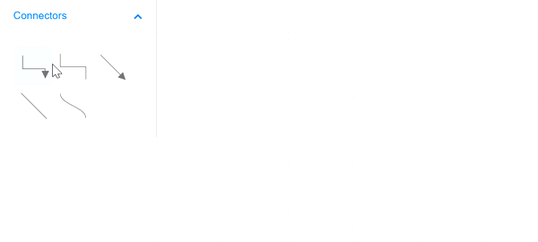
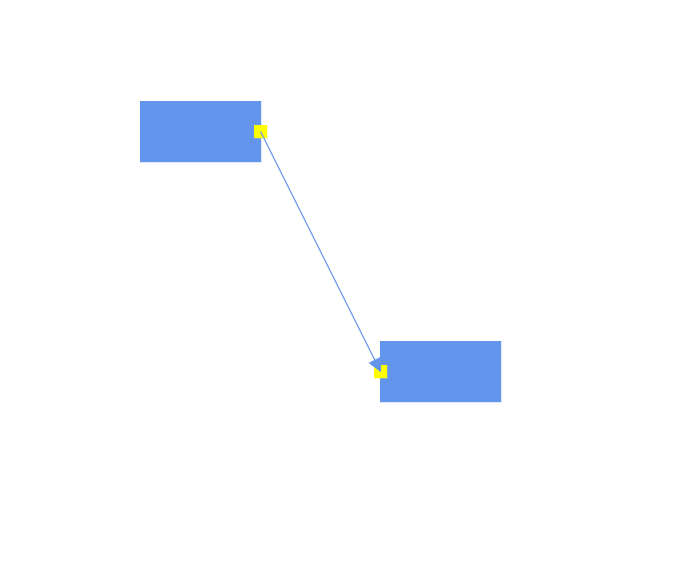

# Connector in Blazor Diagram Component

Connectors are objects used to create link between two points, nodes or ports to represent the relationships between them.

## Create connector

Connector can be created by defining the source and target point of the connector. The path to be drawn can be defined with a collection of segments.

## Add connectors through connectors collection

The `SourcePoint` and `TargetPoint` properties of connector allow you to define the end points of a connector.

The following code example illustrates how to add a connector through connector collection,

```cshtml
@using Syncfusion.Blazor.Diagram
<SfDiagramComponent Width="1000px" Height="500px" Connectors="@connectors">
    <SnapSettings Constraints="@snapConstraints"></SnapSettings>
</SfDiagramComponent>
@code{
    SnapConstraints snapConstraints = SnapConstraints.None;
    //Defines diagram's connector collection
    DiagramObjectCollection<Connector> connectors = new DiagramObjectCollection<Connector>();
    protected override void OnInitialized()
    {
        Connector Connector = new Connector() { ID = "connector1",
        // Set the source and target point of the connector
         SourcePoint = new Point() { X = 100, Y = 100 },
         TargetPoint = new Point() { X = 200, Y = 200 },
        // Type of the connector segemnts
         Type = Segments.Straight };
        connectors.Add(Connector);
    }
}
```


> `ID` for each connector should be unique and so it is further used to find the connector at runtime and do any customization.

## Add connectors at runtime

You can add a connector at runtime by adding connector to the connectors collection in the Diagram component.  The following code explains how to add connectors at runtime.

```cshtml
@using Syncfusion.Blazor.Diagram
<input type="button" value="Add Connector" @onclick="@AddConnector">
<SfDiagramComponent Width="1000px" Height="500px" Connectors="@connectors"></SfDiagramComponent>
@code{

    //Defines diagram's connector collection
    DiagramObjectCollection<Connector> connectors = new DiagramObjectCollection<Connector>();
    protected override void OnInitialized()
    {
        Connector Connector = new Connector() { ID = "connector1", SourcePoint = new Point() { X = 100, Y = 100 }, TargetPoint = new Point() { X = 200, Y = 200 }, Type = Segments.Straight };
        connectors.Add(Connector);
    }
    public void AddConnector()
    {
        Connector NewConnector = new Connector() { ID = "connector2", SourcePoint = new Point() { X = 300, Y = 300 }, TargetPoint = new Point() { X = 400, Y = 400 }, Type = Segments.Straight };
        //Add the connector at the run time.
        connectors.Add(NewConnector);
    }
}
```

## Connectors from the palette

Connectors can be predefined and added to the symbol palette. You can drop those connectors into the diagram when required.

```cshtml
@using Syncfusion.Blazor.Diagram
@using Syncfusion.Blazor.SymbolPalette
<div style="width: 200px; float: left">
    <SfSymbolPaletteComponent Height="600px" @ref="@PaletteInstance" Palettes="@Palettes">
    </SfSymbolPaletteComponent>
</div>
<SfDiagramComponent @ref="@DiagramInstance" Width="1000px" Height="500px" Connectors="@connectors"></SfDiagramComponent>
@code{
    SfSymbolPaletteComponent PaletteInstance;
    SfDiagramComponent DiagramInstance;
    //Defines Symbol palette's PaletteConnector collection
    DiagramObjectCollection<NodeBase> PaletteConnector = new DiagramObjectCollection<NodeBase>();
    DiagramObjectCollection<Palette> Palettes = new DiagramObjectCollection<Palette>();
    protected override async Task OnAfterRenderAsync(bool firstRender)
    {
        PaletteInstance.DiagramInstances = new DiagramObjectCollection<SfDiagramComponent>() { };
        PaletteInstance.DiagramInstances.Add(DiagramInstance);
    }
    DiagramObjectCollection<Connector> connectors = new DiagramObjectCollection<Connector>();
    protected override void OnInitialized()
    {
        Connector Connector = new Connector() { ID = "connector1",
        // Set the source and target point of the connector
        SourcePoint = new Point() { X = 100, Y = 100 }, TargetPoint = new Point() { X = 200, Y = 200 },
         // Type of the connector segemnts
        Type = Segments.Straight };
        connectors.Add(Connector);
        PaletteConnector = new DiagramObjectCollection<NodeBase>();
        Connector connector = new Connector
        {
            ID = "Link1",
            Type = Segments.Straight,
            SourcePoint = new Point() { X = 0, Y = 0 },
            TargetPoint = new Point() { X = 60, Y = 60 }

        };
        PaletteConnector.Add(connector as NodeBase);
        Connector connector2 = new Connector
        {
            ID = "Link2",
            Type = Segments.Orthogonal,
            SourcePoint = new Point() { X = 0, Y = 0 },
            TargetPoint = new Point() { X = 60, Y = 60 },
            TargetDecorator = new Decorator() { Shape = DecoratorShapes.OpenArrow},
            Style = new ShapeStyle() { StrokeWidth =1}

        };
        PaletteConnector.Add(connector2 as NodeBase);
        Connector connector3 = new Connector
        {
            ID = "Link3",
            Type = Segments.Bezier,
            SourcePoint = new Point() { X = 0, Y = 0 },
            TargetPoint = new Point() { X = 60, Y = 60 },
            TargetDecorator = new Decorator() { Shape = DecoratorShapes.None },
        };
        PaletteConnector.Add(connector3 as NodeBase);
        Palettes = new DiagramObjectCollection<Palette>(){
                new Palette(){Symbols =PaletteConnector,Title="Connectors" ,Expanded = false},

            };
    }
}
```



## Draw connectors using drawing object

Connectors can be interactively drawn by clicking and dragging on the diagram surface by using `DrawingObject`.


## Remove connectors at runtime

A connector can be removed from the diagram at runtime by using the `Remove` method.

The following code shows how to remove a connector at runtime.

```cshtml
<input type="button" value="Add Connector" @onclick="@RemoveConnector">
<SfDiagramComponent Width="1000px" Height="500px" Connectors="@connectors">
    <SnapSettings Constraints="@snapConstraints"></SnapSettings>
</SfDiagramComponent>
@code{
    SnapConstraints snapConstraints = SnapConstraints.None;
    //Defines diagram's connector collection
    DiagramObjectCollection<Connector> connectors = new DiagramObjectCollection<Connector>();
    protected override void OnInitialized()
    {
        Connector Connector = new Connector()
        {
            ID = "connector1",
            // Set the source and target point of the connector
            SourcePoint = new Point() { X = 100, Y = 100 },
            TargetPoint = new Point() { X = 200, Y = 200 },
            TargetDecorator = new Decorator() { Shape = DecoratorShapes.Arrow,
            // Style of the connector segment
            Style = new ShapeStyle() { Fill = "#6f409f", StrokeColor = "#6f409f", StrokeWidth = 1 } },
            Style = new ShapeStyle() { StrokeColor = "#6f409f", StrokeWidth = 1 },
            // Type of the connector
            Type = Segments.Straight,
        };
        connectors.Add(Connector);
    }
    public void RemoveConnector()
    {
        // Remove Node at runtime
        connectors.Remove(connectors[0]);
    }
}
```

A connector can be removed from the diagram by using the native `RemoveAt` method. Refer to the following example that shows how to remove the connector at runtime.

```cshtml
public void RemoveConnector()
{
    connectors.RemoveAt(0);
}
```

## Update connectors at runtime

You can change any connector's properties at runtime.

The following code example explains how to change the connector properties.

```cshtml
<input type="button" value="Update Connector" @onclick="@UpdateConnector">
<SfDiagramComponent @ref="Diagram" Width="1000px" Height="500px" Connectors="@connectors">
    <SnapSettings Constraints="@snapConstraints"></SnapSettings>
</SfDiagramComponent>
@code{
    SfDiagramComponent Diagram;
    SnapConstraints snapConstraints = SnapConstraints.None;
    //Defines diagram's connector collection
    DiagramObjectCollection<Connector> connectors = new DiagramObjectCollection<Connector>();
    protected override void OnInitialized()
    {
        Connector Connector = new Connector()
        {
            ID = "connector1",
            SourcePoint = new Point() { X = 100, Y = 100 },
            TargetPoint = new Point() { X = 200, Y = 200 },
            TargetDecorator = new Decorator() { Shape = DecoratorShapes.Arrow, Style = new ShapeStyle() { Fill = "#6f409f", StrokeColor = "#6f409f", StrokeWidth = 1 } },
            Style = new ShapeStyle() { StrokeColor = "#6f409f", StrokeWidth = 1 },
            // Type of the connector
            Type = Segments.Straight,
        };
        connectors.Add(Connector);
    }
    public void UpdateConnector()
    {
        Diagram.BeginUpdate();
        Diagram.Connectors[0].SourcePoint.X = 50;
        Diagram.Connectors[0].SourcePoint.Y = 50;
        Diagram.EndUpdate();
    }
}
```

> BeginUpdate and EndUpdate method which allows you to stop the continuous update of control and resume it finally.

## Connections

A connectors are used to create a link between two points, nodes or ports to represent the relationships between them.

### Connections with nodes

The `SourceID` and `TargetID`properties allow to define the nodes to be connected.

The following code example illustrates how to connect two nodes.

```cshtml
@using Syncfusion.Blazor.Diagram
<SfDiagramComponent @ref="Diagram" Width="1000px" Height="500px" Nodes="@nodes" Connectors="@connectors">

</SfDiagramComponent>
@code{
    SfDiagramComponent Diagram;
    DiagramObjectCollection<Connector> connectors = new DiagramObjectCollection<Connector>();
    DiagramObjectCollection<Node> nodes = new DiagramObjectCollection<Node>();
    protected override void OnInitialized()
    {
        nodes = new DiagramObjectCollection<Node>() {
          new Node() {  OffsetX = 100,
            OffsetY = 100,
            Height = 50,
            Width = 100,
            ID = "node1",
            Style = new ShapeStyle(){ Fill = "#6495ED",
                StrokeColor = "#6495ED",},
            Shape = new BasicShape() { Type = Shapes.Basic, Shape = BasicShapes.Rectangle }
          },
          new Node() {  OffsetX = 300,
            OffsetY = 300,
            Height = 50,
            Width = 100,
            ID = "node2",
            Style = new ShapeStyle(){ Fill = "#6495ED",
                StrokeColor = "#6495ED",},
           Shape = new BasicShape() { Type = Shapes.Basic, Shape = BasicShapes.Rectangle }
          }
        };
        Connector Connector = new Connector()
        {
            ID = "connector1",
            //Source node id of the connector.
            SourceID = "node1",
            TargetDecorator = new Decorator()
            {
                Style = new ShapeStyle()
                {
                    Fill = "#6495ED",
                    StrokeColor = "#6495ED",
                }
            },
            //Target node id of the connector.
            TargetID = "node2",
            Style = new ShapeStyle()
            {
                Fill = "#6495ED",
                StrokeColor = "#6495ED",
            },
            // Type of the connector
            Type = Segments.Straight,
        };
        connectors.Add(Connector);
    }
}
```


* When you remove `NodeConstraints.InConnect` from Default, the node accepts only an outgoing connection to dock in it. Similarly, when you remove `NodeConstraints.OutConnect` from Default, the node accepts only an incoming connection to dock in it.

* When you remove both InConnect and OutConnect `NodeConstraints` from `Default`, the node restricts connector to establish connection in it.

### Connections with ports

The `SourcePortID` and `TargetPortID` properties allow to create connections between some specific points of source/target nodes.

The following code example illustrates how to create port to port connections.

```cshtml
@using Syncfusion.Blazor.Diagram
<SfDiagramComponent @ref="Diagram" Width="1000px" Height="500px" Nodes="@nodes" Connectors="@connectors">

</SfDiagramComponent>
@code{
    SfDiagramComponent Diagram;
    DiagramObjectCollection<Connector> connectors = new DiagramObjectCollection<Connector>();
    DiagramObjectCollection<Node> nodes = new DiagramObjectCollection<Node>();
    protected override void OnInitialized()
    {
        nodes = new DiagramObjectCollection<Node>() {
          new Node() {  OffsetX = 100,
            OffsetY = 100,
            Height = 50,
            Ports = new DiagramObjectCollection<PointPort>()
{
                        new PointPort()
                        {
                            ID="port1",
                            Visibility = PortVisibility.Visible,
                            Offset = new Point() { X = 1, Y = 0.5},
                            Height = 10, Width = 10,
                            Style =  new ShapeStyle(){Fill = "yellow", StrokeColor = "yellow"}
                        }
                    },
            Width = 100,
            ID = "node1",
            Style = new ShapeStyle(){ Fill = "#6495ED",
                StrokeColor = "#6495ED",},
            Shape = new BasicShape() { Type = Shapes.Basic, Shape = BasicShapes.Rectangle }
          },
          new Node() {  OffsetX = 300,
            OffsetY = 300,
            Height = 50,
            Width = 100,
            ID = "node2",
            Ports = new DiagramObjectCollection<PointPort>()
            {
                        new PointPort()
                        {
                            ID="port2",
                            Visibility = PortVisibility.Visible,
                            Offset = new Point() { X = 0, Y = 0.5},
                            Height = 10, Width = 10,
                            Style =  new ShapeStyle(){Fill = "yellow", StrokeColor = "yellow"}
                        }
                    },
            Style = new ShapeStyle(){ Fill = "#6495ED",
                StrokeColor = "#6495ED",},
           Shape = new BasicShape() { Type = Shapes.Basic, Shape = BasicShapes.Rectangle }
          }
        };
        Connector Connector = new Connector()
        {
            ID = "connector1",
            //Source node id of the connector.
            SourceID = "node1",
            //source node port id.
            SourcePortID = "port1",
            //Target node id of the connector.
            TargetID = "node2",
            //Target node port id.
            TargetPortID = "port2",
            TargetDecorator = new Decorator()
            {
                Style = new ShapeStyle()
                {
                    Fill = "#6495ED",
                    StrokeColor = "#6495ED",
                }
            },

            Style = new ShapeStyle()
            {
                Fill = "#6495ED",
                StrokeColor = "#6495ED",
            },
            // Type of the connector
            Type = Segments.Straight,
        };
        connectors.Add(Connector);
    }
}
```



* When you set `PortConstraints` to `InConnect`, the port accepts only an incoming connection to dock in it. Similarly, when you set `PortConstraints` to `OutConnect`, the port accepts only an outgoing connection to dock in it.
* When you set `PortConstraints` to `None`, the port restricts connector to establish connection in it.

## See also

* [`How to customize the connector properties`](./customization)

* [`How to interact the connector`](./interactions)

* [`How to change the segments`](./segments)

* [`How to get the connector events`](./events)

* [`How to add annotations to the connectors`](../annotations/labels)