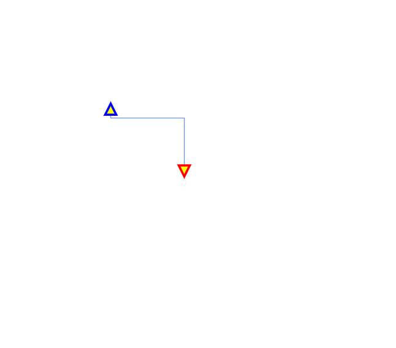
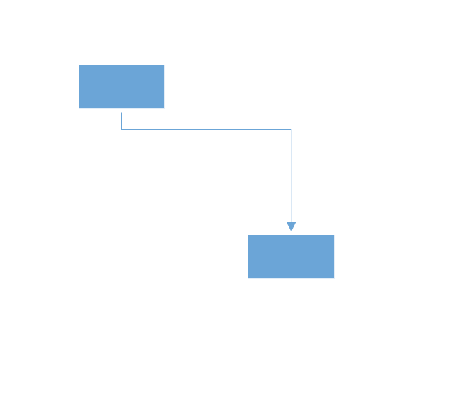

# Customization in Blazor Diagram Component

## Decorator

Diagram allows you to customize the connector appearances . The following topics shows how to customize several properties of the connectors.

* Starting and ending points of a connector can be decorated with some customizable shapes like arrows, circles, diamond, or path. The connection end points can be decorated with the `SourceDecorator` and `TargetDecorator` properties of the connector.

* The `Shape` property of `SourceDecorator` allows to define the shape of the source decorator. Similarly, the `Shape` property of `TargetDecorator` allows to define the shape of the target decorator.

* To create custom shape for source decorator, use `PathData` property. Similarly, to create custom shape for target decorator, use `PathData` property.

* The following code example illustrates how to create decorators of various shapes.

```cshtml
@using Syncfusion.Blazor.Diagram

<SfDiagramComponent Width="1000px" Height="500px" Connectors="@connectors">
</SfDiagramComponent>

@code
{
    //Defines diagram's connector collection
    DiagramObjectCollection<Connector> connectors = new DiagramObjectCollection<Connector>();

    protected override void OnInitialized()
    {
        Connector Connector = new Connector()
        {
            ID = "connector1",
            SourcePoint = new DiagramPoint()
            {
                X = 100,
                Y = 100
            },
            TargetPoint = new DiagramPoint() { X = 200, Y = 200 },
            Style = new ShapeStyle() { StrokeColor = "#6f409f", StrokeWidth = 1 },
            Type = ConnectorSegmentType.Orthogonal,
            SourceDecorator = new DecoratorSettings()
            {
                Shape = DecoratorShape.Circle,
                Style = new ShapeStyle() { StrokeColor = "#37909A", Fill = "#37909A", StrokeWidth = 1 }
            },
            TargetDecorator = new DecoratorSettings()
            {
                Shape = DecoratorShape.Custom,
                PathData = "M80.5,12.5 C80.5,19.127417 62.59139,24.5 40.5,24.5 C18.40861,24.5 0.5,19.127417 0.5,12.5 C0.5,5.872583 18.40861,0.5 40.5,0.5 C62.59139,0.5 80.5,5.872583 80.5,12.5 z",
                Style = new ShapeStyle()
                {
                    StrokeColor = "#37909A",
                    Fill = "#37909A",
                    StrokeWidth = 1,
                }
            }
        };
        connectors.Add(Connector);
    }
}
```

### Decorator appearance

* The source decorator’s `StrokeColor`, `StrokeWidth` and `StrokeDashArray` properties are used to customize the color, width, and appearance of the decorator.

* To set the border stroke color, stroke width, and stroke dash array for the target decorator, use `StrokeColor`, `StrokeWidth`, and `StrokeDashArray`.

* To set the size for source and target decorator, use `Width` and `Height` property.

The following code example illustrates how to customize the appearance of the decorator.

```cshtml
@using Syncfusion.Blazor.Diagram

<SfDiagramComponent Width="1000px" Height="500px" Connectors="@connectors">
</SfDiagramComponent>

@code
{
    DiagramObjectCollection<Connector> connectors = new DiagramObjectCollection<Connector>();

    protected override void OnInitialized()
    {
        Connector Connector = new Connector()
        {
            ID = "connector1",
            Style = new ShapeStyle()
            {
                Fill = "#6495ED",
                StrokeColor = "#6495ED",
                StrokeWidth = 1
            },
            SourcePoint = new DiagramPoint()
            {
                X = 100,
                Y = 100
            },
            TargetPoint = new DiagramPoint()
            {
                X = 200,
                Y = 200
            },
            Type = ConnectorSegmentType.Orthogonal,
            SourceDecorator = new DecoratorSettings()
            {
                Shape = DecoratorShape.Arrow,
                Height = 15,
                Width = 15,
                Style = new ShapeStyle() { StrokeColor = "blue", Fill = "yellow", StrokeWidth = 3 }
            },
            TargetDecorator = new DecoratorSettings()
            {
                Shape = DecoratorShape.Arrow,
                Height = 15,
                Width = 15,
                Style = new ShapeStyle()
                {
                    StrokeColor = "red",
                    Fill = "yellow",
                    StrokeWidth = 3
                }
            }

        };
        connectors.Add(Connector);
    }
}
```



## Padding

Padding is used to leave the space between the Connector's end point and the object to where it is connected.

* The `SourcePadding` property of connector defines space between the source point and the source node of the connector.

* The `TargetPadding` property of connector defines space between the end point and the target node of the connector.

* The following code example illustrates how to leave space between the connection end points and source, target nodes.

```cshtml
@using Syncfusion.Blazor.Diagram

<SfDiagramComponent Width="1000px" Height="500px" Connectors="@connectors" Nodes="@nodes">
</SfDiagramComponent>

@code
{
    //Defines diagram's nodes collection
    DiagramObjectCollection<Node> nodes = new DiagramObjectCollection<Node>();
    //Defines diagram's connector collection
    DiagramObjectCollection<Connector> connectors = new DiagramObjectCollection<Connector>();

    protected override void OnInitialized()
    {
        nodes = new DiagramObjectCollection<Node>() 
        {
          new Node() 
          {
                OffsetX = 100,
                OffsetY = 100,
                Height = 50,
                Width = 100,
                ID = "node1",
                Style = new ShapeStyle() { Fill = "#6BA5D7", StrokeColor = "#6BA5D7" },
                Shape = new BasicShape() { Type = Shapes.Basic, Shape = BasicShapeType.Rectangle }
          },
          new Node() 
          {   
                OffsetX = 300,
                OffsetY = 300,
                Height = 50,
                Width = 100,
                ID = "node2",
                Style = new ShapeStyle(){ Fill = "#6BA5D7", StrokeColor = "#6BA5D7" },
                Shape = new BasicShape() { Type = Shapes.Basic, Shape = BasicShapeType.Rectangle }
          }
        };
        Connector Connector = new Connector()
        {
            ID = "connector1",
            SourceID = "node1",
            TargetID = "node2",
            //Specifies the source and target padding values.
            SourcePadding = 20,
            TargetPadding = 20,
            TargetDecorator = new DecoratorSettings()
            {
                Shape = DecoratorShape.Arrow,
                Style = new ShapeStyle() { Fill = "#6BA5D7", StrokeColor = "#6BA5D7", StrokeWidth = 1 }
            },
            Style = new ShapeStyle()
            {
                StrokeColor = "#6BA5D7",
                StrokeWidth = 1
            },
            Type = ConnectorSegmentType.Orthogonal
        };
        connectors.Add(Connector);
    }
}
```



## Bridging

Line bridging creates a bridge for lines to smartly cross over the other lines, at points of intersection. By default,`BridgeDirection` is set to `Top`. Depending upon the direction given bridging direction appears. Bridging can be enabled/disabled either with the `Connector.Constraints` or `Diagram.Constraints`. The following code example illustrates how to enable line bridging.

```cshtml
@using Syncfusion.Blazor.Diagram

<SfDiagramComponent Width="1000px"@bind-Constraints="@diagramConstraints" Height="500px" Connectors="@connectors">
</SfDiagramComponent>

@code
{
    DiagramConstraints diagramConstraints = DiagramConstraints.Default | DiagramConstraints.Bridging;
    DiagramObjectCollection<Connector> connectors = new DiagramObjectCollection<Connector>();

    protected override void OnInitialized()
    {
        Connector Connector1 = new Connector()
        {
            ID = "connector1",
            // Bridge space value has been defined
            BridgeSpace = 20,
            Style = new ShapeStyle()
            {
                Fill = "#6495ED",
                StrokeColor = "#6495ED",
                StrokeWidth = 1
            },
            SourcePoint = new DiagramPoint()
            {
                X = 200 , Y = 200
            },
            TargetPoint = new DiagramPoint()
            {
                X = 400,
                Y = 200
            },
            Type = ConnectorSegmentType.Orthogonal,
            TargetDecorator = new DecoratorSettings()
            {
                Shape = DecoratorShape.Arrow ,
                Style = new ShapeStyle()
                {
                    Fill = "#6495ED",
                    StrokeColor = "#6495ED",
                    StrokeWidth = 1
                }
            }
        };
        connectors.Add(Connector1);
        Connector Connector2 = new Connector()
        {
            ID = "connector2",
            Style = new ShapeStyle()
            {
                Fill = "#6495ED",
                StrokeColor = "#6495ED",
                StrokeWidth = 1
            },
            SourcePoint = new DiagramPoint()
            {
                X = 300,
                Y = 100
            },
            TargetPoint = new DiagramPoint()
            {
                X = 300,
                Y = 300
            },
            Type = ConnectorSegmentType.Orthogonal,
            TargetDecorator = new DecoratorSettings()
            {
                Shape = DecoratorShape.Arrow,
                Style = new ShapeStyle()
                {
                    Fill = "#6495ED",
                    StrokeColor = "#6495ED",
                    StrokeWidth = 1
                }
            }
        };
        connectors.Add(Connector2);
    }
}
```

The `BridgeSpace` property of connectors can be used to define the width for line bridging.

Limitation: `Bezier` segments do not support bridging.


## Corner radius

Corner radius allows to create connectors with rounded corners. The radius of the rounded corner is set with the `CornerRadius`property.

```cshtml
@using Syncfusion.Blazor.Diagram

<SfDiagramComponent Width="1000px"  Height="500px" Connectors="@connectors">
</SfDiagramComponent>

@code
{
    DiagramObjectCollection<Connector> connectors = new DiagramObjectCollection<Connector>();

    protected override void OnInitialized()
    {
        Connector Connector = new Connector()
        {
            ID = "connector1",
            Style = new ShapeStyle()
            {
                Fill = "#6495ED",
                StrokeColor = "#6495ED",
                StrokeWidth = 1
            },
            SourcePoint = new DiagramPoint()
            {
                X = 100,
                Y = 100
            },
            TargetPoint = new DiagramPoint()
            {
                X = 200,
                Y = 200
            },
            //specify the corner radius value.
            CornerRadius = 10,
            Type = ConnectorSegmentType.Orthogonal,
            TargetDecorator = new DecoratorSettings()
            {
                Shape = DecoratorShape.Arrow,
                Style = new ShapeStyle()
                {
                    Fill = "#6495ED",
                    StrokeColor = "#6495ED",
                    StrokeWidth = 1
                }
            }
        };
        connectors.Add(Connector);
    }
}
```


## Appearance

* The connector’s `StrokeWidth`, `StrokeColor`, `StrokeDashArray`, and `Opacity` properties are used to customize the appearance of the connector segments.

* The `Visible` property of the connector enables or disables the visibility of connector.

* Default values for all the `Connectors` can be set using the `ConnectorCreating` properties. For example, if all connectors have the same type or having the same property then such properties can be moved into `ConnectorCreating`.

### Segment appearance

The following code example illustrates how to customize the segment appearance.

```cshtml
@using Syncfusion.Blazor.Diagram

<SfDiagramComponent Width="1000px" Height="500px" Connectors="@connectors">
</SfDiagramComponent>

@code
{
    DiagramObjectCollection<Connector> connectors = new DiagramObjectCollection<Connector>();

    protected override void OnInitialized()
    {
        Connector Connector1 = new Connector()
        {
            ID = "connector1",
            SourcePoint = new DiagramPoint()
            {
                X = 100,
                Y = 100
            },
            TargetPoint = new DiagramPoint()
            {
                X = 200,
                Y = 200
            },
            Style = new ShapeStyle()
            {
                StrokeColor = "red",
                StrokeWidth = 2,
                StrokeDashArray = "2,2"
            },
            Type = ConnectorSegmentType.Orthogonal,
            TargetDecorator = new DecoratorSettings()
            {
                Shape = DecoratorShape.Arrow,
                Style = new ShapeStyle()
                {
                    Fill = "#6f409f",
                    StrokeColor = "#6f409f",
                    StrokeWidth = 1
                }
            }
        };
        connectors.Add(Connector1);
    }
}
```

### Decorator appearance

* The source decorator’s `StrokeColor`, `StrokeWidth` and `StrokeDashArray` properties are used to customize the color, width, and appearance of the decorator.

* To set the border stroke color, stroke width, and stroke dash array for the target decorator, use `StrokeColor`, `StrokeWidth`, and `StrokeDashArray`.

* To set the size for source and target decorator, use `Width` and `Height` property.

The following code example illustrates how to customize the appearance of the decorator.

```cshtml
@using Syncfusion.Blazor.Diagram

<SfDiagramComponent Width="1000px" Height="500px" Connectors="@connectors">
</SfDiagramComponent>

@code
{
    DiagramObjectCollection<Connector> connectors = new DiagramObjectCollection<Connector>();

    protected override void OnInitialized()
    {
        Connector Connector = new Connector()
        {
            ID = "connector1",
            Style = new ShapeStyle()
            {
                Fill = "#6495ED",
                StrokeColor = "#6495ED",
                StrokeWidth = 1
            },
            SourcePoint = new DiagramPoint()
            {
                X = 100,
                Y = 100
            },
            TargetPoint = new DiagramPoint()
            {
                X = 200,
                Y = 200
            },
            Type = ConnectorSegmentType.Orthogonal,
            SourceDecorator = new DecoratorSettings()
            {
                Shape = DecoratorShape.Arrow,
                Height = 15,
                Width = 15,
                Style = new ShapeStyle()
                { StrokeColor = "blue", Fill = "yellow", StrokeWidth = 3 }
            },
            TargetDecorator = new DecoratorSettings()
            {
                Shape = DecoratorShape.Arrow,
                Height = 15,
                Width = 15,
                Style = new ShapeStyle()
                {
                    StrokeColor = "red",
                    Fill = "yellow",
                    StrokeWidth = 3
                }
            }
        };
        connectors.Add(Connector);
    }
}
```


## Constraints

* The `Constraints` property of connector allows to enable/disable certain features of connectors.

* To enable or disable the constraints, refer [Connector Constraints](./constraints).

The following code illustrates how to disable selection.

```cshtml
@using Syncfusion.Blazor.Diagram

<SfDiagramComponent Width="1000px" Height="500px" Connectors="@connectors">
</SfDiagramComponent>

@code
{
    DiagramObjectCollection<Connector> connectors = new DiagramObjectCollection<Connector>();

    protected override void OnInitialized()
    {
        Connector Connector = new Connector()
        {
            ID = "connector1",
            SourcePoint = new DiagramPoint()
            {
                X = 100,
                Y = 100
            },
            TargetPoint = new DiagramPoint()
            {
                X = 200,
                Y = 200
            },
            Type = ConnectorSegmentType.Orthogonal,
            TargetDecorator = new DecoratorSettings()
            {
                Shape = DecoratorShape.Arrow,
                Style = new ShapeStyle()
                {
                    Fill = "black",
                    StrokeColor = "black",
                    StrokeWidth = 1
                }
            },
            Style = new ShapeStyle()
            {
                StrokeColor = "black",
                StrokeWidth = 1
            },
            //Disable the select constraint
            Constraints = ConnectorConstraints.Default & ~ConnectorConstraints.Select,
        };
        connectors.Add(Connector);
    }
}
```

## Custom properties

* The `AdditionalInfo` property of connectors allow you to maintain additional information to the connectors.

```cshtml
@using Syncfusion.Blazor.Diagram

<SfDiagramComponent Width="1000px" Height="500px" Connectors="@connectors">
</SfDiagramComponent>

@code
{
    DiagramObjectCollection<Connector> connectors = new DiagramObjectCollection<Connector>();

    protected override void OnInitialized()
    {
        Dictionary<string, object> ConnectorInfo = new Dictionary<string, object>();
        ConnectorInfo.Add("connectorInfo", "Central Connector");
        Connector Connector = new Connector()
        {
            ID = "connector1",
            SourcePoint = new DiagramPoint()
            {
                X = 100,
                Y = 100
            },
            TargetPoint = new DiagramPoint()
            {
                X = 200,
                Y = 200
            },
            Type = ConnectorSegmentType.Orthogonal,
            TargetDecorator = new DecoratorSettings()
            {
                Shape = DecoratorShape.Arrow,
                Style = new ShapeStyle()
                {
                    Fill = "black",
                    StrokeColor = "black",
                    StrokeWidth = 1
                }
            },
            Style = new ShapeStyle()
            {
                StrokeColor = "black",
                StrokeWidth = 1
            },
            //Define the add info value.
            AdditionalInfo = ConnectorInfo
        };
        connectors.Add(Connector);
    }
}
```

## See also

* [How to interact the connector](./interactions)

* [How to change the segments](./segments)

* [How to get the connector events](./events)
