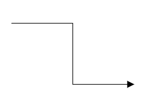

# Segments in Blazor Diagram Component

The path of the connector is defined with a collection of segments. There are three types of segments.

## Straight

To create a straight line, specify the [Type](https://help.syncfusion.com/cr/blazor/Syncfusion.Blazor.Diagram.Connector.html#Syncfusion_Blazor_Diagram_Connector_Type) of the segment as [Straight](https://help.syncfusion.com/cr/blazor/Syncfusion.Blazor.Diagram.ConnectorSegmentType.html#Syncfusion_Blazor_Diagram_ConnectorSegmentType_Straight) and add a straight segment to [Segments](https://help.syncfusion.com/cr/blazor/Syncfusion.Blazor.Diagram.Connector.html#Syncfusion_Blazor_Diagram_Connector_Segments) collection and need to specify Type for the connector. The following code example illustrates how to create a default straight segment.

```cshtml
@using Syncfusion.Blazor.Diagram

<SfDiagramComponent Width="1000px" Height="500px" Connectors="@connectors">
</SfDiagramComponent>

@code
{
    //Defines diagram's connector collection
    DiagramObjectCollection<Connector> connectors = new DiagramObjectCollection<Connector>();

    protected override void OnInitialized()
    {
        Connector Connector = new Connector()
        {
            ID = "connector1",
            SourcePoint = new DiagramPoint()
            {
                X = 100,
                Y = 100
            },
            Style = new ShapeStyle() { StrokeColor = "#6f409f", StrokeWidth = 1 },
            TargetPoint = new DiagramPoint() { X = 200, Y = 200 },
             //Specify the segments typs as straight.
            Type = ConnectorSegmentType.Straight,
            TargetDecorator = new DecoratorSettings()
            {
                Shape = DecoratorShape.Arrow,
                Style = new ShapeStyle()
                {
                    Fill = "#6f409f",
                    StrokeColor = "#6f409f",
                    StrokeWidth = 1
                }
            }
        };
        connectors.Add(Connector);
    }
}
```


## Orthogonal

Orthogonal segments are used to create segments that are perpendicular to each other. Set the segment Type as [Orthogonal](https://help.syncfusion.com/cr/blazor/Syncfusion.Blazor.Diagram.ConnectorSegmentType.html#Syncfusion_Blazor_Diagram_ConnectorSegmentType_Orthogonal) to create a default orthogonal segment and need to specify Type. The following code example illustrates how to create a default orthogonal segment.

```cshtml
@using Syncfusion.Blazor.Diagram

<SfDiagramComponent Width="1000px" Height="500px" Connectors="@connectors">
</SfDiagramComponent>

@code
{
    //Defines diagram's connector collection
    DiagramObjectCollection<Connector> connectors = new DiagramObjectCollection<Connector>();

    protected override void OnInitialized()
    {
        Connector Connector = new Connector()
        {
            ID = "connector1",
            SourcePoint = new DiagramPoint()
            {
                X = 100,
                Y = 100
            },
            Style = new ShapeStyle() { StrokeColor = "#6f409f", StrokeWidth = 1 },
            TargetPoint = new DiagramPoint() { X = 200, Y = 200 },
             //Specify the segments type as Orthogonal.
            Type = ConnectorSegmentType.Orthogonal,
            TargetDecorator = new DecoratorSettings()
            {
                Shape = DecoratorShape.Arrow,
                Style = new ShapeStyle()
                {
                    Fill = "#6f409f",
                    StrokeColor = "#6f409f",
                    StrokeWidth = 1
                }
            }
        };
        connectors.Add(Connector);
    }
}
```

The [Length](https://help.syncfusion.com/cr/blazor/Syncfusion.Blazor.Diagram.OrthogonalSegment.html#Syncfusion_Blazor_Diagram_OrthogonalSegment_Length) and [Direction](https://help.syncfusion.com/cr/blazor/Syncfusion.Blazor.Diagram.OrthogonalSegment.html#Syncfusion_Blazor_Diagram_OrthogonalSegment_Direction) properties allow to define the flow and length of segment. The following code example illustrates how to create customized orthogonal segments.

```cshtml
@using Syncfusion.Blazor.Diagram

<SfDiagramComponent Width="1000px" Height="500px" Connectors="@connectors">
</SfDiagramComponent>

@code
{
    //Defines diagram's connector collection
    DiagramObjectCollection<Connector> connectors = new DiagramObjectCollection<Connector>();

    protected override void OnInitialized()
    {
        Connector Connector = new Connector()
        {
            ID = "connector1",
            SourcePoint = new DiagramPoint()
            {
                X = 100,
                Y = 100
            },
            Style = new ShapeStyle() { StrokeColor = "#6f409f", StrokeWidth = 1 },
            TargetPoint = new DiagramPoint() { X = 200, Y = 200 },
            Type = ConnectorSegmentType.Orthogonal,
            //Create a new segment with length and direction
            Segments = new DiagramObjectCollection<ConnectorSegment>()
            {
                new OrthogonalSegment 
                {
                    Length = 100,
                    Type = ConnectorSegmentType.Orthogonal,
                    Direction = Direction.Right
                },
                new OrthogonalSegment 
                {
                    Length = 100,
                    Type = ConnectorSegmentType.Orthogonal,
                    Direction = Direction.Bottom,
                } 
            },
            TargetDecorator = new DecoratorSettings()
            {
                Shape = DecoratorShape.Arrow,
                Style = new ShapeStyle()
                {
                    Fill = "#6f409f",
                    StrokeColor = "#6f409f",
                    StrokeWidth = 1
                }
            }
        };
        connectors.Add(Connector);
    }
}
```


> You need to mention the segment type as same as what you mentioned in connector type. There should be no contradiction between connector type and segment type.

## Bezier

Bezier segments are used to create curve segments and the curves are configurable either with the control points or with vectors. To create a bezier segment, the Type of the segment is set as [Bezier](https://help.syncfusion.com/cr/blazor/Syncfusion.Blazor.Diagram.ConnectorSegmentType.html#Syncfusion_Blazor_Diagram_ConnectorSegmentType_Bezier) and need to specify type for the connector. The following code example illustrates how to create a default bezier segment.

```cshtml
@using Syncfusion.Blazor.Diagram

<SfDiagramComponent Width="1000px" Height="500px" Connectors="@connectors">
</SfDiagramComponent>

@code
{
     //Defines diagram's connector collection
    DiagramObjectCollection<Connector> connectors = new DiagramObjectCollection<Connector>();

    protected override void OnInitialized()
    {
        Connector Connector = new Connector()
        {
            ID = "connector1",
            SourcePoint = new DiagramPoint()
            {
                X = 100,
                Y = 100
            },
            Style = new ShapeStyle() { StrokeColor = "#6f409f", StrokeWidth = 1 },
            TargetPoint = new DiagramPoint() { X = 200, Y = 200 },
            Type = ConnectorSegmentType.Bezier,
            TargetDecorator = new DecoratorSettings()
            {
                Shape = DecoratorShape.Arrow,
                Style = new ShapeStyle()
                {
                    Fill = "#6f409f",
                    StrokeColor = "#6f409f",
                    StrokeWidth = 1
                }
            }
        };
        //Add the connector into connectors's collection.
        connectors.Add(Connector);
    }
}
```


We have properties called [Point1](https://help.syncfusion.com/cr/blazor/Syncfusion.Blazor.Diagram.BezierSegment.html#Syncfusion_Blazor_Diagram_BezierSegment_Point1) and [Point2](https://help.syncfusion.com/cr/blazor/Syncfusion.Blazor.Diagram.BezierSegment.html#Syncfusion_Blazor_Diagram_BezierSegment_Point2) which is used to control the points of the bezier connector . And also we have properties called [vector1](https://help.syncfusion.com/cr/blazor/Syncfusion.Blazor.Diagram.BezierSegment.html#Syncfusion_Blazor_Diagram_BezierSegment_Vector1) and [Vector2](https://help.syncfusion.com/cr/blazor/Syncfusion.Blazor.Diagram.BezierSegment.html#Syncfusion_Blazor_Diagram_BezierSegment_Vector2) which is used to defines the length and angle between the source point and target point respectively .The following code example illustrates how to use these properties in our control  .

```cshtml
Connector Connector1 = new Connector()
        {
            ID = "Connector1",
            Type = ConnectorSegmentType.Bezier,
            SourcePoint = new DiagramPoint { X = 500, Y = 200 },
            TargetPoint = new DiagramPoint { X = 600, Y = 300 },
            Segments = new DiagramObjectCollection<ConnectorSegment>
            {
                new BezierSegment() 
                {
                    Type = ConnectorSegmentType.Bezier,
                    //Defines the point1 and point2 for the bezier connector
                    Point1 = new DiagramPoint { X = 500, Y = 100 },
                    Point2 = new DiagramPoint { X = 600, Y = 200 }
                }
            }
        };
         Connector Connector2 = new Connector()
         {
            ID = "Connector2",
            Type = ConnectorSegmentType.Bezier,
            SourcePoint = new DiagramPoint { X = 200, Y = 100 },
            TargetPoint = new DiagramPoint { X = 300, Y = 200 },
            Segments = new DiagramObjectCollection<ConnectorSegment>
            {
                new BezierSegment()
                {
                    Type = ConnectorSegmentType.Bezier,
                    //Defines the Vector1 and Vector2 for the bezier connector
                    Vector1 = new Vector(){Distance = 100 ,Angle = 90 },
                    Vector2 = new Vector(){Distance = 45 ,Angle = 45 }
                }
            }
        };
```

## How to create multiple segments

Multiple segments can be defined one after another. To create a connector with multiple segments, define and add the segments to [connector.Segments](https://help.syncfusion.com/cr/blazor/Syncfusion.Blazor.Diagram.ConnectorSegment.html) collection. The following code example illustrates how to create a connector with multiple segments.

```cshtml
@using Syncfusion.Blazor.Diagram

<SfDiagramComponent Width="1000px" Height="500px" Connectors="@connectors">
    <SnapSettings Constraints="SnapConstraints.None"></SnapSettings>
</SfDiagramComponent>

@code
{
    //Defines diagram's connector collection
    DiagramObjectCollection<Connector> connectors = new DiagramObjectCollection<Connector>();

    protected override void OnInitialized()
    {
        Connector connector1 = new Connector()
        {
            ID = "Connector1",
            Type = ConnectorSegmentType.Orthogonal,
            SourcePoint = new DiagramPoint()
            {
                X = 100,
                Y = 100
            },
            TargetPoint = new DiagramPoint() { X = 300, Y = 200 },
            Segments = new DiagramObjectCollection<ConnectorSegment>()
            {
                new OrthogonalSegment
                {
                    Length = 100,
                    Type = ConnectorSegmentType.Orthogonal,
                    Direction = Direction.Right
                },
                new OrthogonalSegment
                {
                    Length = 100,
                    Type = ConnectorSegmentType.Orthogonal,
                    Direction = Direction.Bottom
                }
            },
        };
        //Add the connector into connectors's collection.
        connectors.Add(connector1);
    }
}
```



* Similarly, you can create multiple segments for all the connector type.

## Segment Editing

### Straight segment editing

* End point of each straight segment is represented by a thumb that enables to edit the segment.
* Any number of new segments can be inserted into a straight line by clicking, when Shift and Ctrl keys are pressed (Ctrl+Shift+Click).
* Straight segments can be removed by clicking the segment end point, when Ctrl and Shift keys are pressed (Ctrl+Shift+Click).

```cshtml
@using Syncfusion.Blazor.Diagram

<SfDiagramComponent @ref="Diagram" Width="1000px" Height="500px" Connectors="@connectors">
</SfDiagramComponent>

@code
{
    SfDiagramComponent Diagram;
    DiagramObjectCollection<Connector> connectors = new DiagramObjectCollection<Connector>();

    protected override void OnInitialized()
    {
        Connector Connector = new Connector()
        { 
            ID = "Connector1",
            Constraints = ConnectorConstraints.Default | ConnectorConstraints.DragSegmentThumb,
            SourcePoint = new DiagramPoint { X = 200, Y = 100 },
            TargetPoint = new DiagramPoint { X = 340, Y = 150 },
            // Enable the segment editing
            Segments = new DiagramObjectCollection<ConnectorSegment>
            {
                new StraightSegment()
                {
                    Type = ConnectorSegmentType.Straight,
                    Point = new DiagramPoint { X = 300, Y = 200 }
                }
            }
        };
        connectors.Add(Connector);
    }
}
```


### Orthogonal Segment Editing

* Orthogonal thumbs allow you to adjust the length of adjacent segments by clicking and dragging it.
* When necessary, some segments are added or removed automatically, when dragging the segment. This is to maintain proper routing of orthogonality between segments.

```cshtml
@using Syncfusion.Blazor.Diagram

<SfDiagramComponent @ref="Diagram" Width="1000px"  Height="500px" Connectors="@connectors">
</SfDiagramComponent>

@code
{
    SfDiagramComponent Diagram;
    DiagramObjectCollection<Connector> connectors = new DiagramObjectCollection<Connector>();

    protected override void OnInitialized()
    {
        Connector Connector = new Connector()
        // Enable the segment editing
        {
            ID = "Connector2",
            Constraints = ConnectorConstraints.Default | ConnectorConstraints.DragSegmentThumb,
            Type = ConnectorSegmentType.Orthogonal,
            SourcePoint = new DiagramPoint { X = 400, Y = 100 },
            TargetPoint = new DiagramPoint { X = 500, Y = 200 }
        };
        connectors.Add(Connector);
    }
}
```


### Bezier Segment Editing

* A segment control point of the Bezier connector is used to change the bezier vectors, points of the connector.


## See also

* [How to customize the connector properties](./customization)

* [How to interact the connector](./interactions)

* [How to get the connector events](./events)
