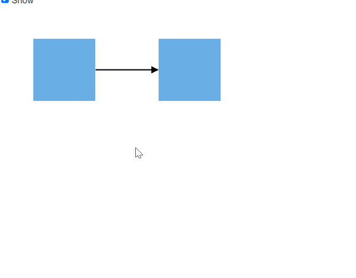
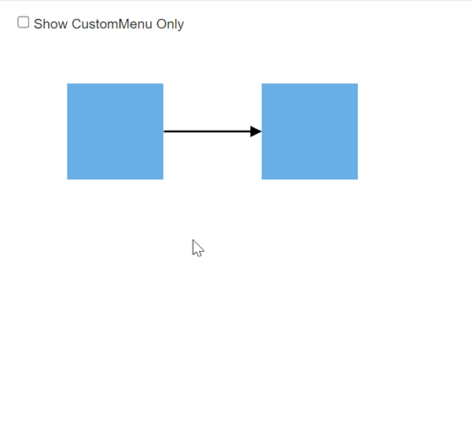
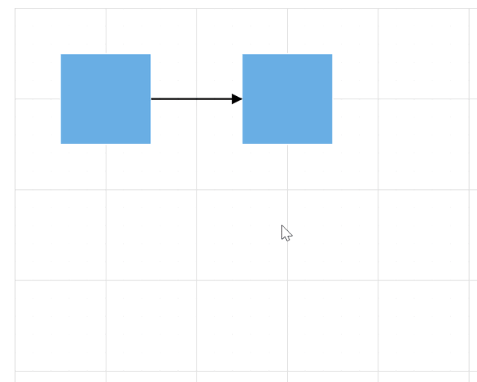

# Context Menu in Blazor Diagram Component

<!-- markdownlint-disable MD010 -->

In graphical user interface (GUI), a context menu is a type of menu that appears when you perform right-click operation. You can create a nested level of context menu items.
Diagram provides some in-built context menu items and allows to define custom menu items through the `ContextMenuSettings` property.

## Default context menu

The `Show` property helps you to enable or disable the context menu. Diagram provides some default context menu items such as copy, cut, select all, order,cut undo, redo, and group options. The following code shows how to enable the default context menu items.

```cshtml
<SfDiagramComponent @ref="diagram" Height="600px">
    //Define context menu
    <ContextMenuSettings Show="true">
    </ContextMenuSettings>
</SfDiagramComponent>
```



The following code shows how to disable the default context menu items.

```cshtml
<SfDiagramComponent @ref="diagram" Height="600px">
    //Define context menu
    <ContextMenuSettings Show="false">
    </ContextMenuSettings>
</SfDiagramComponent>
```

## Custom context menu

Custom context menu provides an option to add the new custom items to the context menu.

* Apart from the default context menu items, define some additional context menu items. Those additional items have to be defined and added to the `Items` property of the context menu.

* You can set the text and ID for the context menu item using the context menu `Text` and `Id` properties respectively.

* You can set an navigation url for the context menu item using the context menu `url` property.

* The `IconCss` property defines the class or multiple classes separated by a space for the menu item that is used to include an icon. Menu item can include the font icon and sprite image.

* The `Separator` property defines the horizontal lines that are used to separate the menu items. You cannot select the separators. You can enable separators to group the menu items using the separator property.

* You can Hide/Show menu item using the `Hidden` property.

* You can Enable/Disable menu item using the `Disabled` property.

* You can add submenu items using the `Items` property.

### Custom context menu along with default context menu

The following code example shows how to add custom context menu items along with the default context menu. set  the `ShowCustomMenuOnly` property to false to render both custom context menu and default context menu.

```cshtml
@using Syncfusion.Blazor.Diagram
@using System.Collections.ObjectModel

<SfDiagramComponent @ref="diagram" Height="600px" Width="90%" @bind-Nodes="nodes" @bind-Connectors="connectors">
    <ContextMenuSettings Show="true"
                         ShowCustomMenuOnly="false"
                         Items="@Items">
    </ContextMenuSettings>
</SfDiagramComponent>

@code {
    SfDiagramComponent diagram;
    DiagramObjectCollection<Node> nodes;
    DiagramObjectCollection<Connector> connectors;
    List<ContextMenuItem> Items; 

    protected override void OnInitialized()
    {
        nodes = new DiagramObjectCollection<Node>();
        connectors = new DiagramObjectCollection<Connector>();

        Items = new List<ContextMenuItem>()
        {
                new ContextMenuItem()
                {
                    Text = "Save As...",
                    ID = "save",
                    IconCss = "e-save",
                },
                new ContextMenuItem()
                {
                    Text = "Delete",
                    ID = "delete",
                    IconCss = "e-delete"
                }
        };

        Node node1 = new Node()
        {
            ID = "node1",
            Height = 100,
            Width = 100,
            OffsetX = 100,
            OffsetY = 100,
            Style = new ShapeStyle()
            {
                Fill = "#6BA5D7",
                StrokeColor = "white",
                StrokeWidth = 1
            }
        };
        Node node2 = new Node()
        {
            ID = "node2",
            Height = 100,
            Width = 100,
            OffsetX = 300,
            OffsetY = 100,
            Style = new ShapeStyle()
            {
                Fill = "#6BA5D7",
                StrokeColor = "white",
                StrokeWidth = 1
            }
        };
        nodes.Add(node1);
        nodes.Add(node2);

        Connector connector1 = new Connector()
        {
            ID = "connector1",
            SourceID = "node1",
            TargetID = "node2",
            Type = ConnectorSegmentType.Straight,
            Style = new ShapeStyle()
            {
                Fill = "#6BA5D7",
                StrokeWidth = 2
            }
        };
        connectors.Add(connector1);
    }
}
```

### Custom context menu alone

To display the custom context menu items alone, set  the `ShowCustomMenuOnly` property to true.
The following code example shows how to add custom context menu items alone.

```cshtml
@using Syncfusion.Blazor.Diagram

<SfDiagramComponent Height="600px">
    // Defines context menu and set the ShowCustomMenuOnly to true to render the custom context menu alone
    <ContextMenuSettings Show="true" ShowCustomMenuOnly="true">
    </ContextMenuSettings>
</SfDiagramComponent>
```



## Template Support for Context menu 

Diagram provides template support for context menu. The context menu items can be customized by using the `ContextMenuTemplate` at tag level. The following code explains how to define template for context menu items.

```cshtml
@using Syncfusion.Blazor.Diagram
@using System.Collections.ObjectModel

<SfDiagramComponent @ref="diagram" Height="600px">
    <ContextMenuSettings Show="true" Items="@Items">

        <ContextMenuTemplate>
            @context.Text
            <span class="shortcut">@((@context.Text == "Save As...") ? "Ctrl + S" : "")</span>
        </ContextMenuTemplate>

    </ContextMenuSettings>
</SfDiagramComponent>

@code {
    SfDiagramComponent diagram;
    List<ContextMenuItem> Items;

    protected override void OnInitialized()
    {
        Items = new List<ContextMenuItem>()
        {
                new ContextMenuItem()
                {
                    Text = "Save As...",
                    ID = "save",
                    IconCss = "e-save",
                },
                new ContextMenuItem()
                {
                    Text = "Delete",
                    ID = "delete",
                    IconCss = "e-delete"
                }
        };
    }
}
<style>
    .shortcut {
        float: right;
        font-size: 10px;
        opacity: 0.5;
    }
</style>
```


## Events

The Diagram control provides event support for context menu that triggers when rendering the context menu and triggers when clicking the items of the context menu.

### ContextMenuOpening

The Diagram control triggers the event `ContextMenuOpening` when performing right click on the diagram or the diagram object.

```cshtml
@using Syncfusion.Blazor.Diagram

<SfDiagramComponent Height="600px">
    // Defines context menu and ContextMenuOpening event
    <ContextMenuSettings Show="true" ShowCustomMenuOnly="false" ContextMenuOpening="@OnContextMenuOpen">
    </ContextMenuSettings>
</SfDiagramComponent>

@code
{
    public void OnContextMenuOpen(DiagramMenuOpeningEventArgs arg)
    {
        //Action to be performed
    }
}
```

### ContextMenuItemClicked

The Diagram control triggers the event `ContextMenuItemClicked` when clicking the context menu item.

```cshtml
@using Syncfusion.Blazor.Diagram

<SfDiagramComponent Height="600px">
    // Defines context menu and ContextMenuItemClicked event
    <ContextMenuSettings Show="true" ShowCustomMenuOnly="false" ContextMenuItemClicked="@ContextMenuItemClickHandler">
    </ContextMenuSettings>
</SfDiagramComponent>

@code
{
    public void ContextMenuItemClickHandler(DiagramMenuClickEventArgs arg)
    {
        //Action to be performed
    }
}
```

The following code example shows how to add separate custom context menu items for node and connector. In the following code, the node color context menu item only render for node and the connector color context menu item only render for connector.

```cshtml
<SfDiagramComponent @ref="@diagram" Height="600px"
           Nodes="@NodeCollection"
           Connectors="@ConnectorCollection">
    
    <ContextMenuSettings Show="true" Items="@contextMenuItemModels" ShowCustomMenuOnly="true" ContextMenuOpening="@OnContextMenuOpen">
    </ContextMenuSettings>
</SfDiagramComponent>

@code
{
    //Reference to diagram
    SfDiagramComponent diagram;
    //Defines diagram's nodes collection
    public DiagramObjectCollection<Node> NodeCollection = new DiagramObjectCollection<Node>();
    //Defines diagram's connector collection
    public DiagramObjectCollection<Connector> ConnectorCollection = new DiagramObjectCollection<Connector>();

    protected override void OnInitialized()
    {
        //Create a node
        Node node1 = new Node()
        {
            ID = "node1",
            Height = 100,
            Width = 100,
            OffsetX = 100,
            OffsetY = 100,
            Style = new ShapeStyle()
            {
                Fill = "#6BA5D7",
                StrokeColor = "white",
                StrokeWidth = 1
            }
        };
        Node node2 = new Node()
            {
                ID = "node2",
                Height = 100,
                Width = 100,
                OffsetX = 300,
                OffsetY = 100,
                Style = new ShapeStyle()
                {
                    Fill = "#6BA5D7",
                    StrokeColor = "white",
                    StrokeWidth = 1
                }
            };
        //Add node into node's collection
        NodeCollection.Add(node1);
        NodeCollection.Add(node2);

        Connector connector1 = new Connector()
        {
            ID = "connector1",
            SourceID = "node1",
            TargetID = "node2",
            Type = ConnectorSegmentType.Straight,
            Style = new ShapeStyle()
            {
                Fill = "#6BA5D7",
                StrokeWidth = 2
            }
        };
        ConnectorCollection.Add(connector1);
    }
    List<ContextMenuItem> contextMenuItemModels = new List<ContextMenuItem>()
    {
        new ContextMenuItem()
        {
            Text ="Node Color",
            ID="Node",
            Items = new List<ContextMenuItem>()
            {
                new ContextMenuItem(){  Text ="Red", ID="Red", },
                new ContextMenuItem(){  Text ="Yellow", ID="Yellow", },
                new ContextMenuItem(){  Text ="Green", ID="Green", }
            }
        },
        new ContextMenuItem()
        {
            Text ="Connector Color",
            ID="Connector",
            Items = new List<ContextMenuItem>()
            {
                new ContextMenuItem(){  Text ="Red", ID="black", },
                new ContextMenuItem(){  Text ="Yellow", ID="blue", },
                new ContextMenuItem(){  Text ="Green", ID="brown", }
            }
        },
    };

    public void OnContextMenuOpen(DiagramMenuOpeningEventArgs arg)
    {
        if (diagram.SelectionSettings.Nodes.Count > 0)
        {
            arg.HiddenItems.Add("Connector");
        }
        if (diagram.SelectionSettings.Connectors.Count > 0)
        {
            arg.HiddenItems.Add("Node");
        }
    }
}

```

