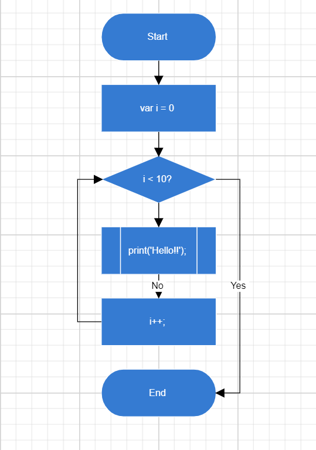

# Getting Started in Blazor Diagram Component

This section briefly explains about how to include a Diagram in your Blazor WebAssembly application. You can refer [Getting Started with Syncfusion Blazor for Blazor WebAssembly in Visual Studio 2019](https://blazor.syncfusion.com/documentation/getting-started/blazor-webassembly-visual-studio-2019/) page for the introduction and configuring the common specifications.

## Importing Syncfusion Blazor component in the application

 1. Install **Syncfusion.Blazor.Diagram** NuGet package to the application by using the **NuGet Package Manager**.
 2. You can add the  style resources through CDN or from NuGet package in the **HEAD** element of the **~/wwwroot/index.cshtml** page.

```html
<head>
    ....
    ....
     <link href="_content/Syncfusion.Blazor/styles/bootstrap4.css" rel="stylesheet" />
</head>
```

> For Internet Explorer 11 kindly refer the polyfills. Refer the [documentation](https://blazor.syncfusion.com/documentation/common/how-to/render-blazor-server-app-in-ie/#blazor-webassembly-app/) for more information.

```html
<head>
    <environment include="Development">
        <link href="_content/Syncfusion.Blazor.Themes/bootstrap4.css" rel="stylesheet" />
        <script src="https://github.com/Daddoon/Blazor.Polyfill/releases/download/3.0.1/blazor.polyfill.min.js"></script>
    </environment>
</head>
```

## Adding component package to the application

Open **~/_Imports.Blazor** file and import the **Syncfusion.Blazor.Diagram** packages.

```csharp
@using Syncfusion.Blazor
@using Syncfusion.Blazor.Diagram
```

## Add SyncfusionBlazor service in Startup.cs

Open the **Startup.cs** file and add services required by Syncfusion components using  **services.AddSyncfusionBlazor()** method. Add this method in the **ConfigureServices** function as follows.

```csharp
@using Syncfusion.Blazor;

namespace BlazorApplication
{
    public class Startup
    {
        ....
        ....
        public void ConfigureServices(IServiceCollection services)
        {
            ....
            ....
            services.AddSyncfusionBlazor();
        }
    }
}
```

## Adding Diagram component to the Application

Diagram component can be rendered by using the `SfDiagramComponent` tag helper in ASP.NET Core Blazor application. Add the Diagram component in any web page `razor` in the `Pages` folder. For example, the Diagram component is added in the `~/Pages/Index.razor` page.

The following example shows a basic Diagram component.

```csharp
<SfDiagramComponent Width="100%" Height="600px">
</SfDiagramComponent>

```

## Adding Nodes and Connectors

Let us create and add a `Nodes` with specific position, size, label and shape. Connect two or more nodes by using a
`Connectors`.

```csharp
@using Syncfusion.Blazor.Diagram
<SfDiagramComponent @ref="@diagram" Connectors="@connectors" Height="700px" Nodes="@nodes">
                </SfDiagramComponent>
@code{

    SfDiagramComponent diagram;
    int connectorCount = 0;
    DiagramObjectCollection<Node> nodes = new DiagramObjectCollection<Node>();

    //Defines Diagram's connectors collection
    DiagramObjectCollection<Connector> connectors = new DiagramObjectCollection<Connector>();
    protected override void OnInitialized()
    {
        InitDiagramModel();
    }
    private void InitDiagramModel()
    {
        CreateNode("Start", 300, 50, FlowShapes.Terminator, "Start");
        CreateNode("Init", 300, 140, FlowShapes.Process, "var i = 0");
        CreateNode("Condition", 300, 230, FlowShapes.Decision, "i < 10?");
        CreateNode("Print", 300, 320, FlowShapes.PreDefinedProcess, "print(\'Hello!!\');");
        CreateNode("Increment", 300, 410, FlowShapes.Process, "i++;");
        CreateNode("End", 300, 500, FlowShapes.Terminator, "End");
        OrthogonalSegment segment1 = new OrthogonalSegment()
        {
            Type = Segments.Orthogonal,
            Direction = Direction.Right,
            Length = 30,
        };
        OrthogonalSegment segment2 = new OrthogonalSegment()
        {
            Type = Segments.Orthogonal,
            Length = 300,
            Direction = Direction.Bottom,
        };
        OrthogonalSegment segment3 = new OrthogonalSegment()
        {
            Type = Segments.Orthogonal,
            Length = 30,
            Direction = Direction.Left,
        };
        OrthogonalSegment segment4 = new OrthogonalSegment()
        {
            Type = Segments.Orthogonal,
            Length = 200,
            Direction = Direction.Top,
        };
        CreateConnector("Start", "Init");
        CreateConnector("Init", "Condition");
        CreateConnector("Condition", "Print");
        CreateConnector("Condition", "End", "Yes", segment1, segment2);
        CreateConnector("Print", "Increment", "No");
        CreateConnector("Increment", "Condition", null, segment3, segment4);
     }


    private void CreateConnector(string sourceId, string targetId, string label = default(string), OrthogonalSegment segment1 = null, OrthogonalSegment segment2 = null)
    {
        Connector diagramConnector = new Connector()
        {
            ID = string.Format("connector{0}", ++connectorCount),
            SourceID = sourceId,
            TargetID = targetId,

        };
        if (label != default(string))
        {
            var annotation = new PathAnnotation()
            {
                Content = label,

                Style = new TextShapeStyle() { Fill = "white" }
            };
            diagramConnector.Annotations = new DiagramObjectCollection<PathAnnotation>() { annotation };
        }
        if (segment1 != null)
        {
            diagramConnector.Type = Segments.Orthogonal;
            diagramConnector.Segments = new DiagramObjectCollection<ConnectorSegment> { segment1, segment2 };
        }

        connectors.Add(diagramConnector);
    }
    private void CreateNode(string id, double x, double y, FlowShapes shape, string label)
    {

        Node diagramNode = new Node()
        {
            ID = id,
            OffsetX = x,
            OffsetY = y,
            Width = 145,
            Height = 60,
            Style = new ShapeStyle { Fill = "#357BD2", StrokeColor = "White" },

            Shape = new FlowShape() { Type = Shapes.Flow, Shape = shape },
            Annotations = new DiagramObjectCollection<ShapeAnnotation>
        {
                    new ShapeAnnotation
                    {
                        Content = label,
                        Style = new TextShapeStyle()
                        {
                          Color="White",

                           Fill = "transparent"
                        }
                    }
                }
        };

        nodes.Add(diagramNode);
    }
}

```



## See Also

* [Getting Started with Syncfusion Blazor for Client-Side in .NET Core CLI](https://blazor.syncfusion.com/documentation/getting-started/blazor-webassembly-dotnet-cli/)
* [Getting Started with Syncfusion Blazor for Server-Side in Visual Studio 2019 Preview](https://blazor.syncfusion.com/documentation/getting-started/blazor-server-side-visual-studio-2019/)
* [Getting Started with Syncfusion Blazor for Server-Side in .NET Core CLI](https://blazor.syncfusion.com/documentation/getting-started/blazor-server-side-dotnet-cli/)