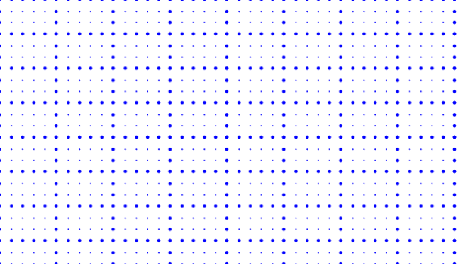

# Gridlines

Gridlines are the pattern of lines drawn behind the diagram elements. It provides a visual guidance while dragging or arranging the objects on the diagram surface.

The `SnapSettings` property is used to customize the gridlines and control the snapping behavior in the diagram.

## Customize the Gridlines visibility

The `SnapConstraints` enables you to show/hide the gridlines. The following code example illustrates how to show or hide gridlines.

```csharp
@using Syncfusion.Blazor.Diagram

<SfDiagramComponent Height="600px" Nodes="@nodes">
@* Initialize the diagram snapping the custom interval *@
<SnapSettings Constraints="SnapConstraints.All">
    <HorizontalGridLines SnapIntervals="@SnapInterval">
    </HorizontalGridLines>
    <VerticalGridLines SnapIntervals="@SnapInterval">
    </VerticalGridLines>
</SnapSettings>
</SfDiagramComponent>

@code{
//Sets the snapinterval...
public double[] SnapInterval { get; set; } = new double[]
{
    10
    };
DiagramObjectCollection<Node> nodes = new DiagramObjectCollection<Node>();
protected override void OnInitialized()
{
    nodes = new DiagramObjectCollection<Node>();
    Node diagramNode = new Node();
    diagramNode.OffsetX = 100;
    diagramNode.OffsetY = 100;
    diagramNode.Width = 100;
    diagramNode.Height = 100;
    diagramNode.Style = new ShapeStyle() { Fill = "#6495ED", StrokeColor = "#6495ED" };
    diagramNode.ID = "node1";
    nodes.Add(diagramNode);
}
}
```


To show only horizontal/vertical gridlines or to hide gridlines, refer to [Constraints](./constraints).

## Appearance

The appearance of the gridlines can be customized by using a set of predefined properties.

* The `HorizontalGridLines` and the `VerticalGridLines` properties allow to customize the appearance of the horizontal and vertical gridlines respectively.

* The horizontal gridlines `LineColor` and `LineDashArray` properties are used to customizes the line color and line style of the horizontal gridlines.

* The vertical gridlines `LineColor` and `LineDashArray` properties are used to customizes the line color and line style of the vertical gridlines.

The following code example illustrates how to customize the appearance of gridlines.

```csharp
@using Syncfusion.Blazor.Diagram

<SfDiagramComponent Height="600px">
@* Shows both horizontal and vertical gridlines *@
<SnapSettings Constraints="SnapConstraints.ShowLines">
    @* Customizes the line color and line style to the gridlines *@
    <HorizontalGridLines LineColor="blue" LineDashArray="2,2">
    </HorizontalGridLines>
    <VerticalGridLines LineColor="blue" LineDashArray="2,2">
    </VerticalGridLines>
</SnapSettings>
</SfDiagramComponent>
```

## How to create dot grid patterns

The appearance of the grid lines can be changed into dots by using the `GridType` as Dots. The following code illustrates how to render grid patterns as Dots.

```csharp
@using Syncfusion.Blazor.Diagram

<SfDiagramComponent Width="1000px" Height="500px">
    <SnapSettings GridType="GridType.Dots">
        <HorizontalGridLines LineColor="Blue" @bind-LineIntervals="@HInterval" @bind-DotIntervals="@HDotInterval"></HorizontalGridLines>
        <VerticalGridLines LineColor="Blue" @bind-LineIntervals="@VInterval" @bind-DotIntervals="@VDotInterval"></VerticalGridLines>
    </SnapSettings>
</SfDiagramComponent>

@code{
    public double[] HDotInterval { get; set; } = new double[] { 3, 20, 1, 20, 1, 20 };
    public double[] VDotInterval { get; set; } = new double[] { 3, 20, 1, 20, 1, 20, 1, 20, 1, 20 };
    public double[] HInterval { get; set; } = new double[] { 1.25, 18.75, 0.25, 19.75, 0.25, 19.75, 0.25, 19.75, 0.25, 19.75 };
    public double[] VInterval { get; set; } = new double[] { 1.25, 18.75, 0.25, 19.75, 0.25, 19.75, 0.25, 19.75, 0.25, 19.75 };
}

```



## Line intervals

Thickness and the space between gridlines can be customized by using horizontal gridline’s `LinesIntervals` and vertical gridline’s `LinesIntervals` properties. In the line intervals collections, values at the odd places are referred as the thickness of lines and values at the even places are referred as the space between gridlines.

The following code example illustrates how to customize the thickness of lines and the line intervals.

```csharp
@using Syncfusion.Blazor.Diagram

<SfDiagramComponent Height="600px">
@* Customize the appearance of the grid lines *@
<SnapSettings Constraints="SnapConstraints.ShowLines">
    <HorizontalGridLines LineColor="blue" LineDashArray="2,2" LineIntervals="@LineInterval">
    </HorizontalGridLines>
    <VerticalGridLines LineColor="blue" LineDashArray="2,2" LineIntervals="@LineInterval">
    </VerticalGridLines>
</SnapSettings>
</SfDiagramComponent>

@code{
//Sets the line intervals for the gridlines
public double[] LineInterval { get; set; } = new double[] {
            1.25, 14, 0.25, 15, 0.25, 15, 0.25, 15, 0.25, 15
            };
}
```


## Snapping

### Snap to lines

This feature allows the diagram objects to snap to the nearest intersection of gridlines while being dragged or resized. This feature enables easier alignment during layout or design.

Snapping to gridlines can be enabled/disabled with the `SnapConstraints`. The following code example illustrates how to enable/disable the snapping to gridlines.

```csharp
@using Syncfusion.Blazor.Diagram

<SfDiagramComponent Height="600px" Nodes="@nodes">
<SnapSettings Constraints="@snapConstraints"></SnapSettings>
</SfDiagramComponent>

@code{
//Sets the snap constraints
public SnapConstraints snapConstraints = SnapConstraints.ShowLines | SnapConstraints.SnapToLines;
DiagramObjectCollection<Node> nodes = new DiagramObjectCollection<Node>();
protected override void OnInitialized()
{
    nodes = new DiagramObjectCollection<Node>();
    Node diagramNode = new Node();
    diagramNode.OffsetX = 100;
    diagramNode.OffsetY = 100;
    diagramNode.Width = 100;
    diagramNode.Height = 100;
    diagramNode.Style = new ShapeStyle() { Fill = "#6495ED", StrokeColor = "#6495ED" };
    diagramNode.ID = "node1";
    nodes.Add(diagramNode);
}
}
```


### Customization of snap intervals

By default, the objects are snapped towards the nearest gridline. The gridline or position towards where the diagram object snaps can be customized with the horizontal gridline’s `SnapIntervals` and the vertical gridline’s `SnapIntervals` properties.

```csharp
@using Syncfusion.Blazor.Diagram

<SfDiagramComponent Height="600px" Nodes="@nodes">
@* Initialize the diagram snapping the custom interval *@
<SnapSettings Constraints="SnapConstraints.All">
    <HorizontalGridLines SnapIntervals="@SnapInterval">
    </HorizontalGridLines>
    <VerticalGridLines SnapIntervals="@SnapInterval">
    </VerticalGridLines>
</SnapSettings>
</SfDiagramComponent>

@code{
//Sets the snapinterval...
public double[] SnapInterval { get; set; } = new double[]
{
    10
    };
DiagramObjectCollection<Node> nodes = new DiagramObjectCollection<Node>();
protected override void OnInitialized()
{
    nodes = new DiagramObjectCollection<Node>();
    Node diagramNode = new Node();
    diagramNode.OffsetX = 100;
    diagramNode.OffsetY = 100;
    diagramNode.Width = 100;
    diagramNode.Height = 100;
    diagramNode.Style = new ShapeStyle() { Fill = "#6495ED", StrokeColor = "#6495ED" };
    diagramNode.ID = "node1";
    nodes.Add(diagramNode);
}
}
```

### Snap to objects

The snap to object provides visual cues to assist with aligning and spacing diagram elements. A node can be snapped with its neighboring objects based on certain alignments. Such alignments are visually represented as smart guides.

The `SnapObjectDistance` property allows you to define minimum distance between the selected object and the nearest object.

The `SnapAngle` property allows you to define the snap angle by which the object needs to be rotated.

The `SnapConstraints` property allows you to enable or disable the certain features of the snapping, refer to `SnapConstraints`.

```csharp
@using Syncfusion.Blazor.Diagram

<SfDiagramComponent Height="600px" Nodes="@nodes">
<SnapSettings Constraints="@snapConstraints" SnapAngle="10" SnapObjectDistance="10">
</SnapSettings>
</SfDiagramComponent>

@code{
//Sets the Snap to objects constraints...
public SnapConstraints snapConstraints = SnapConstraints.ShowLines | SnapConstraints.SnapToObject;
DiagramObjectCollection<Node> nodes = new DiagramObjectCollection<Node>();

protected override void OnInitialized()
{
    nodes = new DiagramObjectCollection<Node>();
    Node diagramNode = new Node();
    diagramNode.OffsetX = 100;
    diagramNode.OffsetY = 100;
    diagramNode.Width = 100;
    diagramNode.Height = 100;
    diagramNode.Style = new ShapeStyle() { Fill = "#6495ED", StrokeColor = "#6495ED" };
    diagramNode.ID = "node1";
    nodes.Add(diagramNode);

    diagramNode = new Node();
    diagramNode.OffsetX = 300;
    diagramNode.OffsetY = 100;
    diagramNode.Width = 100;
    diagramNode.Height = 100;
    diagramNode.Style = new ShapeStyle() { Fill = "#6495ED", StrokeColor = "#6495ED" };
    diagramNode.ID = "node2";
    nodes.Add(diagramNode);
}
}

```

