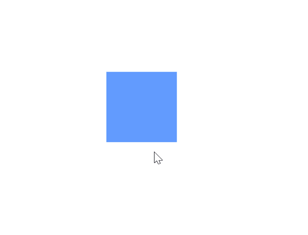
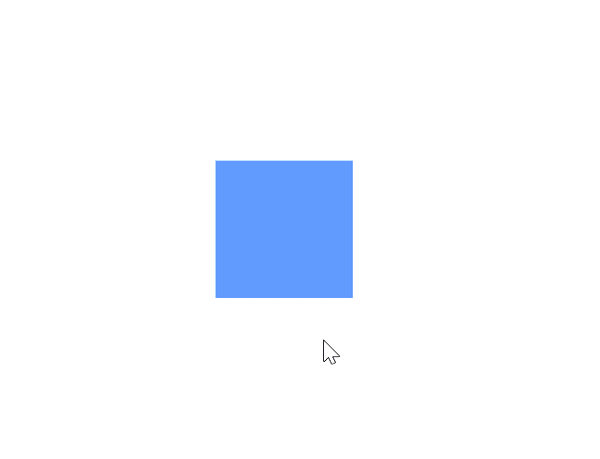
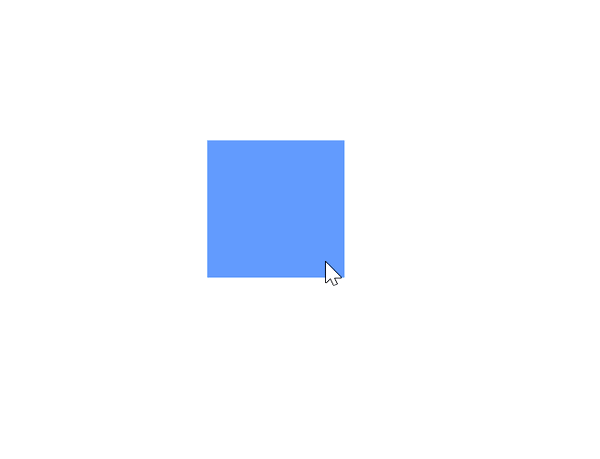

# Interaction

Diagram provides the support to drag, resize, or rotate the node interactively.

## Select

A node can be select at runtime by using the `Select` method and clear the selection in the diagram using the `ClearSelection`. The following code explains how to select and clear selection in the diagram.

```csharp
@using Syncfusion.Blazor.Diagram
@using System.Collections.ObjectModel

<input type="button" value="Select" @onclick="OnSelect">
<input type="button" value="UnSelect" @onclick="@UnSelect" />
<SfDiagramComponent @ref="@diagram" Height="600px" Nodes="@nodes">
</SfDiagramComponent>

@code {
    // reference of the diagram
    SfDiagramComponent diagram;

    // To define node collection
    DiagramObjectCollection<Node> nodes = new DiagramObjectCollection<Node>();
    protected override void OnInitialized()
    {
        // A node is created and stored in nodes collection.
        Node node = new Node()
        {
            // Position of the node
            OffsetX = 250,
            OffsetY = 250,
            // Size of the node
            Width = 100,
            Height = 100,
            Style = new ShapeStyle() { Fill = "#6495ED", StrokeColor = "white" }
        };
        // Add node
        nodes.Add(node);
    }
    public void OnSelect()
    {
        // Select the node
        diagram.Select(new ObservableCollection<IDiagramObject> { Diagram.Nodes[0] });
    }
    public void UnSelect()
    {
        // clear selection in the diagram
        diagram.ClearSelection();
    }
}
```

And also the selection enable during the interaction.

* An element can be selected by clicking that element.
* When you select the elements in the diagram, the `SelectionChange` event gets triggered and to do customization in this event.



## Drag

A node can be drag at runtime by using the `Drag` method. The following code explains how to drag the node by using the drag method.

```csharp
@using Syncfusion.Blazor.Diagram

<input type="button" value="Drag" @onclick="OnDrag">
<SfDiagramComponent @ref="@diagram" Height="600px" Nodes="@nodes">
</SfDiagramComponent>

@code {
    // reference of the diagram
    SfDiagramComponent diagram;
    // To define node collection
    DiagramObjectCollection<Node> nodes = new DiagramObjectCollection<Node>();
    protected override void OnInitialized()
    {
        // A node is created and stored in nodes collection.
        Node node = new Node()
        {
            // Position of the node
            OffsetX = 250, OffsetY = 250,
            // Size of the node
            Width = 100, Height = 100,
            Style = new ShapeStyle() { Fill = "#6495ED", StrokeColor = "white" }
        };
        // Add node
        nodes.Add(node);
    }
    public void OnDrag()
    {
        // Drag the node
        diagram.Drag(Diagram.Nodes[0], 10, 10);
    }
}
```

And also the drag the node during the interaction.

* An object can be dragged by clicking and dragging it. When multiple elements are selected, dragging any one of the selected elements move all the selected elements.
* When you drag the elements in the diagram, the `PositionChange` event gets triggered and to do customization in this event.


## Resize

A node can be resize at runtime by using the `Scale` method. The following code explains how to resize the node by using the scale method.

```csharp
@using Syncfusion.Blazor.Diagram

<input type="button" value="Resize" @onclick="OnResize">
<SfDiagramComponent @ref="@diagram" Height="600px" Nodes="@nodes">
</SfDiagramComponent>

@code {
    // reference of the diagram
    SfDiagramComponent diagram;
    // To define node collection
    DiagramObjectCollection<Node> nodes = new DiagramObjectCollection<Node>();
    protected override void OnInitialized()
    {
        // A node is created and stored in nodes collection.
        Node node = new Node()
        {
            // Position of the node
            OffsetX = 250, OffsetY = 250,
            // Size of the node
            Width = 100, Height = 100,
            Style = new ShapeStyle() { Fill = "#6495ED", StrokeColor = "white" }
        };
        // Add node
        nodes.Add(node);
    }
    public void OnResize()
    {
        // Resize the node
        diagram.Scale(Diagram.Nodes[0], 0.5, 0.5, new Point() { X = 0, Y = 0 } );
    }
}
```

And also you can resize the node during interaction.

* Selector is surrounded by eight thumbs. When dragging these thumbs, the selected items can be resized.
* When one corner of the selector is dragged, the opposite corner will be in a static position.
* When a node is resized, the `SizeChange` event gets triggered.



>  While dragging and resizing, the objects are snapped towards the nearest objects to make better alignments. For better alignments, refer to `Snapping`.

## Rotate

A node can be rotate at runtime by using the `Rotate` method. The following code explains how to rotate the node by using method.

```csharp
@using Syncfusion.Blazor.Diagram

<input type="button" value="Rotate" @onclick="OnRotate">
<SfDiagramComponent @ref="@diagram" Height="600px" Nodes="@nodes">
</SfDiagramComponent>

@code {
    // reference of the diagram
    SfDiagramComponent diagram;

    // To define node collection
    DiagramObjectCollection<Node> nodes = new DiagramObjectCollection<Node>();
    protected override void OnInitialized()
    {
        // A node is created and stored in nodes collection.
        Node node = new Node()
        {
            // Position of the node
            OffsetX = 250, OffsetY = 250,
            // Size of the node
            Width = 100, Height = 100,
            Style = new ShapeStyle() { Fill = "#6495ED", StrokeColor = "white" }
        };
        // Add node
        nodes.Add(node);
    }
    public void OnRotate()
    {
        // Rotate the node
        diagram.Rotate(Diagram.Nodes[0], Diagram.Nodes[0].RotateAngle+10);
    }
}
```

And also the rotate the node during the interaction.

* A rotate handler is placed above the selector. Clicking and dragging the handler in a circular direction lead to rotate the node.
* The node is rotated with reference to the static pivot point.
* Pivot thumb (thumb at the middle of the node) appears when rotating the node to represent the static point.



For more information about node interaction, refer to [`Node Interaction`](../interaction).

## See also

* [`How to get events while the interact the node`](./events)

* [`How to positioning the node`](./positioning)

* [`How to customize the node`](./appearance)

* [`How to interact the annotation in diagram`](../annotations/interaction)

* [`How to interact the port in diagram`](../ports/interaction)

* [`How to interact the connector in diagram`](../connectors/interactions)
