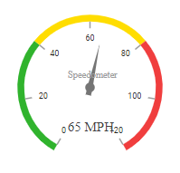
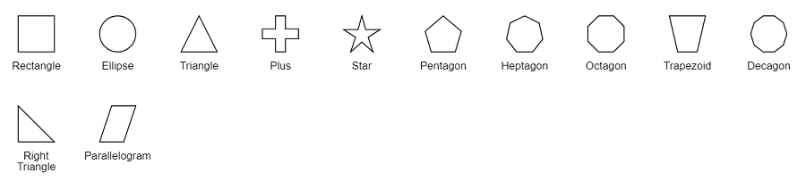
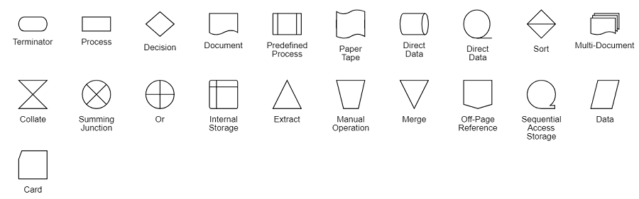

# Shapes in Blazor Diagram Component

Diagram provides support to add different kind of nodes. They are as follows:

* Image node
* HTML node
* Path node
* Basic shapes
* Flow shapes
* Native node

## Image

Diagram allows to add images as `Image` nodes. The shape property of node allows you to set the type of node and for image nodes, it should be set as **image**. In addition, the source property of shape enables you to set the image source.

The following code illustrates how an image node is created.

```cshtml
@using Syncfusion.Blazor.Diagram

@* Initialize Diagram *@
<SfDiagramComponent Height="600px" Nodes="@NodeCollection" />

@code{
    SfDiagramComponent diagram;
    DiagramObjectCollection<Node> NodeCollection = new DiagramObjectCollection<Node>()
    {
        new Node()
        {
             ID="node1",
             //Size of the node
             Height=100,
             Width=100,
             //Position of the node
             OffsetX=100,
             OffsetY=100,
             Shape= new Image(){Type=Shapes.Image,Source="/diagram/images/syncfusion.png"}
        }
    };
}
```


### Base64 encoded image into the image node

The following code illustrates how add Base64 image into image node.

```cshtml
@using Syncfusion.Blazor.Diagram

@* Initialize Diagram *@
<SfDiagramComponent Height="600px" Nodes="@NodeCollection" />

@code{
    //Initialize node collection with node
    DiagramObjectCollection<Node> NodeCollection = new DiagramObjectCollection<Node>()
{
     //Creates a image node
     new Node()
     {
         ID="node1",
         //Size of the node
         Height=100,
         Width=100,
         //Position of the node
         OffsetX=100,
         OffsetY=100,
         //Sets type of the shape as image
         Shape=new Image(){Type=Shapes.Image,Source="data:image/gif;base64,R0lGODlhPQBEAPeoAJosM//AwO/AwHVYZ/z595kzAP/s7P+goOXMv8+fhw/v739/f+8PD98fH/8mJl+fn/9ZWb8/PzWlwv///6wWGbImAPgTEMImIN9gUFCEm/gDALULDN8PAD6atYdCTX9gUNKlj8wZAKUsAOzZz+UMAOsJAP/Z2ccMDA8PD/95eX5NWvsJCOVNQPtfX/8zM8+QePLl38MGBr8JCP+zs9myn/8GBqwpAP/GxgwJCPny78lzYLgjAJ8vAP9fX/+MjMUcAN8zM/9wcM8ZGcATEL+QePdZWf/29uc/P9cmJu9MTDImIN+/r7+/vz8/P8VNQGNugV8AAF9fX8swMNgTAFlDOICAgPNSUnNWSMQ5MBAQEJE3QPIGAM9AQMqGcG9vb6MhJsEdGM8vLx8fH98AANIWAMuQeL8fABkTEPPQ0OM5OSYdGFl5jo+Pj/+pqcsTE78wMFNGQLYmID4dGPvd3UBAQJmTkP+8vH9QUK+vr8ZWSHpzcJMmILdwcLOGcHRQUHxwcK9PT9DQ0O/v70w5MLypoG8wKOuwsP/g4P/Q0IcwKEswKMl8aJ9fX2xjdOtGRs/Pz+Dg4GImIP8gIH0sKEAwKKmTiKZ8aB/f39Wsl+LFt8dgUE9PT5x5aHBwcP+AgP+WltdgYMyZfyywz78AAAAAAAD///8AAP9mZv///wAAAAAAAAAAAAAAAAAAAAAAAAAAAAAAAAAAAAAAAAAAAAAAAAAAAAAAAAAAAAAAAAAAAAAAAAAAAAAAAAAAAAAAAAAAAAAAAAAAAAAAAAAAAAAAAAAAAAAAAAAAAAAAAAAAAAAAAAAAAAAAAAAAAAAAAAAAAAAAAAAAAAAAAAAAAAAAAAAAAAAAAAAAAAAAAAAAAAAAAAAAAAAAAAAAAAAAAAAAAAAAAAAAAAAAAAAAAAAAAAAAAAAAAAAAAAAAAAAAAAAAAAAAAAAAAAAAAAAAAAAAAAAAAAAAAAAAAAAAAAAAAAAAAAAAAAAAAAAAAAAAAAAAAAAAAAAAAAAAAAAAAAAAACH5BAEAAKgALAAAAAA9AEQAAAj/AFEJHEiwoMGDCBMqXMiwocAbBww4nEhxoYkUpzJGrMixogkfGUNqlNixJEIDB0SqHGmyJSojM1bKZOmyop0gM3Oe2liTISKMOoPy7GnwY9CjIYcSRYm0aVKSLmE6nfq05QycVLPuhDrxBlCtYJUqNAq2bNWEBj6ZXRuyxZyDRtqwnXvkhACDV+euTeJm1Ki7A73qNWtFiF+/gA95Gly2CJLDhwEHMOUAAuOpLYDEgBxZ4GRTlC1fDnpkM+fOqD6DDj1aZpITp0dtGCDhr+fVuCu3zlg49ijaokTZTo27uG7Gjn2P+hI8+PDPERoUB318bWbfAJ5sUNFcuGRTYUqV/3ogfXp1rWlMc6awJjiAAd2fm4ogXjz56aypOoIde4OE5u/F9x199dlXnnGiHZWEYbGpsAEA3QXYnHwEFliKAgswgJ8LPeiUXGwedCAKABACCN+EA1pYIIYaFlcDhytd51sGAJbo3onOpajiihlO92KHGaUXGwWjUBChjSPiWJuOO/LYIm4v1tXfE6J4gCSJEZ7YgRYUNrkji9P55sF/ogxw5ZkSqIDaZBV6aSGYq/lGZplndkckZ98xoICbTcIJGQAZcNmdmUc210hs35nCyJ58fgmIKX5RQGOZowxaZwYA+JaoKQwswGijBV4C6SiTUmpphMspJx9unX4KaimjDv9aaXOEBteBqmuuxgEHoLX6Kqx+yXqqBANsgCtit4FWQAEkrNbpq7HSOmtwag5w57GrmlJBASEU18ADjUYb3ADTinIttsgSB1oJFfA63bduimuqKB1keqwUhoCSK374wbujvOSu4QG6UvxBRydcpKsav++Ca6G8A6Pr1x2kVMyHwsVxUALDq/krnrhPSOzXG1lUTIoffqGR7Goi2MAxbv6O2kEG56I7CSlRsEFKFVyovDJoIRTg7sugNRDGqCJzJgcKE0ywc0ELm6KBCCJo8DIPFeCWNGcyqNFE06ToAfV0HBRgxsvLThHn1oddQMrXj5DyAQgjEHSAJMWZwS3HPxT/QMbabI/iBCliMLEJKX2EEkomBAUCxRi42VDADxyTYDVogV+wSChqmKxEKCDAYFDFj4OmwbY7bDGdBhtrnTQYOigeChUmc1K3QTnAUfEgGFgAWt88hKA6aCRIXhxnQ1yg3BCayK44EWdkUQcBByEQChFXfCB776aQsG0BIlQgQgE8qO26X1h8cEUep8ngRBnOy74E9QgRgEAC8SvOfQkh7FDBDmS43PmGoIiKUUEGkMEC/PJHgxw0xH74yx/3XnaYRJgMB8obxQW6kL9QYEJ0FIFgByfIL7/IQAlvQwEpnAC7DtLNJCKUoO/w45c44GwCXiAFB/OXAATQryUxdN4LfFiwgjCNYg+kYMIEFkCKDs6PKAIJouyGWMS1FSKJOMRB/BoIxYJIUXFUxNwoIkEKPAgCBZSQHQ1A2EWDfDEUVLyADj5AChSIQW6gu10bE/JG2VnCZGfo4R4d0sdQoBAHhPjhIB94v/wRoRKQWGRHgrhGSQJxCS+0pCZbEhAAOw=="}
     }
};
}
```


> Deploy your HTML file in the web application and export the diagram (image node) or else the image node will not be exported in the Chrome and Firefox due to security issues. Refer to the following link.

Link 1: [`http://asked.online/draw-images-on-canvas-locally-using-chrome/2546077/`](http://asked.online/draw-images-on-canvas-locally-using-chrome/2546077/)

Link 2: [`http://stackoverflow.com/questions/4761711/local-image-in-canvas-in-chrome`](http://stackoverflow.com/questions/4761711/local-image-in-canvas-in-chrome)

### Image alignment

Stretch and align the image content anywhere but within the node boundary.

The scale property of the node allows to stretch the image as you desired (either to maintain proportion or to stretch). By default, the `Scale` property of the node is set as Meet. The following code illustrates how to scale or stretch the content of the image node.

```csharp

@using Syncfusion.Blazor.Diagram

@* Initialize Diagram *@
<SfDiagramComponent Height="600px" Nodes="@NodeCollection">
    <SnapSettings Constraints="SnapConstraints.None"></SnapSettings>
</SfDiagramComponent>
@code{
    SfDiagramComponent diagram;
    DiagramObjectCollection<Node> NodeCollection = new DiagramObjectCollection<Node>()
    {
        new Node()
        {
             ID="node1",
             //Size of the node
             Height=100,
             Width=100,
             //Position of the node
             OffsetX=100,
             OffsetY=100,
             Shape=new Image(){Type=Shapes.Image,Source="/diagram/images/productmanager.png",Scale=Scale.Meet}
        }
    };
}
```

## HTML

Html elements can be embedded in the diagram through `Html` type node. The shape property of node allows you to set the type of node and to create a HTML node it should be set as `HTML`. The following code illustrates how an Html node is created.

```cshtml
@using Syncfusion.Blazor.Diagram

@* Add a Namespace for a syncfusion control used in Diagrm HTML node *@
@using Syncfusion.Blazor.CircularGauge

@* Initialize Diagram with node template *@
<SfDiagramComponent Height="600px" Nodes="@NodeCollection">
    <DiagramTemplates>
        <NodeTemplate>
            @{
                  <SfCircularGauge Width="300px" Height="300px">
                    <CircularGaugeAxes>
                        <CircularGaugeAxis StartAngle="210" EndAngle="150" Minimum="0" Maximum="120" Radius="80%">
                            <CircularGaugeAxisLineStyle Width="10" Color="transparent">
                            </CircularGaugeAxisLineStyle>
                            <CircularGaugeAxisLabelStyle UseRangeColor="false">
                                <CircularGaugeAxisLabelFont Size="12px" FontFamily="Roboto" FontStyle="Regular">
                                </CircularGaugeAxisLabelFont>
                            </CircularGaugeAxisLabelStyle>
                            <CircularGaugeAxisMajorTicks Height="10" Offset="5" UseRangeColor="false">
                            </CircularGaugeAxisMajorTicks>
                            <CircularGaugeAxisMinorTicks Height="0" Width="0" UseRangeColor="false">
                            </CircularGaugeAxisMinorTicks>
                            <CircularGaugeAnnotations>
                                <CircularGaugeAnnotation Radius="30%" Angle="0" ZIndex="1" Content="Speedometer">
                                    <ContentTemplate>
                                        <div><span style="font-size:14px; color:#9E9E9E; font-family:Regular; margin-left: -33px">Speedometer</span></div>
                                    </ContentTemplate>
                                </CircularGaugeAnnotation>
                                <CircularGaugeAnnotation Radius="40%" Angle="180" ZIndex="1" Content="65 MPH">
                                    <ContentTemplate>
                                        <div><span style="font-size:20px; color:#424242; font-family:Regular; margin-left: -33px">65 MPH</span></div>
                                    </ContentTemplate>
                                </CircularGaugeAnnotation>
                            </CircularGaugeAnnotations>
                            <CircularGaugeRanges>
                                <CircularGaugeRange Start="0" End="40" Color="#30B32D" StartWidth="10" EndWidth="10" RoundedCornerRadius="0">
                                </CircularGaugeRange>
                                <CircularGaugeRange Start="40" End="80" Color="#FFDD00" StartWidth="10" EndWidth="10" RoundedCornerRadius="0">
                                </CircularGaugeRange>
                                <CircularGaugeRange Start="80" End="120" Color="#F03E3E" StartWidth="10" EndWidth="10" RoundedCornerRadius="0">
                                </CircularGaugeRange>
                            </CircularGaugeRanges>
                            <CircularGaugePointers>
                                <CircularGaugePointer Value="65" Radius="60%" PointerWidth="8">
                                    <CircularGaugePointerAnimation Enable="true"></CircularGaugePointerAnimation>
                                    <CircularGaugeCap Radius="7">
                                    </CircularGaugeCap>
                                    <CircularGaugeNeedleTail Length="18%">
                                    </CircularGaugeNeedleTail>
                                </CircularGaugePointer>
                            </CircularGaugePointers>
                        </CircularGaugeAxis>
                    </CircularGaugeAxes>
                </SfCircularGauge>
            }
        </NodeTemplate>
    </DiagramTemplates>
</SfDiagramComponent>

@code{
    //Initialize node collection with node
    DiagramObjectCollection<Node> NodeCollection = new DiagramObjectCollection<Node>()
    {
         //Creates an HTML node
         new Node()
          {
             ID="node1",
             //Size of the node
             Height=300,
             Width=300,
             //Position of the node
             OffsetX=400,
             OffsetY=100,
             //sets the type of the shape as HTML
             Shape=new Shape()
             {
                 Type=Shapes.HTML,
             }
          }
        };
}
```



>* Note: HTML node cannot be exported to image format, like JPEG, PNG and BMP. It is by design, while exporting the diagram is drawn in a canvas. Further, this canvas is exported into image formats. Currently, drawing in a canvas equivalent from all possible HTML is not feasible. Hence, this limitation. Also , HTML node always appears as topmost layer ( whose index is the higher index, even though it is defined at the last).

## Basic shapes

* The `Basic` shapes are common shapes that are used to represent the geometrical information visually. To create basic shapes, the type of the shape should be set as **basic**. Its shape property can be set with any one of the built-in shapes.

* To render a rounded rectangle, you need to set the type as basic and shape as rectangle. Set the `CornerRadius` property to specify the radius of rounded rectangle.

The following code example illustrates how to create a basic shape.

```cshtml
@using Syncfusion.Blazor.Diagram

@* Initialize Diagram *@
<SfDiagramComponent Height="600px" Nodes="@NodeCollection" />

@code{
    //Initialize node collection with node
    DiagramObjectCollection<Node> NodeCollection = new DiagramObjectCollection<Node>()
{
         //Creates a basic shape node
         new Node()
         {
             ID="node1",
             //Size of the node
             Height=100,
             Width=100,
             //Position of the node
             OffsetX=100,
             OffsetY=100,
             //sets the type of the shape as basic
             Shape=new BasicShape(){Type=Shapes.Basic,Shape=BasicShapes.Rectangle}
         }
    };
}
```

> By default, the `Shape` property of the node is set as **Basic**.

Default property for shape is Rectangle.

> When the `Shape` is not set for a basic shape, it is considered as a **Rectangle**.

The list of basic shapes are as follows.



## Path

The `Path` node is a commonly used basic shape that allows visually to represent the geometrical information. To create a path node, specify the shape as **Path**. The path property of node allows you to define the path to be drawn. The following code illustrates how a path node is created.

```cshtml
@using Syncfusion.Blazor.Diagram

@* Initialize Diagram *@
<SfDiagramComponent Height="600px" Nodes="@NodeCollection" />
@code{
    //Initialize node collection with node
    DiagramObjectCollection<Node> NodeCollection = new DiagramObjectCollection<Node>()
{
         // Creates a path node
         new Node()
         {
             ID="node1",
             //Size of the node
             Height=100,
             Width=100,
             //Position of the node
             OffsetX=100,
             OffsetY=100,
             //Sets the type of the shape as path
             Shape=new Path()
             {
                 Type=Shapes.Path,
                 Data="M35.2441,25 L22.7161,49.9937 L22.7161,0.00657536 L35.2441,25 z M22.7167,25 L-0.00131226,25 M35.2441,49.6337 L35.2441,0.368951 M35.2441,25 L49.9981,25"
             }
         }
    };
}
```

## Flow Shapes

The `Flow` shapes are used to represent the process flow. It is used for analyzing, designing and managing for documentation process. To create a flow shape, specify the shape type as **Flow**. Flow shapes and by default, it is considered as **Process**. The following code example illustrates how to create a flow shape.

```cshtml
@using Syncfusion.Blazor.Diagram

@* Initialize Diagram *@
<SfDiagramComponent Height="600px" Nodes="@NodeCollection" />
@code{
    //Initialize node collection with node
    DiagramObjectCollection<Node> NodeCollection = new DiagramObjectCollection<Node>()
{
         //Creates a flow shape node
         new Node()
         {
             ID="node1",
             //Size of the node
             Height=100,
             Width=100,
             //Position of the node
             OffsetX=100,
             OffsetY=100,
             //Sets the type of the shape as flow
             Shape=new FlowShape()
             {
                 Type=Shapes.Flow,
                 Shape=FlowShapes.DirectData
             }
         }
    };
}
```

The list of flow shapes are as follows.



## Native

Diagram provides support to embed SVG element into a node. The shape property of node allows you to set the type of node. To create a native node, it should be set as native. The following code illustrates how a native node is created.

```cshtml
@using Syncfusion.Blazor.Diagram

@* Initialize Diagram *@
<SfDiagramComponent Height="600px" Nodes="@NodeCollection">
    <SnapSettings Constraints="SnapConstraints.None"></SnapSettings>
    <DiagramTemplates>
        <NodeTemplate>
            @{
                if ((context as Node).Shape.Type == Shapes.Native)
                {
                    <g xmlns="http://www.w3.org/2000/svg">
                        <g transform="translate(1 1)">
                            <g>
                                <path style="fill:#61443C;" d="M61.979,435.057c2.645-0.512,5.291-0.853,7.936-1.109c-2.01,1.33-4.472,1.791-6.827,1.28     C62.726,435.13,62.354,435.072,61.979,435.057z" />
                                <path style="fill:#61443C;" d="M502.469,502.471h-25.6c0.163-30.757-20.173-57.861-49.749-66.304     c-5.784-1.581-11.753-2.385-17.749-2.389c-2.425-0.028-4.849,0.114-7.253,0.427c1.831-7.63,2.747-15.45,2.731-23.296     c0.377-47.729-34.52-88.418-81.749-95.317c4.274-0.545,8.577-0.83,12.885-0.853c25.285,0.211,49.448,10.466,67.167,28.504     c17.719,18.039,27.539,42.382,27.297,67.666c0.017,7.846-0.9,15.666-2.731,23.296c2.405-0.312,4.829-0.455,7.253-0.427     C472.572,434.123,502.783,464.869,502.469,502.471z" />
                            </g>
                            <path style="fill:#8B685A;" d="M476.869,502.471H7.536c-0.191-32.558,22.574-60.747,54.443-67.413    c0.375,0.015,0.747,0.072,1.109,0.171c2.355,0.511,4.817,0.05,6.827-1.28c1.707-0.085,3.413-0.171,5.12-0.171    c4.59,0,9.166,0.486,13.653,1.451c2.324,0.559,4.775,0.147,6.787-1.141c2.013-1.288,3.414-3.341,3.879-5.685    c7.68-39.706,39.605-70.228,79.616-76.117c4.325-0.616,8.687-0.929,13.056-0.939c13.281-0.016,26.409,2.837,38.485,8.363    c3.917,1.823,7.708,3.904,11.349,6.229c2.039,1.304,4.527,1.705,6.872,1.106c2.345-0.598,4.337-2.142,5.502-4.264    c14.373-25.502,39.733-42.923,68.693-47.189h0.171c47.229,6.899,82.127,47.588,81.749,95.317c0.017,7.846-0.9,15.666-2.731,23.296    c2.405-0.312,4.829-0.455,7.253-0.427c5.996,0.005,11.965,0.808,17.749,2.389C456.696,444.61,477.033,471.713,476.869,502.471    L476.869,502.471z" />
                            <path style="fill:#66993E;" d="M502.469,7.537c0,0-6.997,264.96-192.512,252.245c-20.217-1.549-40.166-5.59-59.392-12.032    c-1.365-0.341-2.731-0.853-4.096-1.28c0,0-0.597-2.219-1.451-6.144c-6.656-34.048-25.088-198.997,231.765-230.144    C485.061,9.159,493.595,8.22,502.469,7.537z" />
                            <path style="fill:#9ACA5C;" d="M476.784,10.183c-1.28,26.197-16.213,238.165-166.827,249.6    c-20.217-1.549-40.166-5.59-59.392-12.032c-1.365-0.341-2.731-0.853-4.096-1.28c0,0-0.597-2.219-1.451-6.144    C238.363,206.279,219.931,41.329,476.784,10.183z" />
                            <path style="fill:#66993E;" d="M206.192,246.727c-0.768,3.925-1.365,6.144-1.365,6.144c-1.365,0.427-2.731,0.939-4.096,1.28    c-21.505,7.427-44.293,10.417-66.987,8.789C21.104,252.103,8.816,94.236,7.621,71.452c-0.085-1.792-0.085-2.731-0.085-2.731    C222.747,86.129,211.653,216.689,206.192,246.727z" />
                            <path style="fill:#9ACA5C;" d="M180.336,246.727c-0.768,3.925-1.365,6.144-1.365,6.144c-1.365,0.427-2.731,0.939-4.096,1.28    c-13.351,4.412-27.142,7.359-41.131,8.789C21.104,252.103,8.816,94.236,7.621,71.452    C195.952,96.881,185.541,217.969,180.336,246.727z" />
                        </g>
                        <g>
                            <path d="M162.136,426.671c3.451-0.001,6.562-2.08,7.882-5.268s0.591-6.858-1.849-9.298l-8.533-8.533    c-3.341-3.281-8.701-3.256-12.012,0.054c-3.311,3.311-3.335,8.671-0.054,12.012l8.533,8.533    C157.701,425.773,159.872,426.673,162.136,426.671L162.136,426.671z" />
                            <path d="M292.636,398.57c3.341,3.281,8.701,3.256,12.012-0.054c3.311-3.311,3.335-8.671,0.054-12.012l-8.533-8.533    c-3.341-3.281-8.701-3.256-12.012,0.054s-3.335,8.671-0.054,12.012L292.636,398.57z" />
                            <path d="M296.169,454.771c-3.341-3.281-8.701-3.256-12.012,0.054c-3.311,3.311-3.335,8.671-0.054,12.012l8.533,8.533    c3.341,3.281,8.701,3.256,12.012-0.054c3.311-3.311,3.335-8.671,0.054-12.012L296.169,454.771z" />
                            <path d="M386.503,475.37c3.341,3.281,8.701,3.256,12.012-0.054c3.311-3.311,3.335-8.671,0.054-12.012l-8.533-8.533    c-3.341-3.281-8.701-3.256-12.012,0.054c-3.311,3.311-3.335,8.671-0.054,12.012L386.503,475.37z" />
                            <path d="M204.803,409.604c2.264,0.003,4.435-0.897,6.033-2.5l8.533-8.533c3.281-3.341,3.256-8.701-0.054-12.012    c-3.311-3.311-8.671-3.335-12.012-0.054l-8.533,8.533c-2.44,2.44-3.169,6.11-1.849,9.298    C198.241,407.524,201.352,409.603,204.803,409.604z" />
                            <path d="M332.803,443.737c2.264,0.003,4.435-0.897,6.033-2.5l8.533-8.533c3.281-3.341,3.256-8.701-0.054-12.012    c-3.311-3.311-8.671-3.335-12.012-0.054l-8.533,8.533c-2.44,2.44-3.169,6.11-1.849,9.298    C326.241,441.658,329.352,443.737,332.803,443.737z" />
                            <path d="M341.336,366.937c2.264,0.003,4.435-0.897,6.033-2.5l8.533-8.533c3.281-3.341,3.256-8.701-0.054-12.012    c-3.311-3.311-8.671-3.335-12.012-0.054l-8.533,8.533c-2.44,2.44-3.169,6.11-1.849,9.298    C334.774,364.858,337.885,366.937,341.336,366.937z" />
                            <path d="M164.636,454.771l-8.533,8.533c-2.188,2.149-3.055,5.307-2.27,8.271c0.785,2.965,3.1,5.28,6.065,6.065    c2.965,0.785,6.122-0.082,8.271-2.27l8.533-8.533c3.281-3.341,3.256-8.701-0.054-12.012    C173.337,451.515,167.977,451.49,164.636,454.771L164.636,454.771z" />
                            <path d="M232.903,429.171l-8.533,8.533c-2.188,2.149-3.055,5.307-2.27,8.271c0.785,2.965,3.1,5.28,6.065,6.065    c2.965,0.785,6.122-0.082,8.271-2.27l8.533-8.533c3.281-3.341,3.256-8.701-0.054-12.012    C241.604,425.915,236.243,425.89,232.903,429.171L232.903,429.171z" />
                            <path d="M384.003,409.604c2.264,0.003,4.435-0.897,6.033-2.5l8.533-8.533c3.281-3.341,3.256-8.701-0.054-12.012    c-3.311-3.311-8.671-3.335-12.012-0.054l-8.533,8.533c-2.44,2.44-3.169,6.11-1.849,9.298    C377.441,407.524,380.552,409.603,384.003,409.604z" />
                            <path d="M70.77,463.304l-8.533,8.533c-2.188,2.149-3.055,5.307-2.27,8.271s3.1,5.28,6.065,6.065    c2.965,0.785,6.122-0.082,8.271-2.27l8.533-8.533c3.281-3.341,3.256-8.701-0.054-12.012    C79.47,460.048,74.11,460.024,70.77,463.304L70.77,463.304z" />
                            <path d="M121.97,446.238l-8.533,8.533c-2.188,2.149-3.055,5.307-2.27,8.271c0.785,2.965,3.1,5.28,6.065,6.065    c2.965,0.785,6.122-0.082,8.271-2.27l8.533-8.533c3.281-3.341,3.256-8.701-0.054-12.012    C130.67,442.981,125.31,442.957,121.97,446.238L121.97,446.238z" />
                            <path d="M202.302,420.638c-1.6-1.601-3.77-2.5-6.033-2.5c-2.263,0-4.433,0.899-6.033,2.5l-8.533,8.533    c-2.178,2.151-3.037,5.304-2.251,8.262c0.786,2.958,3.097,5.269,6.055,6.055c2.958,0.786,6.111-0.073,8.262-2.251l8.533-8.533    c1.601-1.6,2.5-3.77,2.5-6.033C204.802,424.408,203.903,422.237,202.302,420.638L202.302,420.638z" />
                            <path d="M210.836,463.304c-3.341-3.281-8.701-3.256-12.012,0.054c-3.311,3.311-3.335,8.671-0.054,12.012l8.533,8.533    c2.149,2.188,5.307,3.055,8.271,2.27c2.965-0.785,5.28-3.1,6.065-6.065c0.785-2.965-0.082-6.122-2.27-8.271L210.836,463.304z" />
                            <path d="M343.836,454.771l-8.533,8.533c-2.188,2.149-3.055,5.307-2.27,8.271c0.785,2.965,3.1,5.28,6.065,6.065    c2.965,0.785,6.122-0.082,8.271-2.27l8.533-8.533c3.281-3.341,3.256-8.701-0.054-12.012    C352.537,451.515,347.177,451.49,343.836,454.771L343.836,454.771z" />
                            <path d="M429.17,483.904c3.341,3.281,8.701,3.256,12.012-0.054s3.335-8.671,0.054-12.012l-8.533-8.533    c-3.341-3.281-8.701-3.256-12.012,0.054c-3.311,3.311-3.335,8.671-0.054,12.012L429.17,483.904z" />
                            <path d="M341.336,401.071c2.264,0.003,4.435-0.897,6.033-2.5l8.533-8.533c3.281-3.341,3.256-8.701-0.054-12.012    s-8.671-3.335-12.012-0.054l-8.533,8.533c-2.44,2.441-3.169,6.11-1.849,9.298C334.774,398.991,337.885,401.07,341.336,401.071z" />
                            <path d="M273.069,435.204c2.264,0.003,4.435-0.897,6.033-2.5l8.533-8.533c3.281-3.341,3.256-8.701-0.054-12.012    s-8.671-3.335-12.012-0.054l-8.533,8.533c-2.44,2.44-3.169,6.11-1.849,9.298C266.508,433.124,269.618,435.203,273.069,435.204z" />
                            <path d="M253.318,258.138c22.738,7.382,46.448,11.338,70.351,11.737c31.602,0.543,62.581-8.828,88.583-26.796    c94.225-65.725,99.567-227.462,99.75-234.317c0.059-2.421-0.91-4.754-2.667-6.421c-1.751-1.679-4.141-2.52-6.558-2.308    C387.311,9.396,307.586,44.542,265.819,104.5c-28.443,42.151-38.198,94.184-26.956,143.776c-3.411,8.366-6.04,17.03-7.852,25.881    c-4.581-7.691-9.996-14.854-16.147-21.358c8.023-38.158,0.241-77.939-21.57-110.261C160.753,95.829,98.828,68.458,9.228,61.196    c-2.417-0.214-4.808,0.628-6.558,2.308c-1.757,1.667-2.726,4-2.667,6.421c0.142,5.321,4.292,130.929,77.717,182.142    c20.358,14.081,44.617,21.428,69.367,21.008c18.624-0.309,37.097-3.388,54.814-9.138c11.69,12.508,20.523,27.407,25.889,43.665    c0.149,15.133,2.158,30.19,5.982,44.832c-12.842-5.666-26.723-8.595-40.759-8.6c-49.449,0.497-91.788,35.567-101.483,84.058    c-5.094-1.093-10.29-1.641-15.5-1.638c-42.295,0.38-76.303,34.921-76.025,77.217c-0.001,2.263,0.898,4.434,2.499,6.035    c1.6,1.6,3.771,2.499,6.035,2.499h494.933c2.263,0.001,4.434-0.898,6.035-2.499c1.6-1.6,2.499-3.771,2.499-6.035    c0.249-41.103-31.914-75.112-72.967-77.154c0.65-4.78,0.975-9.598,0.975-14.421c0.914-45.674-28.469-86.455-72.083-100.045    c-43.615-13.59-90.962,3.282-116.154,41.391C242.252,322.17,242.793,288.884,253.318,258.138L253.318,258.138z M87.519,238.092    c-55.35-38.567-67.358-129.25-69.833-158.996c78.8,7.921,133.092,32.454,161.458,72.992    c15.333,22.503,22.859,49.414,21.423,76.606c-23.253-35.362-77.83-105.726-162.473-140.577c-2.82-1.165-6.048-0.736-8.466,1.125    s-3.658,4.873-3.252,7.897c0.406,3.024,2.395,5.602,5.218,6.761c89.261,36.751,144.772,117.776,161.392,144.874    C150.795,260.908,115.29,257.451,87.519,238.092z M279.969,114.046c37.6-53.788,109.708-86.113,214.408-96.138    c-2.65,35.375-17.158,159.05-91.892,211.175c-37.438,26.116-85.311,30.57-142.305,13.433    c19.284-32.09,92.484-142.574,212.405-191.954c2.819-1.161,4.805-3.738,5.209-6.76c0.404-3.022-0.835-6.031-3.25-7.892    c-2.415-1.861-5.64-2.292-8.459-1.131C351.388,82.01,279.465,179.805,252.231,222.711    C248.573,184.367,258.381,145.945,279.969,114.046L279.969,114.046z M262.694,368.017c15.097-26.883,43.468-43.587,74.3-43.746    c47.906,0.521,86.353,39.717,85.95,87.625c-0.001,7.188-0.857,14.351-2.55,21.337c-0.67,2.763,0.08,5.677,1.999,7.774    c1.919,2.097,4.757,3.1,7.568,2.676c1.994-0.272,4.005-0.393,6.017-0.362c29.59,0.283,54.467,22.284,58.367,51.617H17.661    c3.899-29.333,28.777-51.334,58.367-51.617c4-0.004,7.989,0.416,11.9,1.254c4.622,0.985,9.447,0.098,13.417-2.467    c3.858-2.519,6.531-6.493,7.408-11.017c7.793-40.473,43.043-69.838,84.258-70.192c16.045-0.002,31.757,4.582,45.283,13.212    c4.01,2.561,8.897,3.358,13.512,2.205C256.422,375.165,260.36,372.163,262.694,368.017L262.694,368.017z" />
                        </g>
                    </g>
                }
            }
        </NodeTemplate>
    </DiagramTemplates>
</SfDiagramComponent>

@code{
    //Initialize node collection with node
    DiagramObjectCollection<Node> NodeCollection = new DiagramObjectCollection<Node>()
{
        //Creates a text node
         new Node()
         {
             ID="node1",
             // Size of the node
             Height=100,
             Width=100,
             // Position of the node
             OffsetX=100,
             OffsetY=100,
             //Sets type of the shape as Native
             Shape = new Shape() { Type = Shapes.Native},
         }
     };
}
```


>* Note: Like HTML node, the native node also cannot be exported to image format. Fill color of native node can be overridden by the inline style or fill of the SVG element specified in the template.