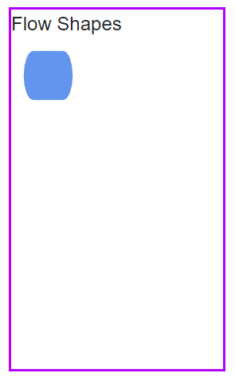
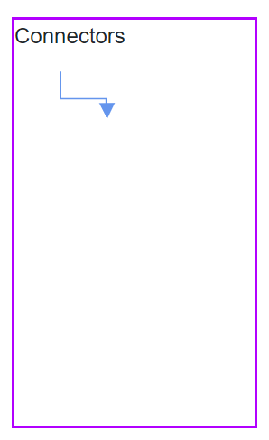
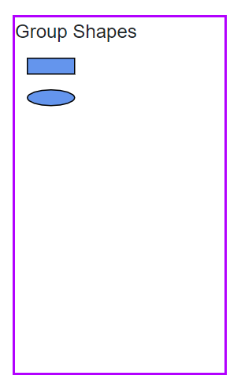
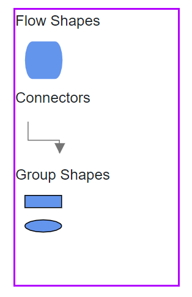

# Symbol Palette in Blazor Diagram Component

The [SymbolPalette](https://help.syncfusion.com/cr/blazor/Syncfusion.Blazor.Diagram.SymbolPalette.html) displays a collection of [Palettes](https://help.syncfusion.com/cr/blazor/Syncfusion.Blazor.Diagram.SymbolPalette.SfSymbolPaletteComponent.html#Syncfusion_Blazor_Diagram_SymbolPalette_SfSymbolPaletteComponent_Palettes). The palette shows a set of nodes and connectors. It allows to drag and drop the nodes and connectors into the diagram.

## Create symbol palette

The [Width](https://help.syncfusion.com/cr/blazor/Syncfusion.Blazor.Diagram.SymbolPalette.SfSymbolPaletteComponent.html#Syncfusion_Blazor_Diagram_SymbolPalette_SfSymbolPaletteComponent_Width) and [Height](https://help.syncfusion.com/cr/blazor/Syncfusion.Blazor.Diagram.SymbolPalette.SfSymbolPaletteComponent.html#Syncfusion_Blazor_Diagram_SymbolPalette_SfSymbolPaletteComponent_Height) properties of the symbol palette allows to define the size of the symbol palette.

```csharp
@using Syncfusion.Blazor.Diagram.SymbolPalette
@using Syncfusion.Blazor.Diagram

@* Initializes the symbol palette *@
<SfSymbolPaletteComponent Height="600px" 
                          SymbolHeight="80" SymbolWidth="80">
</SfSymbolPaletteComponent>
```

### Add node to palette
[SymbolWidth](https://help.syncfusion.com/cr/blazor/Syncfusion.Blazor.Diagram.SymbolPalette.SfSymbolPaletteComponent.html#Syncfusion_Blazor_Diagram_SymbolPalette_SfSymbolPaletteComponent_SymbolWidth) and [SymbolHeight](https://help.syncfusion.com/cr/blazor/Syncfusion.Blazor.Diagram.SymbolPalette.SfSymbolPaletteComponent.html#Syncfusion_Blazor_Diagram_SymbolPalette_SfSymbolPaletteComponent_SymbolHeight) properties of the SfSymbolPaletteComponent should be defined to render the symbol(node, connector or nodegroup) in the palette. The following code example illustrates how to add node to a palette.

* To render a node in a palette, first create SymbolPalette and initialize palettes collection.

```csharp
@using Syncfusion.Blazor.Diagram
@using Syncfusion.Blazor.Diagram.SymbolPalette

<div class="control-section">
    <div style="width:20%">
        <div id="palette-space" class="sb-mobile-palette" style="border: 2px solid #b200ff">
            <SfSymbolPaletteComponent @ref="@symbolpalette" Height="300px" Width="200px"
                                      Palettes="@Palettes" SymbolHeight="60" SymbolWidth="60" SymbolMargin="@SymbolMargin">
            </SfSymbolPaletteComponent>
        </div>
    </div>
</div>

@code
{
    SymbolMargin SymbolMargin = new SymbolMargin 
    { 
        Left = 15, 
        Right = 15, 
        Top = 15, 
        Bottom = 15 
    };
    SfSymbolPaletteComponent symbolpalette;
    //Define palattes collection
    DiagramObjectCollection<Palette> Palettes = new DiagramObjectCollection<Palette>();
}
```

* Create node and add that node to the DiagramObjectCollection<NodeBase>.

```csharp
   // Defines palette's flow-shape collection
    DiagramObjectCollection<NodeBase> PaletteNodes = new DiagramObjectCollection<NodeBase>();

    protected override void OnInitialized()
    {
        InitPaletteModel();
    }

    private void InitPaletteModel()
    {                    
        CreatePaletteNode(FlowShapeType.Terminator, "Terminator");       
    }

    private void CreatePaletteNode(FlowShapeType flowShape, string id)
    {
        Node node = new Node()
        {
            ID = id,
            Shape = new FlowShape() { Type = Shapes.Flow, Shape = flowShape },
            Style = new ShapeStyle() {Fill="#6495ED", StrokeColor = "#757575" },
        };
        PaletteNodes.Add(node);
    }
```

* Complete code to add node to the palette.

```csharp
@using Syncfusion.Blazor.Diagram
@using Syncfusion.Blazor.Diagram.SymbolPalette

<div class="control-section">
    <div style="width:20%">
        <div id="palette-space" class="sb-mobile-palette" style="border: 2px solid #b200ff">
            <SfSymbolPaletteComponent @ref="@symbolpalette" Height="300px" Width="200px"
                                      Palettes="@Palettes" SymbolHeight="60" SymbolWidth="60" SymbolMargin="@SymbolMargin">
            </SfSymbolPaletteComponent>
        </div>
    </div>
</div>

@code
{
    SymbolMargin SymbolMargin = new SymbolMargin 
    { 
        Left = 15, 
        Right = 15, 
        Top = 15, 
        Bottom = 15
    };

    SfSymbolPaletteComponent symbolpalette;

    //Define palattes collection
    DiagramObjectCollection<Palette> Palettes = new DiagramObjectCollection<Palette>();

    // Defines palette's flow-shape collection
    DiagramObjectCollection<NodeBase> PaletteNodes = new DiagramObjectCollection<NodeBase>();

    protected override void OnInitialized()
    {
        InitPaletteModel();
    }

    private void InitPaletteModel()
    {
        CreatePaletteNode(FlowShapeType.Terminator, "Terminator");
        Palettes = new DiagramObjectCollection<Palette>()
        {
           new Palette(){Symbols =PaletteNodes, Title="Flow Shapes", ID="Flow Shapes" },
        };
    }
    private void CreatePaletteNode(FlowShapeType flowShape, string id)
    {
        Node node = new Node()
        {
            ID = id,
            Shape = new FlowShape() { Type = Shapes.Flow, Shape = flowShape },
            Style = new ShapeStyle() { Fill = "#6495ED", StrokeColor = "#6495ED" },
        };
        PaletteNodes.Add(node);
    }
}

```



### Add connector to palette

The following code example illustrates how to add connector to a palette.

```csharp
@using Syncfusion.Blazor.Diagram
@using Syncfusion.Blazor.Diagram.SymbolPalette

<div class="control-section">
    <div style="width:20%">
        <div id="palette-space" class="sb-mobile-palette" style="border: 2px solid #b200ff">
            <SfSymbolPaletteComponent @ref="@symbolpalette" Height="300px" Width="200px"
                                      Palettes="@Palettes" SymbolHeight="60" SymbolWidth="100">
            </SfSymbolPaletteComponent>
        </div>
    </div>
</div>

@code
{
    SfSymbolPaletteComponent symbolpalette;

    //Define palattes collection
    DiagramObjectCollection<Palette> Palettes = new DiagramObjectCollection<Palette>();

    // Defines palette's flow-shape collection
    DiagramObjectCollection<NodeBase> PaletteNodes = new DiagramObjectCollection<NodeBase>();

    // Defines palette's connector collection
    DiagramObjectCollection<NodeBase> PaletteConnectors = new DiagramObjectCollection<NodeBase>();

    protected override void OnInitialized()
    {
        InitPaletteModel();
    }

    private void InitPaletteModel()
    {
        CreatePaletteConnector("Link1", ConnectorSegmentType.Orthogonal, DecoratorShape.Arrow);
        Palettes = new DiagramObjectCollection<Palette>()
        {
            new Palette(){Symbols = PaletteConnectors, Title = "Connectors" , IsExpanded = true},
        };
    }

    private void CreatePaletteConnector(string id, ConnectorSegmentType type, DecoratorShape decoratorShape)
    {
        Connector connector = new Connector()
        {
            ID = id,
            Type = type,
            SourcePoint = new DiagramPoint() { X = 0, Y = 0 },
            TargetPoint = new DiagramPoint() { X = 100, Y = 100 },
            Style = new ShapeStyle() { StrokeWidth = 1, StrokeColor = "#6495ED" },
            TargetDecorator = new DecoratorSettings()
            {
                Shape = decoratorShape,
                Style = new ShapeStyle() { StrokeColor = "#6495ED", Fill = "#6495ED" }
            }
        };

        PaletteConnectors.Add(connector);
    }
}
```



### Add nodegroup to palette

The following code example illustrates how to add nodegroup to a palette.

```csharp
@using Syncfusion.Blazor.Diagram
@using Syncfusion.Blazor.Diagram.SymbolPalette

<div class="control-section">
    <div style="width:20%">
        <div id="palette-space" class="sb-mobile-palette" style="border: 2px solid #b200ff">
            <SfSymbolPaletteComponent @ref="@symbolpalette" Height="300px" Width="200px"
                                      Palettes="@Palettes" SymbolHeight="60" SymbolWidth="60" SymbolMargin="@SymbolMargin">
            </SfSymbolPaletteComponent>
        </div>
    </div>
</div>

@code{

    SymbolMargin SymbolMargin = new SymbolMargin
    {
        Left = 15,
        Right = 15,
        Top = 15,
        Bottom = 15
    };

    SfSymbolPaletteComponent symbolpalette;

    //Define palattes collection
    DiagramObjectCollection<Palette> Palettes = new DiagramObjectCollection<Palette>();

    // Defines palette's group collection
    DiagramObjectCollection<NodeBase> PaletteGroup = new DiagramObjectCollection<NodeBase>();

    protected override void OnInitialized()
    {
        InitPaletteModel();
    }

    private void InitPaletteModel()
    {
        CreatePaletteGroup();
        Palettes = new DiagramObjectCollection<Palette>()
        {
             new Palette(){Symbols = PaletteGroup,Title = "Group Shapes", IsExpanded = true}
        };
    }

    private void CreatePaletteGroup()
    {
        Node node1 = new Node()
        {
            ID = "node1",
            Width = 50,
            Height = 50,
            OffsetX = 100,
            OffsetY = 100,
            Shape = new BasicShape() { Type = Shapes.Basic, Shape = BasicShapeType.Rectangle },
            Style = new ShapeStyle() { Fill = "#6495ed" },
        };
        Node node2 = new Node()
        {
            ID = "node2",
            Width = 50,
            Height = 50,
            OffsetX = 100,
            OffsetY = 200,
            Shape = new BasicShape() { Type = Shapes.Basic, Shape = BasicShapeType.Ellipse },
            Style = new ShapeStyle() { Fill = "#6495ed" },
        };
        PaletteGroup.Add(node1);
        PaletteGroup.Add(node2);

        NodeGroup group = new NodeGroup()
        {
            ID = "group1",
            Children = new string[] { "node1", "node2" }
        };
        PaletteGroup.Add(group);
    }
}
```



## Add palette to SymbolPalette

A palette allows to display a group of related symbols and it textually annotates the group with its header.
A [Palette](https://help.syncfusion.com/cr/blazor/Syncfusion.Blazor.Diagram.SymbolPalette.Palette.html) can be added as a collection of symbol groups.

The collection of predefined symbols can be added in palettes using the [Symbols](https://help.syncfusion.com/cr/blazor/Syncfusion.Blazor.Diagram.SymbolPalette.Palette.html#Syncfusion_Blazor_Diagram_SymbolPalette_Palette_Symbols) property.

To initialize a palette, define a JSON object with the property [ID](https://help.syncfusion.com/cr/blazor/Syncfusion.Blazor.Diagram.SymbolPalette.Palette.html#Syncfusion_Blazor_Diagram_SymbolPalette_Palette_ID) that is unique ID is set to the palettes.

The following code example illustrates how to define a palette.

```csharp
@using Syncfusion.Blazor.Diagram.SymbolPalette
@using Syncfusion.Blazor.Diagram

@* Initializes the symbol palette *@
<SfSymbolPaletteComponent @ref="SymbolPalette" Height="600px"
                          SymbolHeight="80" SymbolWidth="80" Palettes="@palettes">
</SfSymbolPaletteComponent>

@code
{
    SfSymbolPaletteComponent SymbolPalette;
    DiagramObjectCollection<Palette> palettes = new DiagramObjectCollection<Palette>();
}
```

The following code example illustrates how to add nodes, connectors, nodegroups to the palette and add palette to the palettes collection of the symbol palette.

```csharp
Palettes = new DiagramObjectCollection<Palette>()
{
    new Palette(){Symbols = PaletteNodes, Title = "Flow Shapes", ID = "Flow Shapes" },
    new Palette(){Symbols = PaletteConnectors, Title = "Connectors", IsExpanded = true},
    new Palette(){Symbols = PaletteGroup, Title = "Group Shapes", IsExpanded = true}
};                  
```

* Complete code to render palette with node, connector and nodegroup.

```csharp
@using Syncfusion.Blazor.Diagram
@using Syncfusion.Blazor.Diagram.SymbolPalette

<div class="control-section">
    <div style="width:20%">       
        <div id="palette-space" class="sb-mobile-palette" style="border: 2px solid #b200ff">
            <SfSymbolPaletteComponent @ref="@symbolpalette" Height="300px" Width="200px"
                                      Palettes="@Palettes" SymbolHeight="60" SymbolWidth="60" SymbolMargin="@SymbolMargin">
            </SfSymbolPaletteComponent>
        </div>
    </div>
</div>

@code
{
    SymbolMargin SymbolMargin = new SymbolMargin 
    { 
        Left = 15, 
        Right = 15, 
        Top = 15, 
        Bottom = 15 
    };
    SfSymbolPaletteComponent symbolpalette;
    //Define palattes collection
    DiagramObjectCollection<Palette> Palettes = new DiagramObjectCollection<Palette>();
    // Defines palette's flow-shape collection
    DiagramObjectCollection<NodeBase> PaletteNodes = new DiagramObjectCollection<NodeBase>();
    // Defines palette's group collection
    DiagramObjectCollection<NodeBase> PaletteGroup = new DiagramObjectCollection<NodeBase>();
    // Defines palette's connector collection
    DiagramObjectCollection<NodeBase> PaletteConnectors = new DiagramObjectCollection<NodeBase>();

    protected override void OnInitialized()
    {
        InitPaletteModel();
    }

    private void InitPaletteModel()
    {
        CreatePaletteNode(FlowShapeType.Terminator, "Terminator");
        CreatePaletteConnector("Link1", ConnectorSegmentType.Orthogonal, DecoratorShape.Arrow);
        CreatePaletteGroup();
        Palettes = new DiagramObjectCollection<Palette>()
        {
            new Palette(){Symbols = PaletteNodes,Title = "Flow Shapes", ID = "Flow Shapes" },
            new Palette(){Symbols = PaletteConnectors,Title = "Connectors", IsExpanded = true},
            new Palette(){Symbols = PaletteGroup,Title = "Group Shapes", IsExpanded = true}
        };
    }

    private void CreatePaletteNode(FlowShapeType flowShape, string id)
    {
        Node node = new Node()
        {
            ID = id,
            Shape = new FlowShape() { Type = Shapes.Flow, Shape = flowShape },
            Style = new ShapeStyle() { Fill = "#6495ED", StrokeColor = "#6495ED" },
        };
        PaletteNodes.Add(node);
    }

    private void CreatePaletteConnector(string id, ConnectorSegmentType type, DecoratorShape decoratorShape)
    {
        Connector connector = new Connector()
        {
            ID = id,
            Type = type,
            SourcePoint = new DiagramPoint() { X = 0, Y = 0 },
            TargetPoint = new DiagramPoint() { X = 60, Y = 60 },
            Style = new ShapeStyle() { StrokeWidth = 1, StrokeColor = "#757575" },
            TargetDecorator = new DecoratorSettings()
            {
                Shape = decoratorShape,
                Style = new ShapeStyle() { StrokeColor = "#757575", Fill = "#757575" }
            }
        };
        PaletteConnectors.Add(connector);
    }

    private void CreatePaletteGroup()
    {
        Node node1 = new Node()
        {
            ID = "node1",
            Width = 50,
            Height = 50,
            OffsetX = 100,
            OffsetY = 100,
            Shape = new BasicShape() { Type = Shapes.Basic, Shape = BasicShapeType.Rectangle },
            Style = new ShapeStyle() { Fill = "#6495ed" },
        };
        Node node2 = new Node()
        {
            ID = "node2",
            Width = 50,
            Height = 50,
            OffsetX = 100,
            OffsetY = 200,
            Shape = new BasicShape() { Type = Shapes.Basic, Shape = BasicShapeType.Ellipse },
            Style = new ShapeStyle() { Fill = "#6495ed" },
        };
        PaletteGroup.Add(node1);
        PaletteGroup.Add(node2);
        NodeGroup group = new NodeGroup()
        {
            ID = "group1",
            Children = new string[] { "node1", "node2" }
        };
        PaletteGroup.Add(group);
    }
}
```



## How to drag and drop symbols from palette to diagram

To initialize drag and drop, you must add the diagram to the [Targets](https://help.syncfusion.com/cr/blazor/Syncfusion.Blazor.Diagram.SymbolPalette.SfSymbolPaletteComponent.html#Syncfusion_Blazor_Diagram_SymbolPalette_SfSymbolPaletteComponent_Targets) collection of the symbol palette. The below code illustrates how to add diagram to the Targets collection.

```csharp
@code
{
    SfDiagramComponent diagram;

    protected override async Task OnAfterRenderAsync(bool firstRender)
    {
        symbolpalette.Targets = new DiagramObjectCollection<SfDiagramComponent>() { };
        symbolpalette.Targets.Add(diagram);
    }
}
```

* Complete code to drag and drop symbols from palette to diagram.
```csharp
@using Syncfusion.Blazor.Diagram
@using Syncfusion.Blazor.SymbolPalette

<div class="control-section">    
    <div style="width: 100%">
        <div class="sb-mobile-palette-bar">
            <div id="palette-icon" style="float: right;" role="button" class="e-ddb-icons1 e-toggle-palette"></div>
        </div>
        <div id="palette-space" class="sb-mobile-palette">
            <SfSymbolPaletteComponent @ref="@symbolpalette" Height="700px"
                                      Palettes="@Palettes"  SymbolHeight="60" SymbolWidth="60" SymbolMargin="@SymbolMargin">
            </SfSymbolPaletteComponent>
        </div>
        <div id="diagram-space" class="sb-mobile-diagram">
            <div class="content-wrapper" style="border: 1px solid #D7D7D7">
                <SfDiagramComponent @ref="@diagram" Height="700px" Connectors="@connectors" Nodes="@nodes">
                </SfDiagramComponent>
            </div>
        </div>
    </div>
</div>

@code
{
    SymbolMargin SymbolMargin = new SymbolMargin 
    { 
        Left = 15, 
        Right = 15, 
        Top = 15, 
        Bottom = 15 
    };
    SfDiagramComponent diagram;
    SfSymbolPaletteComponent symbolpalette;
    //Define nodes collection
    DiagramObjectCollection<Node> nodes = new DiagramObjectCollection<Node>();
    //Define connectors collection
    DiagramObjectCollection<Connector> connectors = new DiagramObjectCollection<Connector>();
    //Define palattes collection
    DiagramObjectCollection<Palette> Palettes = new DiagramObjectCollection<Palette>();
    // Defines palette's flow-shape collection
    DiagramObjectCollection<NodeBase> PaletteNodes = new DiagramObjectCollection<NodeBase>();
    // Defines palette's group collection
    DiagramObjectCollection<NodeBase> PaletteGroup = new DiagramObjectCollection<NodeBase>();
    // Defines palette's connector collection
    DiagramObjectCollection<NodeBase> PaletteConnectors = new DiagramObjectCollection<NodeBase>();

    protected override async Task OnAfterRenderAsync(bool firstRender)
    {
        symbolpalette.Targets = new DiagramObjectCollection<SfDiagramComponent>() { };
        symbolpalette.Targets.Add(diagram);
    }

    protected override void OnInitialized()
    {
        InitPaletteModel();
    }

    private void InitPaletteModel()
    {
        CreatePaletteNode(FlowShapeType.Terminator, "Terminator");        
        CreatePaletteConnector("Link1", ConnectorSegmentType.Orthogonal, DecoratorShape.Arrow);        
        CreatePaletteGroup();
        Palettes = new DiagramObjectCollection<Palette>()
        {
            new Palette(){Symbols = PaletteNodes,Title = "Flow Shapes", ID = "Flow Shapes" },
            new Palette(){Symbols = PaletteConnectors,Title = "Connectors", IsExpanded = true},
            new Palette(){Symbols = PaletteGroup,Title = "Group Shapes", IsExpanded = true}
        };
    }

    private void CreatePaletteNode(FlowShapeType flowShape, string id)
    {
        Node node = new Node()
        {
            ID = id,
            Shape = new FlowShape() { Type = Shapes.Flow, Shape = flowShape },
            Style = new ShapeStyle() { Fill= "#6495ED", StrokeColor = "#6495ED" },
        };
        PaletteNodes.Add(node);
    }

    private void CreatePaletteConnector(string id, ConnectorSegmentType type, DecoratorShape decoratorShape)
    {
        Connector connector = new Connector()
        {
            ID = id,
            Type = type,
            SourcePoint = new DiagramPoint() { X = 0, Y = 0 },
            TargetPoint = new DiagramPoint() { X = 60, Y = 60 },
            Style = new ShapeStyle() { StrokeWidth = 1, StrokeColor = "#757575" },
            TargetDecorator = new DecoratorSettings()
            {
                Shape = decoratorShape,
                Style = new ShapeStyle() { StrokeColor = "#757575", Fill = "#757575" }
            }
        };
        PaletteConnectors.Add(connector);
    }

    private void CreatePaletteGroup()
    {
        Node node1 = new Node()
        {
            ID = "node1",
            Width = 50,
            Height = 50,
            OffsetX = 100,
            OffsetY = 100,
            Shape = new BasicShape() { Type = Shapes.Basic, Shape = BasicShapeType.Rectangle },
            Style = new ShapeStyle() { Fill = "#6495ed" },
        };
        Node node2 = new Node()
        {
            ID = "node2",
            Width = 50,
            Height = 50,
            OffsetX = 100,
            OffsetY = 200,
            Shape = new BasicShape() { Type = Shapes.Basic, Shape = BasicShapeType.Ellipse },
            Style = new ShapeStyle() { Fill = "#6495ed" },
        };
        PaletteGroup.Add(node1);
        PaletteGroup.Add(node2);
        NodeGroup group = new NodeGroup()
        {
            ID = "group1",
            Children = new string[] { "node1", "node2" }
        };
        PaletteGroup.Add(group);
    }
}
```


## Customize the palette header

Palettes can be annotated with its header texts.

The [Title](https://help.syncfusion.com/cr/blazor/Syncfusion.Blazor.Diagram.SymbolPalette.Palette.html#Syncfusion_Blazor_Diagram_SymbolPalette_Palette_Title) displayed as the header text of palette.

The [IsExpanded](https://help.syncfusion.com/cr/blazor/Syncfusion.Blazor.Diagram.SymbolPalette.Palette.html#Syncfusion_Blazor_Diagram_SymbolPalette_Palette_IsExpanded) property of palette allows to expand/collapse its palette items.

The following code illustrates how to change the Title and IsExpanded properties at runtime.

```csharp
symbolpalette.Palettes[0].Title = "NewTitle";
symbolpalette.Palettes[0].IsExpanded = false;
```

## Add/Remove symbols to palette at runtime

* Symbols can be added to palette at runtime by using public method, [AddPaletteItem](https://help.syncfusion.com/cr/blazor/Syncfusion.Blazor.Diagram.SymbolPalette.SfSymbolPaletteComponent.html#Syncfusion_Blazor_Diagram_SymbolPalette_SfSymbolPaletteComponent_AddPaletteItem_System_String_Syncfusion_Blazor_Diagram_NodeBase_System_Boolean_). The following code sample illustrates how to add symbol using AddPaletteItem method.

```csharp
Node decision = new Node()
{ 
    ID = "Decision",
    Shape = new FlowShape() { Type = Shapes.Flow, Shape = FlowShapeType.Decision } 
};
symbolpalette.AddPaletteItem("Flow Shapes", decision, false);
```

Also, you can add symbol to the palette at runtime by using `Add` method.The following code sample illustrates how to add symbol using Add method.


```csharp
Node decision = new Node()
{ 
    ID = "Decision",
    Shape = new FlowShape() { Type = Shapes.Flow, Shape = FlowShapeType.Decision } 
};
symbolpalette.Palettes[0].Symbols.Add(Tnode2);
```

* Symbols can be removed from palette at runtime by using public method, [RemovePaletteItem](https://help.syncfusion.com/cr/blazor/Syncfusion.Blazor.Diagram.SymbolPalette.SfSymbolPaletteComponent.html#Syncfusion_Blazor_Diagram_SymbolPalette_SfSymbolPaletteComponent_RemovePaletteItem_System_String_System_String_).The following code sample illustrates how to remove symbol using RemovePaletteItem method.


```csharp
symbolpalette.RemovePaletteItem("Flow Shapes", "Decision");
```

## Add/Remove palettes at runtime

* Palettes can be added to the symbol palette at runtime by using public method, [AddPalettes](https://help.syncfusion.com/cr/blazor/Syncfusion.Blazor.Diagram.SymbolPalette.SfSymbolPaletteComponent.html#Syncfusion_Blazor_Diagram_SymbolPalette_SfSymbolPaletteComponent_AddPalettes_Syncfusion_Blazor_Diagram_DiagramObjectCollection_Syncfusion_Blazor_Diagram_SymbolPalette_Palette__). The following code sample illustrates how to add palette using AddPalettes method.

```csharp
DiagramObjectCollection<NodeBase> newNodes = new DiagramObjectCollection<NodeBase>();            
Node newNode = new Node() 
{ 
    ID = "newNode", 
    Shape = new FlowShape() { Type = Shapes.Flow, Shape = FlowShapeType.Process } 
};
newNodes.Add(newNode as NodeBase);           
DiagramObjectCollection<Palette> newPalettes = new DiagramObjectCollection<Palette>()
{
    new Palette(){Symbols = newNodes,Title = "FlowShapes",ID = "FlowShapes" },                
};
symbolpalette.AddPalettes(newPalettes);
```

Also, you can add palette to the symbol palette at runtime by using `Add` method. The following code sample illustrates how to add palette using Add method.

```csharp
DiagramObjectCollection<NodeBase> Newnodes = new DiagramObjectCollection<NodeBase>();
Newnodes = new DiagramObjectCollection<NodeBase>();
Node newNode = new Node() 
{ 
    ID = "newNode", 
    Shape = new FlowShape() { Type = Shapes.Flow, Shape = FlowShapeType.Process }
};
Newnodes.Add(newNode as NodeBase);
Palette newpalette = new Palette() 
{ 
    Symbols = Newnodes, 
    Title = "Flow Shapes", 
    ID = "Flow Shapes" 
};
symbolpalette.Palettes.Add(newpalette);
```

* Palettes can be removed from the symbol palette at runtime by using public method, [RemovePalettes](https://help.syncfusion.com/cr/blazor/Syncfusion.Blazor.Diagram.SymbolPalette.SfSymbolPaletteComponent.html#Syncfusion_Blazor_Diagram_SymbolPalette_SfSymbolPaletteComponent_RemovePalettes_System_String_). The following code sample illustrates how to remove palette using RemovePalettes method.

```csharp
 symbolpalette.RemovePalettes("Basic Shapes");
```

## Customize the size of symbols

The size of the individual symbol can be customized. The [SymbolWidth](https://help.syncfusion.com/cr/blazor/Syncfusion.Blazor.Diagram.SymbolPalette.SfSymbolPaletteComponent.html#Syncfusion_Blazor_Diagram_SymbolPalette_SfSymbolPaletteComponent_SymbolWidth) and [SymbolHeight](https://help.syncfusion.com/cr/blazor/Syncfusion.Blazor.Diagram.SymbolPalette.SfSymbolPaletteComponent.html#Syncfusion_Blazor_Diagram_SymbolPalette_SfSymbolPaletteComponent_SymbolHeight) properties of symbol palette enables you to define the size of the symbols.

* Also, you can update the size of the symbols at runtime.

The following code example illustrates how to change the size of a symbol and how to update the size at runtime.

```csharp
@using Syncfusion.Blazor.Diagram
@using Syncfusion.Blazor.Diagram.SymbolPalette

<div class="control-section">
    <div class="properties">
        <button @onclick="UpdateSize">
            UpdateSize
        </button>
    </div>
    <div style="width:20%">
        <div id="palette-space" class="sb-mobile-palette" style="border: 2px solid #b200ff">
            <SfSymbolPaletteComponent @ref="@symbolpalette" Height="300px" Width="200px"
                                      Palettes="@Palettes" SymbolHeight="@symbolwidth" SymbolWidth="@symbolheight" SymbolMargin="@SymbolMargin">
            </SfSymbolPaletteComponent>
        </div>
    </div>
</div>

@code
{
    DiagramSize SymbolPreview;
    SymbolMargin SymbolMargin = new SymbolMargin 
    { 
        Left = 15, 
        Right = 15, 
        Top = 15, 
        Bottom = 15 
    };
    double symbolwidth = 60;
    double symbolheight = 60;
    SfSymbolPaletteComponent symbolpalette;

    //Define palattes collection
    DiagramObjectCollection<Palette> Palettes = new DiagramObjectCollection<Palette>();

    // Defines palette's flow-shape collection
    DiagramObjectCollection<NodeBase> PaletteNodes = new DiagramObjectCollection<NodeBase>();

    protected override void OnInitialized()
    {
        InitPaletteModel();
    }

    private void InitPaletteModel()
    {
        Node node1 = new Node()
        {
            ID = "Rectangle",
            Shape = new BasicShape() { Type = Shapes.Basic, Shape = BasicShapeType.Rectangle },
            Style = new ShapeStyle() { Fill = "#6495ED", StrokeColor = "#6495ED" },
        };
        Node node2 = new Node()
        {
            ID = "Ellipse",
            Shape = new BasicShape() { Type = Shapes.Basic, Shape = BasicShapeType.Ellipse },
            Style = new ShapeStyle() { Fill = "#6495ED", StrokeColor = "#6495ED" },
        };
        Node node3 = new Node()
        {
            ID = "Diamond",
            Shape = new BasicShape() { Type = Shapes.Basic, Shape = BasicShapeType.Diamond },
            Style = new ShapeStyle() { Fill = "#6495ED", StrokeColor = "#6495ED" },
        };
        PaletteNodes.Add(node1);
        PaletteNodes.Add(node2);
        PaletteNodes.Add(node3);

        Palettes = new DiagramObjectCollection<Palette>()
        {
           new Palette(){Symbols = PaletteNodes,Title = "Basic Shapes",ID = "Basic Shapes" },
        };
    }

    private void UpdateSize()
    {
        symbolwidth = 80;
        symbolheight = 80;
    }
}
```

The [SymbolMargin](https://help.syncfusion.com/cr/blazor/Syncfusion.Blazor.Diagram.SymbolPalette.SfSymbolPaletteComponent.html#Syncfusion_Blazor_Diagram_SymbolPalette_SfSymbolPaletteComponent_SymbolMargin) property is used to create the space around the elements, outside of any defined borders.

## Restrict expansion of the palette panel

The symbol palette panel can be restricted from getting expanded. The [Cancel](https://help.syncfusion.com/cr/blazor/Syncfusion.Blazor.Diagram.SymbolPalette.PaletteExpandingEventArgs.html#Syncfusion_Blazor_Diagram_SymbolPalette_PaletteExpandingEventArgs_Cancel) argument of the [PaletteExpandingEventArgs](https://help.syncfusion.com/cr/blazor/Syncfusion.Blazor.Diagram.SymbolPalette.PaletteExpandingEventArgs.html) property defines whether the palette’s panel should be expanded or collapsed. By default, the panel is expanded. This restriction can be done for each of the palettes in the symbol palette as desired. In the following code example the flow shapes palette is restricted from getting collapsed whereas the group shapes palette can be expanded or collapsed.

```cshtml
@using Syncfusion.Blazor.Diagram
@using Syncfusion.Blazor.Diagram.SymbolPalette

<div class="control-section">
    <div style="width:20%">       
        <div id="palette-space" class="sb-mobile-palette" style="border: 2px solid #b200ff">
            <SfSymbolPaletteComponent @ref="@symbolpalette"
                                      Height="300px" 
                                      Width="200px"
                                      Palettes="@Palettes" 
                                      SymbolHeight="60" 
                                      SymbolWidth="60" 
                                      SymbolMargin="@SymbolMargin"
                                      Expanding="@OnPaletteExpanding">
            </SfSymbolPaletteComponent>
        </div>
    </div>
</div>

@code
{
    SymbolMargin SymbolMargin = new SymbolMargin 
    { 
        Left = 15, 
        Right = 15, 
        Top = 15, 
        Bottom = 15 
    };
    SfSymbolPaletteComponent symbolpalette;
    //Define palattes collection
    DiagramObjectCollection<Palette> Palettes = new DiagramObjectCollection<Palette>();
    // Defines palette's flow-shape collection
    DiagramObjectCollection<NodeBase> PaletteNodes = new DiagramObjectCollection<NodeBase>();
    // Defines palette's group collection
    DiagramObjectCollection<NodeBase> PaletteGroup = new DiagramObjectCollection<NodeBase>();
    // Defines palette's connector collection
    DiagramObjectCollection<NodeBase> PaletteConnectors = new DiagramObjectCollection<NodeBase>();

    protected override void OnInitialized()
    {
        InitPaletteModel();
    }

    private void InitPaletteModel()
    {
        CreatePaletteNode(FlowShapeType.Terminator, "Terminator");
        CreatePaletteConnector("Link1", ConnectorSegmentType.Orthogonal, DecoratorShape.Arrow);
        CreatePaletteGroup();
        Palettes = new DiagramObjectCollection<Palette>()
        {
            new Palette(){Symbols = PaletteNodes,Title = "Flow Shapes", ID = "Flow Shapes" },
            new Palette(){Symbols = PaletteConnectors,Title = "Connectors", ID = "Connectors"},
            new Palette(){Symbols = PaletteGroup,Title = "Group Shapes", ID = "Group Shapes"}
        };
    }

    private void CreatePaletteNode(FlowShapeType flowShape, string id)
    {
        Node node = new Node()
        {
            ID = id,
            Shape = new FlowShape() { Type = Shapes.Flow, Shape = flowShape },
            Style = new ShapeStyle() { Fill = "#6495ED", StrokeColor = "#6495ED" },
        };
        PaletteNodes.Add(node);
    }

    private void CreatePaletteConnector(string id, ConnectorSegmentType type, DecoratorShape decoratorShape)
    {
        Connector connector = new Connector()
        {
            ID = id,
            Type = type,
            SourcePoint = new DiagramPoint() { X = 0, Y = 0 },
            TargetPoint = new DiagramPoint() { X = 60, Y = 60 },
            Style = new ShapeStyle() { StrokeWidth = 1, StrokeColor = "#757575" },
            TargetDecorator = new DecoratorSettings()
            {
                Shape = decoratorShape,
                Style = new ShapeStyle() { StrokeColor = "#757575", Fill = "#757575" }
            }
        };
        PaletteConnectors.Add(connector);
    }

    private void CreatePaletteGroup()
    {
        Node node1 = new Node()
        {
            ID = "node1",
            Width = 50,
            Height = 50,
            OffsetX = 100,
            OffsetY = 100,
            Shape = new BasicShape() { Type = Shapes.Basic, Shape = BasicShapeType.Rectangle },
            Style = new ShapeStyle() { Fill = "#6495ed" },
        };
        Node node2 = new Node()
        {
            ID = "node2",
            Width = 50,
            Height = 50,
            OffsetX = 100,
            OffsetY = 200,
            Shape = new BasicShape() { Type = Shapes.Basic, Shape = BasicShapeType.Ellipse },
            Style = new ShapeStyle() { Fill = "#6495ed" },
        };
        PaletteGroup.Add(node1);
        PaletteGroup.Add(node2);
        NodeGroup group = new NodeGroup()
        {
            ID = "group1",
            Children = new string[] { "node1", "node2" }
        };
        PaletteGroup.Add(group);
    }

    private void OnPaletteExpanding(PaletteExpandingEventArgs args)
    {
        if(args.Palette.ID=="Flow Shapes")
        {
            // Flow shapes panel does not collapse
            args.Cancel = true;
        }
        else
        {
            // Group shapes panel collapse and expand
            args.Cancel = false;
        }
    }
}
```

## Symbol preview size

The symbol preview size of the palette items can be customized using [SymbolDragPreviewSize](https://help.syncfusion.com/cr/blazor/Syncfusion.Blazor.Diagram.SymbolPalette.SfSymbolPaletteComponent.html#Syncfusion_Blazor_Diagram_SymbolPalette_SfSymbolPaletteComponent_SymbolDiagramPreviewSize) property.
The [Width](https://help.syncfusion.com/cr/blazor/Syncfusion.Blazor.Diagram.SymbolPalette.SfSymbolPaletteComponent.html#Syncfusion_Blazor_Diagram_SymbolPalette_SfSymbolPaletteComponent_Width) and [Height](https://help.syncfusion.com/cr/blazor/Syncfusion.Blazor.Diagram.SymbolPalette.SfSymbolPaletteComponent.html#Syncfusion_Blazor_Diagram_SymbolPalette_SfSymbolPaletteComponent_Height) properties of SymbolDragPreviewSize enables you to define the preview size to all the symbol palette items.

The following code example illustrates how to change the preview size of a palette item.

```csharp
@using Syncfusion.Blazor.Diagram
@using Syncfusion.Blazor.Diagram.SymbolPalette

<div class="control-section">
    <div style="width: 100%">
        <div class="sb-mobile-palette-bar">
            <div id="palette-icon" style="float: right;" role="button" class="e-ddb-icons1 e-toggle-palette"></div>
        </div>
        <div id="palette-space" class="sb-mobile-palette">
            <SfSymbolPaletteComponent @ref="@symbolpalette" Height="300px" Width="200px" SymbolDragPreviewSize="@symbolDragPreviewSize"
                                      Palettes="@Palettes" SymbolHeight="60" SymbolWidth="60" SymbolMargin="@SymbolMargin">
            </SfSymbolPaletteComponent>
        </div>
        <div id="diagram-space" class="sb-mobile-diagram">
            <div class="content-wrapper" style="border: 1px solid #D7D7D7">
                <SfDiagramComponent @ref="@diagram" Height="700px" Connectors="@connectors" Nodes="@nodes">
                </SfDiagramComponent>
            </div>
        </div>
    </div>
</div>

@code
{
    Size symbolDragPreviewSize;
    SymbolMargin SymbolMargin = new SymbolMargin 
    { 
        Left = 15, 
        Right = 15, 
        Top = 15, 
        Bottom = 15
     };
    SfDiagramComponent diagram;
    SfSymbolPaletteComponent symbolpalette;
    DiagramObjectCollection<Node> nodes = new DiagramObjectCollection<Node>();
    DiagramObjectCollection<Connector> connectors = new DiagramObjectCollection<Connector>();
    //Define palattes collection
    DiagramObjectCollection<Palette> Palettes = new DiagramObjectCollection<Palette>();
    // Defines palette's flow-shape collection
    DiagramObjectCollection<NodeBase> PaletteNodes = new DiagramObjectCollection<NodeBase>();

    protected override void OnInitialized()
    {
        InitPaletteModel();
    }

    protected override async Task OnAfterRenderAsync(bool firstRender)
    {
        symbolpalette.Targets = new DiagramObjectCollection<SfDiagramComponent>() { };
        symbolpalette.Targets.Add(diagram);
    }

    private void InitPaletteModel()
    {
        symbolDragPreviewSize = new DiagramSize();
        symbolDragPreviewSize.Width = 100;
        symbolDragPreviewSize.Height = 100;
        CreatePaletteNode(BasicShapeType.Rectangle, "Rectangle");
        Palettes = new DiagramObjectCollection<Palette>()
        {
           new Palette(){Symbols = PaletteNodes,Title = "Basic Shapes", ID = "Basic Shapes" },
        };
    }

    private void CreatePaletteNode(BasicShapeType basicShape, string id)
    {
        Node node = new Node()
        {
            ID = id,
            Shape = new BasicShape() { Type = Shapes.Basic, Shape = basicShape },
            Style = new ShapeStyle() { Fill = "#6495ED", StrokeColor = "#6495ED" },
        };
        PaletteNodes.Add(node);
    }
}
```


## Default settings

While adding more number of symbols such as nodes and connectors to the palette, define the default settings for those objects through the [NodeCreating](https://help.syncfusion.com/cr/blazor/Syncfusion.Blazor.Diagram.SymbolPalette.SfSymbolPaletteComponent.html#Syncfusion_Blazor_Diagram_SymbolPalette_SfSymbolPaletteComponent_NodeCreating) and the [ConnectorCreating](https://help.syncfusion.com/cr/blazor/Syncfusion.Blazor.Diagram.SymbolPalette.SfSymbolPaletteComponent.html#Syncfusion_Blazor_Diagram_SymbolPalette_SfSymbolPaletteComponent_ConnectorCreating) properties of diagram allows to define the default settings for nodes and connectors.

## Adding symbol description for symbols in the palette

The diagram provides support to add symbol description below each symbol of a palette. This descriptive representation of each symbol will enhance the details of the symbol visually. The height and width of the symbol description can also be set individually.
* The method [GetSymbolInfo](https://help.syncfusion.com/cr/blazor/Syncfusion.Blazor.Diagram.SymbolPalette.SfSymbolPaletteComponent.html#Syncfusion_Blazor_Diagram_SymbolPalette_SfSymbolPaletteComponent_GetSymbolInfo), can be used to add the symbol description at runtime.
 The following code is an example to set a symbol description for symbols in the palette.

```csharp
@using Syncfusion.Blazor.Diagram
@using Syncfusion.Blazor.Diagram.SymbolPalette

<div class="control-section">   
    <div style="width: 100%">  
        <div id="palette-space" class="sb-mobile-palette" style="border: 2px solid #b200ff">
            <SfSymbolPaletteComponent @ref="@symbolpalette" Height="300px" Width="200px" GetSymbolInfo="GetSymbolInfo"
                                      Palettes="@Palettes" SymbolHeight="60" SymbolWidth="120" SymbolMargin="@SymbolMargin">
            </SfSymbolPaletteComponent>
        </div>
        </div>
</div>

@code
{

    SymbolMargin SymbolMargin = new SymbolMargin 
    { 
        Left = 15, 
        Right = 15, 
        Top = 15, 
        Bottom = 15 
    };       
    SfSymbolPaletteComponent symbolpalette;
    //Define palattes collection
    DiagramObjectCollection<Palette> Palettes = new DiagramObjectCollection<Palette>();
    // Defines palette's flow-shape collection
    DiagramObjectCollection<NodeBase> PaletteNodes = new DiagramObjectCollection<NodeBase>();

    protected override void OnInitialized()
    {
        InitPaletteModel();
    }
        
    private void InitPaletteModel()
    {
        CreatePaletteNode(BasicShapeType.Rectangle, "Rectangle");
        Palettes = new DiagramObjectCollection<Palette>()
        {
           new Palette(){Symbols = PaletteNodes,Title = "Basic Shapes", ID = "Basic Shapes" },
        };
    }
        
    private void CreatePaletteNode(BasicShapeType basicShape, string id)
    {
        Node node = new Node()
        {
            ID = id,
            Shape = new BasicShape() { Type = Shapes.Basic, Shape = basicShape },
            Style = new ShapeStyle() { Fill = "#6495ED", StrokeColor = "#6495ED" },
        };
        PaletteNodes.Add(node);
    }

    private SymbolInfo GetSymbolInfo(IDiagramObject symbol)
    {
        SymbolInfo SymbolInfo = new SymbolInfo();
        string text = null;
        text = (symbol as Node).ID;
        SymbolInfo.Description = new SymbolDescription() { Text = text };
        return SymbolInfo;
    }
}
```


## Palette interaction

Palette interaction notifies the element enter, leave, and dragging of the symbols into the diagram.

### DragStart

* When a symbol is dragged into a diagram from symbol palette, the [DragStart](https://help.syncfusion.com/cr/blazor/Syncfusion.Blazor.Diagram.SfDiagramComponent.html#Syncfusion_Blazor_Diagram_SfDiagramComponent_DragStart) event gets triggered. [DragStartEventArgs](https://help.syncfusion.com/cr/blazor/Syncfusion.Blazor.Diagram.DragStartEventArgs.html) notifies when the element enters into the diagram from the symbol palette.

### Dragging

* When a symbol is dragged over a diagram, the [Dragging](https://help.syncfusion.com/cr/blazor/Syncfusion.Blazor.Diagram.SfDiagramComponent.html#Syncfusion_Blazor_Diagram_SfDiagramComponent_Dragging) event gets triggered. [DraggingEventArgs](https://help.syncfusion.com/cr/blazor/Syncfusion.Blazor.Diagram.DraggingEventArgs.html) notifies when an element drags over another diagram element.

### DragLeave

* When a symbol is dragged outside of the diagram, the [DragLeave](https://help.syncfusion.com/cr/blazor/Syncfusion.Blazor.Diagram.SfDiagramComponent.html#Syncfusion_Blazor_Diagram_SfDiagramComponent_DragLeave) event gets triggered. [DragLeaveEventArgs](https://help.syncfusion.com/cr/blazor/Syncfusion.Blazor.Diagram.DragLeaveEventArgs.html) notifies when the element leaves the diagram.

## Escape Key function

The diagram provides support to cancel the node drop from symbol palette when the ESC key is pressed.

## See Also

* [How to add the symbol to the diagram](./nodes)