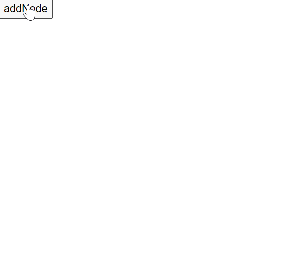
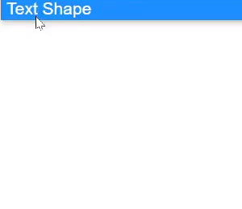

# Tools in Blazor Diagram Component

## Drawing tools

Drawing tool allows you to draw any kind of [Node](https://help.syncfusion.com/cr/blazor/Syncfusion.Blazor.Diagram.Node.html) or [Connector](https://help.syncfusion.com/cr/blazor/Syncfusion.Blazor.Diagram.Connector.html) during runtime by clicking and dragging on the diagram page.

## Drawing shapes through the drawing tool

To draw a [shape](https://help.syncfusion.com/cr/blazor/Syncfusion.Blazor.Diagram.Shape.html), you have to activate the drawing tool by using the [InteractionController](https://help.syncfusion.com/cr/blazor/Syncfusion.Blazor.Diagram.InteractionController.html) property and you need to set the shape by using the [DrawingObject](https://help.syncfusion.com/cr/blazor/Syncfusion.Blazor.Diagram.SfDiagramComponent.html#Syncfusion_Blazor_Diagram_SfDiagramComponent_DrawingObject) property. The following code example illustrates how to draw a rectangle at runtime.

```cshtml
@using Syncfusion.Blazor.Diagram

<input Type="button" value="addNode" @onclick="AddNode" />
<SfDiagramComponent @ref="diagram" Nodes="@nodes" Height="600px" />

@code
{
    //Reference to diagram.
    SfDiagramComponent diagram;

    //Defines diagram's nodes collection.
    public DiagramObjectCollection<Node> nodes;

    protected override void OnInitialized()
    {
        nodes = new DiagramObjectCollection<Node>();
        Node node = new Node()
        {
            ID = "group",
            OffsetX = 200,
            OffsetY = 200,
            Width = 100,
            Height = 100,
            Annotations = new DiagramObjectCollection<ShapeAnnotation>()
            {
                new ShapeAnnotation()
                {
                    Content = "Node",
                    Style = new TextStyle()
                    {
                        Color = "white",
                    }
                }
            },
            Style = new ShapeStyle() { Fill = "#6495ED", StrokeColor = "white" }
        };
        nodes.Add(node);
    }

    private void AddNode()
    {
        //To draw an object once, activate draw once.
        diagram.InteractionController = InteractionController.DrawOnce;
        //Initialize the drawing object to draw the shape.
        diagram.DrawingObject = new Node()
        {
            Shape = new BasicShape() { Type = Shapes.Basic, Shape = BasicShapeType.Rectangle },
            Style = new ShapeStyle() { Fill = "#6495ED", StrokeColor = "#6495ED" }
        };
    }
}
```



## Drawing connectors through the drawing tool

To draw a [Connector](https://help.syncfusion.com/cr/blazor/Syncfusion.Blazor.Diagram.Connector.html), you have to activate the drawing tool by using the [InteractionController](https://help.syncfusion.com/cr/blazor/Syncfusion.Blazor.Diagram.InteractionController.html) property and you need to set the connector by using the [DrawingObject](https://help.syncfusion.com/cr/blazor/Syncfusion.Blazor.Diagram.SfDiagramComponent.html#Syncfusion_Blazor_Diagram_SfDiagramComponent_DrawingObject) property. The following code example illustrates how to draw a [StraightSegment](https://help.syncfusion.com/cr/blazor/Syncfusion.Blazor.Diagram.StraightSegment.html).

```cshtml
@using Syncfusion.Blazor.Diagram

<input Type="button" value="AddConnector" @onclick="AddConnector" />
<SfDiagramComponent @ref="diagram" Nodes="@nodes" Height="600px" />

@code
{
    //Reference to diagram.
    SfDiagramComponent diagram;

    //Defines diagram's nodes collection.
    public DiagramObjectCollection<Node> nodes;

    protected override void OnInitialized()
    {
        nodes = new DiagramObjectCollection<Node>();
        Node node = new Node()
        {
            ID = "group",
            OffsetX = 200,
            OffsetY = 200,
            Width = 100,
            Height = 100,
            Annotations = new DiagramObjectCollection<ShapeAnnotation>()
            {
                new ShapeAnnotation()
                {
                    Content = "Node",
                    Style = new TextStyle()
                    {
                        Color = "white",
                    }
                }
            },
            Style = new ShapeStyle() { Fill = "#6495ED", StrokeColor = "white" }
        };
        nodes.Add(node);
    }

    private void AddConnector()
    {
        //To draw an object once, activate draw once.
        diagram.InteractionController = InteractionController.DrawOnce;
        //Initialize the drawing object to draw the connectors.
        diagram.DrawingObject = new Connector()
        {
            ID = "connector1",
            Type = ConnectorSegmentType.Straight,            
        };
    }
}
```


## Drawing Text Node through the drawing tool

Diagram allows you to create a textNode, when you click on the diagram page. The following code illustrates how to draw a text.

```cshtml
@using Syncfusion.Blazor.Diagram

<input Type="button" value="addNode" @onclick="AddNode" />
<SfDiagramComponent @ref="diagram" Nodes="@nodes" Height="600px" />

@code
{
    //Reference to diagram.
    SfDiagramComponent diagram;

    //Defines diagram's nodes collection.
    public DiagramObjectCollection<Node> nodes;

    protected override void OnInitialized()
    {
        nodes = new DiagramObjectCollection<Node>();
        Node node = new Node()
        {
            ID = "group",
            OffsetX = 200,
            OffsetY = 200,
            Width = 100,
            Height = 100,
            Annotations = new DiagramObjectCollection<ShapeAnnotation>()
            {
                new ShapeAnnotation()
                {
                    Content = "Node",
                    Style = new TextStyle()
                    {
                        Color = "white",
                    }
                }
            },
            Style = new ShapeStyle() { Fill = "#6495ED", StrokeColor = "white" }
        };
        nodes.Add(node);
    }

    private void AddNode()
    {
        //To draw an object once, activate draw once.
        diagram.InteractionController = InteractionController.DrawOnce;
        //Initialize the drawing object to draw the shape.
        diagram.DrawingObject = new Node()
        {
            Shape = new TextShape() { Content = "Text Content" },
            Style = new TextStyle() { Fill = "#6495ED", StrokeColor = "#6495ED" }
        };
    }
}
```


## Drawing polygon shape

Diagram allows to create the [Polygon](https://help.syncfusion.com/cr/blazor/Syncfusion.Blazor.Diagram.BasicShapeType.html#Syncfusion_Blazor_Diagram_BasicShapeType_Polygon) shape by clicking and moving the mouse at runtime on the diagram page.

The following code illustrates how to draw a polygon shape.

```cshtml
@using Syncfusion.Blazor.Diagram

<input Type="button" value="Polygon" @onclick="Polygon" />
<SfDiagramComponent @ref="diagram" Nodes="@nodes" Height="600px">
    <SnapSettings Constraints="SnapConstraints.None"></SnapSettings>
</SfDiagramComponent>

@code
{
    //Reference to diagram.
    SfDiagramComponent diagram;
    //Defines diagram's nodes collection.
    public DiagramObjectCollection<Node> nodes;

    protected override void OnInitialized()
    {
        nodes = new DiagramObjectCollection<Node>();
        Node node = new Node()
        {
            ID = "group",
            OffsetX = 200,
            OffsetY = 200,
            Width = 100,
            Height = 100,
            Annotations = new DiagramObjectCollection<ShapeAnnotation>()
            {
                new ShapeAnnotation()
                {
                    Content = "Node",
                    Style = new TextStyle()
                    {
                        Color = "white",
                    }
                }
            },
            Style = new ShapeStyle() { Fill = "#6495ED", StrokeColor = "white" }
        };
        nodes.Add(node);
    }

    private void Polygon()
    {
        //To draw an object once, activate draw once.
        diagram.InteractionController = InteractionController.DrawOnce;
        //Initialize the drawing object to draw the polygon shape.
        diagram.DrawingObject = new Node()
        {
            ID = "polygon",
            Shape = new BasicShape()
            {
                Type = Shapes.Basic,
                Shape = BasicShapeType.Polygon,
            },
        };
    }
}
```

## Tool selection

There are some functionalities that can be achieved by clicking and dragging on the diagram surface. They are as follows,

* Draw selection rectangle: MultipleSelect interaction Controller
* Pan the diagram: Zoom pan
* Draw nodes/connectors: DrawOnce/DrawOnce

As all the three behaviors are completely different, you can achieve only one behavior at a time based on the interaction controller that you choose.
When more than one of those interaction controllers are applied, an interaction controller is activated based on the precedence given in the following table.

|Precedence|InteractionControllers|Description|
|----------|-----|-----------|
|1st|[ContinuesDraw](https://help.syncfusion.com/cr/blazor/Syncfusion.Blazor.Diagram.InteractionController.html#Syncfusion_Blazor_Diagram_InteractionController_ContinuousDraw)|Allows you to draw the nodes or connectors continuously. Once it is activated, you cannot perform any other interaction in the diagram.|
|2nd|[DrawOnce](https://help.syncfusion.com/cr/blazor/Syncfusion.Blazor.Diagram.InteractionController.html#Syncfusion_Blazor_Diagram_InteractionController_DrawOnce)|Allows you to draw a single node or connector. Once you complete the DrawOnce action, SingleSelect, and MultipleSelect interaction controllers are automatically enabled.|
|3rd|[ZoomPan](https://help.syncfusion.com/cr/blazor/Syncfusion.Blazor.Diagram.InteractionController.html#Syncfusion_Blazor_Diagram_InteractionController_ZoomPan)|Allows you to pan the diagram. When you enable both the SingleSelect and ZoomPan interaction controllers, you can perform the basic interaction as the cursor hovers node/connector. Panning is enabled when cursor hovers the diagram.|
|4th|[MultipleSelect](https://help.syncfusion.com/cr/blazor/Syncfusion.Blazor.Diagram.InteractionController.html#Syncfusion_Blazor_Diagram_InteractionController_MultipleSelect)|Allows you to select multiple nodes and connectors. When you enable both the MultipleSelect and ZoomPan interaction controllers, cursor hovers the diagram. When panning is enabled, you cannot select multiple nodes.|
|5th|[SingleSelect](https://help.syncfusion.com/cr/blazor/Syncfusion.Blazor.Diagram.InteractionController.html#Syncfusion_Blazor_Diagram_InteractionController_SingleSelect)|Allows you to select individual nodes or connectors.|
|6th|None|Disables all interaction controllers.|
|7th|[Default](https://help.syncfusion.com/cr/blazor/Syncfusion.Blazor.Diagram.InteractionController.html#Syncfusion_Blazor_Diagram_InteractionController_Default)|Allows users to select an individual as well as multiple nodes and connectors.|

Set the desired [InteractionController](https://help.syncfusion.com/cr/blazor/Syncfusion.Blazor.Diagram.InteractionController.html) to the diagram.

The following code illustrates how to enable single interaction controller,

```cshtml
@using Syncfusion.Blazor.Diagram

<SfDiagramComponent Connectors="@connectors" Height="600px" InteractionController="@tool" />

@code
{
    //Enable the single tool.
    public InteractionController tool = InteractionController.DrawOnce;
    //Defines diagram's connectors collection.
    public DiagramObjectCollection<Connector> connectors = new DiagramObjectCollection<Connector>();
}
```

The following code illustrates how to enable multiple interaction controllers,

```cshtml
@using Syncfusion.Blazor.Diagram

<SfDiagramComponent Connectors="@connectors" @ref="diagram" Height="600px" InteractionController="@tool" />

@code
{
    //Reference to diagram.
    SfDiagramComponent diagram;
    //Enable the multiple tools.
    public InteractionController tool = InteractionController.DrawOnce | InteractionController.ZoomPan;
    //Defines diagram's connectors collection.
    public DiagramObjectCollection<Connector> connectors = new DiagramObjectCollection<Connector>();
}
```