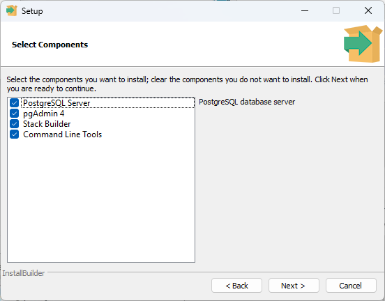
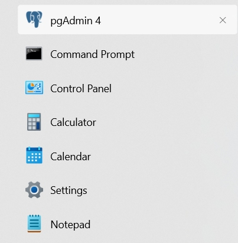
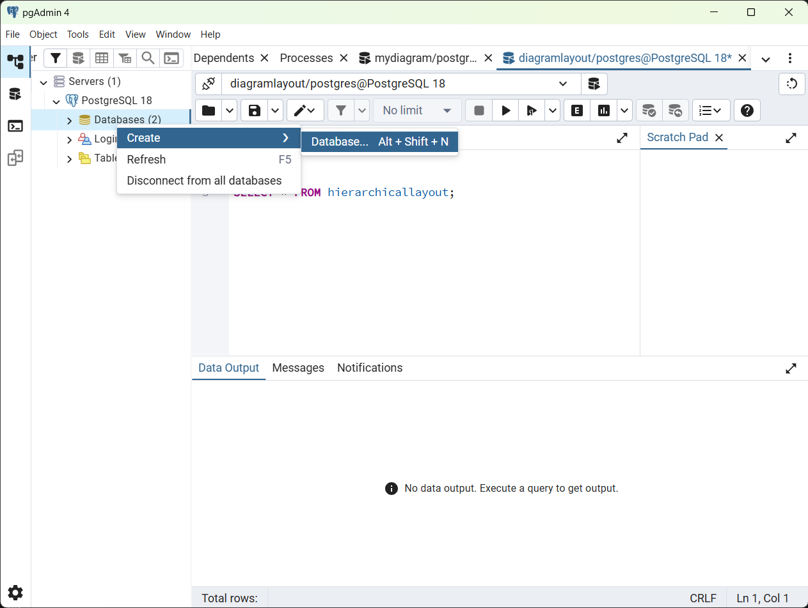
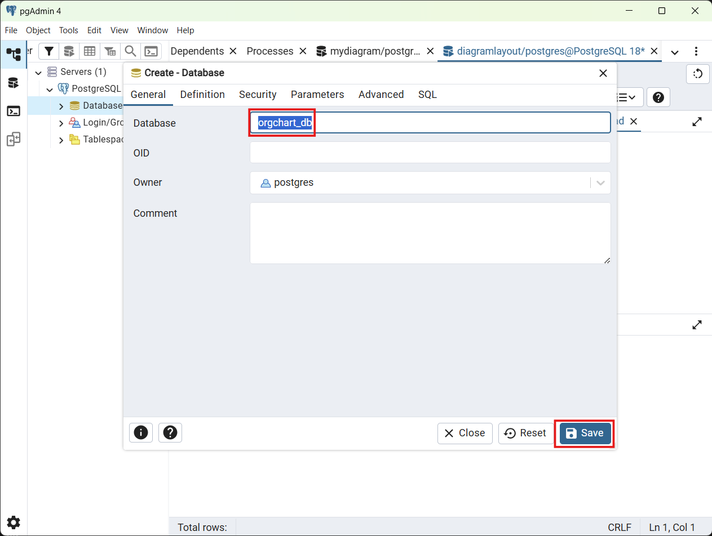
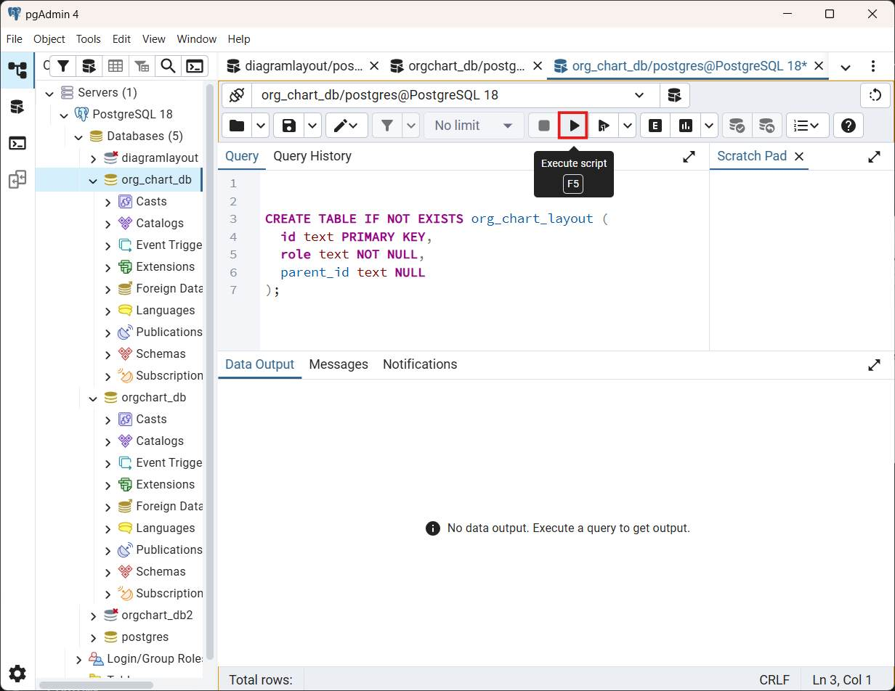
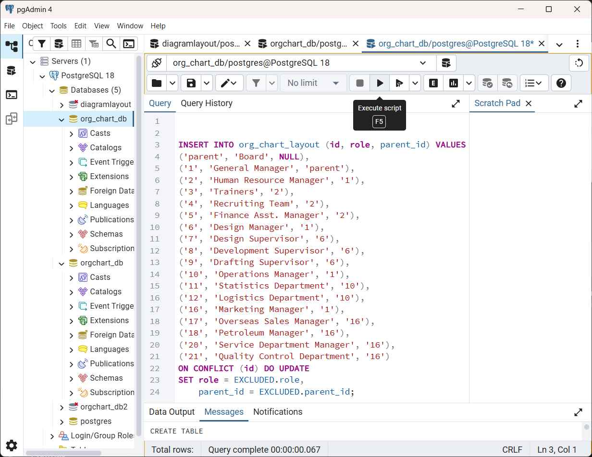
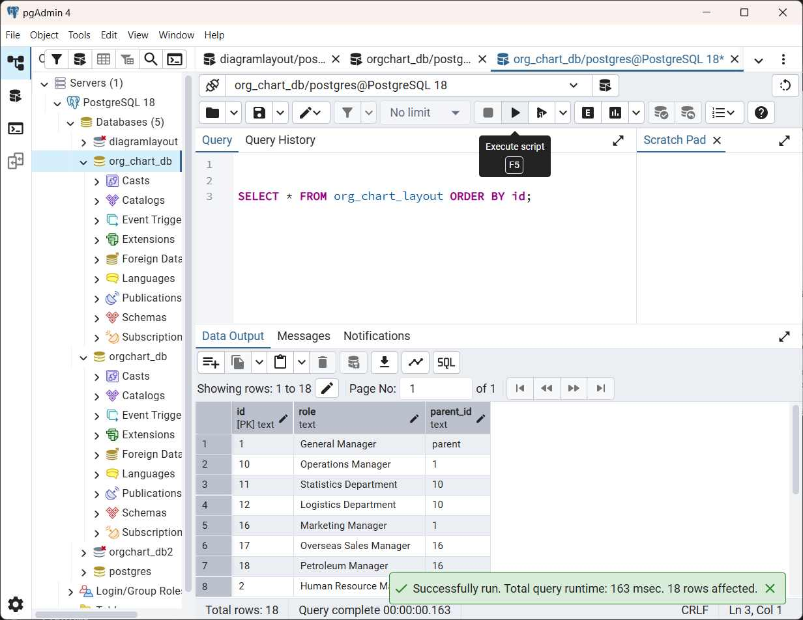

# Loading Blazor Diagram from PostgreSQL Database

This guide explains how to display an organizational chart using data stored in a PostgreSQL database and visualize it with the Syncfusion® Blazor Diagram component.

It covers:
* Design and store organizational chart data in a database.
* Connect the application to the database using Entity Framework Core.
* Make the data available through a backend API.
* Display the organizational chart in Blazor Server and Blazor WebAssembly (WASM) applications.

> **Note**: The REST API must return an array of JSON objects with **id**, **parent_id**, and **role** fields for correct data binding.

**What is Entity Framework Core?**

Entity Framework Core (EF Core) is a software tool that simplifies database operations in .NET applications. It acts as a bridge between C# code and databases such as PostgreSQL.

**Key Benefits of Entity Framework Core**

- **Automatic SQL Generation**: Entity Framework Core generates optimized SQL queries automatically, eliminating the need to write raw SQL code.
- **Type Safety**: Work with strongly typed C# objects instead of SQL strings, which helps reduce runtime errors.
- **Built-in Security**: Automatic query parameterization helps protect applications from SQL injection attacks.
- **Database Versioning with Migrations**: Database schema changes can be tracked, applied, and rolled back using migrations.
- **Familiar Syntax**: **LINQ (Language Integrated Query)** provides a readable and intuitive way to query data using C#.

**What is Npgsql Entity Framework Core Provider?**

The **Npgsql.EntityFrameworkCore.PostgreSQL** package is the official Entity Framework Core provider for PostgreSQL. It acts as a bridge between Entity Framework Core and PostgreSQL, allowing applications to read, write, update, and delete data in a PostgreSQL database.

## Prerequisites

Ensure that the following software and packages are installed:

| Software / Package | Version | Purpose |
|---|---|---|
| Visual Studio / Code | Latest | Development IDE with .NET workloads |
| .NET SDK | 10.0 or later | Build & run projects |
| PostgreSQL Server | 12.x or later | Stores organizational chart data |
| pgAdmin 4 (optional) | Latest | DB management UI |
| Syncfusion.Blazor.Diagram | {{site.blazorversion}} | Diagram component |
| Syncfusion.Blazor.Themes | {{site.blazorversion}} | Styling for Syncfusion® Blazor components |
| Microsoft.EntityFrameworkCore.Design | 10.x |  EF Core design‑time tools |
| Microsoft.EntityFrameworkCore.Tools | 10.x | EF Core CLI tools |
| Npgsql.EntityFrameworkCore.PostgreSQL | 10.x | EF provider for PostgreSQL |

## Installing PostgreSQL

Download PostgreSQL from the official website: [https://www.postgresql.org/download/](https://www.postgresql.org/download/).

**Installation Steps:**

1. Download the installer for the preferred version (12.x or higher recommended).
2. Run the installer and follow the setup wizard.
3. During installation:
  - Set a password for PostgreSQL (for example, postgres123) and remember it.
  - Keep the default port **5432**.
  - Next, the Select Components screen will open.
  - By default, all options are selected, as shown in the image:
    
  - Uncheck the **Stack Builder** option — it is not necessary for this setup.
  - Ensure **PostgreSQL Server**, **pgAdmin 4**, and **Command Line Tools** are selected.
4. Complete the installation.


## PostgreSQL Database Setup

Two options are available to create a database:
  * Manual (pgAdmin 4)
  * Automated Database Setup Using EF Core Migrations.

### Option A: Manual (pgAdmin 4)

#### Opening pgAdmin

PostgreSQL includes pgAdmin 4, a graphical tool for database management. Open pgAdmin 4 from the Windows Start menu or application launcher.



#### Creating the Database

Right-click on the **Databases** option and select **Create** → **Database**.



In the **Create - Database** dialog:
1. Enter **org_chart_db** as the database name. 
2. Click **Save** to create the database.



After creating the database, right-click the **org_chart_db** database and choose **Query Tool** from the context menu.

**Quick procedure before running SQL:**

- Clear the editor (Ctrl+A → Delete) to remove any previous statements.
- Enter the SQL, then click **Execute / Execute Query** (or press **F5**) to run it.
- After execution, clear the editor again before entering the next statement.

Follow this simple sequence for every SQL in this guide.

#### Creating the Table

Run the following SQL to create the **org_chart_layout** table:

```sql
CREATE TABLE IF NOT EXISTS org_chart_layout (
  id text PRIMARY KEY,
  role text NOT NULL,
  parent_id text NULL
);
```


The table structure includes:
- **id** – Primary key for unique node identification.
- **role** – Display text for the node in the organizational chart layout.
- **parent_id** – Foreign key reference to the parent node (NULL for root).

#### Inserting Sample Data

Add organizational chart data using the SQL **INSERT** statement. The sample data shows a typical organizational structure with board, management, and department levels.

```sql
INSERT INTO org_chart_layout (id, role, parent_id) VALUES
('parent', 'Board', NULL),
('1', 'General Manager', 'parent'),
('2', 'Human Resource Manager', '1'),
('3', 'Trainers', '2'),
('4', 'Recruiting Team', '2'),
('5', 'Finance Asst. Manager', '2'),
('6', 'Design Manager', '1'),
('7', 'Design Supervisor', '6'),
('8', 'Development Supervisor', '6'),
('9', 'Drafting Supervisor', '6'),
('10', 'Operations Manager', '1'),
('11', 'Statistics Department', '10'),
('12', 'Logistics Department', '10'),
('16', 'Marketing Manager', '1'),
('17', 'Overseas Sales Manager', '16'),
('18', 'Petroleum Manager', '16'),
('20', 'Service Department Manager', '16'),
('21', 'Quality Control Department', '16')
ON CONFLICT (id) DO UPDATE
SET role = EXCLUDED.role,
    parent_id = EXCLUDED.parent_id;
```



#### Verifying Data Insertion

Run a **SELECT** query to confirm the data insertion:

```sql
SELECT * FROM org_chart_layout ORDER BY id;
```

The query should return 18 rows. Parent–child relationships are indicated by the **parent_id** column, which references the **id** of the parent node (NULL for root nodes).



### Option B — Automated Database Setup Using EF Core Migrations

As an alternative to manually creating database tables and inserting data using SQL scripts, this project supports automated database setup using Entity Framework Core (EF Core) migrations. This approach allows the database schema and initial data to be created directly from the application’s data model and configuration, ensuring consistency between the code and the database.

When EF Core migrations are applied, the following actions occur:

**Database Creation**: If the target PostgreSQL database specified in the connection string does not exist, EF Core creates the database when migrations are executed, provided that the database server is reachable and the user has sufficient permissions.
**Schema Generation**: EF Core creates the required database schema based on the `AppDbContext` configuration. This includes creating the **org_chart_layout** table and applying primary keys and indexes.
**Data Seeding**: Initial organizational chart records are inserted into the database using the seed data defined in `AppDbContext.OnModelCreating()` via the `HasData()` method.

The exact procedure for creating and applying migrations is described in the [automated database initialization and seeding](#step-8-automated-database-initialization-and-seeding).

## Backend Implementation

### Step 1: Install Required NuGet Packages

Before installing the necessary NuGet packages, a new Blazor web application must be created using the default template. For full step-by-step instructions on creating a Blazor project, see the getting-started guide: **[Getting Started](https://blazor.syncfusion.com/documentation/diagram/getting-started)**.

For this guide, a Blazor application named **BlazorServerStyle** has been created. Once the project is set up, the next step involves installing the required NuGet packages. These packages enable Entity Framework Core and PostgreSQL integration.

> **Note**:
In Blazor Server, the UI, API, and EF Core all run in the same project.
In Blazor WebAssembly, the API and EF Core must run in a Server host project, and the WASM client calls it over HTTP.

**Method 1: Using Package Manager Console**

1. Open Visual Studio 2026.
2. Navigate to **Tools → NuGet Package Manager → Package Manager Console**.
3. Run the following commands:

```powershell
Install-Package Microsoft.EntityFrameworkCore -Version 10.0.2; 
Install-Package Npgsql.EntityFrameworkCore.PostgreSQL -Version 10.0.0; 
Install-Package Syncfusion.Blazor.Diagram -Version {{site.blazorversion}}; 
Install-Package Syncfusion.Blazor.Themes -Version {{site.blazorversion}}
```

**Method 2: Using NuGet Package Manager UI**

1. Open **Visual Studio 2026 → Tools → NuGet Package Manager → Manage NuGet Packages for Solution**.
2. Search for and install each package individually:
   - **Microsoft.EntityFrameworkCore** (version 10.0.2 or later)
   - **Npgsql.EntityFrameworkCore.PostgreSQL** (version 10.0.0 or later)
   - **[Syncfusion.Blazor.Diagram](https://www.nuget.org/packages/Syncfusion.Blazor.Diagram/)** (version {{site.blazorversion}})
   - **[Syncfusion.Blazor.Themes](https://www.nuget.org/packages/Syncfusion.Blazor.Themes/)** (version {{site.blazorversion}})

**Method 3: Using Integrated Terminal in Visual Studio Code**

Install NuGet packages from the Visual Studio Code terminal (run these from the project folder):

```powershell
dotnet add package Microsoft.EntityFrameworkCore --version 10.0.2
dotnet add package Npgsql.EntityFrameworkCore.PostgreSQL --version 10.0.0
dotnet add package Syncfusion.Blazor.Diagram --version <your-syncfusion-version>
dotnet add package Syncfusion.Blazor.Themes --version <your-syncfusion-version>
```

**Project File Reference**

The installed packages are reflected in the **BlazorServerStyle.csproj** file:

```xml
<ItemGroup>
    <PackageReference Include="Microsoft.EntityFrameworkCore" Version="10.0.2" />
    <PackageReference Include="Npgsql.EntityFrameworkCore.PostgreSQL" Version="10.0.0" />
    <PackageReference Include="Syncfusion.Blazor.Diagram" Version="*" />
    <PackageReference Include="Syncfusion.Blazor.Themes" Version="*" />
</ItemGroup>
```

### Step 2: Create the Data Model

A data model is a C# class that represents the structure of a database table. This model defines the properties that correspond to the columns in the **org_chart_layout** table.

**Instructions:**

1. Create a new folder named **Models** in the Blazor application project.
2. Inside the **Models** folder, create a new file named **LayoutNode.cs**.
3. Define the `LayoutNode` class with the following code:

```csharp
using System.ComponentModel.DataAnnotations;

namespace BlazorServerStyle.Models;

public class LayoutNode
{
    public string Id { get; set; } = null!;
    public string? ParentId { get; set; }
    public string Role { get; set; } = null!;
}
```

### Step 3: Configure the DbContext

A `DbContext` is a special class that manages the connection between the Blazor application and the PostgreSQL database. It handles all database operations such as saving, updating, deleting, and retrieving data.

**Instructions:**

1. Create a new folder named **Data** in the Blazor application project.
2. Inside the **Data** folder, create a new file named **AppDbContext.cs**.
3. Define the `AppDbContext` class with the following code:

```csharp
using Microsoft.EntityFrameworkCore;
using BlazorServerStyle.Models;  // Or your namespace

namespace BlazorServerStyle.Data;

public class AppDbContext : DbContext
{
    public DbSet<LayoutNode> OrgChartLayouts { get; set; } = null!;

    public AppDbContext(DbContextOptions<AppDbContext> options) : base(options) { }

    protected override void OnModelCreating(ModelBuilder modelBuilder)
    {
        modelBuilder.Entity<LayoutNode>()
            .ToTable("org_chart_layout")
            .HasKey(n => n.Id);

        modelBuilder.Entity<LayoutNode>()
            .Property(n => n.ParentId)
            .HasColumnName("parent_id");

        modelBuilder.Entity<LayoutNode>()
            .Property(n => n.Role)
            .HasColumnName("role")
            .IsRequired();

        modelBuilder.Entity<LayoutNode>()
            .HasIndex(n => n.ParentId);

        // Seed data
        modelBuilder.Entity<LayoutNode>().HasData(
            new LayoutNode { Id = "parent", ParentId = null, Role = "Board" },
            new LayoutNode { Id = "1",      ParentId = "parent", Role = "General Manager" },
            new LayoutNode { Id = "2",      ParentId = "1",      Role = "Human Resource Manager" },
            new LayoutNode { Id = "3",      ParentId = "2",      Role = "Trainers" },
            new LayoutNode { Id = "4",      ParentId = "2",      Role = "Recruiting Team" },
            new LayoutNode { Id = "5",      ParentId = "2",      Role = "Finance Asst. Manager" },
            new LayoutNode { Id = "6",      ParentId = "1",      Role = "Design Manager" },
            new LayoutNode { Id = "7",      ParentId = "6",      Role = "Design Supervisor" },
            new LayoutNode { Id = "8",      ParentId = "6",      Role = "Development Supervisor" },
            new LayoutNode { Id = "9",      ParentId = "6",      Role = "Drafting Supervisor" },
            new LayoutNode { Id = "10",     ParentId = "1",      Role = "Operations Manager" },
            new LayoutNode { Id = "11",     ParentId = "10",     Role = "Statistics Department" },
            new LayoutNode { Id = "12",     ParentId = "10",     Role = "Logistics Department" },
            new LayoutNode { Id = "16",     ParentId = "1",      Role = "Marketing Manager" },
            new LayoutNode { Id = "17",     ParentId = "16",     Role = "Overseas Sales Manager" },
            new LayoutNode { Id = "18",     ParentId = "16",     Role = "Petroleum Manager" },
            new LayoutNode { Id = "20",     ParentId = "16",     Role = "Service Department Manager" },
            new LayoutNode { Id = "21",     ParentId = "16",     Role = "Quality Control Department" }
        );
    }
}
```

**Explanation:**
- The `AppDbContext` class connects the Blazor application to the PostgreSQL database.
- It maps the `LayoutNode` model to the **org_chart_layout** table.
- Column mappings, required fields, and table structure are configured in `OnModelCreating`.
- An index is added on the **parent_id** column to improve performance when loading organizational chart data.

### Step 4: Configure the Connection String

A connection string contains the information needed to connect the application to the PostgreSQL database, including the server address, database name, and authentication credentials.

**Instructions:**

1. Open the **appsettings.json** file in the project root.
2. Update the `ConnectionStrings` section with the PostgreSQL connection details:

```json
{
    "ConnectionStrings": {
        "DefaultConnection": "Server=localhost;Port=5432;Database=org_chart_db;User Id=postgres;Password=postgresql@123"
    },
  "Logging": {
    "LogLevel": {
      "Default": "Information",
      "Microsoft.AspNetCore": "Warning"
    }
  },
  "AllowedHosts": "*"
}
```

**Connection String Components:**

| Component | Description |
|-----------|-------------|
| Server | The address of the PostgreSQL server (localhost for local development) |
| Port | The port number on which PostgreSQL is running (default is 5432) |
| Database | The database name (for this guide, **org_chart_db**) |
| User Id | The PostgreSQL username |
| Password | The password for the PostgreSQL user account |


> **Security Note:** For production environments, store sensitive credentials in environment variables or Azure Key Vault instead of storing them in **appsettings.json**. Example: **Password=${DB_PASSWORD}** and set the environment variable **DB_PASSWORD** on the deployment server.

### Step 5: Create the API Controller

Create a controller file (e.g., **Controllers/LayoutController.cs**) in the current project. This controller exposes a GET API endpoint at **api/Layout** that returns all OrgChart layout records from the database.

```csharp
using BlazorServerStyle.Data;
using BlazorServerStyle.Models;
using Microsoft.AspNetCore.Mvc;
using Microsoft.EntityFrameworkCore;

namespace BlazorServerStyle.Controllers;

[ApiController]
[Route("api/[controller]")]
public class LayoutController : ControllerBase
{
    private readonly AppDbContext _db;
    
    public LayoutController(AppDbContext db) => _db = db;

    [HttpGet]
    public async Task<IActionResult> Get() => Ok(await _db.OrgChartLayouts.ToListAsync());
}
```

### Step 6: Create the LayoutService Class

The `LayoutService` class acts as an HTTP client wrapper that calls the API endpoint to retrieve organizational chart layout data. The Blazor application uses this service to load data from the **/api/layout** endpoint.

**Instructions:**

1. Inside the **Data** folder, create a new file named **LayoutService.cs**.
2. Define the `LayoutService` class with the following code:

```csharp
using BlazorServerStyle.Models;
using System.Net.Http.Json;

namespace BlazorServerStyle.Services;   // Change namespace for WASM project

public class LayoutService
{
    private readonly HttpClient _http;

    public LayoutService(HttpClient http)
    {
        _http = http;
    }

    public async Task<List<LayoutNode>?> GetOrgChartAsync()
    {
        return await _http.GetFromJsonAsync<List<LayoutNode>>("api/layout");
    }
}
```
This service encapsulates HTTP-related logic and provides a clean abstraction for retrieving layout data. By centralizing API calls in a service, Blazor components remain focused on presentation and state management.

### Step 7: Register Services in **Program.cs**

The **Program.cs** file is used to register and configure application services. This step sets up Entity Framework Core with PostgreSQL, registers API controllers, and configures application services used by the Blazor application.

**Instructions:**

1. Open the **Program.cs** file at the project root.
2. Add the following code after the line **var builder = WebApplication.CreateBuilder(args)**:

```csharp
using BlazorServerStyle.Components;
using Syncfusion.Blazor;
using Services;
using Microsoft.EntityFrameworkCore;
using BlazorServerStyle.Data;

var builder = WebApplication.CreateBuilder(args);

// Add services to the container.
builder.Services.AddRazorComponents()
    .AddInteractiveServerComponents();
builder.Services.AddSyncfusionBlazor();
builder.Services.AddHttpClient<LayoutService>("Api", client =>
{
    // Use the port shown in dotnet run output or launchSettings.json
    client.BaseAddress = new Uri("http://localhost:5069/");
});
// Add controllers and EF DbContext.
builder.Services.AddControllers();
builder.Services.AddDbContext<AppDbContext>(options =>
    options.UseNpgsql(builder.Configuration.GetConnectionString("DefaultConnection")));
var app = builder.Build();

// Configure the HTTP request pipeline.
if (!app.Environment.IsDevelopment())
{
    app.UseExceptionHandler("/Error", createScopeForErrors: true);
    // The default HSTS value is 30 days. You may want to change this for production scenarios, see https://aka.ms/aspnetcore-hsts.
    app.UseHsts();
}
app.UseStatusCodePagesWithReExecute("/not-found", createScopeForStatusCodePages: true);
app.UseHttpsRedirection();

app.UseAntiforgery();

app.UseAuthorization();

app.MapControllers();

app.MapStaticAssets();
app.MapRazorComponents<App>()
    .AddInteractiveServerRenderMode();

app.Run();
```

**Explanation:**

- `AddSyncfusionBlazor()`: Registers Syncfusion® Blazor components such as Diagram and themes.
- `AddDbContext<AppDbContext>`: Configures Entity Framework Core to use PostgreSQL via the `UseNpgsql` provider.
- `AddHttpClient<LayoutService>(...)`: Registers `LayoutService` as a typed HTTP client, enabling it to call the **/api/layout** endpoint using dependency injection.
- `AddControllers()`: Enables API controllers for handling HTTP API requests.

With these registrations:
 * The application can access the database via `AppDbContext`.
 * API endpoints are enabled.
 * Blazor components can use `LayoutService` to retrieve data from the API.

### Step 8: Automated Database Initialization and Seeding

This step initializes the PostgreSQL database using EF Core migrations. The migrations create the database (if it does not already exist), apply the schema, and insert the initial organizational chart data required by the application.

To run the migrations, open a terminal in the **server host project** that contains `AppDbContext`. Before running the commands, ensure the PostgreSQL connection string is correctly configured in the host’s **appsettings.Development.json** file.

Example (Blazor Server host):

```powershell
cd src/BlazorServerStyle
dotnet restore
dotnet build
dotnet ef migrations add InitialCreate
dotnet ef database update
```

The Blazor WebAssembly host also includes a server project and migrations. To use it instead, run the commands from that project directory:

```powershell
cd src/BlazorWASMStyle
dotnet restore
dotnet build
dotnet ef migrations add InitialCreate
dotnet ef database update
```

**What happens when you run the above commands**

```powershell
dotnet ef migrations add InitialCreate
```
Creates a migration file based on the current `AppDbContext`. This migration represents the database structure required by the application.

```powershell
dotnet ef database update
```
Applies the migration to PostgreSQL. This command:
  - Creates the database if it does not already exist.
  - Creates the required tables and schema.
  - Inserts the initial data needed by the application.

The initial data is defined using the `HasData` method inside `OnModelCreating()` in `AppDbContext`. This allows EF Core to automatically insert required base data (such as organizational chart layouts) during
migration, without writing or running manual SQL scripts.

The backend setup is now complete. The next section focuses on configuring the Blazor frontend to consume the API and display the diagram.

## Rendering the Blazor Diagram Component

### Step 1: Install and Configure Blazor Diagram Component

This section explains how to render an organizational chart using the Syncfusion® Blazor Diagram component by binding it to data loaded from the backend API.

**Instructions:**

* The Syncfusion.Blazor.Diagram package was installed in **Step 2** of the previous section **Backend Implementation**[🔗](#Backend-implementation).
* Import the required namespaces in the **Components/_Imports.razor** file:

```csharp
@using Syncfusion.Blazor
@using Syncfusion.Blazor.Diagram
```

* Before using Syncfusion® Blazor components, register your license key in **Program.cs**:

```csharp
Syncfusion.Licensing.SyncfusionLicenseProvider.RegisterLicense("YOUR LICENSE KEY");
```

* Add the Syncfusion® stylesheet and scripts to the host page **<head>** element to ensure that required assets load before the Blazor components are rendered. Use the appropriate host file based on your project type:

  - **Blazor Server (.NET 8+)**: Add the links to **Pages/App.razor** (inside the **<head>** element).
  - **Blazor WebAssembly**: Add the links to **wwwroot/index.html** (inside the **<head>** element).

```html
<!-- Syncfusion Blazor Stylesheet -->
<link href="_content/Syncfusion.Blazor.Themes/bootstrap5.css" rel="stylesheet" />

<!-- Syncfusion Blazor Scripts -->
<script src="_content/Syncfusion.Blazor.Core/scripts/syncfusion-blazor.min.js" type="text/javascript"></script>
```
For this project, the Bootstrap 5 theme is used. A different theme can be selected or the existing theme can be customized based on project requirements. Refer to the [Syncfusion Blazor Components Appearance](https://blazor.syncfusion.com/documentation/appearance/themes) documentation to learn more about theming and customization options.

For additional guidance, refer to the Diagram component [getting-started](https://blazor.syncfusion.com/documentation/diagram/getting-started-with-web-app) documentation.

### Step 2: Update the Blazor Diagram

In this step, an organizational chart layout is created using the Blazor Diagram component in the **Home.razor** file.

**Instructions:**

1. Open the file named **Home.razor** in the **Components/Pages** folder.
2. Add the following code to create a Diagram:

```cshtml
@page "/"
@using Services
@using Syncfusion.Blazor.Diagram
@using Syncfusion.Blazor.Data
@using Syncfusion.Blazor.Inputs
@using BlazorServerStyle.Models
@inject LayoutService LayoutService

@if (loading)
{
    <p>Loading organizational chart...</p>
}
else if (!string.IsNullOrEmpty(errorMessage))
{
    <div style="color: red;">Error: @errorMessage</div>
}
else if (_dataSource == null || !_dataSource.Any())
{
    <p>No data available</p>
}
else
{
    <SfDiagramComponent ID="OrgChartDiagram" @ref="_diagram" Width="100%" Height="1000px" NodeCreating="@OnNodeCreating" ConnectorCreating="@OnConnectorCreating">
        <DataSourceSettings ID="Id" ParentID="ParentId" DataSource="@_dataSource"></DataSourceSettings>
        <SnapSettings>
            <HorizontalGridLines LineColor="white" LineDashArray="2,2">
            </HorizontalGridLines>
            <VerticalGridLines LineColor="white" LineDashArray="2,2">
            </VerticalGridLines>
        </SnapSettings>
        <Layout Type="LayoutType.OrganizationalChart" @bind-HorizontalSpacing="@_horizontalSpacing" @bind-VerticalSpacing="@_verticalSpacing">
        </Layout>
    </SfDiagramComponent>
}
@code
{
    //Initializing layout.
    private int _horizontalSpacing = 40;
    private int _verticalSpacing = 50;

    //Creates nodes with default values.
    private void OnNodeCreating(IDiagramObject obj)
    {
        Node node = obj as Node;
        node.Height = 50;
        node.Width = 150;
        LayoutNode Data = node.Data as LayoutNode;
        node.Annotations = new DiagramObjectCollection<ShapeAnnotation>(){
            new ShapeAnnotation(){
                Content = Data.Role,
            }
        };
        node.Style = new ShapeStyle() { Fill = "#6495ED", StrokeWidth = 1, StrokeColor = "Black" };
    }

    //Creates connectors with default styling.
    private void OnConnectorCreating(IDiagramObject connector)
    {
        Connector connectors = connector as Connector;
        connectors.Type = ConnectorSegmentType.Orthogonal;
        connectors.Style = new TextStyle() { StrokeColor = "#6495ED", StrokeWidth = 1 };
        connectors.TargetDecorator = new DecoratorSettings
        {
            Shape = DecoratorShape.None,
            Style = new ShapeStyle() { Fill = "#6495ED", StrokeColor = "#6495ED", }
        };
    }
    private List<LayoutNode>? _dataSource;
    private bool loading = true;
    private string? errorMessage;
    private SfDiagramComponent _diagram;

    protected override async Task OnInitializedAsync()
    {
        try
        {
            _dataSource = await LayoutService.GetOrgChartAsync();
        }
        catch (Exception ex)
        {
            errorMessage = ex.Message;
        }
        finally
        {
            loading = false;
        }

        await base.OnInitializedAsync();
    }
}
```
---

## Run the Sample Locally

This section explains how to run the application locally.

**Run the Blazor Server host**

```powershell
cd src/BlazorServerStyle
dotnet run
```

**Run the Blazor WebAssembly host**

```powershell
cd src/BlazorWASMStyle/BlazorWASMStyle
dotnet run
```

## Troubleshooting

### Application or API Not Working

- Confirm that PostgreSQL is running and reachable.
- Verify the PostgreSQL connection string in **appsettings.Development.json**:
  `Server`, `Port`, `Database`, `User Id`, and `Password` must match your PostgreSQL setup.
- Run **dotnet ef database update** from the server host project to ensure migrations were applied successfully.

### No data in Diagram

- Verify that `DataSourceSettings` uses the correct property names. These property names must exactly match the model returned by the API:
  - `ID="Id"`
  - `ParentID="ParentId"`
- Check the browser developer console (F12) for errors from `LayoutService` class.
- Ensure migrations completed successfully and that seed data exists in the database
  (you may verify this directly in PostgreSQL).

---

## Complete Sample Repository

A complete, working sample implementation is available in the [GitHub repository](https://github.com/SyncfusionExamples/Blazor-Diagram-Examples/tree/master/Samples/OrganizationalChartPostgresql).

You can clone the repository, update the PostgreSQL connection string, apply migrations, and run the project to see the organizational chart in action.

## Summary

This guide demonstrates how to:

1. Install PostgreSQL. [🔗](#installing-postgresql)
2. Create a PostgreSQL database with layout nodes using pgAdmin 4. [🔗](#postgresql-database-setup)
3. Configure backend implementations. [🔗](#backend-implementation)
4. Create data models and DbContext for database communication with PostgreSQL-specific configuration. [🔗](#step-2-create-the-data-model)
5. Configure connection strings and register services. [🔗](#step-4-configure-the-connection-string)
6. HTTP service abstraction for data access using helper methods. [🔗](#step-6-create-the-layoutservice-class)
7. Create a Blazor component with a Diagram that visualizes data as an Organizational Chart layout. [🔗](#rendering-the-blazor-diagram-component)

The application now provides a complete solution for visualizing organizational chart data from PostgreSQL.

## See Also
- [Data Binding](https://blazor.syncfusion.com/documentation/diagram/data-binding#how-to-specify-parent-child-relationship-in-data-source)
- [Organizational Chart Layout](https://blazor.syncfusion.com/documentation/diagram/layout/organizational-chart)
