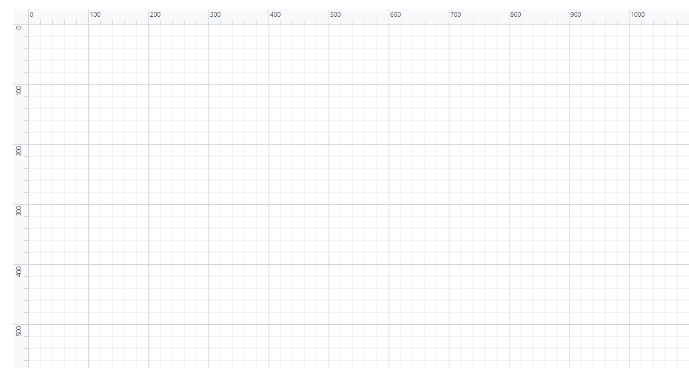

# Ruler Settings in Blazor Diagram Component

The Ruler provides horizontal and vertical guides for measuring in the Diagram control. It can be used to measure diagram objects, indicate positions, and align diagram elements, making it especially useful in creating scale models.

### Adding Rulers to the Diagram Component

- The `RulerSettings` property is used to control the visibility and appearance of the ruler in the diagram.

The following code demonstrates how to add a ruler to the diagram.

```cshtml
@using Syncfusion.Blazor.Diagram

<SfDiagramComponent @ref="@diagram" Height="600px" >
	<RulerSettings>
        <HorizontalRuler>
          </HorizontalRuler>
        <VerticalRuler >
          </VerticalRuler>
    </RulerSettings>
</SfDiagramComponent>

```



## Customizing the Ruler

- The `RulerSettings` `HorizontalRuler` and `VerticalRuler` properties are used to customize the appearance of the rulers in the diagram.

* `HorizontalRuler` - Defines the appearance of the horizontal ruler.
* `VerticalRuler` - Defines the appearance of the vertical ruler.
* Ruler `Interval` - The interval property allows you to define the interval between both horizontal and vertical ruler segments.
* Ruler `IsVisible` - It is used to define whether the horizontal and vertical rulers are visible in the diagram.
* `TickAlignment` - It controls the positioning of the ticks/hash marks in the ruler.
* `MarkerColor` - Determines the color of the marker line/guide line for the ruler, the one which represents current position of cursor in diagram.

The code below demonstrates how the diagram ruler can be customized.

```cshtml
@using Syncfusion.Blazor.Diagram

<SfDiagramComponent @ref="@diagram" Height="600px" >
	<RulerSettings>
        <HorizontalRuler  IsVisible="true" Interval="@RulerInterval" 
                            TickAlignment="@RulerTickAlignment" MarkerColor="@RulerMarkerColor">
     </HorizontalRuler>
        <VerticalRuler IsVisible="false"  Interval="@RulerInterval" 
                        TickAlignment="@RulerTickAlignment" MarkerColor="@RulerMarkerColor">
        </VerticalRuler>
    </RulerSettings>
</SfDiagramComponent>

@code
{
    //Reference to diagram.
    SfDiagramComponent diagram;
    //Defining Ruler Interval of Rulers
    public int RulerInterval = 20;
    //Defining Tick Alignment of Rulers
    public TickAlignment RulerTickAlignment = TickAlignment.RightAndBottom;
    //Defining Marker color of Rulers
    public string RulerMarkerColor = "green";

}

```
You can download a complete working sample from [GitHub](https://github.com/SyncfusionExamples/Blazor-Diagram-Examples/tree/master/UG-Samples/Ruler/CustomizingRuler)

