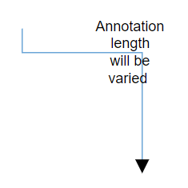
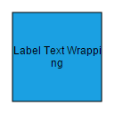
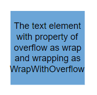
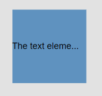
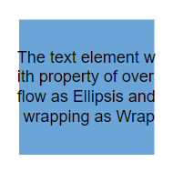
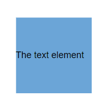
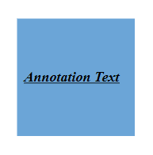
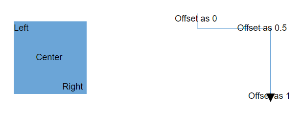

# Appearance in Blazor Diagram Component

## Customize the size for an annotation

Diagram allows you set size for annotations by using the Height and Width properties. The default value of the [`Width`](https://help.syncfusion.com/cr/blazor/Syncfusion.Blazor.Diagrams.DiagramConnectorAnnotation.html#Syncfusion_Blazor_Diagrams_DiagramConnectorAnnotation_Width), and [`Height`](https://help.syncfusion.com/cr/blazor/Syncfusion.Blazor.Diagrams.DiagramConnectorAnnotation.html#Syncfusion_Blazor_Diagrams_DiagramConnectorAnnotation_Height) properties are 0, and it takes the node or connector size as default.

The following code example shows how the annotation size is customized.

```cshtml
@using Syncfusion.Blazor.Diagrams
@using System.Collections.ObjectModel
<SfDiagram Height="600px" Connectors="@ConnectorCollection">
</SfDiagram>

@code
{
    //Defines diagram's connector collection
    public ObservableCollection<DiagramConnector> ConnectorCollection { get; set; }

    protected override void OnInitialized()
    {

        ConnectorCollection = new ObservableCollection<DiagramConnector>();
        DiagramConnector connector = new DiagramConnector()
        {
          SourcePoint = new ConnectorSourcePoint() { X = 300, Y = 40 },
            TargetPoint = new ConnectorTargetPoint() { X = 400, Y = 160 },
            Type = Segments.Orthogonal,
            Style = new ConnectorShapeStyle() { StrokeColor = "#6BA5D7" },
          Annotations = new ObservableCollection<DiagramConnectorAnnotation>()
            {
              new DiagramConnectorAnnotation() { Content = "Annotation length will be varied", Width = 50, Height = 50 },
            }
        };

        ConnectorCollection.Add(connector);
    }
}
```



## Hyperlink

Diagram provides support to add a [`Hyperlink`](https://help.syncfusion.com/cr/blazor/Syncfusion.Blazor.Diagrams.DiagramNodeAnnotation.html#Syncfusion_Blazor_Diagrams_DiagramNodeAnnotation_Hyperlink) to the nodes or connectors annotation. It can also be customized.

```cshtml
@using Syncfusion.Blazor.Diagrams
@using System.Collections.ObjectModel
    <SfDiagram Height="600px" Nodes="@NodeCollection">
    </SfDiagram>

@code
{
    //Defines diagram's node collection
    public ObservableCollection<DiagramNode> NodeCollection { get; set; }

    protected override void OnInitialized()
    {
        NodeCollection = new ObservableCollection<DiagramNode>();
        DiagramNode node1 = new DiagramNode()
        {
            Id = "node1",
            Width = 100,
            Height = 100,
            OffsetX = 100,
            OffsetY = 100,
            // Sets the annotation for the Node
            Annotations = new ObservableCollection<DiagramNodeAnnotation>() {
                // Add text as hyperlink.
                new DiagramNodeAnnotation() { Hyperlink = new NodeHyperlink(){ Link = "https://www.syncfusion.com"} }
            },

            Style = new NodeShapeStyle() { Fill = "#6BA5D7", StrokeColor = "white" },
        };
        NodeCollection.Add(node1);

    }
}
```


### Hyperlink with content

```cshtml
@using Syncfusion.Blazor.Diagrams
@using System.Collections.ObjectModel
<SfDiagram Height="600px" Nodes="@NodeCollection">
</SfDiagram>

@code
{
    //Defines diagram's node collection
    public ObservableCollection<DiagramNode> NodeCollection { get; set; }

    protected override void OnInitialized()
    {
        NodeCollection = new ObservableCollection<DiagramNode>();
        DiagramNode node1 = new DiagramNode()
        {
            Id = "node1",
            Width = 100,
            Height = 100,
            OffsetX = 100,
            OffsetY = 100,
            // Sets the annotation for the Node
            Annotations = new ObservableCollection<DiagramNodeAnnotation>() {
                // Add text as hyperlink.
                new DiagramNodeAnnotation() { Hyperlink = new NodeHyperlink(){ Content = "Syncfusion", Link = "https://www.syncfusion.com" } }
            },

            Style = new NodeShapeStyle() { Fill = "#6BA5D7", StrokeColor = "white" },
        };
        NodeCollection.Add(node1);

    }
}
```


## Wrapping

When text overflows node boundaries, you can control it by using the [`TextWrapping`](https://help.syncfusion.com/cr/blazor/Syncfusion.Blazor.Diagrams.AnnotationStyle.html#Syncfusion_Blazor_Diagrams_AnnotationStyle_TextWrapping). So, it is wrapped into multiple lines. The wrapping property of the annotation defines how the text should be wrapped. 

The following code explains how to wrap a text in a node.

```cshtml
@using Syncfusion.Blazor.Diagrams
@using System.Collections.ObjectModel
<SfDiagram Height="600px" Nodes="@NodeCollection">
</SfDiagram>

@code
{
    //Defines diagram's node collection
    public ObservableCollection<DiagramNode> NodeCollection { get; set; }

    protected override void OnInitialized()
    {
        NodeCollection = new ObservableCollection<DiagramNode>();
        DiagramNode node1 = new DiagramNode()
        {
            Id = "node1",
            Width = 100,
            Height = 100,
            OffsetX = 100,
            OffsetY = 100,
            //Sets the annotation for the node
            Annotations = new ObservableCollection<DiagramNodeAnnotation>() {
                new DiagramNodeAnnotation() {Content = "Annotation Text Wrapping",Style = new AnnotationStyle(){ TextWrapping = TextWrap.Wrap} }
            },

            Style = new NodeShapeStyle() { Fill = "#6BA5D7", StrokeColor = "white" },
        };
        NodeCollection.Add(node1);

    }
}

```

| Value | Description | Image |
| -------- | -------- | -------- |
| No Wrap | Text will not be wrapped. |  |
| Wrap | Text-wrapping occurs, when the text overflows beyond the available node width. |  |
| WrapWithOverflow (Default) | Text-wrapping occurs, when the text overflows beyond the available node width. However, the text may overflow beyond the node width in the case of a very long word. |  |

### Text overflow

The [`TextOverflow`](https://help.syncfusion.com/cr/blazor/Syncfusion.Blazor.Diagrams.AnnotationStyle.html#Syncfusion_Blazor_Diagrams_AnnotationStyle_TextOverflow) property specifies how the overflowed content that is not displayed should be signaled to the user. The TextOverflow can have the following values.

* **Wrap**: Wraps the text to next line, when it exceeds its bounds.
* **Ellipsis**: It truncates the overflown text and render an ellipsis ("...") to represent the clipped text.
* **Clip**: The text is clipped and the overflow text will not be shown.

The following code sample shows how the different types of overflow property working for the different types of text wrapping.

```cshtml
@using Syncfusion.Blazor.Diagrams
@using System.Collections.ObjectModel
<SfDiagram Height="600px" Nodes="@NodeCollection">
</SfDiagram>

@code
{
    //Defines diagram's node collection
    public ObservableCollection<DiagramNode> NodeCollection { get; set; }

    protected override void OnInitialized()
    {
        NodeCollection = new ObservableCollection<DiagramNode>();
        DiagramNode node1 = new DiagramNode()
        {
            Id = "node1",
            Width = 100,
            Height = 100,
            OffsetX = 100,
            OffsetY = 100,
            // Sets the style for the text to be displayed
            Annotations = new ObservableCollection<DiagramNodeAnnotation>() {
                new DiagramNodeAnnotation() {Content = "The text element with property of overflow as Wrap and wrapping as NoWrap",Style = new AnnotationStyle(){ TextOverflow = TextOverflow.Wrap,TextWrapping=TextWrap.NoWrap } },
            },

            Style = new NodeShapeStyle() { Fill = "#6BA5D7", StrokeColor = "white" },
        };
        NodeCollection.Add(node1);

    }
}

```

| TextOverflow | Wrapping | Image |
| -------- | -------- | -------- |
| Wrap | No Wrap |  |
| Wrap| Wrap |  |
| Wrap | WrapWithOverflow |  |
| Ellipsis | No Wrap |  |
| Ellipsis| Wrap |  |
| Ellipsis | WrapWithOverflow |  |
| Clip | No Wrap |  |
| Clip| Wrap |  |
| Clip | WrapWithOverflow |  |

> All the customization over the overflow is also applicable to connector’s annotation.

## Change the appearance of annotation

You can change the font style of the annotations with the font specific properties (FontSize, FontFamily, Color). The following code explains how to customize the appearance of the annotation.

* The label’s [`Bold`](https://help.syncfusion.com/cr/blazor/Syncfusion.Blazor.Diagrams.AnnotationStyle.html#Syncfusion_Blazor_Diagrams_AnnotationStyle_Bold), [`Italic`](https://help.syncfusion.com/cr/blazor/Syncfusion.Blazor.Diagrams.AnnotationStyle.html#Syncfusion_Blazor_Diagrams_AnnotationStyle_Italic), and [`TextDecoration`](https://help.syncfusion.com/cr/blazor/Syncfusion.Blazor.Diagrams.AnnotationStyle.html#Syncfusion_Blazor_Diagrams_AnnotationStyle_TextDecoration) properties are used to style the label’s text.

* The label’s [`Fill`](https://help.syncfusion.com/cr/blazor/Syncfusion.Blazor.Diagrams.AnnotationStyle.html#Syncfusion_Blazor_Diagrams_AnnotationStyle_Fill), [`StrokeColor`](https://help.syncfusion.com/cr/blazor/Syncfusion.Blazor.Diagrams.AnnotationStyle.html#Syncfusion_Blazor_Diagrams_AnnotationStyle_StrokeColor), and [`StrokeWidth`](https://help.syncfusion.com/cr/blazor/Syncfusion.Blazor.Diagrams.AnnotationStyle.html#Syncfusion_Blazor_Diagrams_AnnotationStyle_StrokeWidth) properties are used to define the background color and border color of the annotation and the `Opacity` property is used to define the transparency of the annotations.

* The [`Visibility`](https://help.syncfusion.com/cr/blazor/Syncfusion.Blazor.Diagrams.DiagramNodeAnnotation.html#Syncfusion_Blazor_Diagrams_DiagramNodeAnnotation_Visibility) property of the annotation enables or disables the visibility of annotation.

The Fill, Border, and Opacity appearances of the text can also be customized with appearance specific properties of annotation. The following code explains how to customize Background, Opacity, and Border of the annotation.

```cshtml
@using Syncfusion.Blazor.Diagrams
@using System.Collections.ObjectModel
<SfDiagram Height="600px" Nodes="@NodeCollection">
</SfDiagram>

@code
{
    //Defines diagram's node collection
    public ObservableCollection<DiagramNode> NodeCollection { get; set; }
    protected override void OnInitialized()
    {
        NodeCollection = new ObservableCollection<DiagramNode>();
        DiagramNode node1 = new DiagramNode()
        {
            Id = "node1",
            Width = 100,
            Height = 100,
            OffsetX = 100,
            OffsetY = 100,
            // Sets the annotation for the node
            Annotations = new ObservableCollection<DiagramNodeAnnotation>() {
              new DiagramNodeAnnotation() {Content = "Annotation Text",Style = new AnnotationStyle() {Color="black",Bold = true,Italic = true,TextDecoration=TextDecoration.Underline,FontSize = 12,FontFamily = "TimesNewRoman"  } }
            },

            Style = new NodeShapeStyle() { Fill = "#6BA5D7", StrokeColor = "white" },
        };
        NodeCollection.Add(node1);

    }
}

```



## Update the annotation style at runtime

You can change the font style of the annotations with the font specific properties (FontSize, FontFamily, and Color). The following code explains how to update the appearance of the annotation.

```cshtml
@using Syncfusion.Blazor.Diagrams
@using System.Collections.ObjectModel
<input type="button" value="Update Style" @onclick="@UpdateStyle" />
<SfDiagram @ref="@Diagram" Height="600px" Nodes="@NodeCollection">
</SfDiagram>

@code
{
    // Reference of the diagram
    SfDiagram Diagram;
    //Defines diagram's node collection
    public ObservableCollection<DiagramNode> NodeCollection { get; set; }
    protected override void OnInitialized()
    {
        NodeCollection = new ObservableCollection<DiagramNode>();
        DiagramNode node1 = new DiagramNode()
        {
            Id = "node1",
            Width = 100,
            Height = 100,
            OffsetX = 100,
            OffsetY = 100,
            // Sets the annotation for the node
            Annotations = new ObservableCollection<DiagramNodeAnnotation>() {
                new DiagramNodeAnnotation() {
                    Content = "Annotation Text",
                    Style = new AnnotationStyle() {
                        Color = "black",Bold = true,Italic = true,
                        TextDecoration = TextDecoration.Underline,
                        FontSize = 12, FontFamily = "TimesNewRoman"
                    }
                }
            },
            Style = new NodeShapeStyle() { Fill = "#6BA5D7", StrokeColor = "white" },
        };
        NodeCollection.Add(node1);
    }

    public void UpdateStyle()
    {
        // Change the style of the annotation
        Diagram.BeginUpdate();
        Diagram.Nodes[0].Annotations[0].Style.Bold = false;
        Diagram.Nodes[0].Annotations[0].Style.TextDecoration = TextDecoration.None;
        Diagram.Nodes[0].Annotations[0].Style.Color = "Red";
        Diagram.EndUpdate();
    }
}
```

## Change the editing mode

Diagram provides support to edit an annotation at runtime, either programmatically or interactively. By default, the annotation is in view mode. But it can be brought to edit mode in two ways.

* You can edit the annotation Programmatically by using the [`StartTextEdit`](https://help.syncfusion.com/cr/blazor/Syncfusion.Blazor.Diagrams.SfDiagram.html#Syncfusion_Blazor_Diagrams_SfDiagram_StartTextEdit_System_Object_System_String_) method.
* Also, you can edit the annotation interactively.
* By double-clicking the annotation.
* By selecting the item and pressing the F2 key.

Double-clicking any annotation will enable the editing and the node enables first annotation editing. When the focus of editor is lost, the annotation for the node is updated. When you double-click the node/connector/diagram model, the [`DoubleClick`](https://help.syncfusion.com/cr/blazor/Syncfusion.Blazor.Diagrams.DiagramEvents.html#Syncfusion_Blazor_Diagrams_DiagramEvents_OnDoubleClick) event gets triggered.

## Set annotation to read only

Diagram allows to create read-only annotations. You have to set the read-only property of annotation to enable or disable the read-only [`Constraints`](https://help.syncfusion.com/cr/blazor/Syncfusion.Blazor.Diagrams.DiagramNodeAnnotation.html#Syncfusion_Blazor_Diagrams_DiagramNodeAnnotation_Constraints). The following code explains how to enable read-only mode.

```cshtml
@using Syncfusion.Blazor.Diagrams
@using System.Collections.ObjectModel
<SfDiagram Height="600px" Nodes="@NodeCollection">
</SfDiagram>

@code
{
    //Defines diagram's node collection
    public ObservableCollection<DiagramNode> NodeCollection { get; set; }

    protected override void OnInitialized()
    {
        NodeCollection = new ObservableCollection<DiagramNode>();
        DiagramNode node1 = new DiagramNode()
        {
            Id = "node1",
            Width = 100,
            Height = 100,
            OffsetX = 100,
            OffsetY = 100,
            //Sets the constraints as Read only
            Annotations = new ObservableCollection<DiagramNodeAnnotation>() {
                new DiagramNodeAnnotation() {Content = "Annotation Text",Constraints = AnnotationConstraints.ReadOnly} },

            Style = new NodeShapeStyle() { Fill = "#6BA5D7", StrokeColor = "white" },
        };
        NodeCollection.Add(node1);

    }
}

```

## Create multiple annotations

You can add any number of annotations to a node or connector. The following code example shows how to add multiple annotations to a node. Different labels by position is same or different point of the shapes of connector depends upon the offset values specified.

```cshtml
@using Syncfusion.Blazor.Diagrams
@using System.Collections.ObjectModel
<SfDiagram Height="600px" Nodes="@NodeCollection">
</SfDiagram>

@code
{
    //Defines diagram's node collection
    public ObservableCollection<DiagramNode> NodeCollection { get; set; }

    //Defines diagram's connector collection
    public ObservableCollection<DiagramConnector> ConnectorCollection { get; set; }

    protected override void OnInitialized()
    {
        NodeCollection = new ObservableCollection<DiagramNode>();
        DiagramNode node1 = new DiagramNode()
        {
            Id = "node1",
            Width = 100,
            Height = 100,
            OffsetX = 100,
            OffsetY = 100,
            Style = new NodeShapeStyle() { Fill = "#6BA5D7", StrokeColor = "white" },
            // Sets the multiple annotation for the node
            Annotations = new ObservableCollection<DiagramNodeAnnotation>() {
                new DiagramNodeAnnotation() {Content = "Left",Offset = new NodeAnnotationOffset(){ X = .12,Y = .1} },
            new DiagramNodeAnnotation() {Content = "Center",Offset = new NodeAnnotationOffset(){ X = .5,Y = .5} },
            new DiagramNodeAnnotation() {Content = "Right",Offset = new NodeAnnotationOffset(){ X = .82,Y = .9} }
            },


        };
        NodeCollection.Add(node1);
              ConnectorCollection = new ObservableCollection<DiagramConnector>();
        DiagramConnector connector = new DiagramConnector()
        {
          SourcePoint = new ConnectorSourcePoint() { X = 300, Y = 40 },
            TargetPoint = new ConnectorTargetPoint() { X = 400, Y = 160 },
            Type = Segments.Orthogonal,
            Style = new ConnectorShapeStyle() { StrokeColor = "#6BA5D7" },
          Annotations = new ObservableCollection<DiagramConnectorAnnotation>()
            {
                new DiagramConnectorAnnotation() { Content = "Offset as 0",Offset=0 },
                new DiagramConnectorAnnotation() { Content = "Offset as 0.5",Offset=0.5 },
                new DiagramConnectorAnnotation() { Content = "Offset as 1",Offset=1 },
            }
        };

        ConnectorCollection.Add(connector);

    }
}

```



>* Type of the annotation’s property of the node or connector was ObservableCollection.
>* Default value of the annotation will be null.
>* All the same customization can be applicable for the annotations.
>* Text Editing can be stated only the first annotation of the annotation collection when you double click the node or connector.

## Constraints

[`AnnotationConstraints`](https://help.syncfusion.com/cr/blazor/Syncfusion.Blazor.Diagrams.AnnotationConstraints.html) are used to enable or disable certain behaviors of the annotation. Constraints are provided as flagged enumerations, so that multiple behaviors can be enabled or disabled with bitwise operators.

AnnotationConstraints may have multiple behaviors as follows:

| Constraints | Usages |
|---|---|
| ReadOnly | Enables or disables whether the annotation to be read only or not. |
| Select | Enables or disables whether the annotation to be selectable. |
| Drag | Enables or disables whether the annotation to be dragged. |
| Resize | Enables or disables an Annotation to be Resized. |
| Rotate | Enables or disables whether the annotation to be Rotated. |
| Interaction | Enables or disables select, drag, resize and rotate behaviors. |
| None | Disables all behaviors of Annotation. |

>The default value is AnnotationConstraints.InheritReadOnly for constraints property of the annotation.

Refer to [`Constraints`](https://help.syncfusion.com/cr/blazor/Syncfusion.Blazor.Diagrams.AnnotationConstraints.html) to learn about how to enable or disable the annotation constraints.

## Annotation template

Diagram provides the template support for annotation. You should define an SVG/HTML content to the diagram’s AnnotationTemplate property.

The following code explains how to define a template in node’s annotation. similarly, you can define it in connectors.

```csharp
<style>

    th {
        border: 5px solid #c1dad7
    }

    td {
        border: 5px solid #c1dad7
    }

    .c1 {
        background: #4b8c74
    }

    .c2 {
        background: #74c476
    }

    .c3 {
        background: #a4e56d
    }

    .c4 {
        background: #cffc83
    }
</style>
@using Syncfusion.Blazor.Diagrams
@using System.Collections.ObjectModel
   <SfDiagram Height="600px" ModelType="@model" Nodes="@NodeCollection" Connectors="@ConnectorCollection">

        <DiagramTemplates>
            <AnnotationTemplate>
                @{
                    <table style="width:100%;">
                        <tbody>
                            <tr>
                                <th class="c1">ID</th>
                                <td class="c1">Label1<b></b></td>
                            </tr>
                            <tr>
                                <th class="c1">Width</th>
                                <td class="c1">
                                    <b>  <input type="button" value="Click Me"> </b>
                                </td>
                            </tr>
                        </tbody>
                    </table>
                }
            </AnnotationTemplate>
        </DiagramTemplates>
    </SfDiagram>

@code
{
    //Defines diagram's nodes collection
    public ObservableCollection<DiagramNode> NodeCollection { get;set; }
    //Defines diagram's connector collection
    public ObservableCollection<DiagramConnector> ConnectorCollection { get; set; }
    public Type model = typeof(Node);
    public class Node
    {
        public string Id { get; set; }
        public double Width { get; set; }
    }
    protected override void OnInitialized()
    {
        NodeCollection = new ObservableCollection<DiagramNode>();
        ConnectorCollection = new ObservableCollection<DiagramConnector>();
    DiagramNode node = new DiagramNode()
        {
            Width = 100,
            Height = 100,
            OffsetX = 100,
            OffsetY = 100,
            Style = new NodeShapeStyle() { Fill = "#6BA5D7", StrokeColor = "white" },
        };
        node.Annotations = new ObservableCollection<DiagramNodeAnnotation>()
       {
            new DiagramNodeAnnotation() {Id="label1", AnnotationType=AnnotationType.Template }
        };
        NodeCollection.Add(node);


        DiagramConnector connector = new DiagramConnector()
        {
            SourcePoint = new ConnectorSourcePoint() { X = 220, Y = 40 },
            TargetPoint = new ConnectorTargetPoint() { X = 310, Y = 150 },
            Type = Segments.Orthogonal,
            Style = new ConnectorShapeStyle() { StrokeColor = "#6BA5D7" },
            Annotations = new ObservableCollection<DiagramConnectorAnnotation>()
        {
                   new DiagramConnectorAnnotation() {Id="label2", AnnotationType=AnnotationType.Template },
            }
        };
        ConnectorCollection.Add(connector);
    }
}

```


>* You need to specify the width value by default, if the annotation has template.
>* The AnnotationTemplate property accepts the template string.

## See also

* [`How to add or remove annotation constraints`](../constraints/#annotation-constraints)

* [`How to interact the annotation at runtime`](./interaction)

* [`How to add annotation for Node`](./node-annotation)

* [`How to add annotation for Connector`](./connector-annotation)