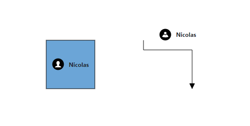

# Annotation Appearance in Blazor Diagram Component

## How to Customize Annotation Size

The annotation size can be customized using the [Height](https://help.syncfusion.com/cr/blazor/Syncfusion.Blazor.Diagram.Annotation.html#Syncfusion_Blazor_Diagram_Annotation_Height) and [Width](https://help.syncfusion.com/cr/blazor/Syncfusion.Blazor.Diagram.Annotation.html#Syncfusion_Blazor_Diagram_Annotation_Width) properties. By default, the `Width` and `Height` properties are **0**, which means the annotation inherits the size of its parent node or connector. The following code example demonstrates how to customize the annotation size.

```cshtml
@using Syncfusion.Blazor.Diagram

<SfDiagramComponent Height="600px" Connectors="@connectors" />

@code
{
    // Defines diagram's connector collection.
    private DiagramObjectCollection<Connector> connectors;
    protected override void OnInitialized()
    {
        connectors = new DiagramObjectCollection<Connector>();
        Connector connector = new Connector()
        {
            SourcePoint = new DiagramPoint() { X = 300, Y = 40 },
            TargetPoint = new DiagramPoint() { X = 400, Y = 160 },
            Type = ConnectorSegmentType.Orthogonal,
            Style = new TextStyle() { StrokeColor = "#6495ED" },
            Annotations = new DiagramObjectCollection<PathAnnotation>()
            {
                new PathAnnotation
                {
                    Content = "Annotation length will be varied",
                    // Sets the size of the annotation.
                    Width = 50,
                    Height = 50
                },
            }
        };
        connectors.Add(connector);
    }
}
```


A complete working sample can be downloaded from [GitHub](https://github.com/SyncfusionExamples/Blazor-Diagram-Examples/tree/master/UG-Samples/Annotations/Appearance/SizeOfAnnotation)


## How to Add a Hyperlink to an Annotation

A [Hyperlink](https://help.syncfusion.com/cr/blazor/Syncfusion.Blazor.Diagram.Annotation.html#Syncfusion_Blazor_Diagram_Annotation_Hyperlink) can be added to the node's or connector's annotation. It can also be customized.

```cshtml
@using Syncfusion.Blazor.Diagram

<SfDiagramComponent Height="600px" Nodes="@nodes" />

@code
{
    // Defines diagram's node collection.
    private DiagramObjectCollection<Node> nodes;

    protected override void OnInitialized()
    {
        nodes = new DiagramObjectCollection<Node>();
        Node node = new Node()
        {
            ID = "node",
            Width = 100,
            Height = 100,
            OffsetX = 100,
            OffsetY = 100,
            // Sets the annotation for the Node.
            Annotations = new DiagramObjectCollection<ShapeAnnotation>()
            {
                // Add text as hyperlink.
                new ShapeAnnotation
                {
                    Hyperlink = new HyperlinkSettings
                    {
                        Url = "https://www.syncfusion.com"
                    }
                }
            },
            Style = new ShapeStyle() { Fill = "#6495ED", StrokeColor = "white" },
        };
        nodes.Add(node);
    }
}
```


A complete working sample can be downloaded from [GitHub](https://github.com/SyncfusionExamples/Blazor-Diagram-Examples/tree/master/UG-Samples/Annotations/Appearance/HyperlinktoAnnotation)


### How to Display Text in Annotation Hyperlinks

The [Content](https://help.syncfusion.com/cr/blazor/Syncfusion.Blazor.Diagram.Annotation.html#Syncfusion_Blazor_Diagram_Annotation_Content) property of the `Hyperlink` can be set to display custom text for the link.

```cshtml
@using Syncfusion.Blazor.Diagram

<SfDiagramComponent Height="600px" Nodes="@nodes" />

@code
{
    // Defines diagram's node collection.
    private DiagramObjectCollection<Node> nodes;

    protected override void OnInitialized()
    {
        nodes = new DiagramObjectCollection<Node>();
        Node node = new Node()
        {
            ID = "node",
            Width = 100,
            Height = 100,
            OffsetX = 100,
            OffsetY = 100,
            // Sets the annotation for the Node.
            Annotations = new DiagramObjectCollection<ShapeAnnotation>()
            {
                // Add text as hyperlink.
                new ShapeAnnotation
                {
                    Hyperlink = new HyperlinkSettings
                    {
                        Content = "Syncfusion",
                        Url = "https://www.syncfusion.com"
                    }
                }
            },
            Style = new ShapeStyle() { Fill = "#6495ED", StrokeColor = "white" },
        };
        nodes.Add(node);
    }
}
```


A complete working sample can be downloaded from [GitHub](https://github.com/SyncfusionExamples/Blazor-Diagram-Examples/tree/master/UG-Samples/Annotations/Appearance/HyperlinkWithContent)


## How to Wrap Text Using Text Wrapping

The [TextWrapping](https://help.syncfusion.com/cr/blazor/Syncfusion.Blazor.Diagram.TextStyle.html#Syncfusion_Blazor_Diagram_TextStyle_TextWrapping) property of an annotation's style defines the wrapping behavior for its text content. When text overflows node boundaries, you can control it by using the `TextWrapping`. So, it is wrapped into multiple lines. The following code explains how to wrap a text in a node.

```cshtml
@using Syncfusion.Blazor.Diagram

<SfDiagramComponent Height="600px" Nodes="@nodes" />

@code
{
    // Defines diagram's node collection.
    private DiagramObjectCollection<Node> nodes;

    protected override void OnInitialized()
    {
        nodes = new DiagramObjectCollection<Node>();
        Node node = new Node()
        {
            ID = "node",
            Width = 100,
            Height = 100,
            OffsetX = 100,
            OffsetY = 100,
            // Sets the annotation for the node.
            Annotations = new DiagramObjectCollection<ShapeAnnotation>()
            {
                new ShapeAnnotation
                {
                    Content = "Annotation Text Wrapping",
                    Style = new TextStyle()
                    {
                        // Sets the text wrapping of the annotation as Wrap.
                        TextWrapping = TextWrap.Wrap
                    }
                }
            },
            Style = new ShapeStyle() { Fill = "#6495ED", StrokeColor = "white" },
        };
        nodes.Add(node);
    }
}
```


A complete working sample can be downloaded from [GitHub](https://github.com/SyncfusionExamples/Blazor-Diagram-Examples/tree/master/UG-Samples/Annotations/Appearance/AnnotationWithTextWrapping)

| TextWrapping | Description | Image |
| -------- | -------- | -------- |
| [No Wrap](https://help.syncfusion.com/cr/blazor/Syncfusion.Blazor.Diagram.TextWrap.html#Syncfusion_Blazor_Diagram_TextWrap_NoWrap) | Text will not be wrapped. |  |
| [Wrap](https://help.syncfusion.com/cr/blazor/Syncfusion.Blazor.Diagram.TextWrap.html#Syncfusion_Blazor_Diagram_TextWrap_Wrap) | Text-wrapping occurs, when the text overflows beyond the available node width. |  |
| [WrapWithOverflow](https://help.syncfusion.com/cr/blazor/Syncfusion.Blazor.Diagram.TextWrap.html#Syncfusion_Blazor_Diagram_TextWrap_WrapWithOverflow) | Text-wrapping occurs, when the text overflows beyond the available node width. However, the text may overflow beyond the node width in the case of a very long word. |  |

### How to Control Text Overflow

The [TextOverflow](https://help.syncfusion.com/cr/blazor/Syncfusion.Blazor.Diagram.TextStyle.html#Syncfusion_Blazor_Diagram_TextStyle_TextOverflow) property specifies how the overflowed content that is not displayed should be signaled to the user. The `TextOverflow` property can have the following values.

* **Wrap**: Wraps the text to the next line when it exceeds its bounds.
* **Ellipsis**: Truncates the overflown text and renders an ellipsis ("...") to represent the clipped text.
* **Clip**: Clips the text, and the overflowed text will not be visible.

The following code sample demonstrates how the `TextOverflow` property works with different `TextWrapping` settings.

```cshtml
@using Syncfusion.Blazor.Diagram

<SfDiagramComponent Height="600px" Nodes="@nodes" />

@code
{
    // Defines diagram's node collection.
    private DiagramObjectCollection<Node> nodes;

    protected override void OnInitialized()
    {
        nodes = new DiagramObjectCollection<Node>();
        Node node = new Node()
        {
            ID = "node",
            Width = 100,
            Height = 100,
            OffsetX = 100,
            OffsetY = 100,
            // Sets the style for the text to be displayed.
            Annotations = new DiagramObjectCollection<ShapeAnnotation>()
            {
                new ShapeAnnotation
                {
                    Content = "The text element with property of overflow as Wrap and wrapping as NoWrap",
                    Style = new TextStyle()
                    {
                        // Sets the text overflow of the annotation as Wrap.
                        TextOverflow = TextOverflow.Wrap,
                        TextWrapping = TextWrap.NoWrap
                    }
                },
            },
            Style = new ShapeStyle() { Fill = "#6495ED", StrokeColor = "white" },
        };
        nodes.Add(node);
    }
}
```


A complete working sample can be downloaded from [GitHub](https://github.com/SyncfusionExamples/Blazor-Diagram-Examples/tree/master/UG-Samples/Annotations/Appearance/AnnotationWithTextOverflow)

| TextOverflow | Wrapping | Image |
| -------- | -------- | -------- |
| Wrap | No Wrap |  |
| Wrap| Wrap |  |
| Wrap | WrapWithOverflow |  |
| Ellipsis | No Wrap |  |
| Ellipsis| Wrap |  |
| Ellipsis | WrapWithOverflow |  |
| Clip | No Wrap |  |
| Clip| Wrap |  |
| Clip | WrapWithOverflow |  |

N>**Note :** All overflow customizations are also applicable to connector annotations.

## How to Customize the Appearance of an Annotation

The appearance of an annotation can be customized using various style properties.

* The text style can be modified using properties like [Bold](https://help.syncfusion.com/cr/blazor/Syncfusion.Blazor.Diagram.TextStyle.html#Syncfusion_Blazor_Diagram_TextStyle_Bold), [Italic](https://help.syncfusion.com/cr/blazor/Syncfusion.Blazor.Diagram.TextStyle.html#Syncfusion_Blazor_Diagram_TextStyle_Italic), and [TextDecoration](https://help.syncfusion.com/cr/blazor/Syncfusion.Blazor.Diagram.TextStyle.html#Syncfusion_Blazor_Diagram_TextStyle_TextDecoration).

* The annotation's background and border color can be defined with the [Fill](https://help.syncfusion.com/cr/blazor/Syncfusion.Blazor.Diagram.ShapeStyle.html#Syncfusion_Blazor_Diagram_ShapeStyle_Fill), [StrokeColor](https://help.syncfusion.com/cr/blazor/Syncfusion.Blazor.Diagram.ShapeStyle.html#Syncfusion_Blazor_Diagram_ShapeStyle_StrokeColor), and [StrokeWidth](https://help.syncfusion.com/cr/blazor/Syncfusion.Blazor.Diagram.ShapeStyle.html#Syncfusion_Blazor_Diagram_ShapeStyle_StrokeWidth) properties.

* The transparency of the annotation is controlled by the [Opacity](https://help.syncfusion.com/cr/blazor/Syncfusion.Blazor.Diagram.ShapeStyle.html#Syncfusion_Blazor_Diagram_ShapeStyle_Opacity) property.

* The [Visibility](https://help.syncfusion.com/cr/blazor/Syncfusion.Blazor.Diagram.Annotation.html#Syncfusion_Blazor_Diagram_Annotation_Visibility) property of the annotation enables or disables the visibility of annotation.

The following code explains how to customize the visual appearance of an annotation.

```cshtml
@using Syncfusion.Blazor.Diagram

<SfDiagramComponent Height="600px" Nodes="@nodes" />

@code
{
    // Defines diagram's node collection.
    private DiagramObjectCollection<Node> nodes;

    protected override void OnInitialized()
    {
        nodes = new DiagramObjectCollection<Node>();
        Node node = new Node()
        {
            ID = "node",
            Width = 100,
            Height = 100,
            OffsetX = 100,
            OffsetY = 100,
            // Sets the annotation for the node.
            Annotations = new DiagramObjectCollection<ShapeAnnotation>()
            {
                new ShapeAnnotation
                {
                    Content = "Annotation Text",
                    Style = new TextStyle()
                    {
                        // Sets the style for the annotation.
                        Color="black",
                        Bold = true,
                        Italic = true,
                        TextDecoration = TextDecoration.Underline,
                        FontSize = 12,
                        FontFamily = "TimesNewRoman"
                    }
                }
            },
            Style = new ShapeStyle() { Fill = "#6BA5D7", StrokeColor = "white" },
        };
        nodes.Add(node);
    }
}
```


A complete working sample can be downloaded from [GitHub](https://github.com/SyncfusionExamples/Blazor-Diagram-Examples/tree/master/UG-Samples/Annotations/Appearance/Appearance)


## How to Update Annotation Font Style at Runtime

The font style of annotations can be changed dynamically at runtime by modifying properties such as [FontSize](https://help.syncfusion.com/cr/blazor/Syncfusion.Blazor.Diagram.TextStyle.html#Syncfusion_Blazor_Diagram_TextStyle_FontSize), [FontFamily](https://help.syncfusion.com/cr/blazor/Syncfusion.Blazor.Diagram.TextStyle.html#Syncfusion_Blazor_Diagram_TextStyle_FontFamily), and [Color](https://help.syncfusion.com/cr/blazor/Syncfusion.Blazor.Diagram.TextStyle.html#Syncfusion_Blazor_Diagram_TextStyle_Color). The following code demonstrates how to update the font style of the annotation.

```cshtml
@using Syncfusion.Blazor.Diagram
@using Syncfusion.Blazor.Buttons

<SfButton Content="UpdateStyle" OnClick="@UpdateStyle" />
<SfDiagramComponent @ref="@Diagram" Height="600px" Nodes="@nodes" />

@code
{
    // Reference of the diagram.
    private SfDiagramComponent Diagram;
    // Defines diagram's node collection.
    private DiagramObjectCollection<Node> nodes;

    protected override void OnInitialized()
    {
        nodes = new DiagramObjectCollection<Node>();
        Node node = new Node()
        {
            ID = "node1",
            Width = 100,
            Height = 100,
            OffsetX = 100,
            OffsetY = 100,
            // Sets the annotation for the node.
            Annotations = new DiagramObjectCollection<ShapeAnnotation>()
            {
                new ShapeAnnotation
                {
                    Content = "Annotation Text",
                    Style = new TextStyle()
                    {
                        Color = "black",
                        Bold = true,
                        Italic = true,
                        TextDecoration = TextDecoration.Underline,
                        FontSize = 12,
                        FontFamily = "TimesNewRoman"
                    }
                }
            },
            Style = new ShapeStyle() { Fill = "#6BA5D7", StrokeColor = "white" },
        };
        nodes.Add(node);
    }

    private void UpdateStyle()
    {
        // Change the style of the annotation.
        Diagram.BeginUpdate();
        Diagram.Nodes[0].Annotations[0].Style.Bold = false;
        Diagram.Nodes[0].Annotations[0].Style.TextDecoration = TextDecoration.None;
        Diagram.Nodes[0].Annotations[0].Style.Color = "Red";
        Diagram.EndUpdateAsync();
    }
}
```


A complete working sample can be downloaded from [GitHub](https://github.com/SyncfusionExamples/Blazor-Diagram-Examples/tree/master/UG-Samples/Annotations/Appearance/AnnotationStyleatRunTime)

## How to Edit Annotations at Runtime

Annotations can be edited at runtime either programmatically or interactively. By default, annotations are in view mode. Edit mode can be enabled in the following ways:

* Programmatically: Invoke the [StartTextEdit](https://help.syncfusion.com/cr/blazor/Syncfusion.Blazor.Diagram.SfDiagramComponent.html#Syncfusion_Blazor_Diagram_SfDiagramComponent_StartTextEdit_Syncfusion_Blazor_Diagram_IDiagramObject_System_String_) method of the diagram component.
* Interactively:
    * Double-click the annotation.
    * Select the parent and press the F2 or enter key.

Double-clicking an annotation enables edit mode. For a object with multiple annotations, double-clicking the object itself will start the edit for the first annotation in its collection. When the focus of editor is lost, the annotation content is updated. 

## How to Set Read-Only Mode for Annotations

Annotations can be set to read-only mode by configuring their [Constraints](https://help.syncfusion.com/cr/blazor/Syncfusion.Blazor.Diagram.Annotation.html#Syncfusion_Blazor_Diagram_Annotation_Constraints). Setting the [ReadOnly](https://help.syncfusion.com/cr/blazor/Syncfusion.Blazor.Diagram.AnnotationConstraints.html#Syncfusion_Blazor_Diagram_AnnotationConstraints_ReadOnly) constraints prevents user interaction and modification. The following code explains how to enable read-only mode.

```cshtml
@using Syncfusion.Blazor.Diagram

<SfDiagramComponent Height="600px" Nodes="@nodes" />

@code
{
    // Defines diagram's node collection.
    private DiagramObjectCollection<Node> nodes;

    protected override void OnInitialized()
    {
        nodes = new DiagramObjectCollection<Node>();
        Node node = new Node()
        {
            ID = "node",
            Width = 100,
            Height = 100,
            OffsetX = 100,
            OffsetY = 100,
            Annotations = new DiagramObjectCollection<ShapeAnnotation>()
            {
                new ShapeAnnotation
                {
                    Content = "Annotation Text",
                    // Sets the constraints as Read only.
                    Constraints = AnnotationConstraints.ReadOnly
                }
            },
            Style = new ShapeStyle() { Fill = "#6BA5D7", StrokeColor = "white" },
        };
        nodes.Add(node);
    }
}
```


A complete working sample can be downloaded from [GitHub](https://github.com/SyncfusionExamples/Blazor-Diagram-Examples/tree/master/UG-Samples/Annotations/Appearance/ReaonlyConstraints)

## How to Create Multiple Annotations

Multiple annotations can be added to a single node or connector. The following code example shows how to add multiple annotations to both a node and a connector. 

```cshtml
@using Syncfusion.Blazor.Diagram

<SfDiagramComponent Height="600px" Nodes="@nodes" Connectors="@connectors" />

@code
{
    // Defines diagram's node collection.
    private DiagramObjectCollection<Node> nodes;
    // Defines diagram's connector collection.
    private DiagramObjectCollection<Connector> connectors;

    protected override void OnInitialized()
    {
        nodes = new DiagramObjectCollection<Node>();
        Node node = new Node()
        {
            ID = "node",
            Width = 100,
            Height = 100,
            OffsetX = 100,
            OffsetY = 100,
            Style = new ShapeStyle() { Fill = "#6BA5D7", StrokeColor = "white" },
            // Sets the multiple annotation for the node.
            Annotations = new DiagramObjectCollection<ShapeAnnotation>()
            {
                new ShapeAnnotation
                {
                    Content = "Left",
                    Offset = new DiagramPoint(){ X = .12,Y = .1}
                },
                new ShapeAnnotation
                {
                    Content = "Center",
                    Offset = new DiagramPoint(){ X = .5,Y = .5}
                },
                new ShapeAnnotation
                {
                    Content = "Right",
                    Offset = new DiagramPoint(){ X = .82,Y = .9}
                }
            },
        };
        nodes.Add(node);
        connectors = new DiagramObjectCollection<Connector>();
        Connector connector = new Connector()
        {
            SourcePoint = new DiagramPoint() { X = 300, Y = 40 },
            TargetPoint = new DiagramPoint() { X = 400, Y = 160 },
            Type = ConnectorSegmentType.Orthogonal,
            Style = new TextStyle() { StrokeColor = "#6495ED" },
            Annotations = new DiagramObjectCollection<PathAnnotation>()
            {
                new PathAnnotation
                {
                    Content = "Offset as 0",
                    Offset = 0
                },
                new PathAnnotation
                {
                    Content = "Offset as 0.5",
                    Offset = 0.5
                },
                new PathAnnotation
                {
                    Content = "Offset as 1",
                    Offset = 1
                },
            }
        };
        connectors.Add(connector);
    }
}
```


A complete working sample can be downloaded from [GitHub](https://github.com/SyncfusionExamples/Blazor-Diagram-Examples/tree/master/UG-Samples/Annotations/Appearance/MultipleAnnotation)


N>* Type of the annotation’s property of the node or connector is ObservableCollection.
<br/>* Default value of the annotation will be **null**.
<br/>* All customization options are applicable to each annotation in the collection.
<br/>* When double-clicking a node or connector, text editing is initiated only for the first annotation in the collection.

## How to Control Annotation Constraints

[AnnotationConstraints](https://help.syncfusion.com/cr/blazor/Syncfusion.Blazor.Diagram.AnnotationConstraints.html) are used to enable or disable certain behaviors of an annotation. Constraints are provided as flag enumerations, allowing multiple behaviors to be combined using bitwise operators.

`AnnotationConstraints` may have multiple behaviors as follows:

| Constraints | Usages |
|---|---|
| [ReadOnly](https://help.syncfusion.com/cr/blazor/Syncfusion.Blazor.Diagram.AnnotationConstraints.html#Syncfusion_Blazor_Diagram_AnnotationConstraints_ReadOnly) | Enables or disables whether the annotation to be read only or not. |
| [None](https://help.syncfusion.com/cr/blazor/Syncfusion.Blazor.Diagram.AnnotationConstraints.html#Syncfusion_Blazor_Diagram_AnnotationConstraints_None) | Disables all behaviors of Annotation. |
|[InheritReadOnly](https://help.syncfusion.com/cr/blazor/Syncfusion.Blazor.Diagram.AnnotationConstraints.html#Syncfusion_Blazor_Diagram_AnnotationConstraints_InheritReadOnly) |Enables or disables to inherit the ReadOnly option from the parent object.|

N> The default value for an annotation's Constraints property is **InheritReadOnly**.

Refer to [Constraints](https://blazor.syncfusion.com/documentation/diagram/constraints) to learn more about how to enable or disable the annotation constraints.

## How to Define Templates in Annotations

The Diagram component supports templating for annotations. HTML content can be defined within the `DiagramTemplates` tag and linked to an annotation by setting the [UseTemplate](https://help.syncfusion.com/cr/blazor/Syncfusion.Blazor.Diagram.Annotation.html#Syncfusion_Blazor_Diagram_Annotation_UseTemplate) property to **true**. To define separate templates for individual annotations, use the `ID` property to differentiate them.

The following code illustrates how to define a template for both a node's and a connector's annotation.
```cshtml
@using Syncfusion.Blazor.Diagram

<SfDiagramComponent Width="1000px" Height="1000px" Nodes="@nodes" Connectors="@connectors">
    <SnapSettings Constraints="SnapConstraints.None"></SnapSettings>
    <DiagramTemplates>
        <AnnotationTemplate>
            @if (context is Annotation annotation)
            {
                if (annotation.ID.Contains("Node"))
                {
                    string ID = annotation.ID + "TemplateContent";
                    <div id="@ID" class="profile-card" style="width:100%;height:100%;display:flex;align-items:center; gap:10px">
                        <svg xmlns="http://www.w3.org/2000/svg" height="48" width="48" viewBox="0 0 48 48">
                            <g>
                                <rect height="48" width="48" fill="#000000" rx="50%" ry="50%" />
                                <path id="path1" transform="rotate(0,24,24) translate(11.1417800784111,11) scale(0.8125,0.8125)  " fill="#FFFFFF" 
                                d="M15.827007,0C20.406003,0 24.346007,3.1960449 24.346007,9.2930298 24.346007,13.259033 22.542005,17.289001 20.180997,19.791992L20.193005,19.791992C19.287,22.627014 20.736997,23.299011 20.966,23.376038 25.997008,25.090027 31.651002,28.317993 31.651002,31.626038L31.651002,32 0,32 0,31.626038C8.034749E-08,28.414001 5.6260008,25.161011 10.421,23.376038 10.766993,23.244995 12.422999,22.317017 11.497004,19.817993 9.1220035,17.321045 7.3279971,13.275024 7.3279971,9.2930298 7.3279971,3.1960449 11.245006,0 15.827007,0z" />
                            </g>
                        </svg>
                        <div class="profile-name" style="font-size:12px;font-weight:bold;">Nicolas</div>
                    </div>
                }
                if (annotation.ID.Contains("Connector"))
                {
                    string ID = annotation.ID + "TemplateContent";
                    <div id="@ID" class="profile-card" style="width: 100%; height: 100%; display: flex; align-items: center; gap: 10px">
                        <svg xmlns="http://www.w3.org/2000/svg" height="48" width="48" viewBox="0 0 48 48">
                            <g>
                                <rect height="48" width="48" fill="#000000" rx="50%" ry="50%" />
                                <path id="path1" transform="rotate(0,24,24) translate(11,12.3588990783035) scale(0.812500048428777,0.812500048428777)  " fill="#FFFFFF"
                                      d="M21.576999,13.473151C26.414003,15.496185 30.259996,20.071221 31.999999,25.86432 15.448002,32.143386 0,25.86432 0,25.86432 1.7140042,20.158227 5.4690005,15.632174 10.202001,13.564156 11.338002,15.514191 13.444005,16.827195 15.862003,16.827195 18.317996,16.827195 20.455997,15.474182 21.576999,13.473151z M16.000003,0C19.617999,1.5323894E-07 22.550998,2.9330488 22.550998,6.5510722 22.550998,10.170134 19.617999,13.102144 16.000003,13.102144 12.381993,13.102144 9.4489957,10.170134 9.4489957,6.5510722 9.4489957,2.9330488 12.381993,1.5323894E-07 16.000003,0z" />
                            </g>
                        </svg>
                        <div class="profile-name" style="font-size:12px;font-weight:bold;">Nicolas</div>
                    </div>
                }
            }
        </AnnotationTemplate>
    </DiagramTemplates>
</SfDiagramComponent>
@code
{
    private DiagramObjectCollection<Node> nodes = new DiagramObjectCollection<Node>();
    private DiagramObjectCollection<Connector> connectors = new DiagramObjectCollection<Connector>();

    protected override void OnInitialized()
    {
        Node node = new Node()
        {
            ID = "node1",
            Height = 100,
            Width = 100,
            OffsetX = 300,
            OffsetY = 300,
            Style = new ShapeStyle() { Fill = "#6BA5D7", StrokeColor = "black", Opacity = 1 },
            Annotations = new DiagramObjectCollection<ShapeAnnotation>()
            {
                new ShapeAnnotation()
                {
                    ID = "NodeAnnotation1",
                    UseTemplate = true,
                    Height = 75,
                    Width = 75,
                },
            },
        };
        nodes.Add(node);
        Connector connector = new Connector()
        {
            ID = "connector1",
            SourcePoint = new DiagramPoint() { X = 450, Y = 250 },
            TargetPoint = new DiagramPoint() { X = 550, Y = 350 },
            Type = ConnectorSegmentType.Orthogonal,
            Annotations = new DiagramObjectCollection<PathAnnotation>()
            {
                new PathAnnotation()
                {
                    ID = "ConnectorAnnotation1",
                    UseTemplate = true,
                    Height = 50,
                    Width = 75,
                    Alignment = AnnotationAlignment.Before,
                    Offset = 0.3,
                    Displacement = new DiagramPoint(){X = 0, Y = -0.5}
                },
            },
        };
        connectors.Add(connector);
    }
}
```


A complete working sample can be downloaded from [GitHub](https://github.com/SyncfusionExamples/Blazor-Diagram-Examples/tree/master/UG-Samples/Annotations/TemplateSupportforAnnotation)


## How to Add Additional Information for an Annotation

The [AdditionalInfo](https://help.syncfusion.com/cr/blazor/Syncfusion.Blazor.Diagram.Annotation.html#Syncfusion_Blazor_Diagram_Annotation_AdditionalInfo) property of an annotation allows you to store extra information associated with the annotation in a flexible way. This can be useful for maintaining metadata or additional details that need to be accessed programmatically.

The following code demonstrates how to set a value for the `AdditionalInfo` property.

```cshtml
@using Syncfusion.Blazor.Diagram

<SfDiagramComponent Height="600px" Nodes="@nodes" />

@code
{
    private DiagramObjectCollection<Node> nodes;

    protected override void OnInitialized()
    {
        nodes = new DiagramObjectCollection<Node>();
        // Create a dictionary to store additional information for the annotation.
        Dictionary<string, object> AnnotationInfo = new Dictionary<string, object>();
        AnnotationInfo.Add("author", "John Doe");
        AnnotationInfo.Add("modifiedDate", DateTime.Now);
        // A node with an annotation containing additional information.
        Node node = new Node()
        {
            OffsetX = 250,
            OffsetY = 250,
            Width = 100,
            Height = 100,
            Style = new ShapeStyle()
            {
                Fill = "#6BA5D7",
                StrokeColor = "white"
            },
            Annotations = new DiagramObjectCollection<ShapeAnnotation>()
            {
                new ShapeAnnotation
                {
                    Content = "Annotated Node",
                    AdditionalInfo = AnnotationInfo
                }
            }
        };
        // Add the node to the collection.
        nodes.Add(node);
    }
}
```


A complete working sample can be downloaded from [GitHub](https://github.com/SyncfusionExamples/Blazor-Diagram-Examples/tree/master/UG-Samples/Annotations/AdditionalInfoProperty)

**Note:** The `AdditionalInfo` property can accept any type of object as its value.


## See also

* [How to add or remove annotation constraints](../constraints#annotation-constraints)

* [How to add an annotation for a Node](./node-annotation)

* [How to add an annotation for a Connector](./connector-annotation)

* [How to Prevent Text Overflow and Display Excess Content on Hover in a Diagram](https://support.syncfusion.com/kb/article/18726/how-to-prevent-text-overflow-and-display-excess-content-on-hover-in-a-diagram)