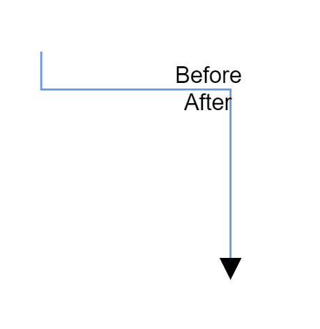
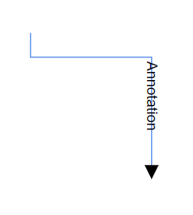
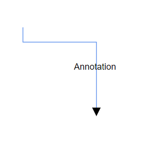

# Connector Annotation Position in Blazor Diagram 

Annotations of a connector can be positioned using the following properties of Annotation class.

* Offset
* Alignment
* Displacement
* SegmentAngle
* HorizontalAlignment
* VerticalAlignment
* Margin

## How to Update Offset Position for Annotations

The [Offset](https://help.syncfusion.com/cr/blazor/Syncfusion.Blazor.Diagram.PathAnnotation.html#Syncfusion_Blazor_Diagram_PathAnnotation_Offset) property of an annotation is used to align the annotations based on fractions. A value of 0 represents Top-Left corner, 1 represents Bottom-Right corner, and 0.5 represents half of Width/Height.

```cshtml
@using Syncfusion.Blazor.Diagram

<SfDiagramComponent Height="600px" Connectors="@connectors" />

@code
{
    //Defines diagram's connector collection.
    DiagramObjectCollection<Connector> connectors;

    protected override void OnInitialized()
    {
        connectors = new DiagramObjectCollection<Connector>();
        Connector connector = new Connector()
        {
            SourcePoint = new DiagramPoint() { X = 300, Y = 40 },
            TargetPoint = new DiagramPoint() { X = 400, Y = 160 },
            Type = ConnectorSegmentType.Orthogonal,
            Style = new TextStyle() { StrokeColor = "#6495ED" },
            Annotations = new DiagramObjectCollection<PathAnnotation>()
            {
                new PathAnnotation 
                { 
                    Content = "Offset as 0",
                    // Sets the offset of the annotation as 0.
                    Offset = 0 
                },
                new PathAnnotation 
                { 
                    Content = "Offset as 0.5",
                    // Sets the offset of the annotation as 0.5.
                    Offset = 0.5 
                },
                new PathAnnotation 
                { 
                    Content = "Offset as 1",
                    // Sets the offset of the annotation as 1.
                    Offset = 1 
                },
            }
        };
        connectors.Add(connector);
    }
}
```
You can download a complete working sample from [GitHub](https://github.com/SyncfusionExamples/Blazor-Diagram-Examples/tree/master/UG-Samples/Annotations/AnnotationOfConnector/UpdateOffsetofAnnotation)

The following image shows the relationship between the annotation position and offset (fraction values).


>**Note:**
> * By default, offset value of the connector annotation is 0.5.
> * Connector annotation's Id should not start with numbers or special characters and should not contain special characters such as underscores(_) or spaces.

## How to Change Annotation Alignment

The connector’s annotation can be aligned over its segment path using the [Alignment](https://help.syncfusion.com/cr/blazor/Syncfusion.Blazor.Diagram.PathAnnotation.html#Syncfusion_Blazor_Diagram_PathAnnotation_Alignment) property of the annotation.

```cshtml
@using Syncfusion.Blazor.Diagram

<SfDiagramComponent Height="600px" Connectors="@connectors" />

@code
{
    //Defines diagram's connector collection.
    DiagramObjectCollection<Connector> connectors;

    protected override void OnInitialized()
    {
        connectors = new DiagramObjectCollection<Connector>();
        Connector connector = new Connector()
        {
            SourcePoint = new DiagramPoint() { X = 300, Y = 40 },
            TargetPoint = new DiagramPoint() { X = 400, Y = 160 },
            Type = ConnectorSegmentType.Orthogonal,
            Style = new TextStyle() { StrokeColor = "#6495ED" },
            Annotations = new DiagramObjectCollection<PathAnnotation>()
            {
                new PathAnnotation 
                { 
                    Content = "Before",
                    // Sets the alignment of the annotation as Before.
                    Alignment = AnnotationAlignment.Before 
                },
                new PathAnnotation 
                { 
                    Content = "After",
                    // Sets the alignment of the annotation as After.
                    Alignment = AnnotationAlignment.After 
                },
            }
        };
        connectors.Add(connector);
    }
}
```
You can download a complete working sample from [GitHub](https://github.com/SyncfusionExamples/Blazor-Diagram-Examples/tree/master/UG-Samples/Annotations/AnnotationOfConnector/AlignmentOfAnnotation)

The following screenshot shows how the annotation of the connector aligned over its path.



N> By default, Alignment value of the connector annotation is `Center`.

## How to Change Annotation Displacement

The [Displacement](https://help.syncfusion.com/cr/blazor/Syncfusion.Blazor.Diagram.PathAnnotation.html#Syncfusion_Blazor_Diagram_PathAnnotation_Displacement) property is used to dislocate the annotation by the value given. By default, annotation will be in centered on the connector path. When you assign a value to the Displacement property, the annotation will be displaced from its position by displacement value.

```cshtml
@using Syncfusion.Blazor.Diagram

<SfDiagramComponent Height="600px" Connectors="@connectors">
</SfDiagramComponent>

@code
{
    //Defines diagram's connector collection.
    public DiagramObjectCollection<Connector> connectors { get; set; }

    protected override void OnInitialized()
    {
        connectors = new DiagramObjectCollection<Connector>();
        Connector connector = new Connector()
        {
            SourcePoint = new DiagramPoint() { X = 300, Y = 40 },
            TargetPoint = new DiagramPoint() { X = 400, Y = 160 },
            Type = ConnectorSegmentType.Orthogonal,
            Style = new ShapeStyle()
            {
                StrokeColor = "#6BA5D7"
            },
            Annotations = new DiagramObjectCollection<PathAnnotation>()
            {
                new PathAnnotation()
                {
                    Content = "After",
                    // Set the displacement to the annotation.
                    Displacement = new DiagramPoint() { X = 50, Y = 50 },
                    Alignment = AnnotationAlignment.After
                },
            }
        };
        connectors.Add(connector);
    }
}
```
You can download a complete working sample from [GitHub](https://github.com/SyncfusionExamples/Blazor-Diagram-Examples/tree/master/UG-Samples/Annotations/AnnotationOfConnector/DisplacementOfAnnotation)

## How to Update Annotation Segment Angle

The [SegmentAngle](https://help.syncfusion.com/cr/blazor/Syncfusion.Blazor.Diagram.PathAnnotation.html#Syncfusion_Blazor_Diagram_PathAnnotation_SegmentAngle) property is used to rotate the annotation based on the connectors segment direction. By default, the annotation will be rotated in the connector path. When you assign a value to the SegmentPath property, the annotation will be rotated from its position based on the connector segment direction.

The following code example shows how the connector annotation rotated in its path direction.

```cshtml
@using Syncfusion.Blazor.Diagram

<SfDiagramComponent Height="600px" Connectors="@connectors" />

@code
{
    // Defines diagram's connector collection.
    DiagramObjectCollection<Connector> connectors;

    protected override void OnInitialized()
    {
        connectors = new DiagramObjectCollection<Connector>();
        Connector connector = new Connector()
        {
            SourcePoint = new DiagramPoint() { X = 300, Y = 40 },
            TargetPoint = new DiagramPoint() { X = 400, Y = 160 },
            Type = ConnectorSegmentType.Orthogonal,
            Style = new TextStyle() { StrokeColor = "#6495ED" },
            Annotations = new DiagramObjectCollection<PathAnnotation>()
            {
                new PathAnnotation 
                { 
                    Content = "Annotation", 
                    // Set the segment angle for the connector's annotation.
                    SegmentAngle = true,
                    Offset = 0.7 
                },
            }
        };
        connectors.Add(connector);
    }
}
```
You can download a complete working sample from [GitHub](https://github.com/SyncfusionExamples/Blazor-Diagram-Examples/tree/master/UG-Samples/Annotations/AnnotationOfConnector/SegmentAngleOfAnnotation)

| SegmentAngle | Output |
|---|---|
| True |  |
| False |  |

N> By default, the SegmentAngle will be disabled.

The `HorizontalAlignment`, `VerticalAlignment` and `Margin` properties were explained in the [NodeAnnotation](./node-annotation).

## See also

* [How to add annotation for Node](./node-annotation)

* [How to add or remove annotation constraints](../constraints#annotation-constraints)

* [How to customize the annotation](./appearance)

* [How to animate connectors using annotationtemplate in angular diagram](https://support.syncfusion.com/kb/article/20265/how-to-animate-connectors-using-annotationtemplate-in-angular-diagram )