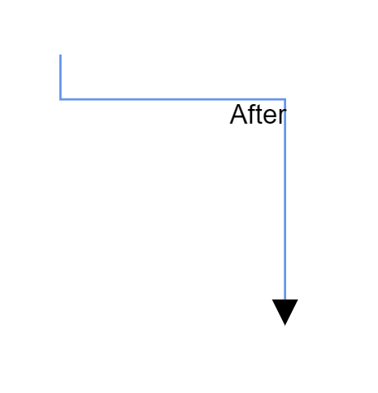

> Syncfusion recommends using [Blazor Diagram Component](https://blazor.syncfusion.com/documentation/diagram-component/getting-started) which provides better performance than this diagram control. Blazor Diagram Component will be actively developed in the future.

# Annotation for Connector in Blazor Diagram Component

Annotations of a connector can be positioned using the following properties of AnnotationEditorViewModel class.

* Offset
* Alignment
* Displacement
* SegmentAngle

## Offset

The [Offset](https://help.syncfusion.com/cr/blazor/Syncfusion.Blazor.Diagrams.DiagramConnectorAnnotation.html#Syncfusion_Blazor_Diagrams_DiagramConnectorAnnotation_Offset) property of annotation is used to align the annotations based on fractions. 0 represents Top-Left corner, 1 represents Bottom-Right corner, and 0.5 represents half of Width/Height.

```cshtml
@using Syncfusion.Blazor.Diagrams
@using System.Collections.ObjectModel

<SfDiagram Height="600px" Connectors="@ConnectorCollection">
</SfDiagram>

@code
{
    //Defines diagram's connector collection
    public ObservableCollection<DiagramConnector> ConnectorCollection { get; set; }

    protected override void OnInitialized()
    {
        ConnectorCollection = new ObservableCollection<DiagramConnector>();
        DiagramConnector connector = new DiagramConnector()
        {
            SourcePoint = new ConnectorSourcePoint() { X = 300, Y = 40 },
            TargetPoint = new ConnectorTargetPoint() { X = 400, Y = 160 },
            Type = Segments.Orthogonal,
            Style = new ConnectorShapeStyle()
            {
                StrokeColor = "#6BA5D7"
            },
            Annotations = new ObservableCollection<DiagramConnectorAnnotation>()
            {
                new DiagramConnectorAnnotation() { Content = "Offset as 0",Offset=0 },
                new DiagramConnectorAnnotation() { Content = "Offset as 0.5",Offset=0.5 },
                new DiagramConnectorAnnotation() { Content = "Offset as 1",Offset=1 },
            }
        };
        ConnectorCollection.Add(connector);
    }
}
```

The following image shows the relationship between the annotation position and offset (fraction values).


> By default, offset value of the connector annotation is 0.5.

## Alignment

The connector’s annotation can be aligned over its segment path using the [Alignment](https://help.syncfusion.com/cr/blazor/Syncfusion.Blazor.Diagrams.DiagramConnectorAnnotation.html#Syncfusion_Blazor_Diagrams_DiagramConnectorAnnotation_Alignment) property of annotation.

```cshtml
@using Syncfusion.Blazor.Diagrams
@using System.Collections.ObjectModel

<SfDiagram Height="600px" Connectors="@ConnectorCollection">
</SfDiagram>

@code
{
    //Defines diagram's connector collection
    public ObservableCollection<DiagramConnector> ConnectorCollection { get; set; }

    protected override void OnInitialized()
    {
        ConnectorCollection = new ObservableCollection<DiagramConnector>();
        DiagramConnector connector = new DiagramConnector()
        {
            SourcePoint = new ConnectorSourcePoint() { X = 300, Y = 40 },
            TargetPoint = new ConnectorTargetPoint() { X = 400, Y = 160 },
            Type = Segments.Orthogonal,
            Style = new ConnectorShapeStyle()
            {
                StrokeColor = "#6BA5D7"
            },
            Annotations = new ObservableCollection<DiagramConnectorAnnotation>()
            {
                new DiagramConnectorAnnotation()
                {
                    Content = "Before",
                    Alignment=AnnotationAlignment.Before
                },
                new DiagramConnectorAnnotation()
                {
                    Content = "After",
                    Alignment=AnnotationAlignment.After
                },
            }
        };
        ConnectorCollection.Add(connector);
    }
}
```

The following screenshot shows how the annotation of the connector aligned over its path.


> By default, Alignment value of the connector annotation is `Center`.

## Displacement

The [Displacement](https://help.syncfusion.com/cr/blazor/Syncfusion.Blazor.Diagrams.DiagramConnectorAnnotation.html#Syncfusion_Blazor_Diagrams_DiagramConnectorAnnotation_Displacement) property is used to dislocate the annotation by the value given. By default, annotation will be in center of the connector path. When you assign value to the Displacement property, annotation will be displaced from its position by displacement value.

```cshtml
@using Syncfusion.Blazor.Diagrams
@using System.Collections.ObjectModel

<SfDiagram Height="600px" Connectors="@ConnectorCollection">
</SfDiagram>

@code
{
    //Defines diagram's connector collection
    public ObservableCollection<DiagramConnector> ConnectorCollection { get; set; }

    protected override void OnInitialized()
    {

        ConnectorCollection = new ObservableCollection<DiagramConnector>();
        DiagramConnector connector = new DiagramConnector()
        {
            SourcePoint = new ConnectorSourcePoint() { X = 300, Y = 40 },
            TargetPoint = new ConnectorTargetPoint() { X = 400, Y = 160 },
            Type = Segments.Orthogonal,
            Style = new ConnectorShapeStyle()
            {
                StrokeColor = "#6BA5D7"
            },
            Annotations = new ObservableCollection<DiagramConnectorAnnotation>()
            {
                new DiagramConnectorAnnotation()
                {
                    Content = "After",
                    Displacement=new ConnectorDisplacementPoint(){X=50,Y=50},
                    Alignment=AnnotationAlignment.After
                },
            }
        };
        ConnectorCollection.Add(connector);
    }
}
```

The following sample shows how the annotation of the displacement happens from its path.

| Property| Value | Output |
|---|---|---|
| Displacement | (50,50) |  |
| | (20,20) |  |
| | (0,0) |  |

> By default, Offset value of the connector annotation is { 0.5, 0.5}.

## Segment angle

The [SegmentAngle](https://help.syncfusion.com/cr/blazor/Syncfusion.Blazor.Diagrams.DiagramConnectorAnnotation.html#Syncfusion_Blazor_Diagrams_DiagramConnectorAnnotation_SegmentAngle) property is used to rotate the annotation based on the connectors segment direction. By default, annotation will be in rotated in the connector path. When you assign value to the SegmentPath property, annotation will be rotated from its position based on the annotation direction.

The following code example shows how the connector annotation rotated in its path direction.

```cshtml
@using Syncfusion.Blazor.Diagrams
@using System.Collections.ObjectModel

<SfDiagram Height="600px" Connectors="@ConnectorCollection">
</SfDiagram>

@code
{
    //Defines diagram's connector collection
    public ObservableCollection<DiagramConnector> ConnectorCollection { get; set; }

    protected override void OnInitialized()
    {
        ConnectorCollection = new ObservableCollection<DiagramConnector>();
        DiagramConnector connector = new DiagramConnector()
        {
            SourcePoint = new ConnectorSourcePoint() { X = 300, Y = 40 },
            TargetPoint = new ConnectorTargetPoint() { X = 400, Y = 160 },
            Type = Segments.Orthogonal,
            Style = new ConnectorShapeStyle()
            {
                StrokeColor = "#6BA5D7"
            },
            Annotations = new ObservableCollection<DiagramConnectorAnnotation>()
            {
                new DiagramConnectorAnnotation()
                {
                    Content = "Annotation",
                    SegmentAngle=true,
                    Offset=0.7
                },
            }
        };
        ConnectorCollection.Add(connector);
    }
}
```

| Segment Angle | Output |
|---|---|
| True |  |
| False |  |

> By default, the SegmentAngle will be disabled.

## See also

* [How to add annotation for Node](./node-annotation)

* [How to add or remove annotation constraints](../constraints/#annotation-constraints)

* [How to customize the annotation](./appearance)

* [How to interact the annotation at runtime](./interaction)
