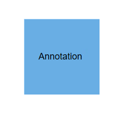
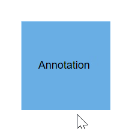

# Interaction in Blazor Diagram Component

Basic interactions of selecting and resizing can be applied over an annotation. These interactions can be controlled by annotation and its parent node or connector. To learn about annotation constraints, refer to the [`Annotation Constraints`](https://help.syncfusion.com/cr/blazor/Syncfusion.Blazor.Diagrams.DiagramNodeAnnotation.html#Syncfusion_Blazor_Diagrams_DiagramNodeAnnotation_Constraints).

## Selecting the annotation

Selection of annotation can be enabled by using the [`Constraints`](https://help.syncfusion.com/cr/blazor/Syncfusion.Blazor.Diagrams.DiagramNodeAnnotation.html#Syncfusion_Blazor_Diagrams_DiagramNodeAnnotation_Constraints) property of `Annotation` and setting its value to [`AnnotationConstraints.Select`].

The following code snippet explains how the select constraints are enabled for annotation.

```cshtml
@using Syncfusion.Blazor.Diagrams
@using System.Collections.ObjectModel
<SfDiagram Height="600px" Nodes="@NodeCollection">
</SfDiagram>

@code
{
    //Defines diagram's node collection
    public ObservableCollection<DiagramNode> NodeCollection { get; set; }

    //Defines diagram's connector collection
    public ObservableCollection<DiagramConnector> ConnectorCollection { get; set; }

    protected override void OnInitialized()
    {
        NodeCollection = new ObservableCollection<DiagramNode>();
        DiagramNode node1 = new DiagramNode()
        {
            Id = "node1",
            Width = 100,
            Height = 100,
            OffsetX = 100,
            OffsetY = 100,
            Style = new NodeShapeStyle() { Fill = "#6BA5D7", StrokeColor = "white" },
            Annotations = new ObservableCollection<DiagramNodeAnnotation>() {
                new DiagramNodeAnnotation() {Content = "Annotation", Height=30, Width=70, Constraints=AnnotationConstraints.Select }
                 },
        };
        NodeCollection.Add(node1);
    }
}

```


## Dragging the annotation

The dragging process can be applied over an annotation and dragging can be controlled by the annotation and its parent node or connector.

Dragging of annotation can be enabled by using the Constraints property of annotation and setting its value to `AnnotationConstraints.Drag`.

```cshtml
@using Syncfusion.Blazor.Diagrams
@using System.Collections.ObjectModel
<SfDiagram Height="600px" Nodes="@NodeCollection">
</SfDiagram>

@code
{
    //Defines diagram's node collection
    public ObservableCollection<DiagramNode> NodeCollection { get; set; }

    //Defines diagram's connector collection
    public ObservableCollection<DiagramConnector> ConnectorCollection { get; set; }

    protected override void OnInitialized()
    {
        NodeCollection = new ObservableCollection<DiagramNode>();
        DiagramNode node1 = new DiagramNode()
        {
            Id = "node1",
            Width = 100,
            Height = 100,
            OffsetX = 100,
            OffsetY = 100,
            Style = new NodeShapeStyle() { Fill = "#6BA5D7", StrokeColor = "white" },
            Annotations = new ObservableCollection<DiagramNodeAnnotation>() {
                 new DiagramNodeAnnotation() {Content = "Annotation", Height=30, Width=70, Constraints=AnnotationConstraints.Select|AnnotationConstraints.Drag }
                 },
        };
        NodeCollection.Add(node1);
    }
}

```



## Resizing the annotation

Resizing of the annotation can be enabled by using the Constraints property of `Annotation` and setting its value to `AnnotationConstraints.Resize`.

The following code snippet explains how the Resize constraints are enabled for annotation.

```cshtml
@using Syncfusion.Blazor.Diagrams
@using System.Collections.ObjectModel
<SfDiagram Height="600px" Nodes="@NodeCollection">
</SfDiagram>

@code
{
    //Defines diagram's node collection
    public ObservableCollection<DiagramNode> NodeCollection { get; set; }

    //Defines diagram's connector collection
    public ObservableCollection<DiagramConnector> ConnectorCollection { get; set; }

    protected override void OnInitialized()
    {
        NodeCollection = new ObservableCollection<DiagramNode>();
        DiagramNode node1 = new DiagramNode()
        {
            Id = "node1",
            Width = 100,
            Height = 100,
            OffsetX = 100,
            OffsetY = 100,
            Style = new NodeShapeStyle() { Fill = "#6BA5D7", StrokeColor = "white" },
            Annotations = new ObservableCollection<DiagramNodeAnnotation>() {
                 new DiagramNodeAnnotation() {Content = "Annotation", Height=30, Width=70, Constraints=AnnotationConstraints.Select|AnnotationConstraints.Resize }
                 },
        };
        NodeCollection.Add(node1);
    }
}

```


## Rotate the annotation

Resizing of the annotation can be enabled by using the Constraints property of `Annotation` and setting its value to `AnnotationConstraints.Resize`.

The following code snippet explains how the Resize constraints are enabled for annotation.

```cshtml
@using Syncfusion.Blazor.Diagrams
@using System.Collections.ObjectModel
<SfDiagram Height="600px" Nodes="@NodeCollection">
</SfDiagram>

@code
{
    //Defines diagram's node collection
    public ObservableCollection<DiagramNode> NodeCollection { get; set; }

    //Defines diagram's connector collection
    public ObservableCollection<DiagramConnector> ConnectorCollection { get; set; }

    protected override void OnInitialized()
    {
        NodeCollection = new ObservableCollection<DiagramNode>();
        DiagramNode node1 = new DiagramNode()
        {
            Id = "node1",
            Width = 100,
            Height = 100,
            OffsetX = 100,
            OffsetY = 100,
            Style = new NodeShapeStyle() { Fill = "#6BA5D7", StrokeColor = "white" },
            Annotations = new ObservableCollection<DiagramNodeAnnotation>() {
                 new DiagramNodeAnnotation() {Content = "Annotation", Height=30, Width=70, Constraints=AnnotationConstraints.Select|AnnotationConstraints.Rotate }
                 },
        };
        NodeCollection.Add(node1);
    }
}

```



### How to restrict the dragging area

The diagram control now supports defining the [`DragLimit`](https://help.syncfusion.com/cr/blazor/Syncfusion.Blazor.Charts.ChartSeries.html#Syncfusion_Blazor_Charts_ChartSeries_Fill) to the label when dragging from the connector and also update the position to the nearest segment offset.

You can set the value to dragLimit left, right, top, and bottom properties that allows dragging of connector labels to a certain limit based on the user defined values.

The following code explains how to set a dragLimit for connector annotations.

```cshtml
@using Syncfusion.Blazor.Diagrams
@using System.Collections.ObjectModel
<SfDiagram Height="600px" Connectors="@ConnectorCollection">
</SfDiagram>

@code
{
    //Defines diagram's connector collection
    public ObservableCollection<DiagramConnector> ConnectorCollection { get; set; }


    protected override void OnInitialized()
    {
         ConnectorCollection = new ObservableCollection<DiagramConnector>();
        DiagramConnector connector = new DiagramConnector()
        {
            SourcePoint = new ConnectorSourcePoint() { X = 100, Y = 100 },
            TargetPoint = new ConnectorTargetPoint() { X = 300, Y = 300 },
            Type = Segments.Orthogonal,
            Style = new ConnectorShapeStyle() { StrokeColor = "#6BA5D7" },
            Annotations = new ObservableCollection<DiagramConnectorAnnotation>()
            {
                   new DiagramConnectorAnnotation() {Content = "Annotation", Constraints=AnnotationConstraints.Select|AnnotationConstraints.Drag, DragLimit=new ConnectorAnnotationDragLimit(){ Left=10,Top=10,Right=10,Bottom=10} },
            }
        };
        ConnectorCollection.Add(connector);
    }
}

```


>* By default, the drag limit will be disabled for the connector. It can be enabled by setting connector constraints to drag.
>* The drag limit is applicable only for the connector.

## See also

* [How to add or remove annotation constraints](../constraints/#annotation-constraints)

* [How to customize the annotation](./appearance)

* [How to add annotation for Node](./node-annotation)

* [How to add annotation for Connector](./connector-annotation)