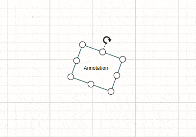
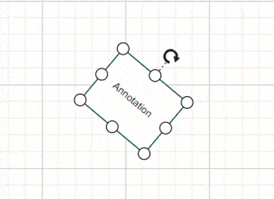
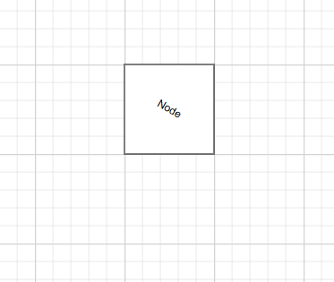

# Annotation Interaction in Blazor Diagram Component

Diagram provides the support to the annotations rotation interactively.

## How to Rotate Annotations
The [RotationReference](https://help.syncfusion.com/cr/blazor/Syncfusion.Blazor.Diagram.ShapeAnnotation.html#Syncfusion_Blazor_Diagram_ShapeAnnotation_RotationReference) property of an annotation allows you to control whether the text should rotate relative to its parent node or the Page. The following code examples illustrate how to configure `RotationReference` for an annotation.


```cshtml
@using Syncfusion.Blazor.Diagram

<SfDiagramComponent Height="600px" Nodes="@nodes" />

@code
{
    // Defines diagram's node collection.
    private DiagramObjectCollection<Node> nodes;

    protected override void OnInitialized()
    {
        nodes = new DiagramObjectCollection<Node>();
        Node node1 = new Node()
        {
            ID = "node1",
            Width = 100,
            Height = 100,
            OffsetX = 100,
            OffsetY = 100,
            Annotations = new DiagramObjectCollection<ShapeAnnotation>()
            {
                new ShapeAnnotation
                {
                    Content = "Node1",
                    RotationReference = AnnotationRotationReference.Parent,
                }
            },
        };
        Node node2 = new Node()
        {
            ID = "node2",
            Width = 100,
            Height = 100,
            OffsetX = 100,
            OffsetY = 100,
            Annotations = new DiagramObjectCollection<ShapeAnnotation>()
            {
                new ShapeAnnotation
                {
                    Content = "Node2",
                    RotationReference = AnnotationRotationReference.Page,
                }
            },
        };
        nodes.Add(node1);
        nodes.Add(node2);
    }
}
```


 Value | Description | Image |
| -------- | -------- | -------- |
| **Page** | When this option is set, the annotation remains fixed in its original orientation even if its parent node is rotated. |  |
| **Parent** | When this option is set, the annotation rotates along with its parent node. |  |


A complete working sample can be downloaded from [GitHub](https://github.com/SyncfusionExamples/Blazor-Diagram-Examples/tree/master/UG-Samples/Annotations/Interactions/RotationReference)

## How to rotate a Annotation using the RotationAngle property

The [RotationAngle](https://help.syncfusion.com/cr/blazor/Syncfusion.Blazor.Diagram.Annotation.html#Syncfusion_Blazor_Diagram_Annotation_RotationAngle) property sets the rotation angle of an annotation in degrees. This determines how much the annotation text is tilted from its normal position. The default value is **0**.

The following code examples illustrate how to configure `RotationAngle` for an annotation.

```cshtml
@using Syncfusion.Blazor.Diagram

<SfDiagramComponent Height="600px" Nodes="@nodes" />

@code
{
    private DiagramObjectCollection<Node> nodes = new DiagramObjectCollection<Node>();

    protected override void OnInitialized()
    {
        Node node = new Node()
        {
            ID = "node1",
            Height = 100,
            Width = 100,
            OffsetX = 100,
            OffsetY = 100,
            Annotations = new DiagramObjectCollection<ShapeAnnotation>()
            {
                new ShapeAnnotation
                {
                    Content = "Node",
                    ID = "Annotation",
                    RotationAngle = 30,
                }
            },
        };
        nodes.Add(node);
    }
}
```


A complete working sample can be downloaded from [GitHub](https://github.com/SyncfusionExamples/Blazor-Diagram-Examples/tree/master/UG-Samples/Annotations/RotationAngleProperty)



## See also

* [How to add or remove annotation constraints](../constraints#annotation-constraints)

* [How to add an annotation for a Node](./node-annotation)

* [How to add an annotation for a Connector](./connector-annotation)

* [How to animate connectors using annotationtemplate in angular diagram](https://support.syncfusion.com/kb/article/20265/how-to-animate-connectors-using-annotationtemplate-in-angular-diagram )