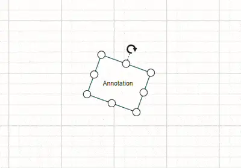
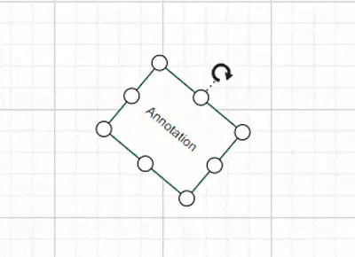
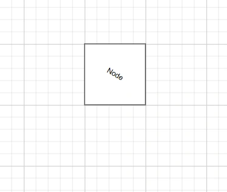

# Annotation Interaction in Blazor Diagram Component

Diagram provides extensive support for annotation interactions. Annotations can be selected, dragged, resized, and rotated interactively. By default, annotation interaction is disabled for security and performance reasons. You can enable annotation interaction using the [Constraints](https://help.syncfusion.com/cr/blazor/Syncfusion.Blazor.Diagram.Annotation.html#Syncfusion_Blazor_Diagram_Annotation_Constraints) property of the annotation.

## How to Enable Annotation Interaction

Annotation interaction is controlled by the [AnnotationConstraints](https://help.syncfusion.com/cr/blazor/Syncfusion.Blazor.Diagram.AnnotationConstraints.html) flags enum. You can enable specific interactions or a combination of interactions using this property.

The following constraints are available:

| Constraint | Description |
| -------- | -------- |
| [None](https://help.syncfusion.com/cr/blazor/Syncfusion.Blazor.Diagram.AnnotationConstraints.html#Syncfusion_Blazor_Diagram_AnnotationConstraints_None) | Disables all interactions on the annotation. |
| [ReadOnly](https://help.syncfusion.com/cr/blazor/Syncfusion.Blazor.Diagram.AnnotationConstraints.html#Syncfusion_Blazor_Diagram_AnnotationConstraints_ReadOnly) | Enables read-only mode for the annotation (cannot be edited). |
| [InheritReadOnly](https://help.syncfusion.com/cr/blazor/Syncfusion.Blazor.Diagram.AnnotationConstraints.html#Syncfusion_Blazor_Diagram_AnnotationConstraints_InheritReadOnly) | Enables inheriting the ReadOnly option from the parent. |
| [Select](https://help.syncfusion.com/cr/blazor/Syncfusion.Blazor.Diagram.AnnotationConstraints.html#Syncfusion_Blazor_Diagram_AnnotationConstraints_Select) | Enables selection of the annotation. |
| [Drag](https://help.syncfusion.com/cr/blazor/Syncfusion.Blazor.Diagram.AnnotationConstraints.html#Syncfusion_Blazor_Diagram_AnnotationConstraints_Drag) | Enables dragging the annotation. |
| [Resize](https://help.syncfusion.com/cr/blazor/Syncfusion.Blazor.Diagram.AnnotationConstraints.html#Syncfusion_Blazor_Diagram_AnnotationConstraints_Resize) | Enables resizing the annotation. |
| [Rotate](https://help.syncfusion.com/cr/blazor/Syncfusion.Blazor.Diagram.AnnotationConstraints.html#Syncfusion_Blazor_Diagram_AnnotationConstraints_Rotate) | Enables rotating the annotation. |
| [Interaction](https://help.syncfusion.com/cr/blazor/Syncfusion.Blazor.Diagram.AnnotationConstraints.html#Syncfusion_Blazor_Diagram_AnnotationConstraints_Interaction) | Enables all interactive behaviors: Select, Drag, Resize, and Rotate combined. |

### How to Enable Interactive Mode for Annotations

You can curtail annotation interactions by enabling either selecting, dragging, rotating, or resizing individually with the respective constraints property. The following code illustrates how to enable interactive mode for annotations:

```cshtml
@using Syncfusion.Blazor.Diagram

<SfDiagramComponent Height="600px" Nodes="@_nodes" />

@code
{
    // Defines diagram's node collection.
    DiagramObjectCollection<Node> _nodes;

    protected override void OnInitialized()
    {
        _nodes = new DiagramObjectCollection<Node>();
        Node node = new Node()
        {
            ID = "node1",
            // Position of the node
            OffsetX = 100,
            OffsetY = 100,
            // Size of the node
            Width = 100,
            Height = 100,
            Style = new ShapeStyle()
            {
                Fill = "#6BA5D7",
                StrokeColor = "white"
            },
            // Sets the annotation for the node
            Annotations = new DiagramObjectCollection<ShapeAnnotation>()
            {
                new ShapeAnnotation 
                { 
                    Content = "Annotation Text",
                    // Sets the constraints as Interaction (enables all interactions)
                    Constraints = AnnotationConstraints.Interaction
                }
            }
        };
        _nodes.Add(node);
    }
}
```


A complete working sample can be downloaded from [GitHub](https://github.com/SyncfusionExamples/Blazor-UG-Examples/blob/master/Diagram/Server/Pages/Annotations/AnnotationInteraction.razor)

## How to Drag Limit for Connector Annotations

The diagram control supports defining the `DragLimit` to constrain connector label movement. The [DragLimit](https://help.syncfusion.com/cr/blazor/Syncfusion.Blazor.Diagram.PathAnnotation.html#Syncfusion_Blazor_Diagram_PathAnnotation_DragLimit) property allows you to set boundaries for annotation dragging while dragging from a connector and to update the position to the nearest segment offset.

You can set values to the `DragLimit` left, right, top, and bottom properties which allow the dragging of connector labels to a certain limit based on user-defined values. By default, drag limit is disabled for the connector. It can be enabled by setting connector constraints as drag.

The following code illustrates how to set a `DragLimit` for connector annotations:

```cshtml
@using Syncfusion.Blazor.Diagram

<SfDiagramComponent Height="600px" Connectors="@_connectors" />

@code
{
    // Defines diagram's connector collection.
    DiagramObjectCollection<Connector> _connectors;

    protected override void OnInitialized()
    {
        _connectors = new DiagramObjectCollection<Connector>();
        Connector connector = new Connector()
        {
            ID = "connector",
            Type = ConnectorSegmentType.Orthogonal,
            SourcePoint = new DiagramPoint() { X = 200, Y = 200 },
            TargetPoint = new DiagramPoint() { X = 300, Y = 300 },
            // Sets the multiple annotation for the connector
            Annotations = new DiagramObjectCollection<PathAnnotation>()
            {
                new PathAnnotation 
                { 
                    Content = "connector1",
                    Offset = 0.5,
                    Constraints = AnnotationConstraints.Interaction | AnnotationConstraints.Drag,
                    // Set drag limit for a connector annotation
                    DragLimit = new DiagramThickness()
                    {
                        Left = 20,
                        Right = 20,
                        Top = 20,
                        Bottom = 20
                    }
                }
            }
        };
        _connectors.Add(connector);
    }
}
```


A complete working sample can be downloaded from [GitHub](https://github.com/SyncfusionExamples/Blazor-UG-Examples/blob/master/Diagram/Server/Pages/Annotations/DragLimitForAnnotation.razor)

N>**Note**: The `DragLimit` property is only applicable to `PathAnnotation` (connector annotations). It defines the boundary within which the connector label can be dragged relative to the connector path.

## How to Rotate Annotations
The [RotationReference](https://help.syncfusion.com/cr/blazor/Syncfusion.Blazor.Diagram.ShapeAnnotation.html#Syncfusion_Blazor_Diagram_ShapeAnnotation_RotationReference) property of an annotation allows you to control whether the text should rotate relative to its parent node or the Page. The following code examples illustrate how to configure `RotationReference` for an annotation.


```cshtml
@using Syncfusion.Blazor.Diagram

<SfDiagramComponent Height="600px" Nodes="@_nodes" />

@code
{
    // Defines diagram's node collection.
    DiagramObjectCollection<Node> _nodes;

    protected override void OnInitialized()
    {
        _nodes = new DiagramObjectCollection<Node>();
        Node node1 = new Node()
        {
            ID = "node1",
            Width = 100,
            Height = 100,
            OffsetX = 100,
            OffsetY = 100,
            Annotations = new DiagramObjectCollection<ShapeAnnotation>()
            {
                new ShapeAnnotation 
                { 
                    Content = "Node1",
                    RotationReference = AnnotationRotationReference.Parent,
                }
            },
           
        };
        Node node2 = new Node()
        {
            ID = "node2",
            Width = 100,
            Height = 100,
            OffsetX = 300,
            OffsetY = 100,
            Annotations = new DiagramObjectCollection<ShapeAnnotation>()
            {
                new ShapeAnnotation 
                { 
                    Content = "Node2",
                    RotationReference = AnnotationRotationReference.Page,
                }
            },
           
        };
        _nodes.Add(node1);
        _nodes.Add(node2);
    }
}
```


 Value | Description | Image |
| -------- | -------- | -------- |
| **Page** | When this option is set, the annotation remains fixed in its original orientation even if its parent node is rotated. |  |
| **Parent** | When this option is set, the annotation rotates along with its parent node. |  |


A complete working sample can be downloaded from [GitHub](https://github.com/SyncfusionExamples/Blazor-UG-Examples/blob/master/Diagram/Server/Pages/Annotations/RotationReference.razor)

## How to rotate a Annotation using the RotationAngle property

The [RotationAngle](https://help.syncfusion.com/cr/blazor/Syncfusion.Blazor.Diagram.Annotation.html#Syncfusion_Blazor_Diagram_Annotation_RotationAngle) property sets the rotation angle of an annotation in degrees. This determines how much the annotation text is tilted from its normal position. The default value is **0**.

The following code examples illustrate how to configure `RotationAngle` for an annotation.

```cshtml
@using Syncfusion.Blazor.Diagram
<SfDiagramComponent Height="600px" Nodes="@_nodes" />
@code
{
    DiagramObjectCollection<Node> _nodes = new DiagramObjectCollection<Node>();
    protected override void OnInitialized()
    {
        Node node = new Node()
        {
            ID = "node1",
            Height = 100,
            Width = 100,
            OffsetX = 100,
            OffsetY = 100,
            Annotations = new DiagramObjectCollection<ShapeAnnotation>() 
            { 
                new ShapeAnnotation 
                { 
                    Content = "Node",
                    ID = "Annotation",
                    RotationAngle = 30,    
                }
            },
        };
        _nodes.Add(node);
    }
}
```


A complete working sample can be downloaded from [GitHub](https://github.com/SyncfusionExamples/Blazor-UG-Examples/blob/master/Diagram/Server/Pages/Annotations/RotationAngleProperty.razor)




## See also

* [How to add or remove annotation constraints](../constraints#annotation-constraints)

* [How to add an annotation for a Node](./node-annotation)

* [How to add an annotation for a Connector](./connector-annotation)

* [How to animate connectors using annotationtemplate in angular diagram](https://support.syncfusion.com/kb/article/20265/how-to-animate-connectors-using-annotationtemplate-in-angular-diagram )