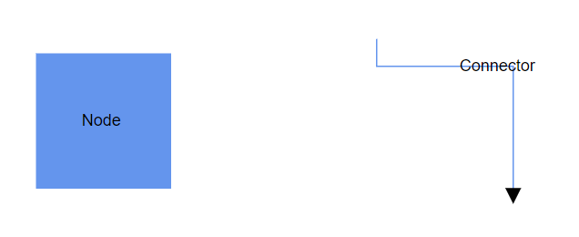

# Annotation in Blazor Diagram Component

The [Annotation](https://help.syncfusion.com/cr/blazor/Syncfusion.Blazor.Diagram.Annotation.html) is a block of text that can be displayed over a node or connector and it is used to textually represent an object with a string that can be edited at run time. Multiple annotations can be added to a node or connector.

## How to Create Annotation

An annotation can be added to a node or connector by defining the annotation object and adding it to the annotation collection of the node or connector. The [Content](https://help.syncfusion.com/cr/blazor/Syncfusion.Blazor.Diagram.Annotation.html#Syncfusion_Blazor_Diagram_Annotation_Content) property of the annotation defines the text to be displayed. 


To create and add annotation to Nodes and Connectors using the Blazor Diagram, refer to the below video link,



The following code explains how to create an annotation.

```cshtml
@using Syncfusion.Blazor.Diagram

<SfDiagramComponent Height="600px" Nodes="@nodes" Connectors="@connectors" />

@code
{
    // Defines diagram's connector collection.
    DiagramObjectCollection<Connector> connectors;

    // Defines diagram's node collection.
    DiagramObjectCollection<Node> nodes;

    protected override void OnInitialized()
    {
        nodes = new DiagramObjectCollection<Node>();
        Node node = new Node()
        {
            Width = 100,
            Height = 100,
            OffsetX = 100,
            OffsetY = 100,
            Style = new ShapeStyle() { Fill = "#6495ED", StrokeColor = "white" },
            Annotations = new DiagramObjectCollection<ShapeAnnotation>()
            {
                // Annotation is created and stored in Annotations collection of Node.
                new ShapeAnnotation { Content = "Node" }
            }
        };
        nodes.Add(node);
        connectors = new DiagramObjectCollection<Connector>();
        Connector connector = new Connector()
        {
            SourcePoint = new DiagramPoint() { X = 300, Y = 40 },
            TargetPoint = new DiagramPoint() { X = 400, Y = 160 },
            Type = ConnectorSegmentType.Orthogonal,
            Style = new TextStyle() { StrokeColor = "#6495ED" },
            Annotations = new DiagramObjectCollection<PathAnnotation>()
            {
                // Annotation is created and stored in Annotations collection of Connector.
                new PathAnnotation { Content = "Connector" }
            }
        };
        connectors.Add(connector);
    }
}
```
You can download a complete working sample from [GitHub](https://github.com/SyncfusionExamples/Blazor-Diagram-Examples/tree/master/UG-Samples/Annotations/CreateAnnotation/CreateAnnotation)



N>* [ID](https://help.syncfusion.com/cr/blazor/Syncfusion.Blazor.Diagram.Annotation.html#Syncfusion_Blazor_Diagram_Annotation_ID) for each annotation should be unique and so it is further used to find the annotation at runtime and do any customization.
<br/>* By default, node’s annotation positioned in center point of the shape.
<br/>* By default, connector’s path annotation positioned in center point of its path.
>**Note:** Do not use underscores(_) for annotation's id.

## How to Add Annotation at Runtime

You can add an annotation at runtime to the Annotations collection of the node/connector in the diagram component by using the `Add` method.

The following code explains how to add an annotation to a node at runtime by using `Add` method.

```cshtml
@using Syncfusion.Blazor.Diagram
@using Syncfusion.Blazor.Buttons

<SfButton Content="Addlabel" OnClick="@AddLabel" />
<SfDiagramComponent Height="600px" @ref="@diagram" Nodes="@nodes">
</SfDiagramComponent>

@code
{
    // Reference to diagram.
    SfDiagramComponent diagram;

    // Defines diagram's node collection.
    DiagramObjectCollection<Node> nodes;

    protected override void OnInitialized()
    {
        nodes = new DiagramObjectCollection<Node>();
        Node node = new Node()
        {
            Width = 100,
            Height = 100,
            OffsetX = 100,
            OffsetY = 100,
            Style = new ShapeStyle() { Fill = "#6495ED", StrokeColor = "white" },
        };
        nodes.Add(node);
    }

    // Method to add annotation at runtime.
    public void AddLabel()
    {
        ShapeAnnotation annotation = new ShapeAnnotation { Content = "Annotation" };
        (diagram.Nodes[0].Annotations as DiagramObjectCollection<ShapeAnnotation>).Add(annotation);
    }
}
```
You can download a complete working sample from [GitHub](https://github.com/SyncfusionExamples/Blazor-Diagram-Examples/tree/master/UG-Samples/Annotations/AddAnnotationAtRunTime)

Also, the annotations can be added at runtime by using the [AddAsync](https://help.syncfusion.com/cr/blazor/Syncfusion.Blazor.Diagram.DiagramObjectCollection-1.html#Syncfusion_Blazor_Diagram_DiagramObjectCollection_1_AddAsync__0_) method. The `await` operator suspends the evaluation of the enclosing async method until the asynchronous operation represented by its operand completes.

The following code explains how to add an annotation to a node at runtime by using the `AddAsync` method.

```csharp
//Method to add annotation at runtime.
public async void AddLabel()
{
    ShapeAnnotation annotation = new ShapeAnnotation { Content = "Annotation" };
    await(diagram.Nodes[0].Annotations as DiagramObjectCollection<ShapeAnnotation>).AddAsync(annotation);
}
```
You can download a complete working sample from [GitHub](https://github.com/SyncfusionExamples/Blazor-Diagram-Examples/tree/master/UG-Samples/Annotations)


## How to Remove Annotation at Runtime

A collection of annotations can be removed from a node by using the `RemoveAt` method. The following code explains how to remove an annotation from a node.

```cshtml
@using Syncfusion.Blazor.Diagram
@using Syncfusion.Blazor.Buttons


<SfButton Content="Removelabel" OnClick="@RemoveLabel" />

<SfDiagramComponent Height="600px" @ref="@diagram" Nodes="@nodes" />

@code
{
    // Reference to diagram.
    SfDiagramComponent diagram;

    // Defines diagram's node collection.
    DiagramObjectCollection<Node> nodes;

    protected override void OnInitialized()
    {
        nodes = new DiagramObjectCollection<Node>();
        Node node = new Node()
        {
            Width = 100,
            Height = 100,
            OffsetX = 100,
            OffsetY = 100,
            Style = new ShapeStyle() { Fill = "#6BA5D7", StrokeColor = "white" },
        };
        node.Annotations = new DiagramObjectCollection<ShapeAnnotation>()
        {
            new ShapeAnnotation {ID = "label", Content = "Annotation" },
        };
        nodes.Add(node);
    }

    // Method to remove annotation at runtime.
    public void RemoveLabel()
    {
        (diagram.Nodes[0].Annotations as DiagramObjectCollection<ShapeAnnotation>).RemoveAt(0);
    }
}
```
You can download a complete working sample from [GitHub](https://github.com/SyncfusionExamples/Blazor-Diagram-Examples/tree/master/UG-Samples/Annotations/RemoveAnnotation/RemoveAnnotation)

Also, a collection of annotations can be removed from the node by using the `Remove` method.

```cshtml
    // Method to remove annotation at runtime using Remove method.
    public void RemoveLabel()
    {
        ShapeAnnotation annotation = (diagram.Nodes[0].Annotations[0]) as ShapeAnnotation;
        (diagram.Nodes[0].Annotations as DiagramObjectCollection<ShapeAnnotation>).Remove(annotation);
    }
```

N>* You can delete multiple annotations from a node to pass the collection of annotation objects as argument.
<br/>* The `Add`, `Remove`, and `RemoveAt` methods are applicable for connectors too.

## How to Update Annotation at Runtime

You can get the annotation directly from the node’s annotations collection property and you can change any annotation properties at runtime.

The following code sample shows how the annotation of the node changed at runtime.

```cshtml
@using Syncfusion.Blazor.Diagram
@using Syncfusion.Blazor.Buttons


<SfButton Content="Updatelabel" OnClick="@UpdateLabel" />

<SfDiagramComponent Height="600px" @ref="@diagram" Nodes="@nodes" />

@code
{
    // Reference to diagram.
    SfDiagramComponent diagram;

    // Defines diagram's node collection.
    DiagramObjectCollection<Node> nodes;

    protected override void OnInitialized()
    {
        nodes = new DiagramObjectCollection<Node>();
        Node node = new Node()
        {
            Width = 100,
            Height = 100,
            OffsetX = 100,
            Annotations = new DiagramObjectCollection<ShapeAnnotation>() 
            { 
                new ShapeAnnotation { Content = "Node" } 
            },
            OffsetY = 100,
            Style = new ShapeStyle() { Fill = "#6495ED", StrokeColor = "white" },
        };
        nodes.Add(node);
    }

    // Method to update the annotation at runtime.
    public void UpdateLabel()
    {
        diagram.Nodes[0].Annotations[0].Content = "Updated Annotation";
    }
}
```
You can download a complete working sample from [GitHub](https://github.com/SyncfusionExamples/Blazor-Diagram-Examples/tree/master/UG-Samples/Annotations/UpdateAnnotation/UpdateAnnotation)

## See also

* [How to add or remove annotation constraints](../constraints#annotation-constraints)

* [How to customize the annotation](./appearance)

* [How to animate connectors using annotationtemplate in angular diagram](https://support.syncfusion.com/kb/article/20265/how-to-animate-connectors-using-annotationtemplate-in-angular-diagram )

* [How to dynamically create and connect diagram nodes with annotations via ports in syncfusion<sup style="font-size:70%">&reg;</sup> blazor diagram](https://support.syncfusion.com/kb/article/19001/how-to-dynamically-create-and-connect-diagram-nodes-with-annotations-via-ports-in-syncfusion-blazor-diagram) 
* [How to Prevent Text Overflow and Display Excess Content on Hover in a Diagram?](https://support.syncfusion.com/kb/article/18726/how-to-prevent-text-overflow-and-display-excess-content-on-hover-in-a-diagram)

* [How to generate a hierarchical layout with annotation at runtime?](https://support.syncfusion.com/kb/article/17884/how-to-generate-a-hierarchical-layout-with-annotation-at-runtime)