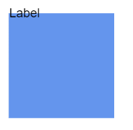
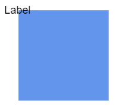
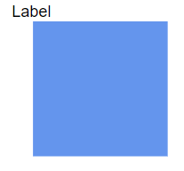

# Node Annotation Position in Blazor Diagram Component

The diagram allows you to customize the position and appearance of the annotation efficiently. Annotations can be aligned relative to the node boundaries. It has margin, offset, horizontal, and vertical alignment settings. It is quite tricky when all four alignments are used together but gives more control over alignments properties of the [ShapeAnnotation](https://help.syncfusion.com/cr/blazor/Syncfusion.Blazor.Diagram.ShapeAnnotation.html) class.

 Annotations of a node can be positioned using the following properties of `ShapeAnnotation`.

* Offset
* HorizontalAlignment
* VerticalAlignment
* Margin

## How to Change Annotation Offset Position

The [Offset](https://help.syncfusion.com/cr/blazor/Syncfusion.Blazor.Diagram.ShapeAnnotation.html#Syncfusion_Blazor_Diagram_ShapeAnnotation_Offset) property of an annotation is used to align the annotations based on fractions. It is defined by a `DiagramPoint` where the X and Y values are fractions of the node's width and height, respectively. A value of **0** represents the top or left edge, **1** represents the bottom or right edge, and **0.5** represents the center.

The following code demonstrates how to set an annotation's `Offset`.

```cshtml
@using Syncfusion.Blazor.Diagram

<SfDiagramComponent Height="600px" Nodes="@nodes" />

@code
{
    // Defines diagram's node collection.
    DiagramObjectCollection<Node> nodes;

    protected override void OnInitialized()
    {
        nodes = new DiagramObjectCollection<Node>();
        Node node = new Node()
        {
            Width = 100,
            Height = 100,
            OffsetX = 100,
            Annotations = new DiagramObjectCollection<ShapeAnnotation>()
            {
                new ShapeAnnotation 
                { 
                    Content = "Offset(0,0)", 
                    // Sets the offset for an annotation's content.
                    Offset = new DiagramPoint() { X = 0, Y = 0 } 
                }
            },
            OffsetY = 100,
            Style = new ShapeStyle() { Fill = "#6495ED", StrokeColor = "white" },
        };
        nodes.Add(node);
    }
}
```


A complete working sample can be downloaded from [GitHub](https://github.com/SyncfusionExamples/Blazor-Diagram-Examples/tree/master/UG-Samples/Annotations/AnnotationOfNode/OffsetofAnnotation)


| Offset values | Output |
|---|---|
| (0,0) |  |
| (0,0.5) |  |
| (0,1) |  |
| (0.5,0) |  |
| (0.5,0.5) |  |
| (0.5,1) |  |
| (1,0) |  |
| (1,0.5) |  |
| (1,1) |  |


>**Note:**
> * Type of the offset property for node’s shape annotation is [DiagramPoint](https://help.syncfusion.com/cr/blazor/Syncfusion.Blazor.Diagram.DiagramPoint.html).
> * Type of the offset property for a connector’s path annotation is double.
> * Node annotation's Id should not start with numbers or special characters and should not contain special characters such as underscores(_) or spaces.

## How to Change the Annotation Alignment

The [HorizontalAlignment](https://help.syncfusion.com/cr/blazor/Syncfusion.Blazor.Diagram.Annotation.html#Syncfusion_Blazor_Diagram_Annotation_HorizontalAlignment) property of an annotation is used to set how the annotation is horizontally aligned at the annotation position determined from the fraction values. The [VerticalAlignment](https://help.syncfusion.com/cr/blazor/Syncfusion.Blazor.Diagram.Annotation.html#Syncfusion_Blazor_Diagram_Annotation_VerticalAlignment) property is used to set how the annotation is vertically aligned at the annotation position.

The following table shows all the possible alignments visually with an 'offset of (0, 0)'.

| Horizontal Alignment | Vertical Alignment | Output with Offset(0,0) |
| -------- | -------- | -------- |
| Left | Top |  |
| Center | Top |  |
| Right | Top |   |
| Left | Center |  |
| Center | Center|  |
| Right | Center |  |
| Left | Bottom |  |
| Center | Bottom |  |
| Right |Bottom | |

The following code demonstrates how to align an annotation.

```cshtml
@using Syncfusion.Blazor.Diagram

<SfDiagramComponent Height="600px" Nodes="@nodes" />

@code
{
    // Defines diagram's node collection.
    DiagramObjectCollection<Node> nodes;

    protected override void OnInitialized()
    {
        nodes = new DiagramObjectCollection<Node>();
        Node node = new Node()
        {
            ID = "node1",
            Width = 100,
            Height = 100,
            OffsetX = 250,
            OffsetY = 250,
            Annotations = new DiagramObjectCollection<ShapeAnnotation>()
            {
                new ShapeAnnotation 
                { 
                    Content = "Annotation",
                    // Sets the HorizontalAlignment and VerticalAlignment for the content.
                    HorizontalAlignment = HorizontalAlignment.Center,
                    VerticalAlignment = VerticalAlignment.Center
                }
            },
            Style = new ShapeStyle() { Fill = "#6495ED", StrokeColor = "white" },
        };
        nodes.Add(node);
    }
}
```


A complete working sample can be downloaded from [GitHub](https://github.com/SyncfusionExamples/Blazor-Diagram-Examples/tree/master/UG-Samples/Annotations/AnnotationOfNode/AlignmentOfAnnotation)


N>* The value of the `HorizontalAlignment` is [Center](https://help.syncfusion.com/cr/blazor/Syncfusion.Blazor.Diagram.HorizontalAlignment.html#Syncfusion_Blazor_Diagram_HorizontalAlignment_Center) by default.
<br/>* The value of the `VerticalAlignment` is [Center](https://help.syncfusion.com/cr/blazor/Syncfusion.Blazor.Diagram.VerticalAlignment.html#Syncfusion_Blazor_Diagram_VerticalAlignment_Center) by default.
<br/>* Alignment is positioned based on the offset value.

## How to Change Annotation Margin

The [Margin](https://help.syncfusion.com/cr/blazor/Syncfusion.Blazor.Diagram.Annotation.html#Syncfusion_Blazor_Diagram_Annotation_Margin) property adds space around the annotation. The annotations can be displaced with the margin property. The following code example explains how to align an annotation based on its `Offset`, `HorizontalAlignment`, `VerticalAlignment`, and `Margin` values.

```cshtml
@using Syncfusion.Blazor.Diagram

<SfDiagramComponent Height="600px" Nodes="@nodes" />

@code
{
    // Defines diagram's node collection.
    DiagramObjectCollection<Node> nodes;

    protected override void OnInitialized()
    {
        nodes = new DiagramObjectCollection<Node>();
        Node node = new Node()
        {
            ID = "node1",
            Width = 100,
            Height = 100,
            OffsetX = 100,
            OffsetY = 100,
            Annotations = new DiagramObjectCollection<ShapeAnnotation>()
            {
                new ShapeAnnotation 
                { 
                    Content = "Task1",
                    // Sets the margin for the content.
                    Margin = new DiagramThickness() { Top = 10},
                    HorizontalAlignment = HorizontalAlignment.Center,
                    VerticalAlignment = VerticalAlignment.Top,
                    Offset = new DiagramPoint(){ X = 0.5 ,Y = 1}
                }
            },
            Style = new ShapeStyle() { Fill = "#6495ED", StrokeColor = "white" },
        };
        nodes.Add(node);
    }
}
```


A complete working sample can be downloaded from [GitHub](https://github.com/SyncfusionExamples/Blazor-Diagram-Examples/tree/master/UG-Samples/Annotations/AnnotationOfNode/MarginOfAnnotation)


## How to Align the Text

The [TextAlign](https://help.syncfusion.com/cr/blazor/Syncfusion.Blazor.Diagram.TextStyle.html#Syncfusion_Blazor_Diagram_TextStyle_TextAlign) property of an annotation's style allows you to set how the text should be aligned (Left, Right, Center, or Justify) inside the text block. The following code explains how to set `TextAlign` for an annotation.

```cshtml
@using Syncfusion.Blazor.Diagram

<SfDiagramComponent Height="600px" Nodes="@nodes" />

@code
{
    // Defines diagram's node collection.
    DiagramObjectCollection<Node> nodes;

    protected override void OnInitialized()
    {
        nodes = new DiagramObjectCollection<Node>();
        Node node = new Node()
        {
            ID = "node1",
            Width = 100,
            Height = 100,
            OffsetX = 100,
            OffsetY = 100,
            Annotations = new DiagramObjectCollection<ShapeAnnotation>()
            {
                new ShapeAnnotation 
                { 
                    Content = "Text align is set as Left",
                    Style = new TextStyle()
                    { 
                        // Sets the textAlign as left for the content.
                        TextAlign = TextAlign.Left
                    } 
                }
            },
            Style = new ShapeStyle() { Fill = "#6495ED", StrokeColor = "white" },
        };
        nodes.Add(node);
    }
}
```


A complete working sample can be downloaded from [GitHub](https://github.com/SyncfusionExamples/Blazor-Diagram-Examples/tree/master/UG-Samples/Annotations/AnnotationOfNode/AlignText)

## See also

* [How to add an annotation for a Connector](./connector-annotation)

* [How to add or remove annotation constraints](../constraints#annotation-constraints)

* [How to customize the annotation](./appearance)
